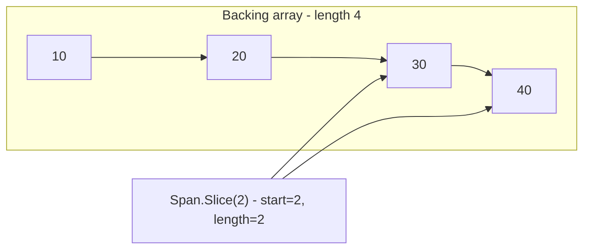

---
topic:
  - Computer Science
subtopic:
  - Data Structures
summary: "A stack-only view over contiguous memory that owns nothing, enabling high-performance zero-copy slicing and parsing."
level:
  - "4"
priority: Medium
status: Done
publish: true
---

# Intro

`Span<T>` is a stack-only view over contiguous memory. It does not own data, it only points to existing memory (array, stackalloc buffer, or unmanaged memory). Use it when you need high-performance slicing/parsing with minimal allocations.

Internally it is just a managed pointer plus a length, so it gives bounds-checked access with almost no overhead and can wrap array segments or stack-allocated buffers. Slicing returns another span over the same backing memory with a new offset and length — nothing is copied, which is why a write through a slice shows up in the original buffer. Being a `ref struct` keeps it on the stack, so it never outlives the memory it points at.



## Example

```csharp
Span<int> values = stackalloc int[] { 10, 20, 30, 40 };
Span<int> tail = values.Slice(2); // 30, 40

tail[0] = 300;
Console.WriteLine(values[2]); // 300
```

## Pitfalls

- **Returning a stack-pointing span** — returning a `Span<T>` that wraps `stackalloc` memory is invalid because the buffer is gone once the method returns. The compiler blocks most cases, but keep span lifetimes inside the owning scope.
- **Using a span across `await`** — spans are stack-only and cannot survive async suspension, so they are disallowed across `await` and `yield`. Switch to `Memory<T>` for async flows.
- **Over-applying spans** — converting every API to `Span<T>` hurts readability when performance is not the bottleneck. Apply it to measured hot paths only.

## Tradeoffs

| Choice | `Span<T>` | Alternative | Decision criteria |
| --- | --- | --- | --- |
| vs `T[]` | Zero-copy view, no ownership | Array owns data, can be stored long-term | Use `Span<T>` for transient slicing over existing memory; use arrays when you must keep or hand off the data. |
| vs `Memory<T>` | Stack-only, synchronous, fastest | Heap-storable, async-safe | Use `Span<T>` inside the hot synchronous loop; use `Memory<T>` when the buffer crosses `await` or lives in a field. |
| vs raw `stackalloc` pointer | Bounds-checked, stays in safe code | Unchecked, requires `unsafe` | Use `Span<T>` to keep bounds safety without dropping to pointers. |

## Questions

> [!QUESTION]- Why is `Span<T>` a `ref struct`?
> - A `ref struct` is confined to the stack: it cannot be boxed, captured in a lambda, stored in a class field, or used as a generic type argument.
> - This guarantees the span never outlives the buffer it points to (stack, `stackalloc`, or array), preserving memory safety.
> - The same restriction is why it cannot cross `await` or `yield` — those would move it to the heap.
> - You give up flexibility (no async, no fields) for zero-copy, allocation-free access, so it earns its place only on synchronous hot paths.

> [!QUESTION]- When should you choose `Memory<T>` instead of `Span<T>`?
> - Use `Memory<T>` when the buffer must survive an async boundary, be stored in a field, or live beyond one synchronous scope.
> - `Memory<T>` is a heap-storable handle; call `.Span` to get a `Span<T>` view at the point of synchronous use.
> - `Span<T>` remains the right choice for the tight synchronous parsing/slicing loop itself.
> - `Memory<T>` buys async/storage flexibility at the cost of one extra indirection — use `Span<T>` where every nanosecond counts, `Memory<T>` where lifetime demands it.

> [!QUESTION]- What is the difference between `Span<T>` and `ReadOnlySpan<T>`?
> - `ReadOnlySpan<T>` is the same windowed view but forbids writes through it, so it can wrap immutable data such as `string` (as `ReadOnlySpan<char>`).
> - Methods should accept `ReadOnlySpan<T>` when they only read, which makes them callable from the widest set of sources.
> - `Span<T>` converts implicitly to `ReadOnlySpan<T>`, but not the reverse.
> - So accept `ReadOnlySpan<T>` in method signatures for reach and intent; use the mutable `Span<T>` only when you actually write back.

## References

- [`Span<T>` struct](https://learn.microsoft.com/en-us/dotnet/api/system.span-1) — API reference covering constructors, Slice, and ref struct constraints.
- [`Memory<T>` and `Span<T>` usage guidelines](https://learn.microsoft.com/en-us/dotnet/standard/memory-and-spans/) — Microsoft guidance on when to use Span vs Memory, ownership rules, and async boundaries.
- [Welcome to C# 7.2 and Span](https://devblogs.microsoft.com/dotnet/welcome-to-c-7-2-and-span/) — .NET blog post introducing `Span<T>` with motivation, design rationale, and early usage examples.
