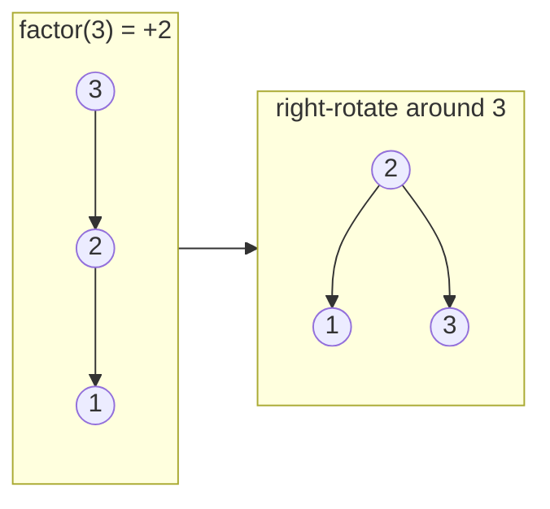

---
topic:
  - Computer Science
subtopic:
  - Data Structures
summary: "A rigidly self-balancing BST that rotates on a ±1 balance factor, giving the fewest search levels at the cost of more write rotations."
level:
  - "4"
priority: Medium
status: Ready to Repeat
publish: true
---

# Intro

An AVL tree is a [[Binary Search Tree]] that repairs itself: after every insert or delete it checks a **balance factor** on each node along the path and rotates subtrees whenever the factor leaves {−1, 0, +1}. The invariant — left and right subtree heights differ by at most 1 at *every* node — bounds the whole tree at ~1.44·log₂(n) levels, so a 1M-key AVL tree is at most ~29 levels deep versus ~40 for a [[Red-Black Tree]]'s 2·log₂(n) worst case. It's the oldest self-balancing BST (Adelson-Velsky and Landis, 1962) and the most rigidly balanced of the mainstream ones.

That rigidity is the tradeoff in one sentence: **fewest levels per search, most rotations per write.** Reach for AVL when the workload is read-dominated — a lookup table built once and queried millions of times. For mixed read/write workloads a red-black tree does less repair work per mutation, which is why .NET's `SortedSet<T>`/`SortedDictionary<TKey, TValue>` are red-black inside — there is no AVL tree in the BCL, and if you think you need one, benchmark against `FrozenDictionary<TKey, TValue>` first: a truly read-only workload is usually better served by a frozen hash structure than by any tree, unless you need ordered/range queries.

## The Balance Invariant

Each node stores its subtree height (or the factor directly):

```text
balanceFactor(node) = height(node.Left) − height(node.Right)   ∈ {−1, 0, +1}
```

Insert/delete as in a plain BST, then walk back up the insertion path recomputing heights. The first node whose factor hits ±2 is where you rotate. An insert needs **at most one rotation** (single or double) to restore the invariant globally; a delete can shorten a subtree and cascade rebalancing all the way to the root — **O(log n) rotations** worst case. That asymmetry is why delete-heavy workloads punish AVL hardest.

## Rotations

A rotation is a local pointer swap that lifts the middle-valued node up one level without violating BST order. Four imbalance shapes, two mechanisms:

| Shape | Detected as | Fix |
|---|---|---|
| Left-Left | factor +2, left child +1 or 0 | single right rotation |
| Right-Right | factor −2, right child −1 or 0 | single left rotation |
| Left-Right | factor +2, left child −1 | rotate left child left, then node right |
| Right-Left | factor −2, right child +1 | rotate right child right, then node left |

The Left-Left case — inserting 1 under an already left-leaning 3-2 chain — and its repair:



The double cases exist because a single rotation on a zig-zag shape (2 → 4 → 3) just flips the zig-zag the other way; the inner node has to be rotated out first. If you remember one thing: **the node that ends up on top is always the middle of the three keys involved.**

## Complexity

Search, insert, delete: **O(log n) worst case** — not amortized, not expected. Space is O(n) plus one height/factor byte per node. The height bound is exact: worst-case height is 1.4405·log₂(n+2) − 0.328, derived from the fact that the *minimum* number of nodes in an AVL tree of height h follows a Fibonacci-like recurrence N(h) = N(h−1) + N(h−2) + 1 — the sparsest legal AVL tree is a "Fibonacci tree."

## AVL vs Red-Black

Same API, same O(log n) bounds, different constants:

- **Reads:** AVL wins — up to ~28% shallower in the worst case (1.44 vs 2.0 × log₂ n), so fewer node visits and cache misses per search.
- **Writes:** red-black wins — inserts need at most 2 rotations and deletes at most 3 (plus O(log n) recolorings, which are cheap single-field writes), versus AVL's possible O(log n) rotation cascade on delete.
- **What ships:** red-black, almost universally — .NET `SortedSet<T>`/`SortedDictionary`, Java `TreeMap`, C++ `std::map`, the Linux scheduler run-queue (CFS, now EEVDF). General-purpose libraries can't assume read-heavy workloads, so they pick the cheaper-write structure.

Pick AVL only when you control the workload and it's genuinely search-dominated with rare mutations. If the data also lives on disk rather than in memory, neither is right — depth, not rotations, is the enemy there, and a [[B-tree]] wins on fan-out.

## Questions

> [!QUESTION]- Why can AVL reads be faster than red-black reads?
> AVL trees keep a stricter height bound, so searches often traverse fewer levels, at the cost of more rotations during writes.

> [!QUESTION]- What is the AVL balance factor invariant, and where is it checked?
> For every node, height(left) − height(right) must stay in {−1, 0, +1}. After each insert or delete you walk back up the modified path recomputing heights; the first node at ±2 gets rotated.

> [!QUESTION]- Why do double rotations (Left-Right / Right-Left) exist?
> A single rotation on a zig-zag imbalance just mirrors the zig-zag instead of fixing it. The inner (middle-valued) node must first be rotated outward to form a straight chain, then a single rotation lifts it to the top.

> [!QUESTION]- Why did .NET choose red-black over AVL for `SortedSet<T>`?
> A general-purpose collection can't assume read-heavy usage. Red-black bounds repair work per mutation (≤2 rotations on insert, ≤3 on delete) where AVL deletes can cascade O(log n) rotations; the price — up to ~40% taller worst-case height — only hurts pure-read workloads.

## References

- [Sorted collection types](https://learn.microsoft.com/en-us/dotnet/standard/collections/sorted-collection-types) — Microsoft overview of sorted collection choices in .NET.
- [Adelson-Velsky & Landis, "An algorithm for the organization of information" (1962)](https://zhjwpku.com/assets/pdf/AED2-10-avl-paper.pdf) — the original paper (translated); primary source for the invariant and the height proof.
- [AVL tree (Wikipedia)](https://en.wikipedia.org/wiki/AVL_tree) — all four rotation cases with diagrams, the Fibonacci-tree height derivation, and the rebalancing-after-delete analysis.
