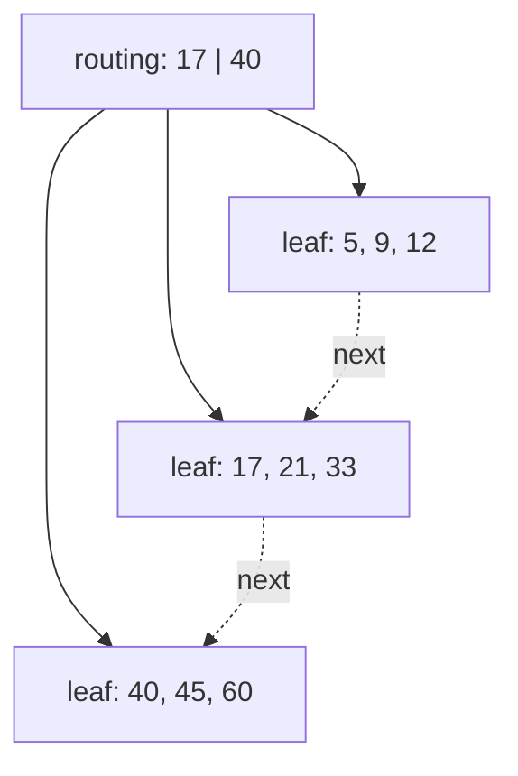

---
topic:
  - Computer Science
subtopic:
  - Data Structures
summary: "The B-tree variant databases ship: data lives only in leaves chained as a sorted linked list, making range scans fast."
level:
  - "4"
priority: Medium
status: Ready to Repeat
publish: true
---

# Intro

A B+ tree is the [[B-tree]] variant that databases actually ship. Two changes to the base structure: **data lives only in the leaves** (internal nodes hold routing keys, nothing else), and **leaves are chained into a sorted linked list**. Everything else — page-sized nodes, high fan-out, split/merge maintenance, all leaves at equal depth — is inherited from the B-tree and covered there.

Those two changes exist for one workload: the range scan. `WHERE order_date BETWEEN '2026-01-01' AND '2026-03-31'` descends the tree once to find the first matching leaf, then walks the sibling chain reading rows in key order — no walking back up through internal nodes, one sequential page read per leaf. A plain B-tree answering the same query does an in-order traversal that bounces between levels.

## What the two changes buy

**Data only in leaves.** Internal nodes store just keys and child pointers — no row data, no record pointers. A routing entry might be 16 bytes where a leaf entry is 100+, so an internal page holds 5–10× more separators than a leaf holds records. Fan-out at the routing levels explodes, the tree gets even shallower, and the entire internal level often fits in the buffer pool: in practice a lookup costs **one disk read** (the leaf), because everything above it is cached. The cost is that every search must go all the way to a leaf — there are no early hits at internal nodes — but the shallower tree more than pays for it. It also means a routing key can survive after its row is deleted; internal keys are separators, not data.

**Linked leaf chain.** Leaves point to their next (and usually previous) sibling. The full key set is readable as a sorted sequence without touching internal nodes — this is what makes `ORDER BY` on an indexed column free, and why an index-order full scan is a sequential walk rather than a tree traversal.

## In real databases

- **SQL Server** — every index is documented as a B+ tree ("B-tree" in the docs, but leaf pages hold all data rows for a clustered index and are doubly linked). The clustered index *is* the table: the leaf level stores the rows themselves.
- **MySQL InnoDB** — same clustered design: the primary key B+ tree's leaves are the rows; secondary indexes' leaves hold the primary key value, so a secondary lookup costs two tree descents.
- **PostgreSQL** — its "btree" access method is a Lehman–Yao B-tree *with* right-sibling links on every level, so it scans ranges like a B+ tree; heap rows live outside the index (no clustered tables), leaves hold TIDs pointing into the heap.

The clustered-vs-secondary distinction and when to choose each live in [[Indexes]]; the structural reason range scans are cheap is this note.

## Tradeoffs vs a plain B-tree

- **Range scans and ordered iteration**: B+ tree, decisively — sequential leaf walk vs multi-level traversal. This alone decides it for databases.
- **Single-key point lookup**: near-tie. The B-tree can terminate early at an internal node; the B+ tree always descends to a leaf but is shallower because routing pages pack more keys. On disk the B+ tree still wins (cached internals, one leaf read).
- **Space**: B+ tree stores each routing key twice (once as a separator, once in a leaf) — a rounding error next to the row data.
- **When a plain B-tree is fine**: in-memory structures with no range-scan requirement, where early termination and no key duplication matter more than leaf chaining. If your access pattern is point-lookup-only, both work; nobody has been fired for picking the B+ tree anyway.

## Questions

> [!QUESTION]- Why is a B+ tree good for range scans?
> Once the first leaf is found, adjacent leaves can be scanned in key order without walking back up the tree.

> [!QUESTION]- What are the two structural differences between a B+ tree and a B-tree?
> Data (or record pointers) lives only in the leaves — internal nodes are pure routing keys — and the leaves are chained into a sorted linked list. Splits, merges, and the equal-leaf-depth invariant are shared with the B-tree.

> [!QUESTION]- Why does keeping data out of internal nodes make lookups faster, not slower?
> Routing entries are tiny compared to records, so internal pages hold 5–10× more keys, fan-out grows, the tree gets shallower, and the whole routing level typically fits in cache. Every search pays a full descent to a leaf, but that descent is shorter and mostly cache-hits.

> [!QUESTION]- In InnoDB, why is a lookup through a secondary index roughly twice the cost of a primary-key lookup?
> Rows live in the leaves of the primary-key (clustered) B+ tree. A secondary index's leaves store primary-key values, so a secondary lookup descends the secondary tree to find the PK, then descends the clustered tree to fetch the row.

## References

- [MySQL InnoDB indexes](https://dev.mysql.com/doc/refman/8.4/en/innodb-index-types.html) — practical B-tree/B+ tree-style clustered and secondary index behavior.
- Comer, [The Ubiquitous B-Tree (1979)](https://doi.org/10.1145/356770.356776) — the survey that canonically describes the B+ variant and its leaf-chain design; primary source.
- [SQL Server clustered and nonclustered indexes](https://learn.microsoft.com/en-us/sql/relational-databases/indexes/clustered-and-nonclustered-indexes-described) — the leaf-level layout of clustered (rows) vs nonclustered (pointers) indexes.
- [Use the Index, Luke — Anatomy of an SQL Index](https://use-the-index-luke.com/sql/anatomy) — the best visual walkthrough of leaf chains and why range scans are cheap; database-agnostic.
