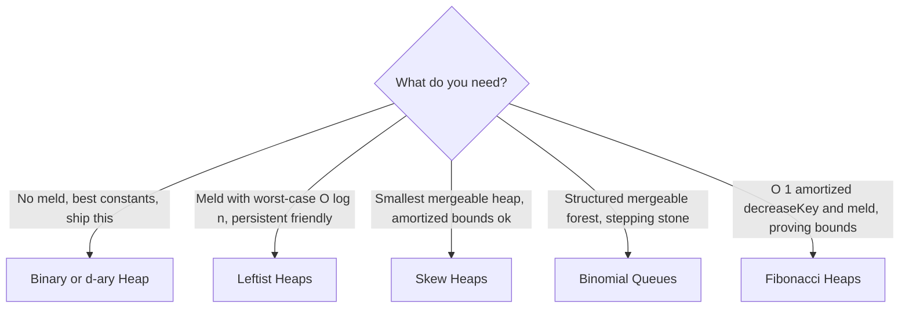

---
topic:
  - Computer Science
subtopic:
  - Data Structures
summary: "Priority-queue structures with an O(1) root peek, differing on meld and decreaseKey."
tags:
  - FolderNote
level:
  - "4"
priority: Medium
status: Done
publish: true
---

Heap-like structures share one contract — a **partial order** (parent beats child, nothing promised between siblings) that keeps the best-priority item at a root for O(1) peek — and differ on everything else. The axis that splits the family is **meld** (merging two heaps into one). An array-backed binary heap can't meld cheaply: concatenating two arrays and re-heapifying is O(n). Every other member of the family exists to fix that, paying for it with pointer-based nodes — per-node allocation, GC pressure, cache misses on every hop.

The second axis is **decreaseKey** — raising an item's priority in place, the operation Dijkstra and Prim lean on. Only [[Fibonacci Heaps]] make it O(1) amortized, and that theoretical win rarely survives contact with real hardware: .NET's `PriorityQueue<TElement, TPriority>` (an array-backed quaternary heap) ships with *no meld and no decreaseKey* and still wins most benchmarks, because sequential index arithmetic in a flat array beats chasing four pointers per node. The lazy-deletion workaround for decreaseKey lives in [[Heap]].

```datacorejsx
const { FolderStructureMap } = await dc.require("Assets/components/devbook-folder-map.jsx");
return FolderStructureMap;
```

# The family

| | Backing | Meld | Insert | ExtractMin | DecreaseKey | Bounds |
|---|---|---|---|---|---|---|
| [[Heap\|Binary / d-ary heap]] | array | O(n) | O(log n) | O(log n) | O(log n)* | worst case |
| [[Binomial Queues]] | pointers | O(log n) | O(1) am. | O(log n) | O(log n) | mixed |
| [[Leftist Heaps]] | pointers | O(log n) | O(log n) | O(log n) | — | worst case |
| [[Skew Heaps]] | pointers | O(log n) | O(log n) | O(log n) | — | amortized |
| [[Fibonacci Heaps]] | pointers | O(1) | O(1) | O(log n) | O(1) | amortized |

\* not exposed by .NET's `PriorityQueue`; use lazy deletion.

**When each wins:**



The [[Heap|binary or d-ary heap]] is what you actually ship: no meld needed, so nothing else comes close on constants. [[Leftist Heaps]] give worst-case O(log n) meld in ~30 lines and are the natural persistent mergeable heap — the cost is one extra null-path-length field per node; [[Skew Heaps]] are the same idea minus that stored metadata when amortized bounds suffice. [[Binomial Queues]] meld as binary addition and are mostly a stepping stone to [[Fibonacci Heaps]], whose O(1) amortized decreaseKey and meld prove bounds like Dijkstra in O(m + n log n) but rarely win in running code: each node carries four pointers plus a degree and a mark bit, scattered across memory, so the "large constants" are literal per-node overhead.

# References

- [PriorityQueue\<TElement, TPriority\> class (Microsoft Learn)](https://learn.microsoft.com/en-us/dotnet/api/system.collections.generic.priorityqueue-2) — the .NET baseline the pointer-based variants are measured against; note the absent meld/decreaseKey surface.
- [Larkin, Sen & Tarjan, "A back-to-basics empirical study of priority queues" (ALENEX 2014)](https://arxiv.org/abs/1403.0252) — benchmarks across the family; implicit d-ary heaps win most real workloads.
- [Mergeable heap (Wikipedia)](https://en.wikipedia.org/wiki/Mergeable_heap) — the meld-centric view of the family with links to each variant.
