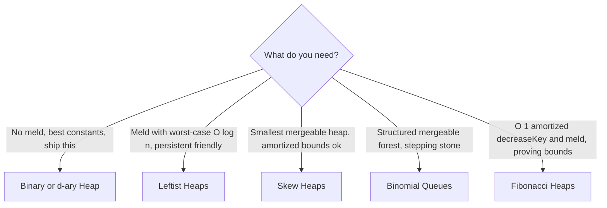

---
topic:
  - Computer Science
subtopic:
  - Data Structures
summary: "Priority-queue structures with an O(1) root peek, differing on meld and decreaseKey."
tags: [FolderNote]
level:
  - "4"
priority: Medium
status: Done
publish: true
---

Heap-like structures share one contract: a **partial order** in which each parent outranks its children. Sibling order is unspecified. Peek is O(1) with a single-root layout or a maintained global-min pointer. Otherwise a forest must scan its roots.

The family splits first on **meld**, the operation that combines two heaps. An array-backed binary heap cannot meld cheaply. Concatenating the arrays and rebuilding costs O(n). Mergeable variants use pointer-based nodes instead, trading the faster meld for separate allocations and poor cache locality.

The second split is **decreaseKey**, which raises an existing item's priority in place. Dijkstra and Prim use it heavily. Among the variants covered here, only [[Fibonacci Heaps]] provide O(1) amortized decreaseKey, yet the asymptotic win often disappears on real hardware. .NET's `PriorityQueue<TElement, TPriority>` is an array-backed quaternary heap that exposes neither meld nor decreaseKey. Empirical comparisons often favor implicit d-ary heaps, but the result depends on the workload and cache behavior. The lazy-deletion workaround for decreaseKey lives in [[Heap]].

```datacorejsx
const { FolderStructureMap } = await dc.require("Assets/components/devbook-folder-map.jsx");
return FolderStructureMap;
```

# The Family

| | Backing | Meld | Insert | ExtractMin | DecreaseKey | Bounds |
|---|---|---|---|---|---|---|
| [[Heap\|Binary / d-ary heap]] | array | O(n) | O(log n) | O(log n) | O(log n)* | worst case |
| [[Binomial Queues]] | pointers | O(log n) | O(1) am. | O(log n) | O(log n) | mixed |
| [[Leftist Heaps]] | pointers | O(log n) | O(log n) | O(log n) | — | worst case |
| [[Skew Heaps]] | pointers | O(log n) | O(log n) | O(log n) | — | amortized |
| [[Fibonacci Heaps]] | pointers | O(1) | O(1) | O(log n) | O(1) | amortized |

\* not exposed by .NET's `PriorityQueue`. Use lazy deletion.

**When each wins:**


```mermaid
flowchart TD
    A{What do you need?} -->|No meld, best constants, ship this| B[Binary or d-ary Heap]
    A -->|Meld with worst-case O log n, persistent friendly| C[Leftist Heaps]
    A -->|Smallest mergeable heap, amortized bounds ok| D[Skew Heaps]
    A -->|Structured mergeable forest, stepping stone| E[Binomial Queues]
    A -->|O 1 amortized decreaseKey and meld, proving bounds| F[Fibonacci Heaps]
```

The [[Heap|binary or d-ary heap]] is the default when meld is unnecessary. [[Leftist Heaps]] provide worst-case O(log n) meld and work naturally as persistent structures, paying one null-path-length field per node. [[Skew Heaps]] drop that field when amortized bounds are enough.

[[Binomial Queues]] make meld look like binary addition. They also expose the structural idea that [[Fibonacci Heaps]] later defer. Fibonacci heaps prove bounds such as Dijkstra in O(m + n log n), but each node carries four pointers plus a degree and mark bit. That cost lands in memory and cache misses, not just in an asymptotic footnote.

# References

- [PriorityQueue\<TElement, TPriority\> class (Microsoft Learn)](https://learn.microsoft.com/en-us/dotnet/api/system.collections.generic.priorityqueue-2)
- [Larkin, Sen & Tarjan, "A back-to-basics empirical study of priority queues" (ALENEX 2014)](https://arxiv.org/abs/1403.0252)
