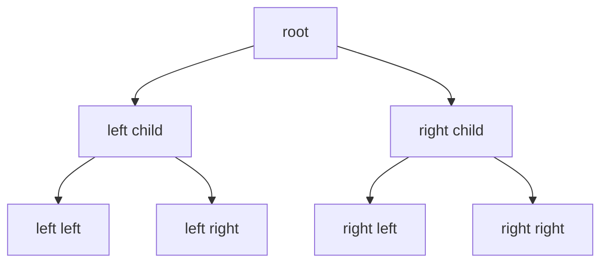

---
topic:
  - Computer Science
subtopic:
  - Data Structures
summary: "Hierarchical parent-child structures whose operation bounds depend on the tree family and its height or routing invariant."
tags: [FolderNote]
level:
  - "4"
priority: Medium
publish: true
status: Creation
---

A tree represents relationships through parent-child edges. It is a shape, not a complexity guarantee. A balanced search tree can keep lookup at O(log n), while an unbalanced tree may become a chain and cost O(n). A trie follows another rule entirely: lookup is O(k) in key length, while scanning a flat dictionary for a prefix is O(n).

In .NET, `SortedSet<T>` and `SortedDictionary<TKey, TValue>` provide ordered collections backed by red-black trees. Custom node models fit domain hierarchies, while expression trees represent code as data.

```datacorejsx
const { FolderStructureMap } = await dc.require("Assets/components/devbook-folder-map.jsx");
return FolderStructureMap;
```

# Shape and Traversal

A rooted tree gives every node except the root exactly one parent. Nodes may have any number of children, and there is one path from the root to each node. Height measures the longest path down from a node. Depth measures the path from the root.

Balance belongs to particular tree families, not to trees in general. Inserting sorted values into a naive binary search tree creates a linked list. A red-black or AVL tree repairs its shape after updates and keeps height at O(log n).

Traversal order determines when a node is processed relative to its children:

- *Pre-order* (root → left → right): used to serialize or copy a tree.
- *In-order* (left → root → right): visits nodes in sorted order for a BST — the basis for `SortedSet<T>` enumeration.
- *Post-order* (left → right → root): used when children must be processed before parents, such as deleting a subtree or evaluating an expression tree.
- *BFS (level-order)*: uses a `Queue<T>` to visit nodes level by level, natural for shortest-path in unweighted trees.

`SortedSet<T>` in .NET uses a red-black tree internally, guaranteeing O(log n) insert and lookup regardless of insertion order.

A *full* binary tree gives each node either zero or two children. A *complete* binary tree fills each level from left to right, which makes the array layout used by heaps possible. A *perfect* binary tree is both full and complete.

# Common Tree Types

The required operation chooses the tree:

| Type | What it adds | Used for |
|---|---|---|
| [[Binary Search Tree\|BST]] | Ordered left < node < right | Baseline ordered lookup — but degrades to O(n) if unbalanced |
| [[AVL Tree\|AVL]] / [[Red-Black Tree\|Red-Black]] | Self-balancing rotations → guaranteed O(log n) | `SortedSet`/`SortedDictionary` (red-black). AVL is more rigidly balanced (faster reads, more rotations) |
| [[Splay Tree\|Splay]] | Self-adjusting: each access rotated to the root | Amortized O(log n) (O(n) worst). Locality-adaptive — reads mutate structure, no stored balance metadata |
| [[B-tree]] / [[B+ Tree\|B+-tree]] | High fan-out, shallow. Node = disk/page sized | **Database & filesystem indexes** — minimizes disk seeks. See [[Indexes]] |
| [[Trie\|Trie (prefix tree)]] | Path = sequence of characters | Autocomplete, prefix search, routing tables — O(k) by key length, independent of n |
| [[Ternary Search Tree]] | Trie whose children are a BST on the next char, not a σ-wide array | Large/Unicode alphabets. Sorted and near-neighbour string queries |
| [[Quadtree]] | Recursively splits 2D space into four quadrants — a **spatial-partitioning tree, unbalanced, not an O(log n) balanced search tree** | 2D range / nearest-neighbor / geospatial queries (spatial indexes, collision detection) |
| [[Heap]] | Parent/child priority, array-backed | Priority queues and heap-like mergeable queues |
| [[Segment Tree]] | Any associative merge over a range — sum, **min/max**, gcd. Lazy range updates | Range-min/max & range-assign in O(log n), ~4n slots |
| [[Fenwick Tree\|Fenwick (BIT)]] | Invertible prefix aggregates such as sum or XOR — no range-min because min is not invertible | Range-sum with point updates in O(log n), ~n slots |

# Traversal Without Recursion

Unbounded depth makes recursive traversal unsafe because call-stack use grows with height. An explicit `Stack<T>` moves that memory to the managed heap and makes the limit visible. **Morris traversal** reaches O(1) extra space for in-order traversal by temporarily threading `right` pointers, but it mutates the tree during the walk and is rarely the practical default.

# Structure



## Example

```csharp
var ids = new SortedSet<int> { 5, 1, 3, 3 };
// Stored sorted and unique: 1, 3, 5
```

## Pitfalls

- **Stack overflow on recursive traversal.** A tree without a height bound can become deep enough to exhaust the call stack. Iterative traversal with an explicit `Stack<T>` is safer when depth comes from external data.
- **GC pressure from node objects.** Pointer-based trees allocate one object per node and lose locality. A flat representation fits complete shapes such as heaps much better.
- **Unbalanced insert patterns.** Sorted input turns a naive BST into a chain with O(n) lookup. A self-balancing tree or .NET's `SortedSet<T>` keeps the logarithmic bound.

## Tradeoffs

- `SortedSet<T>` provides sorted uniqueness with O(log n) lookup and updates.
- Sorting a flat array or list is usually simpler for build-once, scan-many workloads.

# References

- [Sorted collection types](https://learn.microsoft.com/en-us/dotnet/standard/collections/sorted-collection-types)
