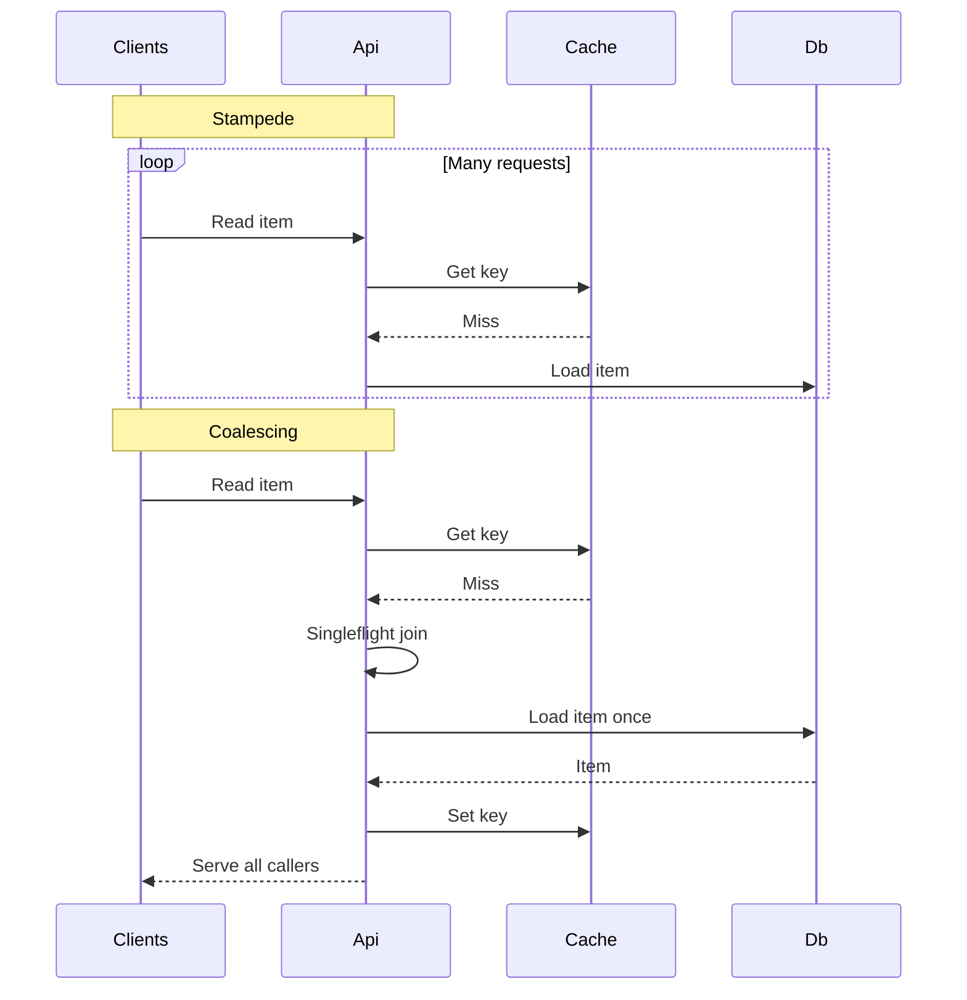

---
topic:
  - Data Persistence
subtopic:
  - Caching
summary: "Keeping bounded caches safe under expiry, memory pressure, miss storms, and dependency outages."
level:
  - "4"
priority: High
status: Ready to Repeat

publish: true
---

# Intro

Cache operations begin where the happy-path `get` and `set` calls stop. A bounded cache must decide what it admits, what it evicts, how it refreshes hot keys, and how callers degrade when either the cache or origin is unavailable. Those decisions protect the origin as much as the cache: if a 5,000-request-per-second catalog key expires fleet-wide and every caller reloads it, a healthy cache can trigger a database outage in seconds.

Write the operating contract before choosing a client library. Name the freshness budget, miss owner, acknowledgement boundary, memory limit, capacity policy, outage behavior, and signals that prove each choice is working. The cache patterns and correctness model are covered in [[Caching]]; this note focuses on the failure and capacity mechanics.

## Operating contract

| Question | Concrete decision | Signal that the decision is wrong |
| --- | --- | --- |
| Does the workload have reuse? | Measure request-key frequency and working-set size; a uniformly random key stream has no useful locality | Hit ratio remains low after warm-up |
| How stale may a value be? | Assign a freshness budget per data type and derive TTL or invalidation latency from it | Stale-read incidents or constant revalidation |
| Who owns misses? | Pick application loader, read-through loader, or background publisher; coalesce concurrent loads | Origin requests per miss rise above one for a hot key |
| What does an acknowledged write mean? | State whether origin, cache, queue, or replicas have accepted it and how retries are deduplicated | Duplicate effects or acknowledged data lost on failure |
| What happens at capacity? | Set a memory limit, admission rule, and capacity-eviction policy separately from TTL | Evictions spike, hit ratio collapses, or writes fail under `noeviction` |
| What happens when the cache is down? | Choose bypass, stale serve, partial degradation, or fail closed for each data class | Cache outage becomes an uncontrolled origin outage |

Track hit ratio by route and key class, miss latency, origin requests caused by misses, eviction and expiration rates, memory fragmentation, invalidation lag, timeout rate, and stale-read or version-mismatch counts. A fleet-wide 95% hit ratio can hide one expensive endpoint whose 5% misses dominate database load.

![[System Design 101/0cb71aee6eed509539fbd5ac91a9efc9bd345bc0855cb10d048f11413785373c.png]]

## Stampede and failure modes

Cache stampede (thundering herd, dogpile) happens when many requests miss at once and all recompute the same expensive value. The result is a burst that can overwhelm the database or downstream service — often right when the cache is least helpful.

Mitigations:

- **Jitter** — randomize expirations so hot keys do not all expire at the same second.
- **Request coalescing (singleflight)** — one in-flight load per cache key, everyone else awaits the same task. `HybridCache` does this automatically within one application process.
- **Lock-based fetch** — only the lock holder recomputes and refills the cache. This requires a backend with atomic lock semantics and a lease timeout.
- **Background refresh** — proactively refresh hot keys before they expire, or use stale-while-revalidate.

The common failures differ in which key misses and whether the cache itself is available:

| Failure | Request trace | Invariant at risk | Safe mitigation |
| --- | --- | --- | --- |
| Synchronized expiry | Many keys expire together → fleet misses → origin burst | Origin must stay within its concurrency and latency budget | TTL jitter, staged warm-up, request coalescing, and origin rate limits |
| Penetration | Random absent key → cache miss → origin not-found, repeated indefinitely | Invalid traffic must not consume unbounded origin work | Validate key space, short negative TTL, Bloom filter where membership is known, and per-principal rate limits |
| Hot-key expiry | One popular key expires → every caller recomputes the same value | At most one refresh per key while bounded-stale data remains usable | Singleflight or lease, soft/hard TTL, proactive refresh, and jitter; do not remove expiry indefinitely |
| Cache outage | Cache timeout → every request bypasses to origin | Degradation must remain below origin capacity and preserve security decisions | Short cache timeout, circuit breaker, rate-limited bypass, stale serve for eligible data, and fail closed for authorization or quota state |

The retry rule is the same in every row: bound attempts, add jittered backoff, and retry only an idempotent read or write. A cache timeout followed by an unbounded origin retry loop turns one degraded dependency into multiplicative load.

The source failure graphic is not embedded because its "no expiry for hot keys" advice creates immortal stale entries and its outage branch does not distinguish data that may bypass from security state that must fail closed.

## Eviction under memory pressure

Invalidation removes data that's *wrong*; **eviction** removes data when the cache is *full*. A cache is bounded, so it must decide what to drop:

- **`IMemoryCache`** does not bound itself by default. Set `SizeLimit` and give every entry a `Size`, otherwise high-cardinality keys can turn the cache into a memory leak. It then evicts by a priority and recency heuristic.
- **Redis** evicts according to its `maxmemory-policy`: `noeviction` rejects memory-growing writes at the limit, while policies such as `allkeys-lru`, `allkeys-lfu`, and `volatile-ttl` select different victims. `allkeys-lru` or `allkeys-lfu` are common starting points for a pure cache.

Separate three controls that diagrams often combine:

| Control | Decision | Example |
| --- | --- | --- |
| Expiration | Is this entry too old to serve? | Absolute TTL or sliding expiration |
| Admission | Is this candidate worth storing? | Reject one-hit scan entries or objects larger than a size limit |
| Capacity eviction | Which resident entry leaves when admitted data will exceed the memory limit? | LRU, LFU, SLRU, FIFO, or random replacement |

| Capacity policy | Fits | Fails when | Metadata cost |
| --- | --- | --- | --- |
| LRU | Recent access predicts near-future reuse | A sequential scan displaces the established hot set | Recency tracking |
| LFU | A stable popularity skew should survive bursts | Yesterday's hot key stays without aging or frequency decay | Counters or approximations |
| SLRU | One-hit entries should prove reuse before joining the protected segment | Segment sizes do not match the workload | Two recency lists and promotion |
| FIFO | Insertion order is a useful proxy and simplicity matters | Old frequently used entries are evicted | Queue order |
| Random | Metadata must be minimal and the working set is roughly uniform | Reuse is highly skewed | Near zero |

The source visual places TTL beside capacity-replacement policies for comparison. TTL is an expiry rule; it does not choose a victim among still-valid entries when memory is full.

![[System Design 101/52d213d56a791a27e9df7511d0ed57607da81e3871713417d123ae49a1f9d2c7.png]]

The eviction policy is the same family of algorithms as an in-process [[LRU Cache]]: LRU is the simple default, while LFU or SLRU can resist scan pollution and short bursts. Choose from measured reuse distance, frequency skew, object size, and miss cost—not the policy name. Watch **eviction rate** alongside hit ratio and origin load; a high eviction rate with a falling hit ratio means the working set no longer fits or the admission policy is polluting it.

## Other pitfalls

- **Cache poisoning** — key includes untrusted input, missing tenant boundary, or cache stores error responses. Mitigation: strict key design, include auth and tenant scope, do not cache failures unless explicitly modeled.
- **Unbounded growth** — high-cardinality keys, missing expirations, or versioned keys without TTL. Mitigation: enforce TTL, cap key space, monitor memory and evictions.
- **Serialization cost and format drift** — large payloads and frequent (de)serialization can dominate latency, and schema changes can break old entries. Mitigation: cache smaller projections, version the cached envelope, measure CPU and payload size.
- **Cold start after deploy** — restart or rollout wipes in-memory caches and can amplify load on the source. Mitigation: distributed cache for shared warm state, background warmup for hot keys, gradual rollout.
- **Distributed cache partition and partial outages** — network split can cause a fleet-wide miss storm or inconsistent reads. Mitigation: timeouts, circuit breaker, fallback to source with rate limiting, avoid coupling correctness to cache.
- **Cache key design mistakes** — missing locale, permissions, feature flags, or query parameters leads to serving wrong content. Mitigation: deterministic key builder, include all correctness dimensions.

### Cache penetration (missing-key floods)

An absent key follows `request → cache miss → origin lookup → not found`. If the system stores nothing, the next request repeats the same origin lookup. An attacker can spread requests across random, syntactically valid keys so the cache never absorbs the traffic.

| Guard | What it stops | Boundary to handle |
| --- | --- | --- |
| Negative result with a short TTL | Repeated misses for the same absent key | Invalidate on create; otherwise a new record stays hidden until the negative TTL expires |
| [[Bloom Filter]] before the origin | Definitely absent keys across a large known set | False positives still reach the origin. Add a key to the filter before exposing it, and rebuild or use a counting filter when deletes matter |
| Admission validation | Malformed IDs, impossible namespaces, or disallowed key ranges | A valid-looking random key still passes, so validation cannot replace origin protection |
| Per-principal rate limit | One caller or credential exhausting the miss path | Distributed attackers can use many identities; combine the limit with negative caching or a Bloom filter |

![[System Design 101/dd576de44a045b089cf394d57e9116f7a362faf8c98734bca86bf0756fa9de37.png]]

## References

- [HybridCache library in ASP.NET Core (.NET 9+)](https://learn.microsoft.com/aspnet/core/performance/caching/hybrid) — documents built-in stampede protection and two-tier caching behavior.
- [Key eviction (Redis docs)](https://redis.io/docs/latest/develop/reference/eviction/) — defines memory limits, `noeviction`, and the available capacity policies.
- [RFC 9111 — HTTP Caching](https://www.rfc-editor.org/rfc/rfc9111) — the normative model for freshness, validation, shared/private caches, and invalidation.
