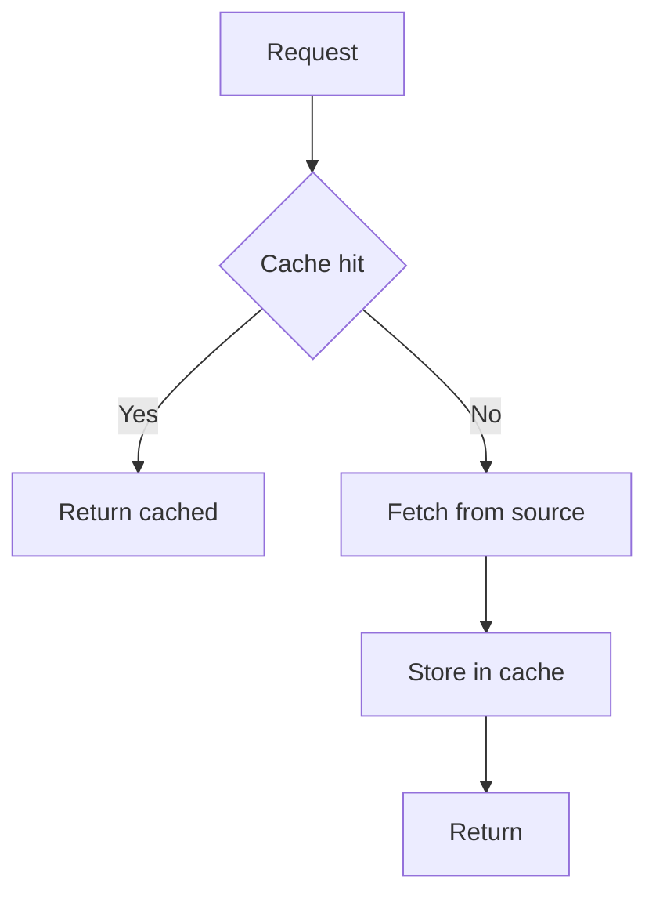
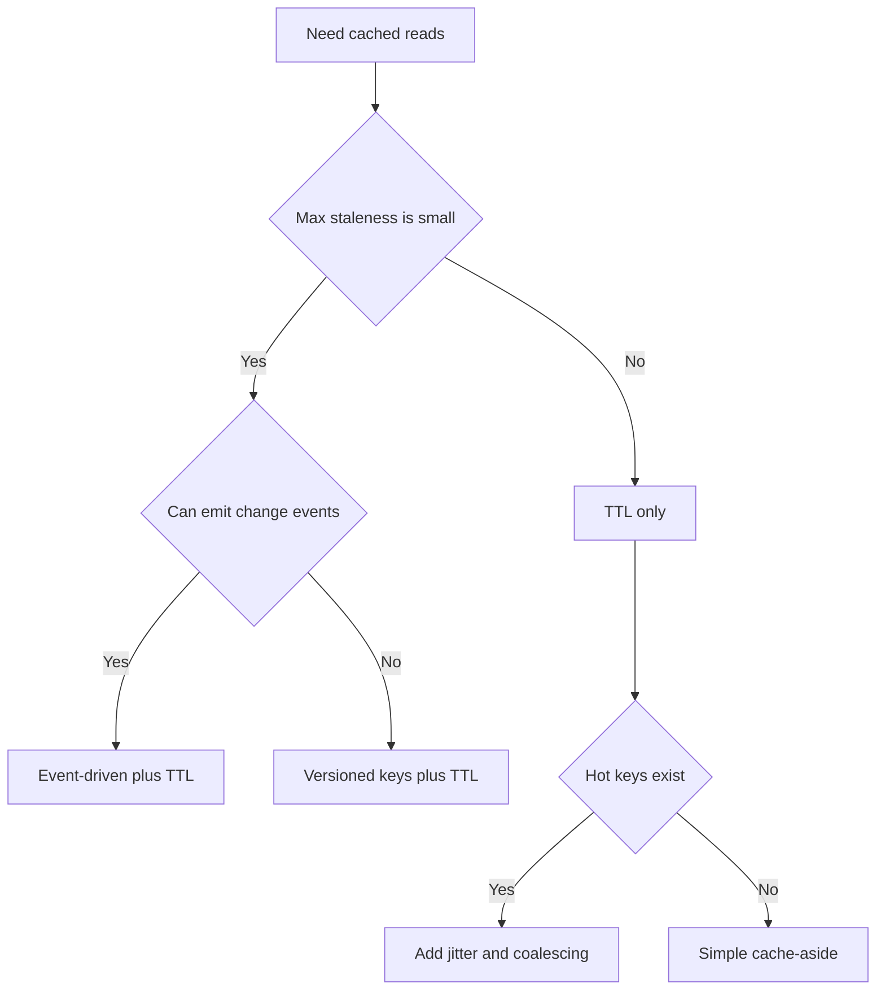

---
topic:
  - Data Persistence
subtopic: []
summary: "Storing data closer to consumers so repeated reads skip the slower origin."
level:
  - "4"
priority: High
status: Ready to Repeat

publish: true
---

# Intro

Caching stores a copy of data closer to where it is consumed — in process memory, in a shared out-of-process store like Redis, or both — so that repeated reads skip the slower origin. The mechanism is simple: check the cache first; on a miss, fetch from the source, store the result, and return it. On a hit, return the stored copy without touching the source at all.

Some systems deliberately layer an in-process cache (L1) over a shared out-of-process cache (L2). L1 avoids serialization and a network hop but is duplicated per process and disappears with that process. L2 can be shared across instances and survive an application restart, but every lookup crosses a client, network, and backend boundary. Whether L2 survives a cache-node failure depends on the selected product's persistence and replication contract. Use both tiers only when measurements show that the extra invalidation and capacity boundaries are worth the saved origin work.

The cache read path is simple; its correctness is not. Invalidation is a common risk, but incomplete keys, serialization drift, and security boundaries can be worse: omitting the tenant from a key can leak data across accounts. This note owns request patterns and freshness semantics. [[Home/Data Persistence/Caching Operations|Caching Operations]] owns outage, stampede, admission, eviction, and capacity controls; [[Home/Data Persistence/Caching Systems|Caching Systems]] owns product-specific Redis, Memcached, and EVCache contracts.



## Measure the Actual Path

CPU cache, process memory, storage I/O, and an application request are different measurement layers. A CPU L1-cache latency is not the latency of an `IMemoryCache` lookup, and a network round trip does not include Redis command execution, queueing, serialization, TLS, retries, or client-pool waits. Hardware generation, topology, payload size, and contention also change the ratios, so a fixed ladder is not a design contract.

Measure end-to-end hit and miss latency for the deployed path, plus origin load and hit ratio by key class. A cache is justified when avoided origin work improves a named latency or capacity target after accounting for miss cost, invalidation, and failure behavior. An L1 tier is justified separately when its measured gain exceeds the cost of per-process duplication and another freshness boundary.

## Cache, retained log, or index?

"Faster copy" is the useful boundary. A cache entry is derivable or replaceable from an authority, so losing it should cost latency and origin load—not correctness or permanent data. Nearby systems may accelerate reads without being caches:

| System | What it owns | Safe response to total loss |
| --- | --- | --- |
| Browser, CDN, database buffer pool, or materialized-result cache | A reusable copy or precomputed result | Re-fetch or recompute from the authority |
| Kafka topic | Retained source records under a delivery and retention contract | Restore from replicated log or backup; silently treating loss as a cache miss loses events |
| Search index | A derived query structure with mappings, analyzers, refresh, and query semantics | Rebuild from the authority; reads are incomplete or unavailable until the rebuild catches up |
| Session or rate-limit store | Time-bounded operational state | Apply an explicit fail-open or fail-closed policy; a "miss" can change security or user behavior |

Before adopting a cache product, write down the authoritative source and the rebuild path. If neither exists, the component is acting as a system of record regardless of its name.

## Cache Patterns

The five common strategies differ in who owns an origin request and what an acknowledged write means:

| Strategy | Read hit / miss | Write path | Failure and retry boundary | Freshness |
| --- | --- | --- | --- | --- |
| Cache-aside | App returns the hit; on miss it loads the origin and populates the cache | App writes the origin, then invalidates or refreshes the key | A cache failure can bypass to the origin; coalesce repeated misses. Retry writes only when the origin operation is idempotent | TTL plus explicit invalidation bounds staleness |
| Read-through | Cache returns the hit; on miss the cache's loader fetches and stores the origin value | Usually paired with a separate write strategy | Loader failures reach the caller; bound retries and coalesce misses so one outage does not multiply origin load | Loader policy, TTL, and invalidation decide freshness |
| Write-through | Reads use the cache; misses are loaded from the origin | Cache synchronously writes the origin before acknowledging | Origin failure fails the write. Retrying needs an idempotent operation or idempotency key | Acknowledged writes are current in the cache; out-of-band origin writes still need invalidation |
| Write-behind | Reads use the cache; misses are loaded from the origin | Cache acknowledges, then queues an asynchronous origin write | Cache or queue loss can lose acknowledged data; retries can duplicate a non-idempotent write | Cache is freshest while the origin intentionally lags |
| Write-around | Existing hits are served; a miss loads and populates as in cache-aside | App writes the origin and bypasses the cache | Origin failure leaves the cache unchanged; retry under the origin's idempotency contract | Invalidate an old cached value on write or let its TTL expire |

Write-around fits write-heavy data that is rarely read back: it avoids filling the cache with entries that may never be read, at the cost of making the first later read a miss.

![[System Design 101/4432553bc930f9667bf6c2b428d1c3ecfba4ee743ca3c7aafacd778422d928a4.png]]

Cache-aside with `IDistributedCache`:

```csharp
public static async Task<string> GetUserName(
    string userId,
    IDistributedCache cache,
    Func<string, Task<string>> loadFromDb,
    CancellationToken ct)
{
    var key = $"user-name:{userId}";
    var cached = await cache.GetStringAsync(key, ct);
    if (cached is not null)
        return cached;

    var value = await loadFromDb(userId);
    await cache.SetStringAsync(
        key,
        value,
        new DistributedCacheEntryOptions { AbsoluteExpirationRelativeToNow = TimeSpan.FromMinutes(5) },
        ct);
    return value;
}
```

The same operation with `HybridCache` (.NET 9+) — stampede protection and L1/L2 layering are built in:

```csharp
public class UserService(HybridCache cache)
{
    public async Task<string> GetUserNameAsync(string userId, CancellationToken ct)
    {
        return await cache.GetOrCreateAsync(
            $"user-name:{userId}",
            async cancel => await LoadFromDbAsync(userId, cancel),
            token: ct);
    }
}
```

## Operating decisions

Before selecting a client library, decide whether the workload has reuse, how stale each data class may be, who owns a miss, what an acknowledged write means, what happens at capacity, and how each request class degrades when the cache is unavailable. Measure hit ratio by route and key class rather than relying on one fleet-wide percentage: a 95% aggregate hit ratio can still hide an endpoint whose misses dominate database load.

The detailed signals, outage boundaries, eviction choices, and miss-abuse controls live in [[Home/Data Persistence/Caching Operations|Caching Operations]].

## Invalidation Strategies

Invalidation strategy is a correctness decision, not an optimization detail. Start by writing down your staleness contract, then pick the simplest strategy that meets it.

- **Explicit delete on write** — on successful write, delete `key` or write the new value. If deletes can be lost, you still need a TTL as a safety net. Best when all writes go through one path that can delete or update cache.
- **TTL only** — choose TTL from a staleness budget, not from guesswork. Add jitter and stampede protection for hot keys. Best when stale reads are acceptable and updates are infrequent or hard to observe.
- **Event-driven** — publish invalidation events on writes, consume them in all app instances. Typical transports: message broker pub/sub, database change data capture, outbox pattern. If you cannot guarantee delivery, treat events as best-effort and keep TTL. Best when correctness matters and you can reliably emit change events.
- **Versioned keys** — key includes a version, for example `user-name:{userId}:v{version}`. Version comes from row version, updated_at, etag, or a separate version store. Old keys naturally age out by TTL, no delete required. Best when deletes are expensive or unreliable, and you can carry a version token.

Decision rule of thumb:



## Correctness and Staleness

Treat cached data as a replica with its own consistency model.

- **Staleness budget** — the maximum age or divergence your product can tolerate, per data type. Example: prices might need seconds, user avatars can tolerate hours.
- **Eventual vs strong consistency** — TTL-only and best-effort invalidation are eventual consistency. Strong consistency usually means bypassing cache or coupling cache and source writes in the same correctness boundary.
- **Read-your-writes** — for user-facing writes, ensure the writer reads fresh data immediately after writing. Common patterns: write-through cache, delete on write, versioned key using row version, per-request bypass for the writer.
- **Stale-while-revalidate** — serve slightly stale data fast while refreshing in the background. Trades bounded staleness for predictable latency and load. The pattern uses two TTLs: a soft TTL (freshness window) and a hard TTL (safety expiration). On a soft miss, the stale value is returned immediately while a background task refreshes the cache. On a hard miss, the caller blocks on a fresh fetch.

Stale-while-revalidate sketch inside a generic cache service — dual TTL with one in-process refresh owner per key:

```csharp
private sealed record RefreshResult(T? Value, Exception? Error);

private readonly ConcurrentDictionary<string, Lazy<Task<RefreshResult>>> refreshes = new();

public async Task<T> GetAsync(string key, CancellationToken ct)
{
    var json = await cache.GetStringAsync(key, ct);
    var envelope = json is null ? null : JsonSerializer.Deserialize<Envelope<T>>(json);

    if (envelope is not null && DateTimeOffset.UtcNow <= envelope.FreshUntilUtc)
        return envelope.Value;

    var refresh = refreshes.GetOrAdd(
        key,
        cacheKey => new Lazy<Task<RefreshResult>>(
            () => RefreshAndReleaseAsync(cacheKey),
            LazyThreadSafetyMode.ExecutionAndPublication));

    if (envelope is not null)
    {
        _ = refresh.Value;
        return envelope.Value;
    }

    var result = await refresh.Value.WaitAsync(ct);
    if (result.Error is not null)
        throw new InvalidOperationException("Cache refresh failed.", result.Error);

    return result.Value!;
}

private async Task<RefreshResult> RefreshAndReleaseAsync(string key)
{
    try
    {
        var value = await LoadFromSourceAsync(key, CancellationToken.None);
        await WriteCacheAsync(key, value, softTtl, hardTtl, CancellationToken.None);
        return new RefreshResult(value, null);
    }
    catch (Exception ex)
    {
        logger.LogWarning(ex, "Cache refresh failed for {CacheKey}", key);
        return new RefreshResult(default, ex);
    }
    finally
    {
        refreshes.TryRemove(key, out _);
    }
}
```

`refreshes` is a service field, not request-local state. `GetOrAdd` may construct unused `Lazy` wrappers during a race, but only the stored wrapper's `Value` starts a refresh. Soft-expired callers return stale data while sharing that task; hard misses await the same owner. The refresh logs failures and returns them as data, so the stale path cannot leave a faulted task unobserved. Request cancellation stops only that caller's wait, not the shared refresh.

Notes:

- Soft TTL is a latency contract. Hard TTL is a safety contract.
- This dictionary and `HybridCache` coalesce only within one process. `IDistributedCache` does not provide atomic singleflight across instances; fleet-wide coordination needs a backend-aware lease or another distributed ownership protocol.

## Stampede and Failure Boundary

A stampede starts when many callers miss the same expensive key and independently load the origin. Coalesce refreshes, jitter expirations, and decide per data class whether an outage may serve stale, bypass under a rate limit, or must fail closed. The concrete request traces, signals, eviction choices, and overload safeguards live in [[Home/Data Persistence/Caching Operations|Caching Operations]].

## Product Boundary

Redis, Memcached, and EVCache are not interchangeable merely because they can serve values from memory. Decide whether values are disposable, which acknowledgement and persistence settings define loss, and how capacity eviction affects the origin. [[Home/Data Persistence/Caching Systems|Caching Systems]] carries those product comparisons and failure contracts.

## Tradeoffs

| Dimension | IMemoryCache (L1) | IDistributedCache (L2) | HybridCache (.NET 9+) |
| --- | --- | --- | --- |
| Request path | Process-local lookup; no serialization or network hop | Client pool, serialization, network, and backend execution | Process-local L1 with L2/origin fallback |
| Capacity | Bounded by app process memory | Bounded by cache cluster (Redis, SQL) | L1 bounded by process, L2 by cluster |
| Sharing | Per-instance, no sharing across pods | Shared across all instances | Shared L2, per-instance L1 |
| Stampede protection | Manual (singleflight pattern) | Manual (distributed lock) | Built-in |
| Survivability | Lost with the process | Survives app restarts; node-loss behavior is backend-specific | L1 is process-local; L2 behavior is backend-specific |
| Tag-based invalidation | Not supported | Not supported | Built-in |
| Best for | Single-instance apps, hot-path data | Multi-instance apps, shared state | Default choice for new .NET 9+ apps |

Decision rule: start with `HybridCache` for new .NET 9+ projects — it handles L1/L2 layering, stampede protection, and serialization out of the box. Fall back to `IDistributedCache` when you need explicit control over cache writes, or `IMemoryCache` for single-instance scenarios where distributed state is unnecessary.

## Eviction and Miss Abuse

Expiration, admission, and capacity eviction answer different questions: whether an entry is too old, whether a candidate should enter, and which resident value leaves when memory is full. Absent-key traffic is another boundary; validate impossible keys, consider short negative caching or a [[Home/Computer Science/Data Structures/Hash-based Structures/Bloom Filter|Bloom Filter]] when membership is known, and rate-limit by principal. [[Home/Data Persistence/Caching Operations|Caching Operations]] owns the policy comparison and the signals that show when it is wrong.

## Questions

> [!QUESTION]- How do you reduce cache stampede?
> Add jitter to expirations so hot keys do not all expire simultaneously. Use request coalescing (singleflight pattern) so only one caller recomputes while others await the result. Consider stale-while-revalidate or background refresh to avoid blocking on recomputation entirely. `HybridCache` in .NET 9+ handles coalescing automatically.

## References

- [HybridCache library in ASP.NET Core (.NET 9+)](https://learn.microsoft.com/aspnet/core/performance/caching/hybrid) — documents the two-tier API, serialization, expiration, and per-process stampede protection used in the examples.
- [Overview of caching in ASP.NET Core](https://learn.microsoft.com/aspnet/core/performance/caching/overview) — compares in-memory, distributed, output, and hybrid caching surfaces in ASP.NET Core.
- [IDistributedCache API reference](https://learn.microsoft.com/dotnet/api/microsoft.extensions.caching.distributed.idistributedcache) — defines the shared-cache get, set, refresh, and remove contract available to .NET applications.
- [Cache-aside pattern (Azure Architecture Center)](https://learn.microsoft.com/azure/architecture/patterns/cache-aside) — traces application-owned cache population, invalidation, and origin fallback with their consistency costs.
- [RFC 5861 — HTTP cache-control extensions for stale content](https://www.rfc-editor.org/rfc/rfc5861) — specifies `stale-while-revalidate` and `stale-if-error` for HTTP caches.
- [Solving thundering herds with request coalescing (jazco.dev)](https://jazco.dev/2023/09/28/request-coalescing) — provides a concrete singleflight implementation and explains why concurrent misses should share one origin request.
- [Database Caching Strategies Using Redis (AWS Whitepaper)](https://docs.aws.amazon.com/whitepapers/latest/database-caching-strategies-using-redis/welcome.html) — defines the write-through/write-behind/write-around trio and cache-aside population.
- [Key eviction (Redis docs)](https://redis.io/docs/latest/develop/reference/eviction/) — the `maxmemory-policy` options (`allkeys-lru`/`allkeys-lfu`/`volatile-ttl`/`noeviction`).
- [Redis persistence](https://redis.io/docs/latest/operate/oss_and_stack/management/persistence/) — RDB, AOF, combined, and no-persistence modes with their data-loss and recovery tradeoffs.
- [Redis replication](https://redis.io/docs/latest/operate/oss_and_stack/management/replication/) — asynchronous replication, partial/full resynchronization, `WAIT`, and remaining failover loss windows.
- [Redis Pub/Sub](https://redis.io/docs/latest/develop/pubsub/) and [Redis Streams](https://redis.io/docs/latest/develop/data-types/streams/) — at-most-once transient delivery versus retained entries and consumer-group state.
- [Redis pipelining](https://redis.io/docs/latest/develop/using-commands/pipelining/) and [latency diagnosis](https://redis.io/docs/latest/operate/oss_and_stack/management/optimization/latency/) — round-trip batching and the command, persistence, fork, swapping, and network sources of latency.
- [Memcached performance](https://docs.memcached.org/serverguide/performance/) — multithreaded event processing, slab allocation, segmented LRU, expiry, and capacity eviction.
- [Netflix EVCache](https://github.com/Netflix/EVCache) — primary project documentation for EVCache's ephemeral, volatile, TTL-bound contract.
- [RFC 9111 — HTTP Caching](https://www.rfc-editor.org/rfc/rfc9111) — normative freshness, validation, shared/private cache, and invalidation semantics.
- [Top 5 caching strategies (ByteByteGo, pinned source)](https://github.com/ByteByteGoHq/system-design-101/blob/b28380a4710c5ec9638ec037d4168e288f334cba/data/guides/top-5-caching-strategies.md) — visual taxonomy for the five request and write paths compared above.
- [Cache miss attack (ByteByteGo, pinned source)](https://github.com/ByteByteGoHq/system-design-101/blob/b28380a4710c5ec9638ec037d4168e288f334cba/data/guides/cache-miss-attack.md) — request-path illustration for cache penetration and the layered mitigations.
- [4 ways Netflix uses caching (ByteByteGo, pinned source)](https://github.com/ByteByteGoHq/system-design-101/blob/b28380a4710c5ec9638ec037d4168e288f334cba/data/guides/4-ways-netflix-uses-caching-to-hold-user-attention.md) — four EVCache roles reconciled here with distinct authority and loss contracts.
- [Cache systems every developer should know (ByteByteGo, pinned source)](https://github.com/ByteByteGoHq/system-design-101/blob/b28380a4710c5ec9638ec037d4168e288f334cba/data/guides/cache-systems-every-developer-should-know.md) — broad layer inventory; the source image is excluded because durable logs and query indexes are not interchangeable with replaceable caches.
- [Most popular cache eviction (ByteByteGo, pinned source)](https://github.com/ByteByteGoHq/system-design-101/blob/b28380a4710c5ec9638ec037d4168e288f334cba/data/guides/most-popular-cache-eviction.md) — visual comparison used with an explicit expiry-versus-capacity distinction.
- [The ultimate Redis 101 (ByteByteGo, pinned source)](https://github.com/ByteByteGoHq/system-design-101/blob/b28380a4710c5ec9638ec037d4168e288f334cba/data/guides/the-ultimate-redis-101.md) — Redis capability inventory reconciled against current persistence, replication, and messaging documentation; the source image is excluded for durability and obsolete-module claims.
- [Memcached vs Redis (ByteByteGo, pinned source)](https://github.com/ByteByteGoHq/system-design-101/blob/b28380a4710c5ec9638ec037d4168e288f334cba/data/guides/memcached-vs-redis.md) — workload comparison expanded here without equating atomic commands to database transactions; the source image is excluded for false absolutes.
- [Top 8 cache eviction strategies (ByteByteGo, pinned source)](https://github.com/ByteByteGoHq/system-design-101/blob/b28380a4710c5ec9638ec037d4168e288f334cba/data/guides/top-8-cache-eviction-strategies.md) — policy inventory corrected by separating TTL, admission, tiers, and capacity eviction; its source image is excluded for conflating those categories.
- [How cache systems can go wrong (ByteByteGo, pinned source)](https://github.com/ByteByteGoHq/system-design-101/blob/b28380a4710c5ec9638ec037d4168e288f334cba/data/guides/how-can-cache-systems-go-wrong.md) — failure taxonomy retained with bounded, data-class-specific mitigations; the source image is excluded for unsafe no-expiry advice.
- [Things to consider when using cache (ByteByteGo, pinned source)](https://github.com/ByteByteGoHq/system-design-101/blob/b28380a4710c5ec9638ec037d4168e288f334cba/data/guides/things-to-consider-when-using-cache.md) — operating checklist expanded with explicit ownership, failure, and measurement boundaries.
- [Why Redis is fast (ByteByteGo, pinned source)](https://github.com/ByteByteGoHq/system-design-101/blob/b28380a4710c5ec9638ec037d4168e288f334cba/data/guides/why-is-redis-so-fast.md) — performance factors reconciled against current Redis latency documentation; the source image is excluded for version-sensitive implementation claims.
