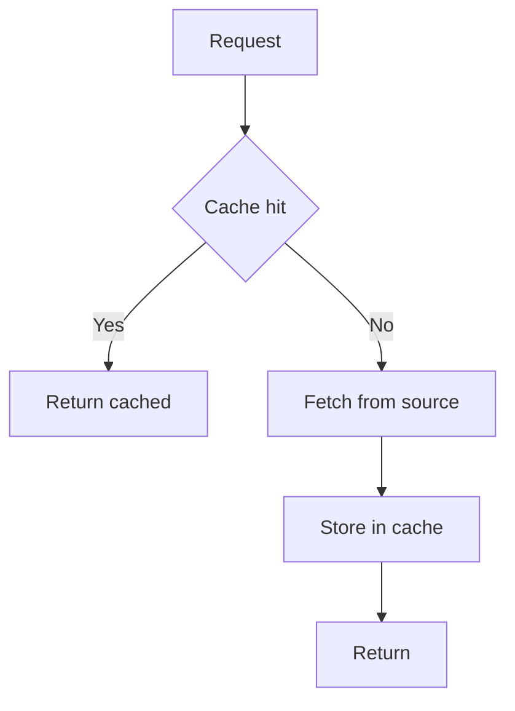
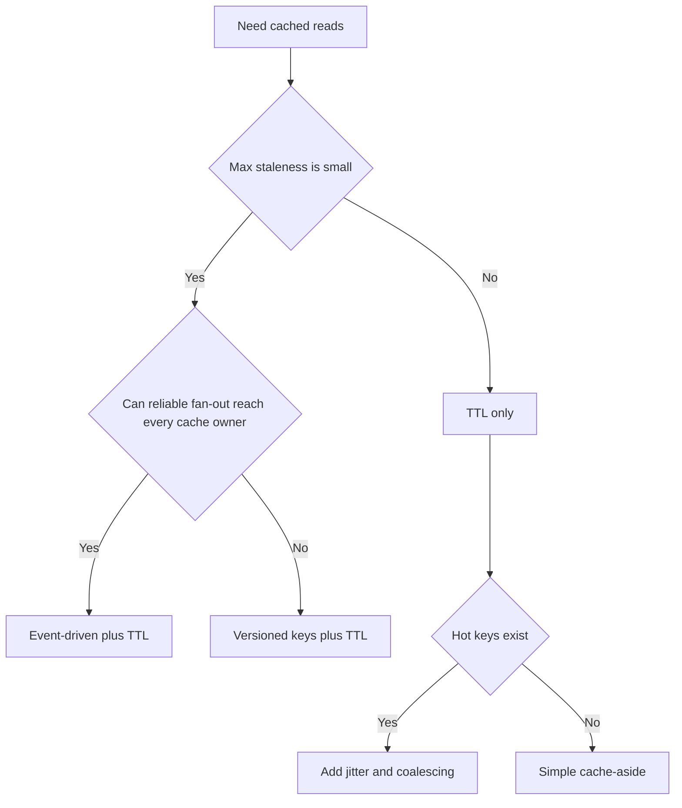

---
topic:
  - Data Persistence
subtopic: []
summary: "Storing data closer to consumers so repeated reads skip the slower origin."
level:
  - "4"
priority: High
status: Ready to Repeat

publish: true
---

Caching keeps a copy of data closer to its consumer, in process memory, in a shared store such as Redis, or in both. A hit returns that copy without touching the slower origin. A miss loads the source, stores the result, and returns it.

An in-process L1 avoids serialization and a network hop, but each process owns a separate copy and loses it on restart. A shared L2 spans application instances and can outlive them, although every lookup crosses client, network, and backend boundaries. Cache-node failure is a separate question governed by the product's persistence and replication contract. Two tiers are worth carrying only when the saved origin work exceeds the extra capacity and invalidation cost.

The read path is short. The correctness boundary is larger. Incomplete keys, serialization drift, and stale values can return the wrong data. Omitting a tenant from a key can leak data across accounts. The design must name freshness, outage behavior, capacity policy, and the product's loss boundary.


```mermaid
flowchart TD
  A[Request] --> B{Cache hit}
  B -->|Yes| C[Return cached]
  B -->|No| D[Fetch from source]
  D --> E[Store in cache]
  E --> F[Return]
```

# Measure the Actual Path

CPU cache, process memory, storage I/O, and an application request are different measurement layers. A CPU L1-cache latency is not the latency of an `IMemoryCache` lookup, and a network round trip does not include Redis command execution, queueing, serialization, TLS, retries, or client-pool waits. Hardware generation, topology, payload size, and contention also change the ratios, so a fixed ladder is not a design contract.

Measure end-to-end hit and miss latency for the deployed path, plus origin load and hit ratio by key class. A cache is justified when avoided origin work improves a named latency or capacity target after accounting for miss cost, invalidation, and failure behavior. An L1 tier is justified separately when its measured gain exceeds the cost of per-process duplication and another freshness boundary.

# Cache, Retained Log, or Index?

"Faster copy" is the useful boundary. A cache entry is derivable or replaceable from an authority, so losing it should cost latency and origin load—not correctness or permanent data. Nearby systems may accelerate reads without being caches:

| System | What it owns | Safe response to total loss |
| --- | --- | --- |
| Browser, CDN, database buffer pool, or materialized-result cache | A reusable copy or precomputed result | Re-fetch or recompute from the authority |
| Kafka topic | Retained source records under a delivery and retention contract | Restore from replicated log or backup. Silently treating loss as a cache miss loses events |
| Search index | A derived query structure with mappings, analyzers, refresh, and query semantics | Rebuild from the authority. Reads are incomplete or unavailable until the rebuild catches up |
| Session or rate-limit store | Time-bounded operational state | Apply an explicit fail-open or fail-closed policy. A "miss" can change security or user behavior |

A cache needs an authoritative source and a rebuild path. Without them, the component is acting as a system of record regardless of its name.

# Cache Patterns

The common strategies differ in who owns an origin request and what an acknowledged write means:

| Strategy | Read hit / miss | Write path | Failure and retry boundary | Freshness |
| --- | --- | --- | --- | --- |
| Cache-aside | App returns the hit. On miss it loads the origin and populates the cache | App writes the origin, then invalidates or refreshes the key | A cache failure can bypass to the origin. Coalesce repeated misses. Retry writes only when the origin operation is idempotent | TTL plus explicit invalidation bounds staleness |
| Read-through | Cache returns the hit. On miss the cache's loader fetches and stores the origin value | Usually paired with a separate write strategy | Loader failures reach the caller. Bound retries and coalesce misses so one outage does not multiply origin load | Loader policy, TTL, and invalidation decide freshness |
| Write-through | Reads use the cache. Misses are loaded from the origin | Cache synchronously writes the origin before acknowledging | Origin failure fails the write. Retrying needs an idempotent operation or idempotency key | Acknowledged writes are current in the cache. Out-of-band origin writes still need invalidation |
| Write-behind | Reads use the cache. Misses are loaded from the origin | Cache acknowledges, then queues an asynchronous origin write | Cache or queue loss can lose acknowledged data. Retries can duplicate a non-idempotent write | Cache is freshest while the origin intentionally lags |
| Write-around | Existing hits are served. A miss loads and populates as in cache-aside | App writes the origin and bypasses the cache | Origin failure leaves the cache unchanged. Retry under the origin's idempotency contract | Invalidate an old cached value on write or let its TTL expire |

Write-around fits write-heavy data that is rarely read back: it avoids filling the cache with entries that may never be read, at the cost of making the first later read a miss.

![[Data Persistence/Data Persistence-Caching-18120000-1.png|theme-aware]]

Cache-aside with `IDistributedCache`:

```csharp
public static async Task<string> GetUserName(
    string userId,
    IDistributedCache cache,
    Func<string, Task<string>> loadFromDb,
    CancellationToken ct)
{
    var key = $"user-name:{userId}";
    var cached = await cache.GetStringAsync(key, ct);
    if (cached is not null)
        return cached;

    var value = await loadFromDb(userId);
    await cache.SetStringAsync(
        key,
        value,
        new DistributedCacheEntryOptions { AbsoluteExpirationRelativeToNow = TimeSpan.FromMinutes(5) },
        ct);
    return value;
}
```

The same operation with `HybridCache` (.NET 9+) uses a built-in L1, an optional configured L2, and per-process stampede protection:

```csharp
public class UserService(HybridCache cache)
{
    public async Task<string> GetUserNameAsync(string userId, CancellationToken ct)
    {
        return await cache.GetOrCreateAsync(
            $"user-name:{userId}",
            async cancel => await LoadFromDbAsync(userId, cancel),
            token: ct);
    }
}
```

# What to Decide Before Adding a Cache

Choose the behavior before the client library: how often keys repeat, how stale a value may be, who loads a miss, what an acknowledged write means, what happens at capacity, and how requests behave when the cache is down. Hit ratio belongs to a route and key class. A 95% fleet-wide ratio can still hide one endpoint whose misses dominate database load.

| Question | Concrete decision | Signal that the decision is wrong |
| --- | --- | --- |
| Does the workload have reuse? | Measure request-key frequency and working-set size | Hit ratio remains low after warm-up |
| How stale may a value be? | Assign a freshness budget per data type and derive TTL or invalidation latency | Stale-read incidents or constant revalidation |
| Who owns misses? | Choose an application loader, read-through loader, or background publisher. Coalesce concurrent loads | Origin requests per miss rise above one for a hot key |
| What does an acknowledged write mean? | Name whether the origin, cache, queue, or replicas have accepted it | Duplicate effects or acknowledged data loss on failure |
| What happens at capacity? | Set a memory limit, admission rule, and eviction policy separately from TTL | Evictions spike, hit ratio collapses, or writes fail under `noeviction` |
| What happens when the cache is down? | Choose bypass, stale serve, partial degradation, or fail closed per data class | A cache outage becomes an uncontrolled origin outage |

Track hit ratio by route and key class, miss latency, origin requests caused by misses, eviction and expiration rates, invalidation lag, timeouts, and stale-read or version-mismatch counts.

![[Data Persistence/Data Persistence-Caching-18120000.png|theme-aware]]

# Invalidation Strategies

Invalidation determines how long a stale value can survive. Choose the smallest strategy that stays within that limit.

- **Explicit delete on write** — after a successful origin write, delete the key or replace its value. A TTL remains a safety net when deletes can be lost. This fits systems whose writes pass through one controlled path.
- **TTL only** — derive the TTL from the allowed staleness. Hot keys also need jitter and stampede protection. This fits infrequent updates and data that may remain stale for a bounded period.
- **Event-driven** — an outbox or change data capture records the change. A relay then publishes an invalidation through a broadcast-capable broker or a separate subscription for each cache owner. Every owner consumes the message and invalidates its local entry. TTL remains the backstop when capture, relay, or delivery fails.
- **Versioned keys** — the key carries a row version, timestamp, ETag, or other version token, such as `user-name:{userId}:v{version}`. Old entries expire naturally. This avoids unreliable deletes when the version is already available to readers.

The paths separate cleanly:


```mermaid
flowchart TD
  A[Need cached reads] --> B{Max staleness is small}
  B -->|Yes| C{Can reliable fan-out reach every cache owner}
  B -->|No| D[TTL only]
  C -->|Yes| E[Event-driven plus TTL]
  C -->|No| F[Versioned keys plus TTL]
  D --> G{Hot keys exist}
  G -->|Yes| H[Add jitter and coalescing]
  G -->|No| I[Simple cache-aside]
```

# Correctness and Staleness

Cached data is a replica with its own consistency model.

- **Staleness budget** — the maximum age or divergence the product can tolerate, per data type. Example: prices might need seconds, user avatars can tolerate hours.
- **Eventual vs strong consistency** — TTL-only and best-effort invalidation are eventual consistency. Strong consistency usually means bypassing cache or coupling cache and source writes in the same correctness boundary.
- **Read-your-writes** — for user-facing writes, ensure the writer reads fresh data immediately after writing. Common patterns: write-through cache, delete on write, versioned key using row version, per-request bypass for the writer.
- **Stale-while-revalidate** — serve slightly stale data fast while refreshing in the background. Trades bounded staleness for predictable latency and load. The pattern uses two TTLs: a soft TTL (freshness window) and a hard TTL (safety expiration). On a soft miss, the stale value is returned immediately while a background task refreshes the cache. On a hard miss, the caller blocks on a fresh fetch.

Stale-while-revalidate sketch inside a generic cache service — dual TTL with one in-process refresh owner per key:

```csharp
private sealed record RefreshResult(T? Value, Exception? Error);

private readonly ConcurrentDictionary<string, Lazy<Task<RefreshResult>>> refreshes = new();

public async Task<T> GetAsync(string key, CancellationToken ct)
{
    var json = await cache.GetStringAsync(key, ct);
    var envelope = json is null ? null : JsonSerializer.Deserialize<Envelope<T>>(json);

    if (envelope is not null && DateTimeOffset.UtcNow <= envelope.FreshUntilUtc)
        return envelope.Value;

    var refresh = refreshes.GetOrAdd(
        key,
        cacheKey => new Lazy<Task<RefreshResult>>(
            () => RefreshAndReleaseAsync(cacheKey),
            LazyThreadSafetyMode.ExecutionAndPublication));

    if (envelope is not null)
    {
        _ = refresh.Value;
        return envelope.Value;
    }

    var result = await refresh.Value.WaitAsync(ct);
    if (result.Error is not null)
        throw new InvalidOperationException("Cache refresh failed.", result.Error);

    return result.Value!;
}

private async Task<RefreshResult> RefreshAndReleaseAsync(string key)
{
    try
    {
        var value = await LoadFromSourceAsync(key, CancellationToken.None);
        await WriteCacheAsync(key, value, softTtl, hardTtl, CancellationToken.None);
        return new RefreshResult(value, null);
    }
    catch (Exception ex)
    {
        logger.LogWarning(ex, "Cache refresh failed for {CacheKey}", key);
        return new RefreshResult(default, ex);
    }
    finally
    {
        refreshes.TryRemove(key, out _);
    }
}
```

`refreshes` is a service field, not request-local state. `GetOrAdd` may construct unused `Lazy` wrappers during a race, but only the stored wrapper's `Value` starts a refresh. Soft-expired callers return stale data while sharing that task. Hard misses await the same owner. The refresh logs failures and returns them as data, so the stale path cannot leave a faulted task unobserved. Request cancellation stops only that caller's wait, not the shared refresh.

Notes:

- Soft TTL is a latency contract. Hard TTL is a safety contract.
- This dictionary and `HybridCache` coalesce only within one process. `IDistributedCache` does not provide atomic singleflight across instances. Fleet-wide coordination needs a backend-aware lease or another distributed ownership protocol.

# Stampede and Failure Modes

A stampede starts when many callers miss the same expensive key and independently load the origin. Coalesce refreshes, jitter expirations, and decide per data class whether an outage may serve stale, bypass under a rate limit, or must fail closed.

| Failure | Request trace | Safe boundary |
| --- | --- | --- |
| Synchronized expiry | Many keys expire together, producing a fleet-wide origin burst | TTL jitter, staged warm-up, coalescing, and origin rate limits |
| Hot-key expiry | One popular key expires and every caller recomputes it | One refresh owner, soft/hard TTL, proactive refresh, and bounded stale serve |
| Penetration | Random absent keys repeatedly miss and reach the origin | Key-space validation, short negative TTL, membership filter when applicable, and per-principal limits |
| Cache outage | Cache timeouts make every request bypass | Short cache timeouts, circuit breaker, rate-limited bypass, stale serve for eligible data, and fail closed for authorization or quota state |

Retries remain bounded and apply only to idempotent operations. An unbounded origin retry after a cache timeout multiplies load exactly when the dependency is weakest.

# Redis and Memcached

Redis, Memcached, and EVCache are not interchangeable merely because they serve values from memory. The real boundaries are whether values are disposable, what an acknowledgement promises, and how eviction affects the origin.

| Dimension | Memcached | Redis |
| --- | --- | --- |
| Core model | Ephemeral opaque values distributed in memory | Typed in-memory structures with atomic commands |
| Capacity behavior | Slab classes and segmented LRU reclaim expired or unexpired items | Configurable `maxmemory-policy`. `noeviction` rejects memory-growing writes at the limit |
| Persistence and failover | Loss is a miss and the application repopulates | Optional RDB/AOF plus asynchronous replication. The loss window depends on configuration |
| Coordination features | CAS for compare-and-set of a cached value | Atomic commands, scripts, streams, Pub/Sub, replication, Sentinel, and Cluster |

Use Memcached for a plain disposable object cache. Use Redis when server-side structures or atomic operations justify its persistence, replication, and cluster choices. Redis command atomicity is not a relational transaction across arbitrary operations.

# Netflix EVCache: Four Data Contracts

Netflix's EVCache illustrates four distinct contracts that can share an in-memory implementation:

| Role | Authority and rebuild path | Loss and freshness contract |
| --- | --- | --- |
| Lookaside cache | Database or backend service remains authoritative | Eviction is expected. TTL and invalidation bound staleness |
| Transient session state | The cache may hold the only short-lived coordination value | Loss changes session behavior, so clients need an explicit recovery path |
| Precomputed primary read store | An offline job publishes a generated data version | Retain or regenerate the last good generation before replacement |
| Distribution plane | A publisher derives UI strings or translations from an upstream authority | Readers need versioned publication, rollback, and partial-generation handling |

![[Data Persistence/Data Persistence-Caching-18120000-3.png|theme-aware]]

# Redis as a Cache or System of Record

Authoritative Redis data cannot use an eviction policy that discards keys, and its acknowledgement boundary must name the remaining loss window. RDB can lose writes since the last snapshot. AOF durability depends on `appendfsync`, replication is asynchronous by default, and `WAIT` narrows failover risk without eliminating it. Pub/Sub has no replay. Streams retains entries and consumer-group state under the same persistence and replication configuration. Durability comes from the tested deployment, not from one enabled setting.

# Why Redis Is Fast and When It Stalls

Redis is fast because the working set stays in memory, clients are multiplexed, and most commands execute through a mostly serialized path. That same path makes large-key traversal, `O(N)` commands, Lua or module work, persistence fork pressure, AOF flushing, swapping, and network queues visible as tail latency. Measure the actual command and payload mix. Watch slow commands, big keys, memory, persistence, and replication lag.

# Tradeoffs

| Dimension | IMemoryCache (L1) | IDistributedCache (L2) | HybridCache (.NET 9+) |
| --- | --- | --- | --- |
| Request path | Process-local lookup. No serialization or network hop | Client pool, serialization, network, and backend execution | Process-local L1 with configured L2/origin fallback |
| Capacity | Bounded by app process memory | Bounded by cache cluster (Redis, SQL) | L1 bounded by process; optional L2 by cluster |
| Sharing | Per-instance, no sharing across pods | Shared across all instances | Per-instance L1; shared L2 only when configured |
| Stampede protection | Manual (singleflight pattern) | Manual (distributed lock) | Built-in within the current server |
| Survivability | Lost with the process | Survives app restarts. Node-loss behavior is backend-specific | L1 is process-local. Configured L2 behavior is backend-specific |
| Tag-based invalidation | Not supported | Not supported | Current server and configured L2. Other servers' L1 caches need fan-out |
| Best for | Single-instance apps, hot-path data | Multi-instance apps, shared state | Default choice for new .NET 9+ apps |

For a new .NET 9+ service, `HybridCache` is the practical default when its L1, optional L2, and per-process stampede protection match the workload. `IDistributedCache` exposes cache writes directly. `IMemoryCache` keeps the design smaller when one process owns the data and restart loss is acceptable.

# Eviction under Memory Pressure

Expiration, admission, and capacity eviction answer different questions: whether an entry is too old, whether a candidate should enter, and which resident value leaves when memory is full.

| Capacity policy | Fits | Fails when |
| --- | --- | --- |
| LRU | Recent access predicts reuse | A sequential scan displaces the established hot set |
| LFU | A stable popularity skew should survive bursts | Old hot keys never age out |
| SLRU | One-hit entries should prove reuse before entering a protected segment | Segment sizes do not match the workload |
| FIFO | Insertion order is a useful proxy and simplicity matters | Old frequently used entries are evicted |
| Random | Metadata must be minimal and reuse is roughly uniform | Popularity is highly skewed |

`IMemoryCache` is not bounded unless entries provide sizes and the cache has a `SizeLimit`. Redis uses `maxmemory-policy`. A pure cache commonly starts with an all-keys LRU or LFU policy, while `noeviction` rejects memory-growing writes. Choose from measured reuse distance, skew, object size, and miss cost, then watch eviction rate with hit ratio and origin load.

![[Data Persistence/Data Persistence-Caching-18120000-2.png|theme-aware]]

# Other Pitfalls

High-cardinality keys, missing tenant or authorization dimensions, large payloads, format drift, and cold deploys can erase the latency gain or return incorrect data. Safe operation requires a bounded key space, versioned envelopes, measured serialization cost, and a rollout rate the origin can absorb.

## Cache Penetration (Missing-Key Floods)

Absent-key traffic follows `request → cache miss → origin not found`. Validate impossible keys, use a short negative TTL for repeated misses, consider a [[Home/Computer Science/Data Structures/Hash-based Structures/Bloom Filter|Bloom Filter]] when membership is known, and rate-limit by principal. Negative entries must be invalidated on creation. Bloom false positives still reach the origin. Versioned keys still need TTLs so obsolete versions do not grow without bound.

![[Data Persistence/Data Persistence-Caching-18120000-4.png|theme-aware]]

