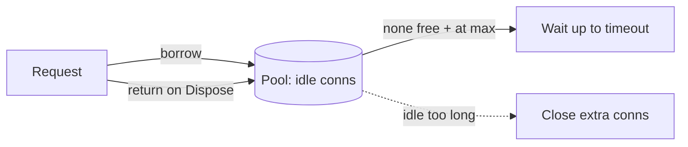

---
topic:
  - Data Persistence
subtopic: []
summary: "Reusing a bounded set of open database connections to avoid costly handshakes."
level:
  - "4"
priority: High
status: Ready to Repeat
publish: true
---

Opening a physical database connection can require a socket, a security handshake, authentication, and server-side session setup. Repeating that work for every query wastes latency and server capacity. A connection pool keeps physical connections open and lends them to callers. `SqlClient` and Npgsql enable pooling by default. The application still has to return connections promptly and keep the fleet-wide limit within what the database can serve.

# How It Works

The client-side pool manages a bounded set of physical connections:

1. `OpenAsync()` takes a usable idle connection or creates one while the pool is below its maximum.
2. Once the pool is full, another caller waits until a connection returns or the connection timeout expires.
3. `Close()` or `Dispose()` returns the logical connection. The provider resets reusable session state and places the physical connection back in the pool.



Pools are separated by connection configuration. `SqlClient` uses an exact connection-string match and may also separate by identity, credential object, transaction context, or other provider state. Npgsql similarly maintains pools by data-source configuration. Idle and maximum-lifetime settings decide when a provider retires extra or aging connections.

# Example

Pooling works when checkout time stays short. Open immediately before database work and dispose as soon as that work finishes. An open connection should not sit idle while unrelated network calls or user interaction completes.

```csharp
// 'using' returns the connection to the pool immediately after the query.
await using var conn = new NpgsqlConnection(connectionString);
await conn.OpenAsync(ct);                       // rented from pool (cheap)
await using var cmd = new NpgsqlCommand("SELECT name FROM users WHERE id = $1", conn)
    { Parameters = { new() { Value = id } } };
var name = (string?)await cmd.ExecuteScalarAsync(ct);
// dispose → connection reset and returned to pool
```

Npgsql pool settings can be configured in the connection string, for example `Maximum Pool Size=100;Minimum Pool Size=5;Connection Lifetime=300`. Defaults and keyword names are provider-specific.

# Sizing the Pool

Bigger is not automatically better. Every open connection consumes client and server resources. Once the database reaches its CPU, I/O, or lock-contention limit, more concurrent queries increase queueing inside the server instead of raising throughput.

The HikariCP project offers this rough starting point for a database handling mostly active work:

> **connections ≈ (CPU cores × 2) + effective spindle count**

It is a heuristic, not a per-instance entitlement. Storage architecture, query mix, transaction duration, and workload burstiness can move the useful limit. Start from a database-wide concurrency budget, reserve capacity for administration and background work, then divide the remainder across application instances. Fifty pods with a maximum of 100 connections each expose 5,000 possible sessions even if the database can run only a small fraction at once.

# Pitfalls

- **Pool exhaustion.** Every connection is checked out, so another `OpenAsync()` waits and eventually times out. A leak, a long transaction, unrelated work inside the checkout window, or more concurrency than the configured pool can support can all produce the same symptom.
- **Connection leaks.** A connection that is never disposed may remain checked out. `using` or `await using` makes the return path explicit even when the command fails.
- **Slow work inside the checkout window.** Waiting for an HTTP response while holding a connection consumes scarce database concurrency without using it. The same problem appears when a transaction remains open across unrelated work. See [[ACID]].
- **Pool fragmentation.** Different connection strings, identities, or provider configurations create separate pools. Per-user credentials and per-tenant databases can multiply the physical connection count even when each pool looks small.
- **Autoscaling multiplication.** Each process owns its client pool. Adding instances raises the possible server-session count unless pool limits shrink with the fleet.
- **Elastic compute fan-out.** A warm function environment may reuse its own pool, but separate environments do not share it. A burst that creates many environments can therefore create many independent pools at once.

# Server-Side Poolers

When many application processes would otherwise maintain too many server sessions, a proxy can multiplex client connections in front of the database:

- **PgBouncer** assigns a server connection for an entire client session, transaction, or statement depending on mode. Transaction pooling reduces server-session occupancy, but session-scoped state such as `SET`, `LISTEN`, session advisory locks, and SQL `PREPARE` does not follow a client between transactions. Protocol-level prepared plans can work when `max_prepared_statements` is configured.
- **Managed database proxies**, such as RDS Proxy, can provide a shared connection boundary for elastic clients. Azure SQL Database is a managed database service rather than a drop-in server-side pooler, so its connection limits and gateway behavior must be designed separately.

# Tradeoffs

| Concern | Small pool | Large pool |
|---|---|---|
| DB server load | Low (few backends) | High — can saturate `max_connections`, memory |
| App throughput under burst | May queue/timeout | More concurrency, until DB becomes the bottleneck |
| Latency | Slight wait when busy | Lower wait, but risks DB-side contention |

Start with a conservative fleet-wide budget. Measure pool wait time alongside database CPU, I/O, active sessions, transaction age, and query latency. Increase concurrency only while throughput improves within the latency target. A shared proxy can help when process count, rather than useful database parallelism, is driving the session count.

# Questions

> [!QUESTION]- Why is a bigger connection pool often worse, not better?
> Each connection consumes server resources. After the useful database concurrency is saturated, additional queries wait on CPU, I/O, or locks inside the engine, so latency rises without a matching throughput gain. Size the whole fleet against measured database capacity and the server connection limit, then divide that budget across instances.

# References

- [SQL Server connection pooling](https://learn.microsoft.com/en-us/dotnet/framework/data/adonet/sql-server-connection-pooling)
- [Npgsql connection string parameters](https://www.npgsql.org/doc/connection-string-parameters.html)
- [HikariCP pool sizing](https://github.com/brettwooldridge/HikariCP/wiki/About-Pool-Sizing)
- [PgBouncer documentation](https://www.pgbouncer.org/)
