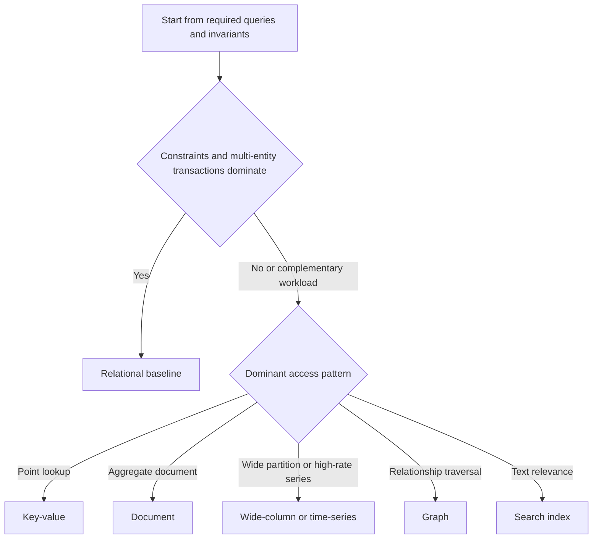

---
topic:
  - Data Persistence
subtopic:
  - NoSQL
summary: "A family of non-relational and specialized data models chosen around concrete access, consistency, and scaling requirements."
level:
  - "4"
status: Creation
tags: [FolderNote]

publish: true
priority: High
---

NoSQL names a loose group of data stores rather than one database model. It covers key-value, document, wide-column, and graph stores, while search and time-series engines are often grouped beside them. Product boundaries overlap. A document store may enforce schemas, a key-value service may expose secondary indexes, and either may support transactions within a documented scope.

A specialized store earns its place when one access pattern dominates the workload: point lookup by key, aggregate-shaped documents, relationship traversal, text relevance, or sustained time-window ingestion. A relational database remains the safer default when constraints, multi-entity transactions, and changing query combinations matter more. The useful decision is always about a concrete engine and its consistency, partitioning, query, and recovery contracts.


```mermaid
flowchart TD
  A[Start from required queries and invariants] --> B{Constraints and multi-entity transactions dominate}
  B -->|Yes| C[Relational baseline]
  B -->|No or complementary workload| D{Dominant access pattern}
  D -->|Point lookup| E[Key-value]
  D -->|Aggregate document| F[Document]
  D -->|Wide partition or high-rate series| G[Wide-column or time-series]
  D -->|Relationship traversal| H[Graph]
  D -->|Text relevance| I[Search index]
```

```datacorejsx
const { FolderStructureMap } = await dc.require("Assets/components/devbook-folder-map.jsx");
return FolderStructureMap;
```

# How It Works

Each family makes a different operation cheap. Key-value stores center the primary key. Document stores keep an aggregate together. Wide-column stores organize known queries around partition and clustering keys. Graph stores make relationships part of the stored model. Some products expose more than one of these interfaces, so the product name alone says little about the workload fit.

Distributed stores make different [[CAP theorem]] choices for each operation. Cassandra can keep serving selected requests through a partition when the chosen consistency level can still be met. A leader-based replica set may instead reject writes when it cannot establish the required authority. Neither behavior follows from the word “NoSQL.” Relational systems can also be distributed, while non-relational systems can provide strong reads or transactions within bounded scopes.

Data is often shaped around known reads because keeping related values in one partition avoids remote joins or fan-out. That can reduce read work substantially. It also duplicates state, moves coordination into the write path, and creates a repair problem when one copy is missed.

# Tradeoffs

| Dimension | Common relational default | Common NoSQL patterns |
| --- | --- | --- |
| Consistency | ACID transactions across rows and tables within the engine's scope | Engine-specific: strong, causal, eventual, or tunable. Transaction scope varies |
| Schema | Database-enforced table and constraint schema | Flexible, application-enforced, or database-enforced depending on engine |
| Relationships | General joins and foreign keys are normal | Embedded, denormalized, traversed, or joined where the engine supports it |
| Scaling | Scale-up, replicas, partitioning, or distributed SQL | Some engines are built around partitioned scale-out. Others are single-node or leader-bound |
| Strong fit | Integrity-heavy transactions and evolving query combinations | Stable specialized access patterns whose measured benefit pays the modeling cost |

# Questions

> [!QUESTION]- When is NoSQL a bad idea?
> It is a poor trade when the core model depends on relational constraints, multi-entity transactions, or queries that change faster than the storage model can be redesigned. If the selected engine cannot enforce those guarantees, application code inherits them. Keeping SQL and adding a cache, replica, or purpose-built read model is often cheaper.

# References

- [Understand data store models](https://learn.microsoft.com/azure/architecture/guide/technology-choices/data-store-overview)
