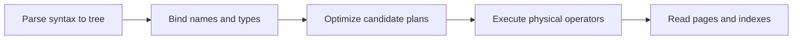

---
topic:
  - Data Persistence
subtopic:
  - SQL
summary: "How SQL clauses produce a logical result and the optimizer turns it into physical operators."
level:
  - "4"
priority: High
status: Creation
publish: true
---

# Intro

SQL separates meaning from execution. The logical query describes which rows belong in the result; parsing, binding, optimization, and execution turn that meaning into physical scans, seeks, joins, and aggregates. Read logical semantics to prove correctness and the execution plan to diagnose cost.

## Logical Clause Order

The common logical order is `FROM`/`JOIN` → `WHERE` → `GROUP BY` → `HAVING` → `SELECT` → `ORDER BY` → `LIMIT`/`TOP`. The engine can push predicates or reorder joins physically, but only when duplicates, `NULL`, and the final result remain equivalent.

```sql
SELECT department, COUNT(*) AS headcount
FROM employees
WHERE hire_date >= DATE '2024-01-01'
GROUP BY department
HAVING COUNT(*) > 5
ORDER BY headcount DESC;
```

`WHERE` cannot see `headcount` because projection happens later. `ORDER BY` generally can. Do not generalize that rule to `GROUP BY`: PostgreSQL permits a simple output alias there, while SQL Server requires the original expression. `HAVING` rules also differ, so portable SQL repeats the grouped or aggregate expression.

## Physical Pipeline



Cardinality estimates connect the optimizer to storage. If a predicate is estimated at 10 rows but returns 1,000,000, a nested loop or join order that looked cheap can spill or repeat millions of probes. The SQL can remain correct while the plan is poor.

## Join Semantics

Assume `customers` contains Ada and Lin, while `orders` contains two rows for Ada and none for Lin. A left join returns Ada twice and extends Lin's missing order columns with `NULL`; joins do not deduplicate.

```sql
SELECT c.name, o.total
FROM customers AS c
LEFT JOIN orders AS o ON o.customer_id = c.id
ORDER BY c.id, o.total;
```

```text
name | total
Ada  | 40
Ada  | 70
Lin  | NULL
```

Putting `o.total >= 50` in `ON` preserves Lin as an unmatched left row. Putting it in `WHERE` removes Lin because `NULL >= 50` is unknown.

![[System Design 101/69d04f55628d30c022877891da37ee4804fccff9add65065e6573d63f24483e5.png]]

## Physical Join Choice

| Operator | Strong fit | Cost to watch |
|---|---|---|
| Nested loop | Small outer input with indexed inner probes | Repeated inner work when estimates are wrong |
| Hash join | Large equality joins with enough memory | Build memory and spills |
| Merge join | Inputs already ordered on the join key | Sorting when order is absent |

No operator is universally fastest. Row counts, ordering, widths, indexes, memory, and cache state determine the plan.

## References

- [Query processing architecture guide](https://learn.microsoft.com/sql/relational-databases/query-processing-architecture-guide?view=sql-server-ver17) — SQL Server's parse, bind, optimize, and execute stages.
- [PostgreSQL query path](https://www.postgresql.org/docs/current/query-path.html) — primary overview of parsing, planning, and execution.
- [PostgreSQL table expressions](https://www.postgresql.org/docs/current/queries-table-expressions.html) — primary reference for inner and outer join semantics and filtering order.
- [PostgreSQL SELECT](https://www.postgresql.org/docs/current/sql-select.html) — documents output-name visibility in `ORDER BY` and `GROUP BY`.
- [SQL Server SELECT: GROUP BY](https://learn.microsoft.com/sql/t-sql/queries/select-group-by-transact-sql?view=sql-server-ver17) — documents SQL Server's restriction on aliases defined in the same select list.
- [Using EXPLAIN](https://www.postgresql.org/docs/current/using-explain.html) — shows how estimates and costs drive physical scan and join choices.
