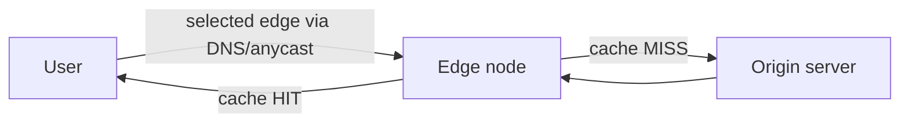

---
topic:
  - Networks
subtopic:
  - Architecture & Ops
summary: "Edge caching servers that serve content from near users, cutting latency and origin load."
level:
  - "3"
priority: Medium
status: Ready to Repeat
publish: true
---

A content delivery network places shared delivery infrastructure between clients and an origin. Edge nodes cache reusable responses near access networks, reducing round trips to the origin and absorbing repeated requests. The same edge may terminate TLS, route dynamic traffic, filter attacks, or run constrained code, but those capabilities are separate from caching.

# How It Works

A request reaches an edge selected through [[Home/Networks/Protocols/DNS|DNS]] steering, anycast routing, or both:

- **Cache hit** — the selected edge has a reusable response and can serve it without contacting the origin.
- **Cache miss** — the edge fetches from the origin, returns the response, and stores it only when policy permits shared caching.

With **anycast**, several sites announce the same address and routing selects a path. With **GeoDNS**, the resolver receives an address chosen from request context. Neither method guarantees the geographically closest site. Routing policy, resolver location, health, and capacity all affect the decision. See [[Home/Networks/Protocols/DNS|DNS as a traffic director]].

![[Networks/Networks-CDN-18120000.png|theme-aware]]

> [!WARNING] Diagram caveat
> The provider list is historical—Google Stadia is discontinued—and it mixes general regional serverless products such as Azure Functions with edge runtimes. Treat edge compute as code executed at or near a provider point of presence under that product's documented placement, state, latency, and runtime limits.

For `GET https://static.example.com/app.9f2c1.js`, the concrete path is:

1. DNS resolves the CDN hostname, and routing brings the client to an available edge. "Nearest" is a routing decision, not a guarantee of the geographically closest building.
2. The edge derives a cache key. A fresh entry returns immediately with an `Age` value: the origin does no work.
3. On a miss, the edge opens or reuses an origin connection, fetches the object, and applies its cache policy and the response's shared-cache directives.
4. A purge removes the cached key eventually. A content-hashed replacement avoids that race because the new bytes have a new URL.

An origin outage therefore affects misses differently from hits. Fresh cached objects can still be served, while uncached objects fail unless the CDN has an explicitly configured stale-response policy. A second origin, origin shield, and tested stale limits address different parts of that failure path.

# Map Tiles: a Cache-Key Example

A slippy map turns a viewport and zoom level into versioned tile coordinates such as `/tiles/v2026-07/12/1204/1538.webp`. Panning requests adjacent coordinates. Zooming changes the level segment. Including the dataset version makes each URL immutable, so public tiles are good CDN objects: the edge either returns the exact tile or fetches it from object storage through the origin path.

![[Networks/Networks-CDN-18120000-1.png|theme-aware]]

The CDN does not geocode an address, select a route, or rank traffic-aware alternatives. Those are separate services whose results tell the client which tiles and overlays to request. Keeping that boundary explicit prevents a cache layer from becoming an imaginary navigation service.

# What the CDN Caches and For How Long

CDNs apply [[Home/Data Persistence/Caching|HTTP caching]] semantics together with provider-specific cache policy:

- **`Cache-Control: max-age` / `s-maxage`** — `s-maxage` targets *shared* caches (the CDN) specifically, letting the edge cache longer than browsers.
- **`ETag` / `Last-Modified`** — let the edge revalidate cheaply with the origin (`304 Not Modified`) instead of refetching.
- **`Vary`** — the edge keys the cache on the listed headers (e.g. `Accept-Encoding`). A careless `Vary: User-Agent` shreds the hit rate.
- **Cache key** — commonly derived from the URL and selected request properties. Provider configuration can ignore tracking parameters or include another representation dimension.

# Invalidation

Content changes need one of three publication strategies:

- **TTL expiry** — let content age out naturally. Simple, but stale until it expires.
- **Purge / invalidation** — explicitly evict a URL or tag when content changes. Propagation takes time and provider limits apply.
- **Cache-busting / immutable URLs** — embed a content hash in the filename (`app.9f2c1.js`) and serve it `Cache-Control: immutable, max-age=31536000`. New bytes receive a new URL. The old object can expire after references move away from it.

# Beyond Static Caching

- **Dynamic acceleration** — an uncacheable response may still benefit from edge TLS termination, connection reuse, or a provider backbone. The gain depends on the client path and the edge-to-origin route.
- **Edge compute** — provider runtimes can evaluate authentication hints, redirects, request transforms, or small application handlers near the point of presence. Runtime limits and placement determine whether this is actually an edge-latency improvement.
- **Security** — the distributed edge can terminate TLS, filter requests, and absorb some attacks before traffic reaches the origin, including [[Home/Networks/Transport & Sockets/UDP|volumetric UDP floods]]. The origin still needs access controls that prevent attackers from bypassing the edge.

# Pitfalls

- **Caching personalized or private content** — a shared cache can serve one user's response to another when the cache key omits identity-bearing inputs. `private` prevents shared caching. `no-store` prevents storage. Authenticated responses require an explicit, reviewed cache policy rather than a blanket assumption that authorization alone disables caching.
- **Forgetting `Vary` / cache-key hygiene** — a missing `Vary: Accept-Encoding` can reuse the wrong representation. Unbounded tracking parameters create many low-reuse keys and reduce the hit ratio.
- **No explicit `Cache-Control`** — shared caches may apply heuristic freshness or decline to store the response. Deliberate headers make the contract visible, as with [[Home/Data Persistence/Caching|application caching]].
- **Thundering herd on the origin** — when a popular object expires, many edges miss simultaneously and stampede the origin. Mitigate with origin shield (a mid-tier cache), request coalescing, and stale-while-revalidate.
- **Stale after deploy** — shipping new HTML that references old cached assets (or vice versa). Cache-busted asset URLs + short-TTL/`no-cache` HTML avoids version skew.

# Tradeoffs

| Concern | With a CDN | Without |
|---|---|---|
| Latency for distant users | Low (served from nearby edge) | High (every hop to origin) |
| Origin load & cost | Low (edge absorbs traffic) | High (all traffic hits origin) |
| Static asset delivery | Strong fit for immutable, reusable objects | Origin serves every request |
| Highly dynamic, per-user data | Benefit depends on transport and edge policy | Direct origin path may be simpler |
| Operational complexity | Cache keys, purges, and version skew | Fewer cache states. Origin carries all load |

A CDN earns its operational cost when repeated public content, geographic distance, origin protection, or edge security controls matter. Content-hashed immutable URLs are the safest default for versioned assets. Dynamic and per-user responses need cache keys and directives designed around their actual variation.

# References

- [What is a CDN?](https://www.cloudflare.com/learning/cdn/what-is-a-cdn/)
- [Amazon CloudFront Developer Guide](https://docs.aws.amazon.com/AmazonCloudFront/latest/DeveloperGuide/Introduction.html)
- [Caching best practices](https://jakearchibald.com/2016/caching-best-practices/)
