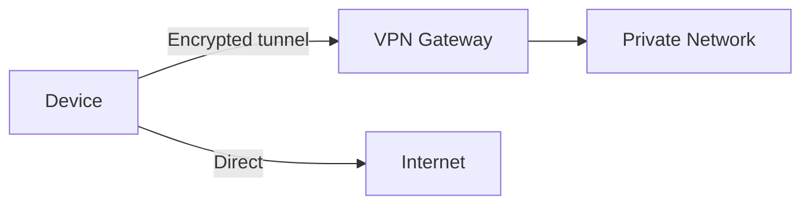

---
topic:
  - Networks
subtopic:
  - Architecture & Ops
summary: "An encrypted tunnel making remote endpoints act as one private network over the internet."
level:
  - "3"
priority: Medium
status: Ready to Repeat
publish: true
---

A virtual private network carries selected traffic through an authenticated, encrypted tunnel over another network. Routing and policy make remote addresses reachable through a virtual interface. The tunnel does not automatically grant access or place every endpoint on one flat network.

Encryption protects the tunnel hop. The rest of the design decides who may establish it, which prefixes enter it, how names resolve, what the gateway may reach, and whether traffic can bypass inspection.

# How It Works

A VPN wraps (encapsulates) packets inside an encrypted outer packet. The outer packet travels over the public internet to the VPN gateway, which decrypts it and forwards the inner packet to the private network.



**Split tunneling:** selected prefixes or applications use the tunnel while other traffic follows the local route. This reduces gateway load and often shortens the path for public traffic, but it creates two simultaneous trust paths on the endpoint.

**Full tunneling:** the VPN installs a default route through the gateway. Central inspection becomes possible, at the cost of gateway capacity, a longer path, and a larger outage boundary.

# VPN Types

**Client VPN (remote access)**
A device authenticates to a gateway and receives routes, addressing, and DNS policy for protected resources. Authorization still belongs to the gateway and downstream services.

**Site-to-site VPN**
Gateways connect selected prefixes from two networks. Route overlap, asymmetric paths, failover, and traffic selectors matter as much as tunnel establishment.

**Mesh VPN (overlay)**
An overlay control plane distributes peer identity, keys, and routes. Endpoints attempt direct paths and may use relays when NAT or firewall policy prevents them. This can avoid a central data-plane gateway, while the control plane and relay fleet remain availability dependencies.

# Beyond the VPN: Zero Trust (ZTNA)

A tunnel supplies connectivity, not least privilege. Broad routes and permissive network ACLs let a compromised endpoint explore far beyond the application it needed. ZTNA designs narrow the exposed surface by authorizing access to a specific service using identity and device signals. The two approaches can coexist: a VPN may carry traffic while application and network policy still enforce per-resource authorization.

# Protocols

**IPsec**
The traditional standard operates at the network layer. With ESP, two common modes are:
- *Transport mode*: protects the upper-layer payload while leaving the original IP header available for routing, commonly used host to host.
- *Tunnel mode*: protects an encapsulated IP packet inside a new outer packet, commonly used through gateways.

IPsec separates key management from packet protection through IKE and security associations. Its broad platform and appliance support makes it common for site-to-site interoperability, while the policy surface makes troubleshooting demanding.

**WireGuard**
WireGuard uses a small protocol surface and a fixed suite built from ChaCha20-Poly1305, Curve25519, BLAKE2s, SipHash24, and HKDF. Peers are identified by public keys, while `AllowedIPs` acts as both routing configuration and a source-address policy. Performance still depends on implementation, platform, packet size, and hardware.

**OpenVPN**
OpenVPN uses TLS for control-channel security and can carry its tunnel over UDP or TCP. Its mature cross-platform ecosystem is useful when existing clients and network policy already support it. Running a TCP tunnel over TCP can amplify loss-related stalls, so UDP is normally the better transport when available.

| Protocol | Layer | Complexity | Performance | Use case |
|----------|-------|------------|-------------|----------|
| IPsec | 3 | Broad policy surface | Implementation-dependent | Appliance and cloud-gateway interoperability |
| WireGuard | 3 | Low protocol surface | Implementation-dependent | Key-based routed overlays and remote access |
| OpenVPN | TLS tunnel over UDP/TCP | Mature but configurable | Implementation-dependent | Existing cross-platform client fleets |

# Tradeoffs

**IPsec vs WireGuard vs OpenVPN:** interoperability decides first. IPsec is the common boundary for network appliances and cloud gateways. WireGuard keeps the protocol and configuration surface small when both endpoints support it. OpenVPN remains practical for established client fleets and restrictive environments. Benchmark the actual implementations instead of treating protocol choice as a universal performance ranking.

**Full tunnel vs split tunnel:** full tunnel gives the gateway a chance to inspect outbound traffic but increases its capacity and availability burden. Split tunnel reduces that burden and keeps public traffic local, while the endpoint remains attached to both trusted and untrusted paths. Neither mode replaces destination authorization or endpoint controls.

WireGuard peer configuration (client side):

```text
[Interface]
PrivateKey = <client-private-key>
Address = 10.0.0.2/24
DNS = 10.0.0.1

[Peer]
PublicKey = <server-public-key>
Endpoint = vpn.example.com:51820
AllowedIPs = 10.0.0.0/24   # split tunnel: only private subnet
PersistentKeepalive = 25
```

# Pitfalls

**DNS leaks**
If protected-name queries bypass the tunnel, they may expose names and can return answers inconsistent with the private network. Resolver policy must follow the same routing boundary as the names it serves.

**Split-tunnel misconfiguration**
Overly broad advertised routes send unrelated traffic through the gateway. Missing routes bypass required controls or make private destinations unreachable. Route tables and ACLs should be tested independently because one controls the path and the other controls permission.

**MTU issues**
Encapsulation reduces the payload that fits within the underlying path MTU. A guessed interface MTU may work on one path and fail on another. Preserve Packet Too Big feedback, measure the real path, and set interface MTU or TCP MSS only when the tunnel boundary requires it.

# References

- [WireGuard](https://www.wireguard.com/)
- [Security Architecture for the Internet Protocol](https://www.rfc-editor.org/rfc/rfc4301)
- [How Tailscale works](https://tailscale.com/blog/how-tailscale-works)
