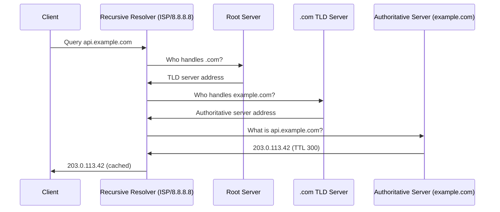

---
topic:
  - Networks
subtopic:
  - Protocols
summary: "The internet's distributed directory mapping hostnames to records like IP addresses."
level:
  - "3"
priority: Medium
status: Ready to Repeat
publish: true
---
# Intro

DNS (Domain Name System) is the internet's distributed directory: it maps human-readable names like `api.example.com` to machine-readable records like IP addresses. Every network connection that uses a hostname goes through DNS first. Understanding DNS is essential for diagnosing connectivity failures, designing reliable service discovery, and reasoning about propagation delays when you change infrastructure.

DNS is hierarchical and distributed — no single server knows all names. Queries are resolved by walking the hierarchy from root servers down to authoritative servers, with caching at every layer to reduce latency.

## Resolution Process

When a client queries `api.example.com`:



**Steps:**
1. Client checks its local cache. If a valid cached answer exists, return it.
2. Client asks its configured recursive resolver (ISP resolver, 8.8.8.8, 1.1.1.1).
3. Resolver checks its cache. If cached, return it.
4. Resolver queries a root server for the TLD nameserver.
5. Resolver queries the TLD server for the authoritative nameserver.
6. Resolver queries the authoritative server for the record.
7. Resolver caches the answer for the TTL duration and returns it to the client.

This full walk (iterative resolution) only happens on a cache miss. Most queries are served from the resolver's cache.

## Record Types

| Type | Purpose | Example |
|------|---------|---------|
| `A` | IPv4 address | `api.example.com → 203.0.113.42` |
| `AAAA` | IPv6 address | `api.example.com → 2001:db8::1` |
| `CNAME` | Alias to another name | `www.example.com → example.com` |
| `MX` | Mail server | `example.com → mail.example.com` |
| `TXT` | Arbitrary text | SPF, DKIM, domain verification |
| `NS` | Nameserver for a zone | `example.com → ns1.example.com` |
| `SOA` | Zone authority metadata | Serial, refresh, retry, expire |
| `PTR` | Reverse lookup (IP → name) | `42.113.0.203.in-addr.arpa → api.example.com` |
| `SRV` | Service location | `_http._tcp.example.com → host:port` |

## TTL and Caching

Every DNS record has a TTL (Time To Live) in seconds. Resolvers and clients cache the answer for the TTL duration. After expiry, they re-query.

**Implications:**
- **Propagation delay:** when you change a DNS record, old answers persist in caches until their TTL expires. A 24-hour TTL means changes take up to 24 hours to propagate globally.
- **Pre-change TTL reduction:** before a planned migration, lower the TTL to 60–300 seconds a day in advance. After the change, raise it back.
- **Negative caching:** NXDOMAIN (name not found) responses are also cached for the SOA's negative TTL. A misconfigured record can cause "DNS not found" errors that persist for minutes.

## DNSSEC

DNSSEC adds cryptographic signatures to DNS records, allowing resolvers to verify that responses are authentic and unmodified. It protects against DNS spoofing and cache poisoning attacks.

**How it works:** the authoritative server signs records with a private key. Resolvers verify signatures using the public key published in the DNS hierarchy. A chain of trust runs from the root zone down to the authoritative zone.

**Adoption:** DNSSEC is supported by major TLDs and cloud DNS providers (Azure DNS, Route 53, Cloudflare) but is not universally deployed. It adds complexity (key rotation, signing overhead) and does not encrypt DNS traffic — it only authenticates it.

## Encrypted DNS (DoH / DoT)

DNSSEC authenticates but doesn't *encrypt* — classic DNS queries travel in plaintext on UDP 53, so anyone on-path can see (and tamper with) the names you look up. Two protocols close that gap:

- **DNS-over-TLS (DoT)** — DNS inside a TLS connection on port 853; easy for networks to identify (and block) by port.
- **DNS-over-HTTPS (DoH)** — DNS queries as HTTPS requests on 443, indistinguishable from normal web traffic; harder to block but controversial because it bypasses network-level DNS controls.

Both give confidentiality and integrity against eavesdropping/poisoning; they're complementary to DNSSEC (authentication), not a replacement.

## DNS as a Traffic Director

Beyond name→IP, DNS is a load-balancing and routing layer because the *answer* can depend on who's asking and what's healthy:

- **Round-robin** — return multiple A records; clients spread across them (crude, no health awareness).
- **GeoDNS / latency-based** — return the IP of the nearest/fastest region (Route 53 latency routing, Azure Traffic Manager) to cut RTT.
- **Weighted** — split traffic by percentage for canary/blue-green rollouts.
- **Health-check-aware failover** — stop returning an endpoint that fails health checks (pairs with short TTLs).
- **Anycast** — one IP (e.g. `8.8.8.8`, `1.1.1.1`) announced from many locations via BGP; the network routes each client to the closest instance. This is how public resolvers and CDNs appear "everywhere at once."

## Pitfalls

**Long TTLs blocking fast failover**
A 24-hour TTL means a failed server's IP stays cached for up to 24 hours. Clients will keep trying the dead IP. Fix: use short TTLs (60–300s) for records that may need fast failover, and use health-check-aware DNS (Route 53 health checks, Azure Traffic Manager).

**CNAME at zone apex**
A CNAME cannot coexist with other records at the zone apex (`example.com`). You cannot have `example.com CNAME cdn.example.net` alongside `example.com MX mail.example.com`. Fix: use ALIAS/ANAME records (supported by Route 53, Cloudflare) which behave like CNAME but are resolved server-side.

**DNS cache poisoning**
An attacker injects a forged DNS response into a resolver's cache, redirecting traffic to a malicious IP. Mitigations: DNSSEC, DNS-over-HTTPS (DoH), DNS-over-TLS (DoT), and source port randomization.

**Split-horizon DNS**
Internal and external DNS return different answers for the same name (e.g., internal IP vs public IP). Misconfiguration can cause internal services to route through the public internet or expose internal IPs externally.

## Questions

> [!QUESTION]- Why does a DNS change "take time" to propagate?
> Because resolvers cache answers for the record's TTL. Old answers persist until they expire. A 24-hour TTL means up to 24 hours of propagation delay. Mitigation: lower TTL to 60–300s before planned changes, then restore it after.

> [!QUESTION]- What is the difference between a recursive resolver and an authoritative server?
> A recursive resolver (e.g., 8.8.8.8) does the work of walking the DNS hierarchy on behalf of the client. It caches results. An authoritative server holds the actual records for a zone and answers queries about names in that zone. The resolver queries authoritative servers; clients query resolvers.

> [!QUESTION]- How does DNSSEC protect against cache poisoning?
> DNSSEC signs records with a private key. Resolvers verify signatures using the public key from the DNS hierarchy. A forged response without a valid signature is rejected. Cost: key rotation complexity, signing overhead, and larger DNS responses (signatures add bytes).

## Tradeoffs

**TTL length: short vs long**

| Dimension | Short TTL (60–300s) | Long TTL (3600–86400s) |
|-----------|--------------------|-----------------------|
| Failover speed | Fast (minutes) | Slow (hours) |
| Cache hit rate | Low (more resolver queries) | High (fewer queries) |
| DNS query load | Higher | Lower |
| Migration risk | Low | High (stale records persist) |

Decision rule: use short TTLs for records that may change (load balancer IPs, CDN origins, failover targets). Use long TTLs for stable records (MX, NS, static content). Always lower TTL 24h before a planned migration, then restore it after.

**Recursive vs iterative resolution**
Recursive: client delegates all work to the resolver. Simpler for clients, but the resolver is a single point of failure and cache poisoning target. Iterative: client walks the hierarchy itself. Rare in practice — most clients use recursive resolvers. Useful for DNS debugging tools (`dig +trace`).

## DNS Debugging Commands

```bash
# Full resolution trace (shows each step)
dig +trace api.example.com

# Query specific record type
dig api.example.com A
dig example.com MX

# Check TTL remaining in resolver cache
dig @8.8.8.8 api.example.com A

# Reverse lookup
dig -x 203.0.113.42

# Check DNSSEC validation
dig +dnssec api.example.com
```

## References

- [DNS concepts (RFC 1034)](https://www.rfc-editor.org/rfc/rfc1034) — the original DNS specification covering the hierarchical namespace, zones, and resolution algorithm.
- [DNS implementation (RFC 1035)](https://www.rfc-editor.org/rfc/rfc1035) — wire format, record types, and message structure.
- [DNS basics (Cloudflare Learning)](https://www.cloudflare.com/learning/dns/what-is-dns/) — accessible explanation of the resolution process with diagrams; good for building intuition.
- [DNSSEC overview (ICANN)](https://www.icann.org/resources/pages/dnssec-what-is-it-why-important-2019-03-05-en) — authoritative explanation of DNSSEC, chain of trust, and deployment considerations.
- [DNS record types (Cloudflare)](https://www.cloudflare.com/learning/dns/dns-records/) — practical guide to A, AAAA, CNAME, MX, TXT, and SRV records with use cases.
