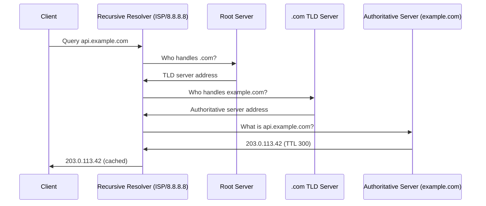

---
topic:
  - Networks
subtopic:
  - Protocols
summary: "The internet's distributed directory mapping hostnames to records like IP addresses."
level:
  - "3"
priority: Medium
status: Ready to Repeat
publish: true
---
# Intro

DNS (Domain Name System) is the internet's distributed directory: it maps human-readable names like `api.example.com` to records such as IP addresses. Before connecting to a hostname, an application normally obtains an address from a local cache, static mapping, service-specific naming mechanism, or DNS resolver; a network connection does not necessarily perform a fresh DNS query. Understanding that boundary is essential for diagnosing connectivity failures, designing reliable service discovery, and reasoning about propagation delays when infrastructure changes.

DNS is hierarchical and distributed — no single server knows all names. Queries are resolved by walking the hierarchy from root servers down to authoritative servers, with caching at every layer to reduce latency.

## Resolution Process

When a client queries `api.example.com`:

**Steps:**
1. Client checks its local cache. If a valid cached answer exists, return it.
2. Client asks its configured recursive resolver (ISP resolver, 8.8.8.8, 1.1.1.1).
3. Resolver checks its cache. If cached, return it.
4. Resolver queries a root server for the TLD nameserver.
5. Resolver queries the TLD server for the authoritative nameserver.
6. Resolver queries the authoritative server for the record.
7. Resolver caches the answer for the TTL duration and returns it to the client.

This full walk (iterative resolution) only happens on a cache miss. Most queries are served from the resolver's cache.

The stub resolver asks its recursive resolver for a complete answer. The recursive resolver then performs iterative work: root and TLD servers usually return **referrals** to another zone, not the final address. A referral can include in-bailiwick **glue** A/AAAA records so the resolver can reach a delegated nameserver without a circular lookup.

If the requested name is a CNAME, the resolver follows that alias and returns the chain plus the terminal data, subject to cache and loop limits. Each record set has its own TTL. An NXDOMAIN or NODATA result can be cached using the zone's SOA-derived negative TTL, so fixing a missing record does not instantly clear every resolver.

DNS normally begins over UDP. A truncated response sets `TC=1`, prompting retry over TCP; TCP is also required for zone transfers. Encrypted transports such as DoT and DoH change the client-to-resolver hop, not the referral algorithm between DNS authorities.

![[System Design 101/dfaafd9073b0a72bc05c758dc1162a3f470a0cf903a50156e6d6107f79f1fdd0.png]]

## Record Types

| Type | Lookup direction | Payload | Operational example |
|------|---------|---------|---------|
| `A` | Name → address | IPv4 address | `api.example.com → 203.0.113.42` |
| `AAAA` | Name → address | IPv6 address | `api.example.com → 2001:db8::1` |
| `CNAME` | Alias → canonical name | Another domain name | `www.example.com → example.com`; the resolver then looks up the target |
| `MX` | Mail domain → exchanger | Preference plus mail-server name | `example.com → 10 mail.example.com`; see [[SMTP]] |
| `TXT` | Name → text strings | One or more character strings | SPF policy, DKIM public-key material, and domain verification |
| `NS` | Zone → authoritative server | Nameserver name | Delegates `example.com` to `ns1.example.net` |
| `SOA` | Zone → authority metadata | Primary server, serial, and timers | Drives zone transfer freshness and negative caching |
| `PTR` | Reverse-tree name → host name | Domain name | `42.113.0.203.in-addr.arpa → api.example.com` |
| `SRV` | Service/protocol/domain → endpoint | Priority, weight, port, and target | `_sip._tcp.example.com → 10 5 5060 sip1.example.com` |

![[System Design 101/cf648ed0a8c256e338b080a139796886987b527a7e761d913b98e38092984af0.png]]

## TTL and Caching

Every record set has a TTL. A resolver can reuse the old answer until that TTL expires, so changing the authoritative value does not invalidate existing caches. Before a migration, lower the TTL and wait at least one full **previous-TTL window** before changing the target; lowering a one-day TTL five minutes before cutover does not affect answers already cached for the original day. [[DNS Operations]] covers cutover, failover, traffic steering, and debugging.

## DNSSEC

DNSSEC lets a validating resolver authenticate signed DNS data through a chain of trust. It does not encrypt queries or hide names. Key rollover and delegation records are operational parts of the security boundary; see [[DNS Security]].

## Encrypted DNS (DoH / DoT)

DoT and DoH protect the channel between a client and its chosen recursive resolver. They do not authenticate the DNS data end-to-end, protect the resolver-to-authoritative path by themselves, or prevent a trusted resolver from returning a false answer. DNSSEC authenticates signed data; encrypted DNS protects one transport channel. [[DNS Security]] shows how the two controls compose.

## Operations Boundary

DNS can steer traffic with weighted, geographic, latency, or health-aware answers, but cached answers make every change gradual. Anycast is a routing mechanism for reaching one advertised address, not a DNS answer-selection policy. [[DNS Operations]] separates those mechanisms and gives a migration runbook.

## Pitfalls

**Long TTLs blocking fast failover**
A 24-hour TTL means a failed server's IP stays cached for up to 24 hours. Clients will keep trying the dead IP. Fix: use short TTLs (60–300s) for records that may need fast failover, and use health-check-aware DNS (Route 53 health checks, Azure Traffic Manager).

**CNAME at zone apex**
A CNAME cannot coexist with other records at the zone apex (`example.com`). You cannot have `example.com CNAME cdn.example.net` alongside `example.com MX mail.example.com`. Fix: use ALIAS/ANAME records (supported by Route 53, Cloudflare) which behave like CNAME but are resolved server-side.

**DNS cache poisoning**
An attacker injects a forged response into a resolver's cache. DNSSEC validation authenticates signed data; source-port and query-ID randomization make blind forgery harder. DoH and DoT protect only the client-to-resolver channel and are not substitutes for DNSSEC.

**Split-horizon DNS**
Internal and external DNS return different answers for the same name (e.g., internal IP vs public IP). Misconfiguration can cause internal services to route through the public internet or expose internal IPs externally.

## Questions

> [!QUESTION]- Why does a DNS change "take time" to propagate?
> Because resolvers cache answers for the record's TTL. Old answers persist until they expire. Lower the TTL, wait at least one complete old-TTL interval so earlier cache entries expire, then cut over and restore the longer TTL after the new answer is stable.

> [!QUESTION]- What is the difference between a recursive resolver and an authoritative server?
> A recursive resolver (e.g., 8.8.8.8) does the work of walking the DNS hierarchy on behalf of the client. It caches results. An authoritative server holds the actual records for a zone and answers queries about names in that zone. The resolver queries authoritative servers; clients query resolvers.

> [!QUESTION]- How does DNSSEC protect against cache poisoning?
> DNSSEC signs records with a private key. Resolvers verify signatures using the public key from the DNS hierarchy. A forged response without a valid signature is rejected. Cost: key rotation complexity, signing overhead, and larger DNS responses (signatures add bytes).

## References

- [DNS concepts (RFC 1034)](https://www.rfc-editor.org/rfc/rfc1034) — the original DNS specification covering the hierarchical namespace, zones, and resolution algorithm.
- [DNS implementation (RFC 1035)](https://www.rfc-editor.org/rfc/rfc1035) — wire format, record types, and message structure.
- [DNS basics (Cloudflare Learning)](https://www.cloudflare.com/learning/dns/what-is-dns/) — accessible explanation of the resolution process with diagrams; good for building intuition.
- [DNSSEC overview (ICANN)](https://www.icann.org/resources/pages/dnssec-what-is-it-why-important-2019-03-05-en) — authoritative explanation of DNSSEC, chain of trust, and deployment considerations.
- [DNS record types (Cloudflare)](https://www.cloudflare.com/learning/dns/dns-records/) — practical guide to A, AAAA, CNAME, MX, TXT, and SRV records with use cases.
- [Negative caching (RFC 2308)](https://www.rfc-editor.org/rfc/rfc2308) — specifies caching for NXDOMAIN and NODATA answers using SOA data.
- [ByteByteGo: DNS lookup](https://github.com/ByteByteGoHq/system-design-101/blob/b28380a4710c5ec9638ec037d4168e288f334cba/data/guides/how-does-the-domain-name-system-dns-lookup-work.md) — source resolution visual, bounded here with referrals, caches, aliases, transport fallback, and negative answers.
- [ByteByteGo: DNS record types](https://github.com/ByteByteGoHq/system-design-101/blob/b28380a4710c5ec9638ec037d4168e288f334cba/data/guides/dns-record-types-you-should-know.md) — source record map expanded here with lookup direction and wire payload.
