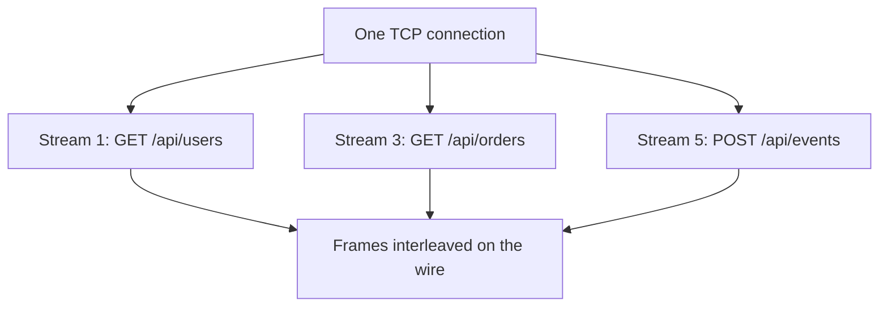

---
topic:
  - Networks
subtopic:
  - Protocols
summary: "Multiplexes many requests over one TCP connection, removing HTTP/1.1 head-of-line blocking."
level:
  - "3"
priority: Medium
status: Ready to Repeat
publish: true
---
HTTP/2 is the second major version of the HTTP protocol, standardized in 2015 (RFC 7540, superseded by RFC 9113). It runs over a TCP connection and multiplexes many request/response pairs simultaneously, eliminating HTTP/1.1's application-layer head-of-line blocking without eliminating TCP's ordered-delivery blocking. The result is lower latency and less connection overhead for applications that make many concurrent requests — without changing the HTTP semantics (methods, headers, status codes) that applications already use.

See [[HTTP]] for the foundational HTTP concepts that HTTP/2 builds on.

# What HTTP/1.1 Got Wrong

HTTP/1.1 has two fundamental performance problems:

1. **Ordered responses on a connection:** without pipelining, a client waits for one response before sending the next request. Pipelining permits several outstanding requests, but responses must stay in request order, so a slow first response still blocks later ones. Browsers instead used several TCP connections per origin, which isolates some waiting at the cost of more connection state.

2. **Verbose headers:** HTTP/1.1 headers are plain text and sent in full with every request. A typical request has 500–800 bytes of headers. For small API calls, headers can be larger than the payload.

# How HTTP/2 Works

**Binary framing layer**
HTTP/2 replaces the text-based HTTP/1.1 format with a binary framing layer. Messages are split into frames (the smallest unit of communication), each tagged with a stream ID.

**Multiplexing**
Multiple streams share a single TCP connection. Frames from different streams are interleaved, so stream 1's response frames can arrive between stream 3's request frames. Multiplexing removes HTTP/1.1's response-order dependency; streams can still wait on flow-control credit, scheduling, server work, and TCP packet recovery.



**HPACK header compression**
Headers are compressed using a static table and a connection-specific dynamic table. Sensitive values such as `Authorization` credentials must use the never-indexed representation rather than entering the dynamic table, because dynamic compression state is shared across messages and can leak secrets through size observations. The header name can still use a static-table index; the credential value is sent as a literal and is not reduced to a one-byte dynamic-table reference.

# Server Push and Prioritization Caveats

HTTP/2 still specifies server push: a server can send a promised request and response before the client asks. The mechanism was difficult to operate well because the server lacks the browser's complete cache state, pushed bytes compete with more urgent responses, and intermediaries handle push inconsistently. Chrome removed HTTP/2 push support, and other major browsers no longer make it a dependable web optimization. This is browser-product behavior, not an HTTP/3 deprecation of the concept; HTTP/3 also defines push.

Prefer preload hints and ordinary cacheable responses for web delivery. They let the browser decide whether and when to fetch a resource.

The original HTTP/2 dependency tree allowed clients to express stream relationships and weights, but deployments implemented it inconsistently. RFC 9218 defines the simpler extensible-priority scheme using urgency and incremental delivery. A priority signal is advice, not a guarantee: the server, proxy, and congestion controller still decide scheduling. Test the full path before relying on it for user-visible ordering.

# How HTTP/2 Is Negotiated (ALPN)

A client and server don't just "speak HTTP/2" — they have to agree to. For HTTPS (the only mode browsers allow), this happens **during the TLS handshake via ALPN** (Application-Layer Protocol Negotiation): the `ClientHello` lists supported protocols (`h2`, `http/1.1`) and the server picks one in its reply — **zero extra round-trips**. This is why HTTP/2 is "TLS-required in practice": ALPN rides along on the handshake that's already happening.

Cleartext HTTP/2 (**h2c**) exists via an HTTP/1.1 `Upgrade` header, but browsers don't support it; it's mostly used **server-to-server** (e.g. behind a load balancer, or [[gRPC]], which runs on HTTP/2 and relies on this multiplexing).

# HTTP/2 vs HTTP/1.1

| Feature | HTTP/1.1 | HTTP/2 |
|---------|----------|--------|
| Connections per origin | 6–8 (browser workaround) | 1 |
| Request multiplexing | No independent streams; optional pipelining keeps responses ordered | Yes |
| Header format | Plain text, repeated in full | Binary, HPACK compressed |
| Server push | No | Yes (limited adoption) |
| Head-of-line blocking | Application layer | TCP layer only |
| TLS requirement | Optional | Required in practice (browsers enforce) |

# HTTP/2 in .NET

ASP.NET Core supports HTTP/2 natively via Kestrel. Enable it in `appsettings.json` or `Program.cs`:

```csharp
builder.WebHost.ConfigureKestrel(options =>
{
    options.ListenAnyIP(443, listenOptions =>
    {
        listenOptions.UseHttps();
        listenOptions.Protocols = HttpProtocols.Http1AndHttp2;
    });
});
```

`HttpClient` still defaults requests to HTTP/1.1. Ask for HTTP/2 with a request version and policy; `RequestVersionOrHigher` permits negotiation upward when the server supports it:

```csharp
var client = new HttpClient
{
    DefaultRequestVersion = HttpVersion.Version20,
    DefaultVersionPolicy = HttpVersionPolicy.RequestVersionOrHigher
};
```

# Pitfalls

**TCP head-of-line blocking remains**
HTTP/2 eliminates HTTP/1.1's ordered-response head-of-line blocking but not TCP-layer blocking. A single lost packet can delay data for all streams on the connection until TCP retransmits it. Under high packet loss, HTTP/2 can perform worse than HTTP/1.1 with multiple connections. HTTP/3 uses QUIC streams so loss on one request stream does not block unrelated request streams at the transport layer; ordered delivery still blocks later bytes within the affected stream.

**Single connection amplifies TCP congestion**
HTTP/1.1 uses multiple connections, so congestion on one does not affect others. HTTP/2's single connection means a congestion event affects all streams simultaneously.

**Server push cache invalidation**
Pushed resources may already be in the client's cache. The server has no way to know, so it wastes bandwidth pushing resources the client doesn't need. Most production deployments disable server push.

# HTTP/3 Boundary

HTTP/3 keeps HTTP semantics but replaces HTTP/2's framing-over-TCP with HTTP framing over QUIC. QUIC uses UDP datagrams while providing its own reliable streams, congestion control, connection IDs, and TLS 1.3 handshake.

- Loss on one QUIC stream does not block delivery on unrelated request streams; the affected stream still has ordered-delivery head-of-line blocking, and QPACK or control-stream dependencies can delay field decoding or connection progress.
- Connection IDs allow migration between network paths, such as Wi-Fi to cellular, without identifying the connection only by IP and port.
- TLS 1.3 is integrated into QUIC; there is no separate plaintext QUIC mode.
- UDP-blocking networks, middleboxes, observability tooling, CPU cost, and server/CDN support can force fallback to HTTP/2.
- HTTP/2 server push is not a reason to migrate: major browsers removed or disabled it, and HTTP/3 also has a push mechanism that applications should not assume is useful.

# Questions

> [!QUESTION]- What problem does HTTP/2 multiplexing solve compared to HTTP/1.1?
> HTTP/1.1 has no independent request streams. Optional pipelining permits multiple outstanding requests on one connection, but responses must return in request order, so a slow earlier response delays later ones. Browsers typically work around this with 6–8 parallel connections. HTTP/2 multiplexes independent streams on one connection, removing that response-order dependency and reducing connection overhead.
> Cost: a single TCP connection means TCP-layer packet loss affects all streams simultaneously.

> [!QUESTION]- Why does HTTP/2 still have head-of-line blocking?
> HTTP/2 removes HTTP/1.1's response-order dependency but not TCP's connection-wide ordered delivery. A missing TCP segment can delay later data for every stream on that connection. HTTP/3 limits transport loss recovery to the affected QUIC stream, while ordered delivery still applies inside that stream and shared compression/control dependencies can introduce other waits.

> [!QUESTION]- When would you choose HTTP/1.1 over HTTP/2?
> When the network has high packet loss (mobile, satellite) and you cannot use HTTP/3 — multiple HTTP/1.1 connections isolate packet loss better than a single HTTP/2 connection. Also when connecting to legacy servers or proxies that don't support HTTP/2.

# References

- [HTTP/2 (RFC 9113)](https://www.rfc-editor.org/rfc/rfc9113) — the current HTTP/2 specification, superseding RFC 7540.
- [Evolution of HTTP (MDN)](https://developer.mozilla.org/en-US/docs/Web/HTTP/Basics_of_HTTP/Evolution_of_HTTP#http2) — accessible history of HTTP versions with clear explanations of what each version improved.
- [HTTP/2 in ASP.NET Core (Microsoft Learn)](https://learn.microsoft.com/en-us/aspnet/core/fundamentals/servers/kestrel/http2) — Kestrel configuration for HTTP/2 including TLS requirements and protocol negotiation.
- [HPACK header compression (RFC 7541)](https://www.rfc-editor.org/rfc/rfc7541) — the header compression algorithm used by HTTP/2.
- [HTTP/2 is trickier than I thought (Cloudflare blog)](https://blog.cloudflare.com/http-2-for-web-developers/) — practitioner analysis of HTTP/2 performance characteristics and when it helps vs hurts.
- [RFC 9218: Extensible Prioritization Scheme for HTTP](https://www.rfc-editor.org/rfc/rfc9218) — current urgency and incremental priority signaling for HTTP/2 and HTTP/3.
- [HTTP/3 (RFC 9114)](https://www.rfc-editor.org/rfc/rfc9114) — maps HTTP semantics to QUIC streams and defines control and push behavior.
- [QUIC transport (RFC 9000)](https://www.rfc-editor.org/rfc/rfc9000) — specifies QUIC streams, connection IDs, migration, recovery boundaries, and transport behavior.
- [ByteByteGo: Why HTTP/2 is faster](https://github.com/ByteByteGoHq/system-design-101/blob/b28380a4710c5ec9638ec037d4168e288f334cba/data/guides/what-makes-http2-faster-than-http1.md) — source comparison corrected here for TCP head-of-line blocking, browser push removal, and current priorities.
- [ByteByteGo: HTTP/1 to HTTP/3](https://github.com/ByteByteGoHq/system-design-101/blob/b28380a4710c5ec9638ec037d4168e288f334cba/data/guides/http1-http2-http3.md) — source evolution summary replaced with the RFC boundary between TCP and QUIC.
