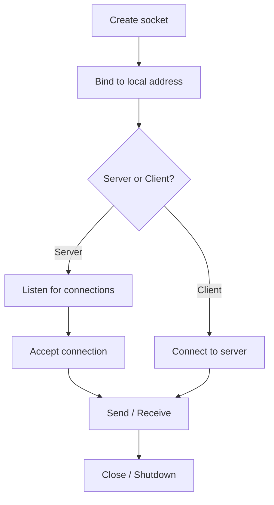

---
topic:
  - Networks
subtopic:
  - Transport & Sockets
summary: "A file-like endpoint for bidirectional communication between two processes over a network."
level:
  - "3"
priority: Medium
status: Ready to Repeat

publish: true
---

A socket is an operating-system endpoint for network communication. An Internet socket endpoint is an IP address plus a port. The address family, socket type, and protocol are selected when the socket is created. Together they determine whether the API exposes a TCP byte stream, UDP datagrams, or another protocol contract.

TCP does not preserve the boundaries between writes. One read may return part of a frame, exactly one frame, or bytes from several frames. That is the first rule to recover when debugging a custom protocol.

The low-level `Socket` API fits custom transports and code that needs direct option, packet, or protocol control. A true raw socket bypasses the normal TCP/UDP abstraction and is a narrower operating-system capability. Most application code is better served by `HttpClient`, gRPC, or SignalR because those libraries already own framing, pooling, deadlines, and protocol details.

# Stream Vs Datagram Sockets

The two common socket types expose different units of data. A **TCP stream socket** reads and writes bytes without message boundaries, so the application must define framing. A **UDP datagram socket** preserves each delivered datagram as one message. A sent datagram can still be lost, duplicated, or reordered. There is no guaranteed matching receive.

The [[Home/Networks/Transport & Sockets/Transport & Sockets|Transport & Sockets]] hub compares the transports directly. A stream socket is a good fit for one reliable ordered flow. A datagram socket is useful when message boundaries, multicast, or independent recovery matter enough to justify owning the missing transport behavior.

# Socket Lifecycle



On the server, `bind` assigns the local address, `listen` creates a connection queue, and `accept` returns a new connected socket. The listening socket stays available for later clients. A client usually lets the OS choose a local ephemeral port and calls `connect` with the remote endpoint.

# Example

## TCP Client with TcpClient

```csharp
using var client = new TcpClient();
await client.ConnectAsync("example.com", 80);

await using var stream = client.GetStream();

// Send HTTP/1.0 request
var request = "GET / HTTP/1.0\r\nHost: example.com\r\n\r\n"u8.ToArray();
await stream.WriteAsync(request);

// Read response — partial reads are normal; loop until done
var buffer = new byte[4096];
int bytesRead;
while ((bytesRead = await stream.ReadAsync(buffer)) > 0)
{
    Console.Write(Encoding.UTF8.GetString(buffer, 0, bytesRead));
}
```

## TCP Server with TcpListener

```csharp
var listener = new TcpListener(IPAddress.Any, 8080);
listener.Start();

while (true)
{
    var client = await listener.AcceptTcpClientAsync();
    _ = HandleClientAsync(client); // fire-and-forget per connection
}

static async Task HandleClientAsync(TcpClient client)
{
    await using var stream = client.GetStream();
    var buffer = new byte[1024];
    int bytesRead = await stream.ReadAsync(buffer);
    // process buffer[0..bytesRead]
    client.Close();
}
```

This sample leaves connection ownership unsafe on purpose: the discarded handler task is not observed, and an exception before `client.Close()` can leave the client undisposed. Production code should track handler tasks, observe their failures, and wrap each accepted `TcpClient` in `using` or a `finally`-based disposal path. Shutdown should stop accepting, cancel active handlers, and await them.

## UDP with UdpClient

```csharp
using var udp = new UdpClient();
var endpoint = new IPEndPoint(IPAddress.Parse("8.8.8.8"), 53);

var payload = new byte[] { 0x00, 0x01 }; // minimal DNS query stub
await udp.SendAsync(payload, endpoint);

var result = await udp.ReceiveAsync();
Console.WriteLine($"Received {result.Buffer.Length} bytes from {result.RemoteEndPoint}");
```

The two-byte payload is transport-only pseudodata, not a valid DNS query. The example also waits without a deadline. Real request/response code must serialize a valid protocol message and apply cancellation or a timeout so a lost datagram cannot leave the operation pending forever.

# Pitfalls

**Treating a read as a message** — `ReadAsync` returns the bytes currently available, up to the supplied buffer length. It can split or combine application frames. Read until the framing rule says one complete message is present. A zero-byte read means the peer closed its sending side gracefully.

**Confusing stream and socket writes** — `NetworkStream.WriteAsync` completes the requested buffer or throws and has no byte-count return value. Low-level `Socket.Send` and `SendAsync` overloads that return a count may report a partial send, so code using those APIs must advance through the remaining buffer.

**Leaking ownership** — every accepted connection needs a clear owner and disposal path. Otherwise file descriptors and protocol state remain allocated until later cleanup.

**Blocking one thread per connection** — synchronous operations occupy the calling thread while the network is idle. Async socket APIs let the runtime wait through the operating system and resume work only when an operation completes.

**No framing on TCP** — variable-length messages need a length prefix, delimiter, or self-describing format. Local tests often hide this because small writes happen to arrive separately. That behavior is timing, not a contract.

# Half-Close and the Scaling Model

**Half-close** — each direction of a TCP connection closes independently. `socket.Shutdown(SocketShutdown.Send)` ends local writes while leaving reads open. The peer eventually observes end-of-stream as a zero-byte read after consuming any buffered data.

**Scaling** — a server does not need one blocked thread per connection. .NET's async socket APIs use the operating system's readiness or completion facilities, such as `epoll`, `kqueue`, and IOCP. `SocketAsyncEventArgs` and `System.IO.Pipelines` become relevant when profiling shows per-operation allocation or buffer movement is the next limit. They do not remove the need for backpressure and bounded connection work.

# Tradeoffs

| Option | Best for | Weakness |
|---|---|---|
| Raw `Socket` class | Transport control and custom protocols | Manual framing, ownership, and error handling |
| `TcpClient` / `TcpListener` | TCP client/server with stream API | Still requires framing. No HTTP semantics |
| `UdpClient` | UDP datagrams | No delivery guarantees. Application must handle loss |
| `HttpClient` | HTTP clients with connection pooling and protocol negotiation | Restricted to HTTP semantics |
| `System.Net.WebSockets` | Full-duplex over HTTP | Requires HTTP upgrade. Not for raw TCP |

# References

- [Use sockets to send and receive data over TCP](https://learn.microsoft.com/dotnet/fundamentals/networking/sockets/tcp-classes)
