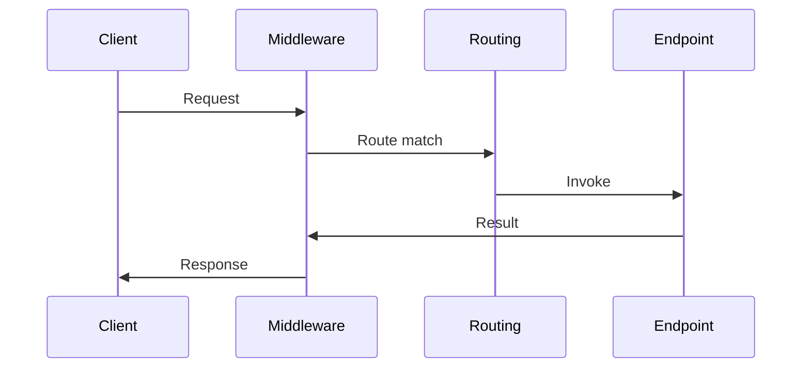

---
topic:
  - Programming
subtopic:
  - NET
summary: "How ASP.NET Core routes each HTTP request through middleware to handlers or controllers."
level:
  - "4"
priority: High
tags: [FolderNote]

publish: true
status: Creation
---

An ASP.NET Core API is an ordered HTTP pipeline ending at a selected endpoint. Middleware handles concerns that span requests. Routing selects a Minimal API handler or controller action. Filters and endpoint code handle work that depends on the selected operation.

The main design decision is where each concern belongs. Authentication, exception handling, and request logging usually sit in middleware. Authorization metadata, model binding, validation, and response mapping stay closer to the endpoint. A misplaced concern either runs too broadly or gets copied across handlers.

```datacorejsx
const { FolderStructureMap } = await dc.require("Assets/components/devbook-folder-map.jsx");
return FolderStructureMap;
```

# Request Flow

The request moves inward through middleware until routing and endpoint execution take over. The response then unwinds through the same middleware in reverse order, which is why registration order affects both request and response behavior.



# Endpoint Examples

Minimal API:

```csharp
var app = WebApplication.CreateBuilder(args).Build();

app.MapGet("/health", () => Results.Ok(new { status = "ok" }));

app.Run();
```

Controller style:

```csharp
[ApiController]
[Route("api/orders")]
public sealed class OrdersController : ControllerBase
{
    [HttpGet("{id}")]
    public ActionResult<OrderDto> GetById(string id) => Ok(new OrderDto(id));
}
```

# References

- [ASP.NET Core web API documentation](https://learn.microsoft.com/en-us/aspnet/core/web-api/?view=aspnetcore-10.0)
