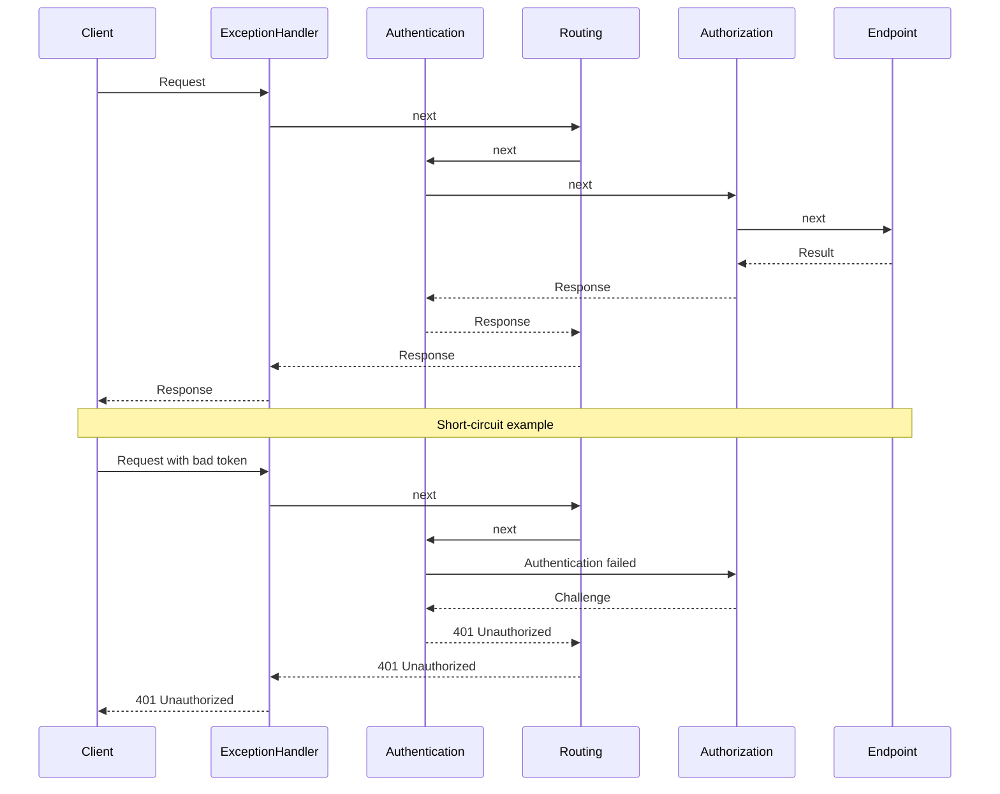

---
topic:
  - Programming
subtopic:
  - NET
summary: "Components forming the ASP.NET Core HTTP pipeline, each wrapping the next."
level:
  - "4"
priority: High
status: Ready to Repeat

publish: true
---

ASP.NET Core middleware forms an ordered chain around endpoint execution. Each component can inspect the inbound request, call the next delegate, and then observe the outbound response. This is the right boundary for behavior that spans many endpoint types, such as exception handling, request logging, CORS, or authentication.

Every component receives `HttpContext` and a delegate for the rest of the chain. Calling `next` passes control inward. Returning without it short-circuits the request. Authentication normally tries to establish `HttpContext.User` and continues. Authorization is the component that challenges or forbids access when endpoint policy requires it.



In the 401 branch, authentication records the failed credential and the pipeline reaches authorization. Authorization triggers the unauthenticated challenge, and the configured authentication handler produces the scheme-specific 401 response.

Registration order is control flow. The first component runs first for the request and last while the response unwinds. A common API pipeline looks like this, with environment-specific pieces such as HSTS enabled only where appropriate:

```csharp
app.UseExceptionHandler("/error");
app.UseHsts();
app.UseHttpsRedirection();
app.UseStaticFiles();
app.UseRouting();
app.UseCors();
app.UseAuthentication();
app.UseAuthorization();
app.MapControllers();
```

# Writing Custom Middleware

An inline lambda is enough for one local concern:

```csharp
app.Use(async (ctx, next) =>
{
    var sw = System.Diagnostics.Stopwatch.StartNew();
    try
    {
        await next(ctx);
    }
    finally
    {
        sw.Stop();
        app.Logger.LogInformation("{Method} {Path} -> {StatusCode} in {ElapsedMs} ms",
            ctx.Request.Method,
            ctx.Request.Path,
            ctx.Response.StatusCode,
            sw.ElapsedMilliseconds);
    }
});
```

A reusable conventional middleware class receives the next delegate through its constructor and exposes `Invoke` or `InvokeAsync`:

```csharp
public sealed class CorrelationIdMiddleware
{
    private readonly RequestDelegate _next;
    private readonly ILogger<CorrelationIdMiddleware> _logger;

    public CorrelationIdMiddleware(RequestDelegate next, ILogger<CorrelationIdMiddleware> logger)
    {
        _next = next;
        _logger = logger;
    }

    public async Task InvokeAsync(HttpContext context)
    {
        var correlationId = context.Request.Headers["X-Correlation-Id"].FirstOrDefault()
            ?? Guid.NewGuid().ToString("N");

        context.Response.Headers["X-Correlation-Id"] = correlationId;
        using (_logger.BeginScope(new Dictionary<string, object> { ["CorrelationId"] = correlationId }))
        {
            await _next(context);
        }
    }
}

// Registration
app.UseMiddleware<CorrelationIdMiddleware>();
```

> [!WARNING]
> **Conventional middleware is constructed once.** Constructor dependencies therefore need lifetimes compatible with the application-long instance. Scoped services belong in `InvokeAsync` parameters, where the framework resolves them from the current request scope. `IMiddleware` plus DI registration is the alternative when the middleware object itself needs a scoped or transient lifetime.

# Branching the Pipeline

The pipeline can branch as well as continue linearly:

- **`app.Map("/admin", branch => ...)`** and **`MapWhen(predicate, ...)`** select a terminal sub-pipeline by path or predicate.
- **`app.UseWhen(predicate, branch => ...)`** runs a conditional branch and then rejoins the main chain when that branch reaches its end.
- **`app.Run(handler)`** installs a terminal delegate that never calls `next`.

```csharp
app.UseWhen(
    ctx => ctx.Request.Path.StartsWithSegments("/api"),
    api => api.UseMiddleware<ApiKeyMiddleware>()); // only /api gets the API-key check
```

# Pitfalls

**Wrong registration order.** Authorization placed before authentication evaluates an anonymous principal. CORS placed after authorization may miss challenged preflights. The exact pipeline varies, but dependencies between components do not.

**Changing a started response.** Once `Response.HasStarted` is true, the status and headers may already be on the wire. Post-`next` code must check that state before attempting changes.

**Blocking I/O.** `Thread.Sleep` and synchronous database or file calls hold a thread-pool thread while the request waits. Middleware wrapping I/O should remain asynchronous through the whole call chain.

**Swallowing exceptions.** Logging and returning 200 converts a failure into a false success. An exception boundary should either rethrow or deliberately write the API's error contract.

**Reading endpoint metadata before routing.** `context.GetEndpoint()` is populated only after endpoint selection. Middleware that depends on authorization or custom endpoint metadata must run after routing and before endpoint execution.

# Tradeoffs

| Option | Best for | Weakness |
|---|---|---|
| Middleware | App-wide cross-cutting concerns (logging, auth, exception handling, CORS) | No direct MVC action context. Runs for all requests including static files |
| MVC action filters | Concerns tied to controllers/actions and model/action context | Only applies to MVC pipeline. Not available for Minimal APIs |
| Endpoint filters | Minimal API endpoint-scoped behavior | Not used by MVC controllers |

Use middleware when the concern belongs outside a particular endpoint model or must cover several request types. Use filters when the logic needs MVC action context or Minimal API invocation context.

# Questions

> [!QUESTION]- Action filter vs middleware: what is the difference?
> Middleware wraps the HTTP pipeline and can cover controllers, Minimal APIs, static files, or requests that never reach an endpoint. MVC action filters run inside controller execution and can inspect bound arguments or results. Required scope and context decide between them.

> [!QUESTION]- How can you centrally catch errors for all requests?
> Put exception-handling middleware near the start of the pipeline so it wraps downstream components. `UseExceptionHandler` can route failures into a consistent Problem Details response, while the developer exception page remains a development-only diagnostic.

> [!QUESTION]- What is the ASP.NET request processing pipeline?
> The server passes each request through registered middleware in order. Routing selects an endpoint, authorization may stop execution, and the chosen handler eventually produces the response. Control then returns through earlier middleware in reverse order for post-processing.

# References

- [Middleware in ASP.NET Core](https://learn.microsoft.com/en-us/aspnet/core/fundamentals/middleware/)
