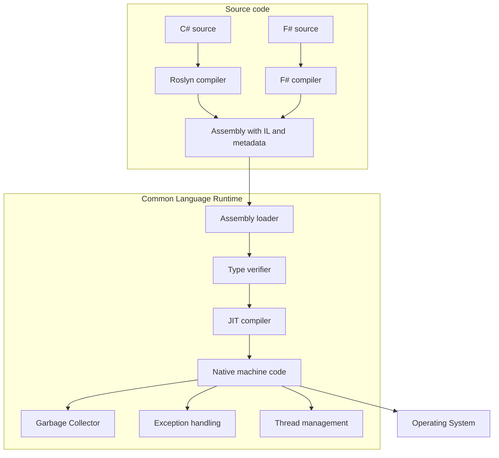

---
topic:
  - Programming
subtopic:
  - NET
summary: ".NET's execution engine compiling IL to native code and managing memory and types."
level:
  - "4"
priority: High
status: Ready to Repeat

publish: true
---

The Common Language Runtime (CLR) is .NET's managed execution engine. It loads assemblies, establishes their types, executes managed methods, and supplies services such as garbage collection, exception handling, threading, and native interoperability.

Most .NET language builds produce assemblies containing Common Intermediate Language (CIL, usually called IL) and metadata. A normal runtime deployment turns executable IL into machine code with a just-in-time compiler. ReadyToRun adds native code for many methods while retaining IL, and Native AOT produces a platform-specific native application at publish time.

The runtime, libraries, and standardized assembly/type model make cross-language and cross-platform execution possible. A source language alone does not guarantee either property. Native AOT also retains runtime services even though the deployed application has no JIT compiler.

# How It Works



The diagram is a conceptual JIT path. The arrows from native code to the GC, exception handling, and thread management show runtime services participating during execution. They are not later pipeline stages or outputs of native code. Assembly loading, validation, code generation, and dependency resolution happen incrementally. Verification depends on the loaded and executed path and on how code is produced, so the runtime does not eagerly verify or compile the whole application before its entry point runs.

**Typical startup path:**

1. A native host resolves the runtime configuration and starts a compatible runtime.
2. The loader locates the entry assembly and dependencies, reads metadata as needed, and binds type and method references.
3. Executed methods use available ReadyToRun code or are JIT-compiled. Tiered compilation may replace an earlier native body later.
4. Runtime services such as the GC and thread pool initialize and expand according to demand.

**Core runtime responsibilities:**

| Subsystem | What it does |
|---|---|
| JIT compiler | Produces native method bodies and can recompile hot code at higher tiers |
| Garbage collector | Allocates managed objects and reclaims unreachable graphs |
| Type system and loader | Bind metadata, enforce runtime type rules, and support reflection |
| Exception handling | Finds handlers and unwinds managed frames while running cleanup |
| Thread pool | Schedules worker and I/O-completion work and adapts its thread supply |
| Interop | Marshals calls and data across managed and native boundaries |

# Managed Vs Unmanaged Code

Managed code executes with runtime metadata and services. Garbage collection owns managed object storage, while the type system and exception machinery remain involved in execution. An `unsafe` C# block can use pointers without turning the containing method into unmanaged code.

Unmanaged code is native code outside those managed lifetime rules. It may use manual allocation, RAII, reference counting, or another native ownership model. The GC cannot prove when a native handle or buffer should be released, so the managed boundary needs an explicit ownership contract, usually `SafeHandle` or deterministic disposal.

This example is Windows-specific P/Invoke:

```csharp
using System.Runtime.InteropServices;

[DllImport("kernel32.dll", SetLastError = true)]
static extern bool Beep(uint dwFreq, uint dwDuration);

Beep(440, 500); // A4 note for 500ms
```

# JIT Vs AOT

| Mode | Code available at startup | Runtime adaptation | Main cost |
|---|---|---|---|
| JIT | IL. Native code is produced when needed | Tiering and profile data can optimize executed paths for the current machine | First-use compilation and a runtime JIT |
| ReadyToRun | IL plus precompiled native code for many methods | The JIT can still compile unsupported methods and replace hot ReadyToRun bodies | Larger assemblies and target-specific publishing |
| Native AOT | A self-contained native application | No runtime JIT or dynamic code generation | Trimming and AOT-compatibility constraints. Target-specific output |

JIT is the flexible default when dynamic loading, runtime code generation, or warm steady-state optimization matters. ReadyToRun is a middle path for reducing first-use compilation while retaining the JIT. Native AOT fits startup- and footprint-sensitive deployments whose dependencies pass AOT analysis. Measurements decide whether the publish-time tradeoff helps a particular application.

## Tiered Compilation

Tiered compilation does not promise exactly two compilations for every method. A method may begin with quickly generated Tier 0 code, a ReadyToRun body, or a more optimized initial body, depending on runtime policy and method shape. Frequently executed code can move through additional instrumented and optimized tiers.

- **Tier 0** favors low compilation cost and fast availability.
- **Tier 1** spends more time optimizing code that has proved hot.
- **On-Stack Replacement (OSR)** can transfer a running loop to optimized code without waiting for a later method call.
- **Dynamic PGO**, enabled by default starting with .NET 8, feeds observed types and branch behavior into later optimization. ReadyToRun methods can also be replaced through tiering.

## Assembly Loading and the Type System

Current .NET applications use an **`AssemblyLoadContext`** to locate, load, and cache managed assemblies and their dependencies. A collectible context supports plugin-style unloading, but unloading is cooperative: the context and every object, type, method, or thread rooted through it must first become unreachable. Type identity therefore includes the loaded assembly instance, not only a namespace-qualified name.

CoreCLR commonly shares JIT-generated generic code across reference-type arguments and specializes code for value-type arguments. That strategy preserves value layout and avoids boxing while limiting duplicate native code. The exact sharing strategy is a runtime implementation detail. [[Generics]] defines the language-facing constraints.

## Memory Model and Exceptions

The .NET memory model constrains how reads and writes become visible across threads. `volatile`, `Interlocked`, locks, and explicit barriers provide different ordering and atomicity guarantees. They are not interchangeable performance hints.

Managed exception dispatch uses two logical passes. The search pass walks frames and evaluates filters while the stack is intact. Once a handler is selected, the unwind pass runs intervening `finally` and fault cleanup before control enters that handler.

# Pitfalls

**Treating first-use cost as random latency.** JIT, assembly loading, static initialization, and connection setup can all appear on an early request. Traces should identify the actual source before ReadyToRun, Native AOT, or warm-up is introduced.

**Blocking shared worker threads.** Sustained synchronous waits can consume the available thread-pool supply faster than its control loop adds threads. Async I/O removes that wait from a worker only when the underlying operation is genuinely asynchronous.

**Using finalization as normal cleanup.** An unreachable object whose finalization remains registered stays alive until its finalizer is scheduled and run, then normally needs a later collection for reclamation. A successful dispose path normally releases the resource and calls `GC.SuppressFinalize`, avoiding that pending-finalization lifetime. `IDisposable` and `SafeHandle` make resource release explicit. A finalizer remains a narrow fallback for missed disposal.

# Questions

> [!QUESTION]- What is managed vs unmanaged code? Why does unmanaged interop require careful lifetime management?
> Managed code executes with runtime metadata and services. Unmanaged code follows the native platform's own ABI and ownership rules. A P/Invoke signature must match that ABI, including calling convention, layout, encoding, and ownership. The GC cannot release a native resource merely because its managed wrapper is no longer useful. `SafeHandle` plus deterministic disposal keeps the handle valid across calls and gives release one owner.

> [!QUESTION]- What is the CLR and IL? How does JIT compilation affect startup vs steady-state performance, and when is NativeAOT a better choice?
> IL is the intermediate instruction set stored with type metadata in ordinary managed assemblies. JIT deployments compile executed methods on demand, then tier hot code using runtime observations. This creates first-use work but preserves runtime adaptation and dynamic-code features. Native AOT moves code generation to publish time and removes the runtime JIT. It is a better fit when startup or footprint measurements matter and every dependency survives trimming and AOT analysis.

# References

- [Managed execution process](https://learn.microsoft.com/en-us/dotnet/standard/managed-execution-process)
