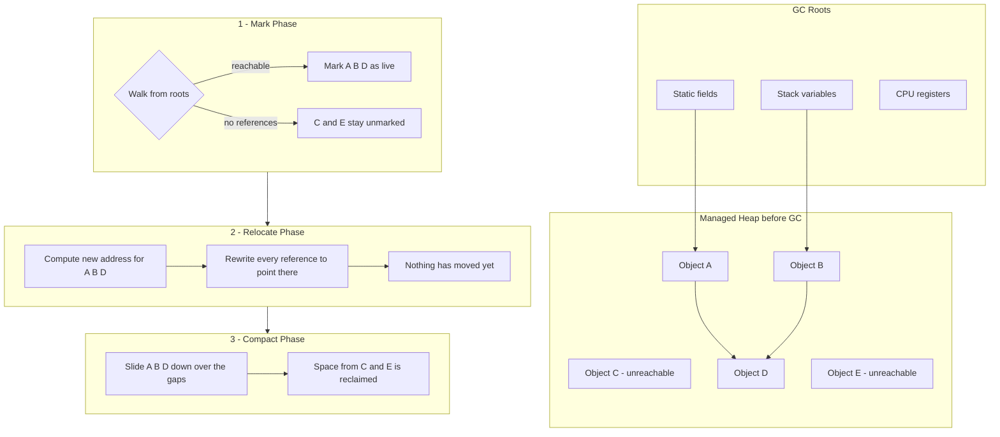
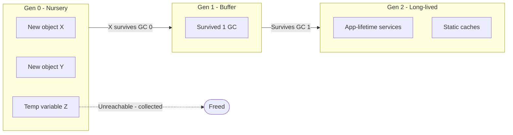

---
topic:
  - Programming
subtopic:
  - NET
summary: "The CLR's automatic memory manager reclaiming unreachable objects generationally."
level:
  - "4"
priority: High
status: Ready to Repeat

publish: true
---

The .NET garbage collector manages memory for objects on the managed heap. It traces references from roots known to the runtime, keeps reachable objects, and reuses space occupied by unreachable ones. Cycles need no special treatment: two objects that reference each other are still collectible when nothing reachable points to either of them.

Automatic memory management removes manual `free` calls from ordinary managed code, but it does not remove lifetime design. Allocation rate affects how often collections run. Long-lived references keep entire object graphs alive, and moving collectors must occasionally pause managed execution while roots and references are made consistent.

The collector is generational because new objects usually become unreachable quickly. Most new heap objects enter generation 0. Survivors may move to generation 1 and later generation 2. Large objects normally enter the Large Object Heap (LOH), which is collected with generation 2 and is not compacted during ordinary collections. Reference stores also pass through a write barrier so younger generations can be collected without scanning every old object. See [[#Card tables and write barriers]].

The GC tracks managed memory, not the lifetime contract of an operating-system handle or native allocation. `IDisposable`, `using`, and `await using` release those resources deterministically. A finalizer is a delayed safety net for missed disposal, not normal cleanup. An unreachable finalizable object whose finalization has not been suppressed requires extra processing and normally survives until finalization has occurred and a later collection can reclaim it.

# Managed Heap

The managed heap is virtual memory reserved and committed by the runtime for managed objects. Workstation GC normally has one heap. Server GC can use multiple heaps so allocation and collection work scale across processors. With DATAS, the runtime can adapt the active heap count and budgets to application size. Application threads allocate from thread-local allocation contexts backed by those heaps rather than taking one global lock for every object.

Allocation on the Small Object Heap is usually a bump-pointer operation: advance the allocation pointer and initialize the object. The expensive part is retaining too much data or allocating fast enough to force frequent collections, not the pointer increment itself.

> [!INFO]
> **Segments and regions.** GC implementation details have changed across runtime versions and modes. Current runtimes can manage heap memory in smaller regions rather than relying only on a fixed segment layout. Generations, the SOH, the LOH, and the pinned object heap remain the stable application-level model. Segment or region size is not an application contract.

> [!TIP]
> Segment and region sizes are implementation-dependent. Performance decisions should use runtime counters and traces rather than inferred heap geometry.

Reducing temporary allocation can reduce generation 0 collection frequency. Reducing retained graphs matters more for full collections because every reachable object must still be considered. A low allocation rate does not compensate for an unbounded cache.

Compacting collections move survivors together and update references, which restores contiguous free space and often improves locality. Some heaps or regions are swept instead, leaving survivors in place and recording reusable gaps. Pinning can also prevent an otherwise movable object from being relocated.

The [Large Object Heap](https://learn.microsoft.com/en-us/dotnet/standard/garbage-collection/large-object-heap) normally receives allocations of at least 85,000 bytes. Arrays are common LOH occupants, though any sufficiently large managed object can qualify. Smaller objects normally use the SOH.

> [!TIP]
> The runtime exposes a [**configurable LOH threshold**](https://learn.microsoft.com/en-us/dotnet/core/runtime-config/garbage-collector#large-object-heap-threshold). Raising it changes placement policy. It does not make large allocation or copy costs disappear.

# Reclaiming Memory

The runtime reports roots such as references in static fields, active stack frames, registers, and GC handles. The collector walks object-reference fields from those roots. Anything it cannot reach is eligible for reclamation, subject to finalization and other runtime lifetime rules.

For a compacting collection, the collector marks survivors, plans their new locations, fixes references, and moves the objects. The exact phase ordering and concurrency depend on GC mode and heap type. Code should depend on object identity and managed references, never a stable address unless a narrowly scoped pin explicitly provides one.

## Conditions that Trigger Garbage Collection

Collections can be triggered when:

- allocation crosses a generation's dynamically adjusted budget.
- the operating system or host reports memory pressure.
- the [GC.Collect](https://learn.microsoft.com/en-us/dotnet/api/system.gc.collect) API requests a collection.

Manual collection is rarely a repair for high memory use. It can promote survivors, interrupt background work, and add pauses while the references keeping memory alive remain unchanged. It belongs in measured, bounded cases such as coordinating one-time LOH compaction.

# GC Execution Model

## Generational Heap

Collection duration has no useful universal range. It depends on the live graph, heap size, GC mode, allocation history, processor count, and memory pressure. A generation 0 collection on one workload can still matter less than a generation 2 collection on another, but measurements must come from the running application.

A compacting collection can be understood as four operations:

1. **Mark:** trace references from roots and identify the reachable objects.
2. **Plan relocation:** choose new addresses for survivors in the regions being compacted.
3. **Fix references and move:** update roots and object fields, then place survivors at their new addresses.
4. **Reclaim:** reuse the space left by unreachable objects. A swept region reclaims dead blocks without moving survivors, trading copy work for possible fragmentation.

# Root Objects

Roots are references supplied directly by the runtime rather than discovered by walking another managed object. They include references reported from active thread stacks and registers, static fields, GC handles, and runtime-owned structures.

A local variable is a root only while the JIT reports its reference as live. Lexical scope does not guarantee lifetime to the closing brace, and the JIT can extend or shorten the effective lifetime when doing so preserves observable behavior.

Finalization adds another lifetime step when an unreachable object is still registered for finalization. The runtime schedules it and keeps it reachable long enough for the finalizer to run. Reclamation normally requires a later collection. A successful dispose path can call `GC.SuppressFinalize` and avoid that pending-finalization path. The extra lifetime therefore applies to missed disposal or another path where finalization remains registered, not every disposed instance of a finalizable type.

# Object Generations

Generations let the collector examine a small, recently allocated part of the heap more often than long-lived data:

- **Generation 0** holds new SOH objects and is collected most frequently.
- **Generation 1** buffers objects between short-lived and long-lived populations.
- **Generation 2** holds long-lived objects and is included in full collections.

A generation 1 collection includes generations 0 and 1. A generation 2 collection includes all generations. Survivors often promote, although pinning and collector heuristics can keep an object in its current generation. The LOH and pinned object heap are logically collected with generation 2 even though their placement and compaction rules differ from the ordinary SOH.

## Card tables and write barriers

An old object can point to a young object, so roots alone are not enough for an ephemeral collection. The JIT inserts a **write barrier** around managed reference stores. When a store might create an old-to-young reference, the barrier marks the corresponding range in a **card table**. The next generation 0 or 1 collection scans the relevant dirty cards instead of walking the whole older generation. This remembered-set work is a small cost on reference writes that buys much cheaper young-generation collections.

## Boxing as a Hidden Allocation Source

Converting a value type to `object` or to an interface it implements usually creates a boxed heap object. Non-generic APIs and `params object[]` are common places for this allocation to hide. Modern interpolated-string handlers and generic formatting paths can avoid boxing, so string interpolation is not evidence by itself. A generic API can preserve the concrete value type and use constrained calls, but its implementation can still box by converting `T` to `object` or an interface value. Traces or allocation benchmarks confirm what the actual call path does.

## Latency Modes and Low-pause Regions

GC controls trade collection intrusiveness against throughput and memory use:

- **`GCSettings.LatencyMode`** selects a throughput- or latency-oriented policy. Low-latency modes belong around bounded critical windows because delaying some collections can increase memory use.
- **`GC.TryStartNoGCRegion(totalBytes)`** attempts to reserve enough allocation budget for a critical region. It can fail to enter the mode, and exceeding the budget can end the no-GC guarantee. `GC.EndNoGCRegion()` is valid only while that mode remains active.
- **DATAS** adapts server GC to application size and long-lived data. It is enabled by default starting with .NET 9, but explicit heap settings, runtime version, and deployment constraints still matter.

# Pitfalls

**LOH fragmentation.** Large objects are normally swept rather than compacted, so changing allocation sizes can leave gaps that later requests cannot reuse. `ArrayPool<T>` helps only when ownership, clearing, and retention are controlled. `CompactOnce` plus an induced collection is a measured maintenance action, not a routine allocation strategy.

**Finalizer backlog.** A blocking or expensive finalizer delays other finalizable objects and keeps their graphs alive. Deterministic disposal should perform normal cleanup, call `GC.SuppressFinalize` where the dispose pattern requires it, and leave the finalizer with the smallest safe native-resource release.

**Treating every pause as an allocation problem.** A large retained graph can make a full collection expensive even at a modest allocation rate. Traces should separate allocation pressure, survival, fragmentation, finalization, and suspension time before pooling or changing GC policy.

**Long-lived pins.** `fixed` and pinned `GCHandle` instances stop selected objects from moving and can obstruct compaction around them. Pins should be short-lived where possible. The pinned object heap is useful for objects allocated with a long-lived pinning intent. It does not make pinning free.

# Tradeoffs

| Mode | Operating behavior | Main cost | Useful fit |
| --- | --- | --- | --- |
| **Workstation** | Centers GC work around a single managed heap | Less parallel collection work | Smaller or interactive processes where footprint and responsiveness dominate |
| **Server** | Can use multiple heaps and dedicated GC threads. DATAS can adapt the active heap count and budgets | More memory and processor resources when parallelism expands | Multi-core workloads where collection throughput matters |
| **Background** | Performs much of generation 2 collection concurrently while foreground ephemeral collections can still run | Concurrent CPU and memory work. Some suspensions remain | Workloads where long blocking generation 2 pauses are disruptive |
| **SustainedLowLatency** | Avoids some blocking generation 2 collections while background collection remains available | Higher memory pressure if used too long | A bounded latency-critical window with a tested fallback |

The runtime defaults are the starting point. A mode change is justified only when production-like counters and traces show that its tradeoff addresses the measured bottleneck. Reducing unnecessary retention is often more effective than forcing collections or changing a switch.

# Questions

> [!QUESTION]- Why can generation 0 be collected without scanning every generation 2 object?
> The collector starts from normal GC roots, but it also needs to find references from old objects to young ones. A write barrier records the older heap ranges where those references may have been written. During a generation 0 collection, the GC scans those recorded ranges, called dirty cards, instead of walking every generation 2 object. Young objects referenced by older ones are still preserved without paying for a full old-generation scan.

> [!QUESTION]- Why can process memory remain high after a generation 2 collection?
> A generation 2 collection removes objects that are no longer reachable; it cannot remove live object graphs held by caches, static fields, or other roots. Pinned objects and swept heap regions can also leave gaps that are free to the GC but difficult to reuse. Finally, the runtime may keep committed heap memory for later allocations instead of returning it to the operating system immediately. A completed collection therefore does not guarantee that the process working set will shrink.

# References

- [Fundamentals of garbage collection](https://learn.microsoft.com/en-us/dotnet/standard/garbage-collection/fundamentals)
- [Pro .NET Memory Management](https://prodotnetmemory.com/)
- [Maoni Stephens' blog](https://maoni0.medium.com/)
