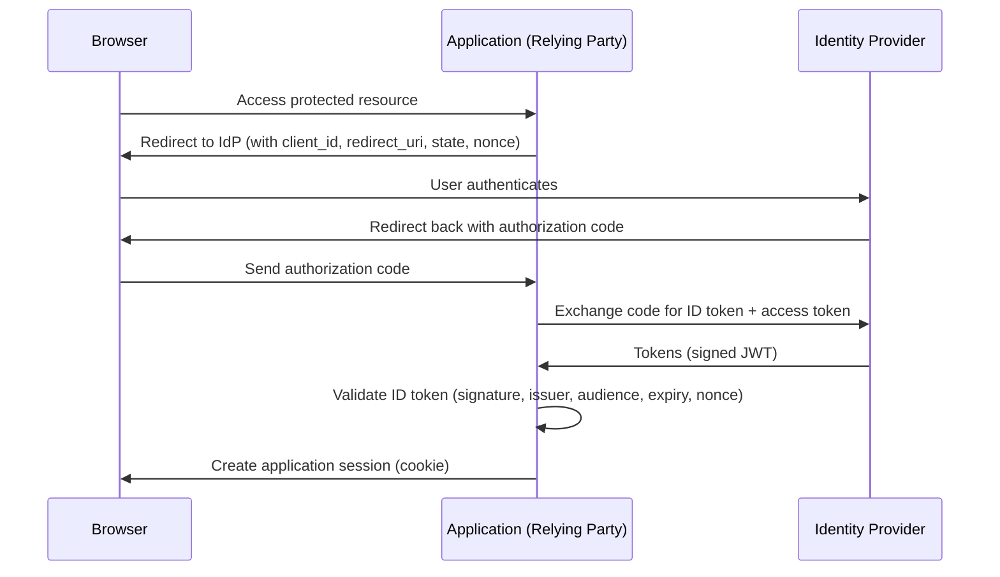

---
topic:
  - Security
subtopic:
  - Authentication
summary: "Authenticate once with a central Identity Provider, then access many applications."
level:
  - "3"
priority: High
status: Ready to Repeat
publish: true
---
# Intro

Single Sign-On (SSO) lets a user authenticate once with a central Identity Provider (IdP) and then access multiple applications without re-entering credentials. The IdP issues tokens or assertions that each application validates independently. In modern systems, SSO is implemented with OpenID Connect (OIDC) on top of OAuth 2.0. The core engineering work is session management, token validation, and handling failure modes safely.

See [[Oauth OIDC (OpenId Connect)|OAuth OIDC]] for the underlying protocol details.

## How It Works — OIDC Flow



**Key points:**
- The application never sees the user's password — only tokens from the IdP.
- The `state` parameter prevents CSRF attacks on the redirect.
- The `nonce` prevents replay attacks on the ID token.
- Each application creates its own session after validating the token — SSO does not mean a shared session.

## SAML vs OIDC

| Aspect | SAML 2.0 | OIDC (OAuth 2.0) |
|--------|----------|-----------------|
| Format | XML assertions | JSON Web Tokens (JWT) |
| Transport | HTTP POST/Redirect | HTTP redirects + REST |
| Age | 2005 (enterprise legacy) | 2014 (modern web/mobile) |
| Mobile support | Poor (XML, browser-only) | Excellent (native apps, SPAs) |
| Complexity | High (XML signatures, metadata) | Lower (JSON, standard libraries) |
| Adoption | Enterprise (Okta, ADFS, Salesforce) | Cloud-native (Azure AD, Google, GitHub) |

**Decision rule:** use OIDC for new systems. Use SAML only when integrating with legacy enterprise IdPs that don't support OIDC (e.g., older ADFS deployments, some SaaS products).

## ASP.NET Core Integration

```csharp
// Program.cs — configure OIDC with Azure AD
builder.Services.AddAuthentication(options =>
{
    options.DefaultScheme = CookieAuthenticationDefaults.AuthenticationScheme;
    options.DefaultChallengeScheme = OpenIdConnectDefaults.AuthenticationScheme;
})
.AddCookie()
.AddOpenIdConnect(options =>
{
    options.Authority = "https://login.microsoftonline.com/{tenant-id}/v2.0";
    options.ClientId = builder.Configuration["AzureAd:ClientId"];
    options.ClientSecret = builder.Configuration["AzureAd:ClientSecret"];
    options.ResponseType = OpenIdConnectResponseType.Code;
    options.SaveTokens = true;
    options.Scope.Add("openid");
    options.Scope.Add("profile");
    options.Scope.Add("email");
});
```

The middleware handles the redirect, code exchange, token validation, and cookie creation automatically.

## Token Validation Checklist

When accepting an ID token from an IdP, validate:

1. **Signature** — verify using the IdP's public key (fetched from `/.well-known/openid-configuration`).
2. **Issuer (`iss`)** — must match the expected IdP URL.
3. **Audience (`aud`)** — must include your application's `client_id`.
4. **Expiry (`exp`)** — token must not be expired.
5. **Nonce** — must match the nonce sent in the authorization request (prevents replay).
6. **Redirect URI** — must match the registered redirect URI exactly.

## Pitfalls

**Shared session vs federated identity**
SSO does not mean all applications share one session cookie. Each application creates its own session after validating the IdP token. If the IdP session expires, users may need to re-authenticate — but this is transparent if the application handles token refresh.

**Single point of failure**
If the IdP is unavailable, users cannot authenticate to any SSO-protected application. Mitigate with IdP high availability (Azure AD, Okta have SLAs) and graceful degradation for non-critical paths.

**Token leakage**
ID tokens contain user claims (email, name, roles). Logging tokens or passing them in URLs exposes PII. Always transmit tokens over HTTPS and store them in secure, HttpOnly cookies.

**Logout complexity**
Logging out of one application does not automatically log out of the IdP or other applications. Implement front-channel logout (IdP notifies all applications) or back-channel logout (server-to-server) for complete logout.

## Questions

> [!QUESTION]- What problem does SSO solve and what does it not solve?
> SSO eliminates repeated interactive logins across applications — users authenticate once and access many services. It does not replace per-application authorization (what the user can do) or per-application session management (how long the session lasts). Each application still manages its own session and access control.

> [!QUESTION]- What must you validate when accepting an ID token from an IdP?
> Signature (using IdP's public key), issuer, audience (your client_id), expiry, and nonce. Also validate the redirect URI matches the registered value. Missing any of these opens the door to token forgery, replay attacks, or open redirect vulnerabilities.

> [!QUESTION]- When would you choose SAML over OIDC?
> When integrating with legacy enterprise IdPs that only support SAML (older ADFS, some SaaS products). For new systems, OIDC is simpler, better supported on mobile/SPA, and has a richer ecosystem of libraries. The cost of SAML: XML parsing complexity, larger message sizes, and harder debugging.

## References

- [OpenID Connect on ASP.NET Core (Microsoft Learn)](https://learn.microsoft.com/en-us/aspnet/core/security/authentication/openid-connect) — official guide to configuring OIDC authentication in ASP.NET Core with Azure AD.
- [OpenID Connect Core 1.0 (OpenID Foundation)](https://openid.net/specs/openid-connect-core-1_0.html) — the OIDC specification covering authentication flows, token validation, and claims.
- [OAuth 2.0 (RFC 6749)](https://www.rfc-editor.org/rfc/rfc6749) — the underlying authorization framework that OIDC builds on.
- [NIST Digital Identity Guidelines (SP 800-63)](https://pages.nist.gov/800-63-3/) — authoritative guidance on identity assurance levels, federation, and token validation requirements.
- [SAML vs OIDC (Okta)](https://developer.okta.com/docs/concepts/saml-vs-oidc/) — practitioner comparison of SAML and OIDC with migration guidance.
