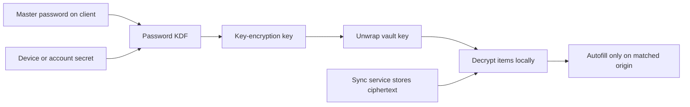

---
topic:
  - Security
subtopic:
  - Security
summary: "Generates unique credentials and protects a synchronized vault whose decryption boundary stays with authorized clients."
level:
  - "3"
priority: Medium
status: Ready to Repeat
publish: true
---

A password manager trades many reused, memorable passwords for one strongly protected vault and unique generated credentials per account. The useful security property is not merely “encrypted in the cloud.” It is that the provider-neutral design derives or unlocks key material on an authorized client, encrypts each vault item with authenticated encryption, and synchronizes ciphertext instead of plaintext.

Exact key derivation, recovery, sharing, and device-enrollment protocols differ by provider. Do not infer one product's design from another product's diagram.

# Trust Boundary

The master password should be long, unique, and absent from every other service. A memory-hard password KDF slows offline guesses if an attacker steals the encrypted vault. Many designs add a device or account secret so a server-side ciphertext leak alone is insufficient, but that property must be verified in the selected provider's current security design.

Vault items use random data-encryption keys or a vault key. Envelope encryption lets the system wrap those keys for each authorized device or member without re-encrypting every item. Sharing should grant a collection key to a recipient's public key or another authenticated membership mechanism; emailing the item plaintext escapes the vault boundary.

# Recovery and Synchronization Are Security Decisions

| Capability | What it enables | Security cost |
| --- | --- | --- |
| Server sync | Availability across devices | Ciphertext, metadata, and login endpoints become high-value targets |
| Account recovery | Restores access after a lost secret | A recovery authority may become an alternate decryption path |
| Team sharing | Revocable shared collections | Membership changes and cached keys must be propagated correctly |
| Offline access | Access during an outage | A stolen unlocked device or copied local vault extends exposure |

A “zero-knowledge” claim does not remove the need to inspect recovery. If support can reset the master password and reveal the old vault, then support or its recovery keys are inside the decryption boundary. If recovery cannot reveal the old vault, losing every enrolled device and recovery secret may make the data permanently unavailable.

# Autofill, Phishing, and Device Compromise

Autofill can resist phishing when it releases a credential only to the saved origin; a look-alike domain receives nothing. The user can still override warnings, copy a password into the wrong site, or approve a malicious browser extension. A password manager cannot protect plaintext after endpoint malware reads an unlocked vault or captures form data.

Protect the manager account with MFA. It can stop a stolen master password from opening a new server session, although provider architecture determines whether MFA also strengthens offline vault decryption. Keep emergency access and recovery material offline, review newly enrolled devices, and rotate every stored credential after a confirmed vault compromise.

# References

- [ByteByteGo — How Password Managers Work](https://github.com/ByteByteGoHq/system-design-101/blob/b28380a4710c5ec9638ec037d4168e288f334cba/data/guides/how-does-a-password-manager-such-as-1password-or-lastpass-work.md) — the pinned source; its product-specific key hierarchy is intentionally replaced by the provider-neutral boundary above.
- [NIST SP 800-63B-4 — Authenticators](https://pages.nist.gov/800-63-4/sp800-63b/authenticators/) — permits password managers and autofill and explains verifier requirements.
- [NIST SP 800-63B-4 — Customer Experience](https://pages.nist.gov/800-63-4/sp800-63b/customer/) — distinct password and password-manager usability guidance.
- [OWASP Cryptographic Storage Cheat Sheet](https://cheatsheetseries.owasp.org/cheatsheets/Cryptographic_Storage_Cheat_Sheet.html) — authenticated encryption, key separation, and lifecycle considerations for vault storage.
