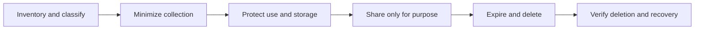

---
topic:
  - Security
subtopic:
  - Security
summary: "Controls sensitive data from collection through deletion by attaching purpose, access, retention, and incident rules to each class."
level:
  - "3"
priority: High
status: Ready to Repeat
publish: true
---

Sensitive data is information whose disclosure, alteration, loss, or misuse could harm a person, the organization, or another affected party. Personal, health, financial, authentication, legal, and intellectual-property data commonly qualify. The label becomes actionable only when a data class has an owner, purpose, allowed consumers, retention rule, and deletion path.

# Classify Before Choosing Controls

A useful scheme is small enough that engineers apply it consistently:

| Class | Example | Access and handling | Failure to design for |
| --- | --- | --- | --- |
| Public | Published product documentation | Integrity and availability controls | An attacker publishes altered instructions |
| Internal | Non-public runbook | Workforce access and normal retention | Operational details aid reconnaissance |
| Confidential | Customer email or contract | Need-to-know access, encryption, redacted logs | A support export exposes customer records |
| Restricted | Password verifier, payment token, health record | Narrow service identity, managed keys, explicit audit and deletion | One compromised workload exposes regulated or reusable credentials |

Classification is not a substitute for legal review. Jurisdiction, data-subject rights, contractual promises, sector rules, and cross-border transfers can change the permitted purpose, retention period, and incident process. A data inventory must therefore record where a field is copied and derived, not only its primary database column.

# Lifecycle Controls

1. **Collect:** take only fields tied to an explicit purpose. Do not collect a date of birth when an age-band result is sufficient.
2. **Store:** encrypt confidential data with managed keys, separate key administration from data administration, and use envelope encryption when independent key rotation matters.
3. **Use:** authorize the exact record and operation. A support role that can view contact details should not automatically see payment tokens.
4. **Move:** require TLS, authenticate both endpoints where appropriate, constrain exports, and keep third-party processors inside the same purpose and retention contract.
5. **Observe:** log access decisions and record identifiers, not secrets or full payloads. Redact structured fields before they reach logs, traces, analytics, crash reports, or support tickets.
6. **Retain and delete:** enforce expiry in primary stores, indexes, caches, data lakes, and derived exports. Define how backups age out rather than claiming immediate erasure from immutable recovery media.
7. **Respond:** know which data class and subjects were affected, revoke access, rotate exposed keys or tokens, preserve evidence, and follow the jurisdiction-specific notification process.

# Transformations Change Different Boundaries

- **Encryption** is reversible with a key. It protects confidentiality against storage or transport exposure but not against a workload that is authorized to decrypt.
- **Tokenization** replaces a value with a token and moves the sensitive mapping into a vault. It can reduce the number of systems that handle the original value, but the vault and detokenization API become concentrated targets.
- **Pseudonymization** replaces direct identifiers while retaining a relinking path. The data remains sensitive when another dataset or key can re-identify people.
- **Anonymization** aims to make re-identification no longer reasonably possible. Removing names alone is not enough. Rare combinations and external datasets can identify a person.

For example, an analytics job does not need raw card numbers. A payment service can retain the provider token, publish a scoped transaction identifier that does not expose the card number, and deny the analytics identity any detokenization permission. That identifier and surrounding transaction metadata remain classified and authorization-scoped when they can be linked to a customer or payment. Encrypting the same raw card column would still expose it whenever that job receives the decryption key.

# References

- [NIST Privacy Framework](https://www.nist.gov/privacy-framework/privacy-framework)
- [NIST SP 800-122: Guide to Protecting the Confidentiality of Personally Identifiable Information](https://csrc.nist.gov/pubs/sp/800/122/final)
