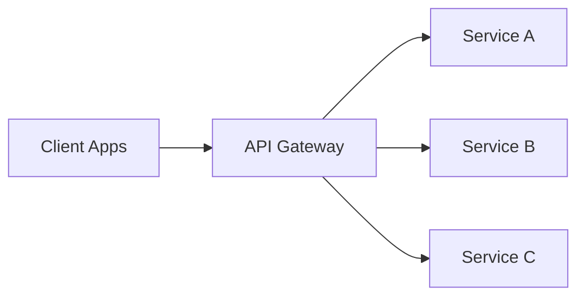

---
topic:
  - Software Architecture
subtopic:
  - Distributed Systems
summary: "A single entry point that centralizes routing, auth, rate limiting, and TLS so backend services don't re-implement cross-cutting concerns."
level:
  - "2"
priority: High
status: Done
publish: true
---

# Intro

An API Gateway is a single entry point between external clients and a set of backend services. It centralizes cross-cutting concerns such as request routing, authentication and authorization enforcement, rate limiting, TLS termination, and traffic policies so individual services do not have to re-implement them. This matters because it gives you one place to enforce consistency and security while keeping clients simpler, especially when each client would otherwise need to call many services directly.

In .NET ecosystems, a common implementation is to run a reverse proxy gateway at the system edge and keep service-level business behavior inside domain services.

## Core Responsibilities

- **Request routing**: Map incoming paths, headers, hostnames, or methods to the right downstream service.
- **Authentication and authorization**: Validate tokens at the edge and enforce coarse-grained access policy before forwarding.
- **Rate limiting and quotas**: Protect services from abusive or accidental traffic spikes.
- **Request and response transformation**: Normalize payload shape, hide internal endpoint changes, or project data for specific clients.
- **[[Load Balancing]]**: Distribute requests across service instances using health-aware selection.
- **[[Circuit Breaker|Circuit breaking]] and resiliency policies**: Fail fast when a downstream is unhealthy and apply retries or fallback only where safe.
- **TLS termination**: Offload certificate handling and HTTPS policy enforcement from every backend service.
- **[[Observability]]**: Emit centralized logs, traces, metrics, and correlation IDs for end-to-end troubleshooting.

### Routing, policy enforcement, composition, and failure boundary

Trace `GET /mobile/orders/42` through the edge:

1. Terminate TLS and enforce request-size and protocol limits.
2. Authenticate the caller and apply a coarse-grained route policy.
3. Rate-limit by tenant or credential before consuming downstream capacity.
4. Route to `Orders`, or fan out to `Orders`, `Payments`, and `Shipping` for a mobile projection.
5. Propagate trace and cancellation context; cap every downstream timeout inside the client deadline.
6. Return a bounded response: complete, explicitly partial, or failed. Never silently omit a failed dependency.

Routing and policy are common gateway duties. Composition, response caching, transformation, retries, and circuit breaking are optional because each concentrates more state, latency, and failure at the gateway. A fan-out endpoint with three independent 99.9% dependencies has lower end-to-end availability than any one dependency unless it can degrade safely.

### Reverse proxy, gateway, and load balancer capability overlap

![[System Design 101/f8408b96b2c46ddbccb453ca0dff9728562f83739c8511892d4f9e081b8935e8.png]]

The image shows archetypal roles, not mutually exclusive products. NGINX, Envoy, YARP, and cloud gateways can combine several columns.

| Capability | Reverse proxy | API gateway | Load balancer |
|---|---|---|---|
| Hide backend addresses and terminate TLS | Common | Common | Common for proxy load balancers |
| Route by host, path, or header | Common at L7 | Core | L7 only |
| Auth, quotas, API keys, contract lifecycle | Possible with modules | Core | Usually outside scope |
| Compose multiple APIs | Possible in custom code | Optional | Outside scope |
| Health-aware distribution across equivalent instances | Possible | Often delegated or built in | Core |

Choose the failure boundary deliberately. A global edge proxy affects all routes; a domain gateway affects one bounded context; a per-service load balancer affects one replica pool. Product names do not define the blast radius — topology and ownership do.

## Patterns

### Gateway Routing

Use the gateway as the policy and routing edge. Clients call one host, and route rules dispatch traffic to internal services.

When it works best:

- Many services are private on internal networks.
- You need consistent auth and throttling policy.
- You want controlled API evolution at the boundary.

### Gateway Aggregation

The gateway composes a single response from multiple service calls to reduce client round trips.

Concrete example:

- Mobile app needs order summary page.
- Gateway calls `Orders`, `Payments`, and `Shipping` services.
- Gateway returns one payload tuned for the mobile screen.

Use carefully: aggregation is orchestration logic, not domain logic. Keep it thin and response-oriented.

### Gateway Offloading

The gateway handles edge concerns such as TLS, compression, CORS, header normalization, and request size limits.

Benefit:

- Service teams focus on domain behavior.
- Security and policy changes roll out in one place.

### BFF (Backend for Frontend)

Separate gateways or route sets per client type only when payload, authentication, latency, or ownership needs have materially diverged. [[Backend for Frontend and API Federation]] owns the client-specific composition and federated ownership tradeoffs.

### Netflix API evolution: aggregation to federation

![[System Design 101/3e1b2b8d87fdc6b1e589b34ba270f8497c314218e558b304c60ad21a3bcaec42.png]]

The visual compresses distinct systems into an evolution story. The durable point is that federation redistributes schema and resolver ownership toward domains while a shared registry and graph gateway retain composition and execution responsibilities. See [[Backend for Frontend and API Federation]] for the full boundary and operating tradeoffs.

## .NET gateway implementation

YARP provides configurable routes, clusters, transforms, destination health, and ASP.NET Core extension points. [[YARP API Gateway]] contains the focused configuration and production boundary; the gateway pattern itself is independent of the chosen proxy library.

## Gateway vs Service Mesh

API Gateway and Service Mesh solve different traffic planes and are often used together.

- **Gateway (north-south)**: Handles client-to-system traffic, public API exposure, edge auth, and external policy enforcement.
- **Service mesh (east-west)**: Handles service-to-service traffic inside the platform, including mTLS, retries, traffic shifting, and per-service telemetry.

Rule of thumb:

- Put internet-facing boundary policy in the gateway.
- Put internal service communication policy in the mesh.

## Tradeoffs

- **Direct client to services vs gateway**: Direct calls reduce one network hop but increase client complexity and duplicate policy enforcement.
- **Single gateway vs BFF gateways**: Single gateway is simpler to operate; BFF improves client optimization and team autonomy at the cost of more moving parts.
- **Centralized transformation vs service-owned contracts**: Gateway transformations can shield clients from churn, but too much translation can hide unhealthy service boundaries.

## Pitfalls

1. **Gateway becomes a monolith bottleneck**
   - What goes wrong: every change flows through one oversized gateway, and outages impact all consumers.
   - Why it happens: uncontrolled feature growth and weak horizontal scaling strategy.
   - How to prevent/detect: keep gateway stateless, scale out aggressively, split by bounded context or BFF when ownership and traffic diverge.

2. **Business logic creeps into the gateway**
   - What goes wrong: domain rules are duplicated at the edge, causing inconsistent behavior and hard-to-test flows.
   - Why it happens: aggregation code gradually turns into orchestration and then decision logic.
   - How to prevent/detect: enforce a boundary rule that gateway owns transport and policy only; domain invariants stay in services.

3. **Extra latency from the additional hop**
   - What goes wrong: p95 and p99 latency increase, especially under fan-out aggregation.
   - Why it happens: more network hops, serialization work, and downstream dependency chains.
   - How to prevent/detect: measure end-to-end traces, cap fan-out depth, use parallel downstream calls, and cache only where freshness allows.

4. **Configuration sprawl with many routes**
   - What goes wrong: route conflicts, accidental exposure, and hard-to-review config changes.
   - Why it happens: rapid service growth without governance for route naming and ownership.
   - How to prevent/detect: define route conventions, enforce config validation in CI, and assign clear ownership per route group.

## Questions

> [!QUESTION]- How do you design gateway aggregation endpoints for client efficiency, and what do you keep out of the gateway?
> Use gateway routing for normal traffic and add a few targeted aggregation endpoints where a client — usually mobile — would otherwise make five round trips for one screen. The gateway composes those reads and tunes the payload, but it stays thin: auth, throttling, routing, transformation, observability, and nothing else. Business rules, transactions, and domain invariants live in the backend services, with correlation IDs flowing across the fan-out so you can trace a slow screen. The line to hold: aggregation is response-shaping, not orchestration — the moment decision logic creeps in, you have a distributed monolith.

> [!QUESTION]- Where do API Gateway and service mesh responsibilities belong in one architecture?
> They handle different traffic planes, so they sit side by side rather than compete. The gateway owns north-south traffic — clients entering the system — so edge auth, TLS termination, external rate limits, and API surface control belong there. The mesh owns east-west traffic between internal services: mTLS, retries, traffic shifting, and per-service telemetry. The gateway guards the front door; the mesh governs the hallways.

## References

- [API Gateway pattern (Azure Architecture Center)](https://learn.microsoft.com/azure/architecture/patterns/gateway-routing) — pattern description covering routing, aggregation, and offloading cross-cutting concerns.
- [YARP documentation](https://learn.microsoft.com/aspnet/core/fundamentals/servers/yarp/getting-started) — official getting-started guide for Microsoft's YARP reverse proxy library for .NET.
- [YARP GitHub repository](https://github.com/dotnet/yarp) — source code, samples, and issue tracker for the YARP project.
- [Ocelot documentation](https://ocelot.readthedocs.io/en/latest/) — configuration reference for the Ocelot .NET API gateway including routing, authentication, and rate limiting.
- [Microservices.io — API Gateway pattern (Chris Richardson)](https://microservices.io/patterns/apigateway.html) — pattern catalog entry covering API gateway vs BFF, forces, and consequences in microservices architectures.
- [How Netflix scales its API with GraphQL Federation](https://medium.com/netflix-techblog/how-netflix-scales-its-api-with-graphql-federation-part-1-ae3557c187e2) — Netflix's primary account of the unified aggregation layer, domain graph services, schema registry, and graph gateway.

### ByteByteGo provenance

- [API gateway 101](https://github.com/ByteByteGoHq/system-design-101/blob/b28380a4710c5ec9638ec037d4168e288f334cba/data/guides/api-gateway-101.md) — editorial lead for the request trace; its stale product infographic was rejected.
- [Reverse proxy versus API gateway versus load balancer](https://github.com/ByteByteGoHq/system-design-101/blob/b28380a4710c5ec9638ec037d4168e288f334cba/data/guides/reverse-proxy-vs-api-gateway-vs-load-balancer.md) — provenance for the role visual, qualified by capability overlap.
- [Evolution of the Netflix API architecture](https://github.com/ByteByteGoHq/system-design-101/blob/b28380a4710c5ec9638ec037d4168e288f334cba/data/guides/evolution-of-the-netflix-api-architecture.md) — editorial lead for the simplified evolution case, grounded in Netflix's federation write-up.
