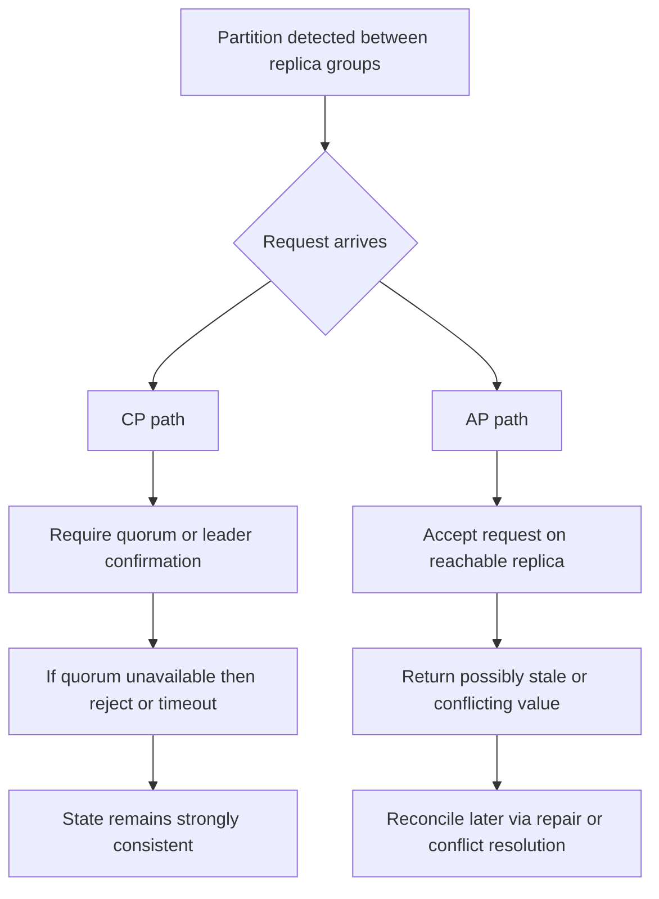

---
topic:
  - Software Architecture
subtopic:
  - Distributed Systems
summary: "Once a network partition happens, a distributed data system can guarantee at most one of strong consistency or availability."
level:
  - "2"
priority: High
status: Done

publish: true
---

# Intro

CAP theorem says that in a distributed data system, once a network partition happens, you can guarantee at most one of **strong consistency** or **availability** (while still tolerating the partition). This matters because real systems eventually hit partial failures: links drop, regions isolate, packets reorder, and suddenly nodes cannot communicate reliably. A partition is not "the whole system is down"; it is specifically "some nodes can still process requests, but they cannot exchange enough messages to maintain a single, current view of data." You reach for CAP when deciding failure behavior in system design: do we reject some operations to protect correctness, or accept operations and repair divergence later?

## What CAP Actually Means

### Definitions in operational terms

- **Consistency (C)**: every successful read sees the most recent successful write (or an error), as if there is one up-to-date value. *(This is **linearizability** — replicas agreeing. It is **not** the "C" in [[ACID]], which means constraint/invariant preservation within one node. A system can be ACID and AP, or CP and non-ACID — the two C's are unrelated.)*
- **Availability (A)**: every request to a non-failed node receives a non-error response in finite time.
- **Partition tolerance (P)**: the system continues operating despite message loss/delay between node groups.

The common "pick any 2 of 3" slogan is a simplification that often causes wrong design decisions. In modern distributed systems, partition tolerance is usually non-negotiable once data is replicated across machines, racks, zones, or regions. The real forced choice is:

- during a partition, choose **C** (reject/timeout some operations)
- or choose **A** (continue serving operations with possible staleness/conflicts)

When there is **no** partition, many systems can provide both consistency and availability for normal operation.

## Mechanism: Why You Cannot Have C and A During Partition

Imagine two replicas, `R1` and `R2`, serving the same key.

1. Client writes `x=5` to `R1`.
2. A network partition isolates `R1` from `R2`.
3. Another client reads from `R2`.

If `R2` answers immediately, it may return old `x=4` (availability preserved, consistency broken). If `R2` refuses/blocks until it can confirm latest state from `R1`, it preserves consistency but sacrifices availability for that request path.

That is the CAP tension: with no reliable communication path, a node cannot both always answer and always be globally current.

## CP vs AP With Concrete Systems

### CP behavior (consistency-first during partition)

Representative systems: ZooKeeper / etcd style coordination services, majority-quorum relational deployments.

- They require leader or quorum confirmation before committing writes.
- If a partition prevents quorum, writes are rejected or blocked.
- Reads may also be restricted if linearizability is required.

Concrete effect:

- **Good**: no split-brain writes, strong correctness for locks, config, leader election.
- **Cost**: reduced availability for some operations during partition.

ZooKeeper-style mindset: "If I cannot prove this write is globally safe, I will not accept it."

### AP behavior (availability-first during partition)

Representative systems: the original Amazon Dynamo design, Cassandra configurations that accept on reachable replicas, and other explicitly availability-first multi-writer topologies.

- Replicas accept writes on reachable nodes even when not fully coordinated.
- Divergent versions can exist temporarily.
- Background repair, vector clocks/timestamps, or app-level merge rules reconcile state.

Concrete effect:

- **Good**: service continues under partition, better uptime for user-facing traffic.
- **Cost**: clients may observe stale reads or conflict resolution artifacts.

Dynamo-style mindset: "Keep accepting traffic now, converge state later."

## CAP Is About Partition Time, Not Normal Time

This is one of the most important interview points:

- If links are healthy and quorum is reachable, a CP system can look both consistent and available.
- If links are healthy, an AP system can also look fully correct because replicas converge quickly.
- CAP only constrains guarantees **when partition actually exists**.

Practical implication: ask "What happens in the bad 0.1% network case?" rather than evaluating only happy-path latency graphs.

### Partition-time choice and the false CA option

| Partitioned operation | Preserve CAP consistency | Preserve CAP availability |
|---|---|---|
| `ReserveInventory` cannot reach a quorum | Reject or wait; do not confirm an unprovable reservation | Accept locally and reconcile competing reservations later |
| `GetRecommendations` loses the fresh replica | Reject rather than return stale data | Return a reachable replica's stale result |

"CA" is not a third partition-time mode for a replicated system. If isolated nodes both keep answering and must remain linearizable, one side can neither learn the other's latest write nor prove that its own value is current. A single-node database can provide consistency and ordinary uptime while it is reachable, but it does not tolerate a partition between replicas because there are no replicas to continue serving.

CAP availability is also stricter than an uptime SLO. It requires every request to every non-failed node to receive a non-error response in finite time. A service can meet `99.99%` monthly uptime while rejecting the small set of partitioned writes needed to protect consistency; that makes the operation CP under CAP, not an operationally "unavailable service" in the usual dashboard sense.

## Normal-time tradeoffs

CAP constrains partition-time behavior. PACELC adds the normal case: if there is a partition, choose availability or consistency; else, choose latency or consistency. Database configuration changes both failure behavior and everyday request latency, so classify an operation and its selected consistency level instead of labeling an entire product `CP` or `AP`.

| Operation | Correctness requirement | Reasonable posture |
| --- | --- | --- |
| Reserve inventory | Do not confirm overlapping reservations | Quorum or leader confirmation; reject when safety cannot be proved |
| Read product recommendations | A stale result is acceptable | Read a nearby replica and repair asynchronously |
| Read own profile after update | The user should see their write | Session guarantee without global linearizability |
| Append a ledger entry | Preserve ordering and uniqueness | Strong write coordination, idempotency, and an authoritative store |

Product names do not fix these choices. SQL Server Availability Groups with synchronous commit lean toward consistency for protected writes, but failover mode and read routing change operation behavior. Cosmos DB exposes several consistency levels. Cassandra quorum values and topology decide whether requests favor local latency, overlapping read/write replica sets, or continued service during failures. Redis used as a cache commonly accepts staleness because an authoritative database repairs truth. Record the concrete topology, quorum, read mode, region, and fallback policy.

For a multi-region profile service, writes can go to the primary region and return a session token. The next read carries that token, preserving read-your-writes without waiting for every region. Anonymous recommendation reads use the nearest region and tolerate a five-minute freshness window. One product therefore occupies two PACELC positions for two operations.

## Pitfalls

### Pitfall 1: "CAP means pick two of three"

- **What goes wrong**: teams assume they can permanently choose C and A while ignoring P.
- **Why it is wrong**: once replication spans unreliable networks, partitions will happen; P is not optional in practice.
- **How to avoid it**: restate CAP as "during partition, choose C or A" and design explicit failure policy for each critical operation.

### Pitfall 2: Treating CAP choice as system-wide and static

- **What goes wrong**: architecture docs label entire platform "CP" or "AP," then apply one rule to all endpoints.
- **Why it is risky**: different endpoints have different correctness and UX budgets.
- **How to avoid it**: classify operations by business invariants and allowed stale window, then pick per-operation consistency/availability behavior.

### Pitfall 3: Ignoring reconciliation design in AP paths

- **What goes wrong**: system accepts writes under partition but has weak conflict strategy.
- **Why it is risky**: silent data corruption appears later as duplicate orders or lost preference updates.
- **How to avoid it**: define merge policy, [[Idempotency|idempotency keys]], causality/version metadata, and repair observability from day one.

## Questions

> [!QUESTION]- Is a system "CP" or "AP" as a whole?
> Don't think of it system-wide — decide per operation, because different endpoints have different correctness budgets. A `PlaceOrder` or ledger write wants CP: refuse it under partition rather than risk split-brain or a double charge. A `GetRecommendations` read wants AP: keep serving slightly stale data because availability beats freshness there. A profile read might only need session consistency. So the same system is CP on some paths and AP on others; labeling the whole platform and applying one rule everywhere is the mistake. Map each operation to its business invariant and its allowed staleness window.

> [!QUESTION]- Why is "pick two of three" a misleading way to state CAP?
> Because in any system that replicates data across machines, partition tolerance isn't something you opt out of — networks drop packets and isolate nodes whether you like it or not. So "CA" isn't really on the menu: the moment a partition hits, a system that didn't plan for it just stops being correct or stops responding. The honest framing is that P is a given, and the real decision is what you do *during* a partition — sacrifice consistency to stay available (AP), or sacrifice availability to stay consistent (CP). With no partition you can have both; CAP only forces the choice inside the failure window.

## References

- [Brewer, "Towards Robust Distributed Systems" (PODC 2000 keynote)](https://people.eecs.berkeley.edu/~brewer/cs262b-2004/PODC-keynote.pdf) — the original CAP conjecture presentation by Eric Brewer.
- [Gilbert and Lynch, "Brewer's Conjecture and the Feasibility of Consistent, Available, Partition-Tolerant Web Services"](https://groups.csail.mit.edu/tds/papers/Lynch/jacm.pdf) — the formal proof of the CAP theorem with precise definitions of consistency and availability.
- [Azure Cosmos DB consistency levels](https://learn.microsoft.com/azure/cosmos-db/consistency-levels) — practical example of a production system offering five tunable consistency levels, illustrating CAP tradeoffs in a real product.
- [Amazon Dynamo paper (SOSP 2007)](https://www.allthingsdistributed.com/files/amazon-dynamo-sosp2007.pdf) — canonical AP system design paper showing how Amazon chose availability over consistency and the engineering consequences.
- [Abadi, "Consistency Tradeoffs in Modern Distributed Database System Design: CAP is only part of the story" (PACELC)](https://www.cs.umd.edu/~abadi/papers/abadi-pacelc.pdf) — extends CAP with the PACELC model, adding latency vs consistency tradeoffs during normal operation.
- [SQL Server availability modes](https://learn.microsoft.com/sql/database-engine/availability-groups/windows/availability-modes-always-on-availability-groups) — official synchronous and asynchronous commit behavior.
- [Apache Cassandra consistency](https://cassandra.apache.org/doc/latest/cassandra/architecture/dynamo.html#tunable-consistency) — official quorum and tunable-consistency model.
- [CAP theorem: one of the most misunderstood terms](https://github.com/ByteByteGoHq/system-design-101/blob/b28380a4710c5ec9638ec037d4168e288f334cba/data/guides/cap-theorem-one-of-the-most-misunderstood-terms.md) — ByteByteGo provenance for the partition-time prompt; its false CA-choice visual was rejected.
