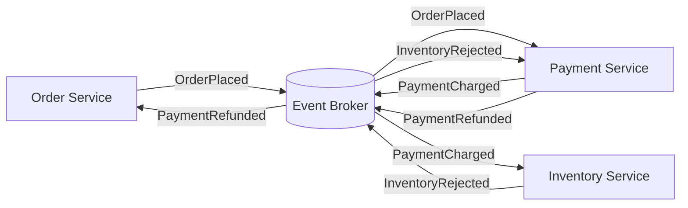

---
topic:
  - Software Architecture
subtopic:
  - Distributed Systems
summary: "Coordinates distributed behavior through services reacting to events without a central component directing the whole workflow."
level:
  - "3"
priority: High
status: Not-Started
publish: true
---

Choreography coordinates distributed behavior through facts published by participants. Each service decides its own reaction. No central component sends every next-step command or owns the complete workflow state. Service ownership stays local, while the end-to-end process emerges from subscriptions and event contracts.

# Order Workflow

The order service publishes `OrderPlaced`. Payment reacts and publishes `PaymentCharged`. Inventory then attempts a reservation. If inventory publishes `InventoryRejected`, payment reacts with a refund and the order service cancels the order. No participant alone owns the whole sequence, so event contracts, subscription ownership, and the allowed state transitions form the process definition.

# When Choreography Fits

Choreography fits independent reactions and modest workflows. `OrderPlaced` can trigger email, analytics, and search indexing without a coordinator. Each subscriber owns its response, and fan-out does not put one workflow component on the throughput path.

The costs appear as the graph grows. Cycles and hidden dependencies become hard to reason about. A new subscriber changes load and timing, yet no single record necessarily answers “where is order 42?” Duplicate or delayed delivery requires idempotent handlers and durable outbox/inbox boundaries. Reordering needs a per-aggregate rule where order matters.

Observability reconstructs a flow from event identity, correlation and causation, broker progress, and domain state. Compensation is choreographed too: failure events trigger compensating handlers, so a failed refund or poison message needs explicit ownership and escalation. Periodic reconciliation finds workflows whose expected successor event never arrived.

# Boundary with Orchestration

[[Home/Software Architecture/Distributed Systems/Orchestration|Orchestration]] centralizes the state machine and next-step decisions. Move toward it when ordered branching, deadlines, compensation progress, or an operator-visible workflow status can no longer be recovered reliably from distributed state. Keep choreography when reactions are independent and no business invariant requires one owner of the sequence. Mixing the styles is normal: orchestrate the transaction, then choreograph reactions to its completed facts.

# References

- [Saga pattern](https://microservices.io/patterns/data/saga.html)
- [CloudEvents specification](https://github.com/cloudevents/spec/blob/main/cloudevents/spec.md)
