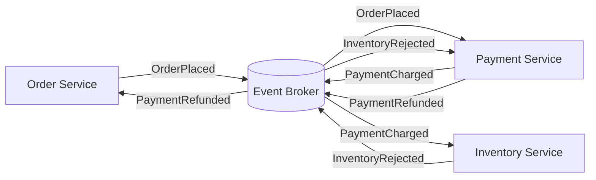

---
topic:
  - Software Architecture
subtopic:
  - Distributed Systems
summary: "Coordinates distributed behavior through services reacting to events without a central component directing the whole workflow."
level:
  - "3"
priority: High
status: Not-Started
publish: true
---

Choreography coordinates distributed behavior through facts published by participants. Each service decides its own reaction; no central component sends every next-step command or owns the complete workflow state. This preserves service autonomy, but the end-to-end process emerges from subscriptions and event contracts.

# Order Workflow

The order service publishes `OrderPlaced`; payment reacts and publishes `PaymentCharged`; inventory then attempts a reservation. If inventory publishes `InventoryRejected`, payment reacts with a refund and the order service cancels the order. No participant alone owns the whole sequence, so event contracts, subscription ownership, and the allowed state transitions form the process definition.

# Where It Fits

Choreography suits independent reactions and modest workflows: `OrderPlaced` can trigger email, analytics, and search indexing without introducing a coordinator. Its advantages are local ownership, natural fan-out, and the absence of a central workflow throughput dependency.

The costs appear as the graph grows. Cycles and hidden dependencies become difficult to reason about; an added subscriber can change load and timing; and no single record necessarily answers “where is order 42?” Duplicate, delayed, and reordered delivery require idempotent handlers, per-aggregate ordering rules where necessary, and durable outbox/inbox boundaries.

Observability must reconstruct a flow from event IDs, correlation and causation IDs, broker offsets, consumer lag, and domain state. Compensation is also choreographed: failure events trigger compensating handlers, so ownership and escalation for a failed refund or poison message must be explicit. Periodic reconciliation detects workflows whose expected successor event never arrived.

# Boundary with Orchestration

[[Home/Software Architecture/Distributed Systems/Orchestration|Orchestration]] centralizes the state machine and next-step decisions. Move toward it when ordered branching, deadlines, compensation progress, or an operator-visible workflow status can no longer be recovered reliably from distributed state. Keep choreography when reactions are independent and no business invariant requires one owner of the sequence. Mixing the styles is normal: orchestrate the transaction, then choreograph reactions to its completed facts.

# Questions

> [!QUESTION]- Why can a choreographed workflow become hard to operate?
> The process is distributed across event contracts, subscriptions, and service state. Without correlation, ownership, lag metrics, and reconciliation, a missing or cyclic reaction has no single diagnostic record.

> [!QUESTION]- What makes compensation reliable without a coordinator?
> Failure events must be durable, compensating handlers idempotent, outcomes observable, and missing successor events reconciled. A failed compensation needs a named owner and escalation path rather than unbounded retries.

# References

- [Saga distributed transactions pattern (Azure Architecture Center)](https://learn.microsoft.com/en-us/azure/architecture/reference-architectures/saga/saga) — Microsoft’s reference architecture shows event-driven saga choreography and its recovery tradeoffs.
- [Saga pattern (microservices.io)](https://microservices.io/patterns/data/saga.html) — Chris Richardson’s primary pattern catalog defines choreography through domain-event exchange between saga participants.
- [CloudEvents specification](https://github.com/cloudevents/spec/blob/main/cloudevents/spec.md) — the CNCF’s normative event-envelope contract for portable event identity, source, type, time, and data.
- [OpenTelemetry messaging semantic conventions](https://opentelemetry.io/docs/specs/semconv/messaging/) — the project’s normative attributes for tracing producers, brokers, and consumers across asynchronous flows.
