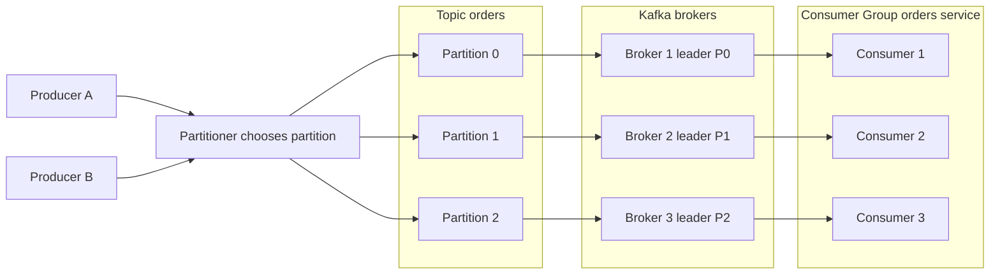

---
topic:
  - Software Architecture
subtopic:
  - Distributed Systems
summary: "Distributed event streaming platform built on an append-only commit log, giving durability, high throughput, and replayable per-partition ordering."
level:
  - "2"
priority: High
status: Done

publish: true
---

Apache Kafka is a distributed event-streaming platform built around an append-only log. Producers append records to topic partitions. Consumers move through those partitions at their own pace and store their position as an offset.

That separation is Kafka's defining property. A slow or offline consumer does not hold up producers, and retained records can be replayed by the same application or read independently by another one. Kafka fits systems that need durable event history, high sequential throughput, and ordering for records that share a key. Typical workloads include [[Home/Software Architecture/Patterns/Architectural Patterns/Event Sourcing|Event Sourcing]], change data capture, stream processing, and log aggregation.

# Core Architecture



## Topics

A **topic** is a named logical stream such as `orders` or `inventory_changes`. Producers write without knowing which applications will consume the records. Each consumer application can deploy, fail, catch up, and replay independently.

## Partitions

A topic is split into **partitions**. Each partition is an immutable, ordered log and the unit Kafka distributes across brokers. More partitions create room for more storage and parallel work, but the ordering guarantee stops at the partition boundary.

## Producers

Producers append records and may attach a **partition key**. The producer's partitioner maps that key to a partition, usually by hashing it. Equal keys keep their local order only while clients use compatible partitioning logic and the partition count stays unchanged. Mixed clients and custom partitioners can break that assumption.

## Consumer Groups

A **consumer group** represents one logical application. Kafka assigns each partition to one member of the group at a time, allowing several instances to divide the work without processing the same partition concurrently. A group cannot use more active consumers than the topic has partitions. Extra instances sit idle.

## Offsets

Every record has an increasing **offset** within its partition. Consumers persist offsets separately from the records, which makes rewind, replay, and backfill cheap. The point at which an application commits its offset determines whether a crash can lose work or repeat it.

## Brokers, Leaders, and Followers

Kafka **brokers** store partition replicas. Each partition has one leader and zero or more followers. The leader accepts writes and normally serves reads. Eligible reads can be routed to followers when replica selection is configured. Followers copy the leader's log and one can be promoted after a failure.

## ZooKeeper to KRaft

Older Kafka clusters kept metadata and controller coordination in ZooKeeper. Kafka 4.x is KRaft-only: a Raft-based controller quorum now owns that state inside Kafka. A ZooKeeper cluster must first move to KRaft on a Kafka 3.x release that supports both modes, then upgrade to 4.x.

## Semantics Checklist

Several boundaries explain most Kafka design mistakes:

- A record is an opaque key/value envelope with headers and a timestamp. The broker does not understand the business payload.
- Ordering is per partition, not per topic.
- An offset identifies a position inside one partition. It is not a global event ID.
- A consumer group shares partitions among its members. Separate groups receive independent copies of the logical stream.
- Replication protects broker storage. It does not prove that a producer sent a record or that a consumer committed its external side effect.

# Delivery Semantics

Kafka's delivery behavior is the product of producer acknowledgements, replica health, and offset commit timing. No single setting establishes an end-to-end guarantee.

## At-most-once

The consumer commits the offset before processing. A crash in the gap loses the record because the group resumes after it. This model suits telemetry and other workloads where occasional loss costs less than duplicate processing.

## At-least-once

The consumer processes first and commits afterward. A crash after the effect but before the commit causes the record to be delivered again. This is the usual production model, and it pushes duplicate handling into an idempotent consumer boundary.

## Exactly-once

Kafka transactions can make a consume-process-produce flow atomic when both input and output stay in Kafka. The producer needs idempotence and a `transactional.id`. Output consumers normally use `isolation.level=read_committed`. Committing consumed offsets in the same transaction binds the output records to the source position.

The boundary is narrow. Producer idempotence alone is not end-to-end exactly-once processing, and a database update or HTTP call cannot join a Kafka transaction. Those side effects still need an idempotency key or an outbox. Transactions also add latency and operational work, so their cost must match the business risk.

## `acks` Setting

- `acks=0` returns without a broker acknowledgement. It has the largest loss window.
- `acks=1` returns after the leader accepts the write, before followers necessarily copy it.
- `acks=all` waits for every current in-sync replica. For critical data, it belongs with a suitable replication factor and `min.insync.replicas`.

# Partition Key Design

The partition key controls two things that often pull in opposite directions: local ordering and load distribution.

- With a stable partitioner and partition count, records with the same key land on the same partition. Preserving producer order across retries also requires idempotence or at most one in-flight request per connection.
- A skewed key creates a hot partition. If one customer produces most events, one partition and one consumer carry most of the load.

The usual choices are straightforward:

- A domain key such as `customer_id` keeps all events for that entity together.
- A composite key such as `customer_id:region` spreads a hot entity, but ordering is now limited to each composite value.
- Load tests and partition-level metrics expose skew before it becomes a production bottleneck.

# Producer, Broker, and Consumer Loss Windows

![[Software Architecture/Software Architecture-Kafka-18120000.png]]

"Message loss" hides several different failure windows. The acknowledgement boundary identifies which one is in play:

| Window | Failure | Control |
|---|---|---|
| Producer before broker acknowledgement | Client crashes or exhausts retries before a successful send | Treat send failure as unknown until the application reconciles by business ID. Enable idempotence and bounded retries |
| Leader after acknowledgement | Leader fails before enough replicas retain the write | Use `acks=all`, an appropriate replication factor, and `min.insync.replicas` |
| Consumer before processing | Offset committed too early | Disable automatic commit and commit only after the required effect succeeds |
| Consumer after effect, before offset commit | Record is processed twice after restart | Make the effect idempotent or atomically couple it with an inbox/outbox boundary |

`acks=all` means all current in-sync replicas acknowledge, not all configured replicas. If `min.insync.replicas=2`, a critical topic can reject writes when fewer than two replicas are in sync instead of acknowledging a single-copy write.

# Kafka Use Cases by Workload Requirement

Kafka earns its place through log semantics. A workload being "real time" is not enough.

| Workload | Kafka property that matters | Constraint to check |
|---|---|---|
| Change data capture | Durable ordered history per table/key | Source connector semantics and schema evolution |
| Event sourcing feed | Replay and independent consumer offsets | The domain still needs an authoritative event model and snapshots |
| Stream processing | Partitioned parallelism and retained inputs | State stores, checkpoints, and end-to-end side effects |
| Log or telemetry aggregation | High sequential throughput | Retention cost and whether loss is acceptable |
| Fan-out integration events | Independent consumer groups | Contract governance and per-key ordering |

A simple work queue may fit RabbitMQ or Service Bus better, especially when it needs per-message priorities, flexible routing, or short retention. Broker choice follows the delivery model.

# Schema Evolution

Kafka retains old records while producers and consumers deploy independently. That makes compatibility a long-lived concern rather than a one-release migration. Kafka itself is schema-agnostic. Registry-aware serializers embed or associate a schema identifier with each record.

# Why Kafka Achieves High Throughput

Kafka's throughput comes from a stack of ordinary mechanisms working in the same direction:

- Append-only partition logs turn writes into mostly sequential I/O.
- The operating-system page cache serves hot data without a separate application cache.
- Producers batch records and can compress the batch, cutting syscall and network overhead.
- Brokers move batches without parsing the application payload.
- Partitions spread storage and consumer work across brokers.

Each mechanism charges somewhere else. Larger batches add linger latency. More partitions mean more metadata, files, and rebalance work. Compression spends CPU. Production settings should come from measured record size, partition throughput, and consumer lag rather than a copied benchmark.

# .NET Consumer Boundary

The Confluent .NET client exposes Kafka's group, partition, and offset model through a poll loop. The consumer group's committed offset advances only after the business effect, or an owned quarantine path, is durable:

```csharp
using Confluent.Kafka;

var config = new ConsumerConfig
{
    BootstrapServers = "kafka:9092",
    GroupId = "billing-v1",
    EnableAutoCommit = false,
    AutoOffsetReset = AutoOffsetReset.Earliest
};

using var consumer = new ConsumerBuilder<string, string>(config).Build();
consumer.Subscribe("orders.v1");

while (!cancellationToken.IsCancellationRequested)
{
    var record = consumer.Consume(cancellationToken);

    try
    {
        var order = OrderPlaced.Parse(record.Message.Value);
        await handler.HandleAsync(order, cancellationToken);
        consumer.Commit(record);
    }
    catch (InvalidOrderEventException error)
    {
        await quarantine.PublishAsync(record, error.Code, cancellationToken);
        consumer.Commit(record);
    }
}
```

The example quarantines only failures normalized to `InvalidOrderEventException`. Any other parse or deserialization exception bypasses that catch and leaves the offset uncommitted, so it can loop. A deserializer that can fail before the `try` needs its own error handler. Otherwise failures must be normalized into the same owned quarantine path before commit.

Before the consumer group's committed offset advances past the record, a quarantine record must retain enough context to diagnose and replay the failure: original topic, partition, offset, key, payload, schema identifier, and a stable reason. Transient failures leave the offset uncommitted and use bounded retry or pause/resume. The business handler still needs idempotency because a process can crash after the effect and before `Commit`.

Operationally, lag matters by group and partition. Oldest-record age shows how stale the backlog is, while rebalance duration and commit failures explain why it may be growing. Quarantine rate and processing latency belong beside them. Lag measures work not yet acknowledged. It says nothing about whether a projection is correct.

# Pitfalls

## Hot Partitions from Bad Key Design

One partition can receive most of a topic's traffic while the rest stay quiet. Kafka is behaving correctly: deterministic hashing keeps equal keys together, so a skewed key produces skewed work. Per-partition throughput and lag make the imbalance visible. A different domain key or a composite key can spread the load, provided the weaker ordering boundary is acceptable.

## Consumer Lag Grows Unnoticed

A pipeline can stay healthy at the broker while falling steadily behind. The consumer either processes records slower than they arrive or carries an uneven partition assignment. Alerts should cover lag growth and oldest-record age, then group inspection can reveal the partition responsible.

```bash
kafka-consumer-groups.sh --bootstrap-server localhost:9092 --group orders-worker --describe
```

## Too Many Partitions

Partitions are not free capacity. Every partition adds metadata, open files, replicas, and work during leader election or group rebalance. Partition count should follow measured throughput and a credible growth range. A large default chosen "for scale" often buys control-plane cost long before the traffic arrives.

## Ignoring `acks=all` for Critical Data

With `acks=1`, a producer can receive success before any follower has copied the record. A leader failure in that window loses an acknowledged write. Critical topics normally use `acks=all`, producer idempotence, and a `min.insync.replicas` value that prevents the cluster from quietly accepting single-copy writes.

# References

- [Apache Kafka documentation](https://kafka.apache.org/documentation/)
- [Confluent Kafka .NET client documentation](https://docs.confluent.io/kafka-clients/dotnet/current/overview.html)
- [The Log: What every software engineer should know about real-time data's unifying abstraction](https://www.linkedin.com/blog/engineering/distributed-systems/log-what-every-software-engineer-should-know-about-real-time-datas-unifying)
