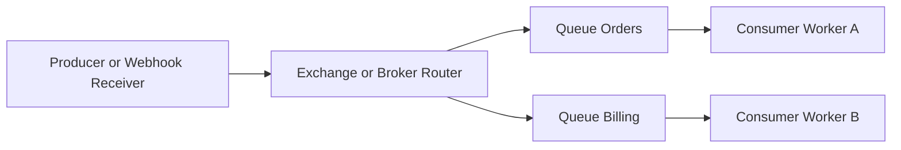

---
topic:
  - Software Architecture
subtopic:
  - Distributed Systems
summary: "Message queues decouple producers from consumers by buffering messages until consumers are ready, absorbing spikes and isolating failures."
tags:
  - FolderNote
publish: true
priority: High
level:
  - "3"
status: Done
---

# Intro

Message queues decouple producers from consumers by buffering messages until consumers are ready. They absorb spikes, isolate failures, and keep systems working when downstream services slow. Use queues for webhook ingestion and background work.

```datacorejsx
const { FolderStructureMap } = await dc.require("Assets/components/devbook-folder-map.jsx");
return FolderStructureMap;
```

## Core concepts

- **Queue vs Topic**
- `Queue` (point-to-point): one message is consumed by one worker in a competing-consumer group.
- `Topic` (pub/sub): one event is consumed by multiple independent subscriber groups.
- Terminology varies: RabbitMQ uses exchanges, Kafka uses topics/partitions, and Service Bus uses subscriptions.



- **Delivery guarantees**
- `At-most-once`: possible loss, no redelivery.
- `At-least-once`: redelivery until ack or policy cutoff (DLQ/TTL), duplicates expected.
- `Effectively-once` for one side effect is usually `at-least-once + idempotency + transactional boundary`.
- End-to-end exactly-once across external systems is generally not realistic.

- **Ordering and partitioning**
- Ordering is usually per partition/queue shard, not global.
- More partitions improve throughput but weaken global order guarantees.
- If per-entity ordering matters (for example `OrderId`), route by a stable key to one partition.
- Retries/redelivery and competing consumers can reorder events.
- Kafka rebalances can cause duplicate processing when offsets were not committed; out-of-order effects usually come from multi-partition reads or concurrent handlers.

## Reliability patterns

- **DLQ for poison messages**
- Use DLQ when messages repeatedly fail and block healthy traffic.
- Broker specifics: Service Bus uses `MaxDeliveryCount`; RabbitMQ uses DLX + TTL/retry queues; Kafka has no broker DLQ and uses an app dead-letter topic.
- Operate DLQ as a first-class system: alerts, replay tooling, retention ownership.

- **Retry with backoff**
- Retry transient failures with exponential backoff + jitter.
- If the broker supports delayed delivery, prefer broker-managed delay; otherwise use retry queues/topics.

- **Idempotency keys**
- Persist a durable idempotency key (`MessageId` or business key).
- Avoid check-then-act; it races. Reserve/upsert key atomically (unique index or transactional insert), then apply side effects.
- Commit business write and idempotency completion in one database transaction; broker ack/offset commit follows after success.

- **Ack modes and offset commits**
- Auto-ack favors throughput but risks loss on mid-processing crashes.
- Manual ack after successful side effects favors correctness.
- RabbitMQ `nack`/requeue and Service Bus `Abandon` cause retry/redelivery; dead-lettering is separate.
- Kafka uses offset commits instead of ack/nack: commit after processing and rely on idempotency for duplicate safety.
- Lock or visibility expiration can also trigger redelivery, so long handlers need lock renewal/extension.

- **Backpressure**
- Limit in-flight work using prefetch/QoS.
- Track queue depth, lag, and oldest-message age to avoid memory and latency collapse.

## .NET worker implementation

[[NET Message Queue Workers]] owns the full receive-handle-acknowledge boundary, including idempotent state changes, bounded retry, shutdown, and dead-letter ordering. The durable rule is short: acknowledge only after the business effect or owned quarantine record is committed.
## .NET platform choices

Use [[RabbitMQ]] for routing-heavy queues and latency-sensitive tasks. Use [[Kafka]] for replayable event streams. Use Azure Service Bus for managed messaging with queues/topics and dead-lettering.

| Option | Strengths | Tradeoffs | Typical .NET fit |
|---|---|---|---|
| [[RabbitMQ]] | Rich routing, easy work queues, low latency | Cluster ops are your responsibility unless managed | Background jobs, webhook pipelines, command dispatch |
| [[Kafka]] | High throughput, durable log, strong replay | Partition model and ops complexity | Event streaming, analytics, event sourcing feeds |
| Azure Service Bus | Fully managed with enterprise messaging features | Cost and platform coupling | Azure-native workflows and integration |
| [[MSMQ]] | Durable, transactional (MSDTC), Windows-native | Windows-only, no containers, legacy; `System.Messaging` absent in .NET 5+ | Existing on-prem Windows systems only |

- `IDistributedCache` is not a queue.
- Cache stores key-value state; queues store ordered work items/events with ack/retry semantics.

## Delivery attempts, processing effects, and idempotency

Broker guarantees describe delivery attempts at a boundary; they do not automatically guarantee business effects. An at-least-once broker may redeliver after a consumer commits `ChargeCustomer` but crashes before acknowledgement. The second attempt is correct broker behavior and a dangerous duplicate unless the charge operation uses a stable idempotency key.

| Broker behavior | Consumer sequence | Result |
|---|---|---|
| At-most-once | Acknowledge, then process | A crash can lose work |
| At-least-once | Process, then acknowledge | A crash can repeat work |
| Transactional broker scope | Atomically consume and publish inside one broker | External database or HTTP effects remain outside that transaction |

For `InvoicePaid { EventId = 91, InvoiceId = 42 }`, reserve `EventId=91` with a unique constraint in the same database transaction that marks invoice 42 paid. A redelivery then observes the completed reservation and acknowledges without applying the transition twice. This produces one durable effect even though delivery was attempted more than once.

## Messaging patterns

Choose a pattern from ownership and fan-out, not from broker terminology:

- **Competing consumers:** several workers share one logical subscription; each message is handled by one worker. Use it to scale image processing.
- **Publish/subscribe:** each subscription receives the event independently. Use it when `OrderPlaced` drives billing, email, and analytics.
- **Request/reply:** a request carries a correlation ID and a reply address. Use it only when asynchronous transport is required but the caller still needs a response; it preserves temporal coupling.
- **Priority queue:** urgent work is selected first. Guard against starvation and do not assume every broker offers strict priority.
- **Dead-letter channel:** terminally failed messages leave the hot path with failure metadata and an owned replay process.
- **Claim check:** store a large payload in object storage and send its identifier, checksum, and authorization context through the broker.

Patterns combine. A video upload can publish a claim-check message to a competing-consumer queue, then emit `VideoProcessed` to multiple subscribers.

## Choosing a broker

![[System Design 101/6cfe944116519663da3149d9783b6dfb18c7051528250a9d2143433efe5446c9.png]]

Choose from replay, routing, ordering, delivery, retention, managed-service, and operating requirements. [[Message Broker Selection]] compares [[Kafka]], [[RabbitMQ]], [[MSMQ]], and managed alternatives without treating broker families as a supersession sequence.
## Pitfalls

- **1) Ordering assumptions across partitions**
- What goes wrong: teams assume global ordering and break business invariants.
- Why: most brokers guarantee order per partition, and retries/prefetch/competing consumers can still reorder work.
- Mitigation: partition by entity key, limit concurrency per key, and make handlers reorder-tolerant.

- **2) Poison messages without DLQ**
- What goes wrong: one bad message retries forever and starves healthy traffic.
- Why: missing dead-letter policy.
- Mitigation: bounded retries plus DLQ routing and alerts.

- **3) At-least-once without idempotency**
- What goes wrong: duplicate charges, emails, or external calls.
- Why: redelivery is expected but handler side effects are not deduplicated.
- Mitigation: durable idempotency keys with atomic reservation.

- **4) Silent queue growth**
- What goes wrong: backlog grows until OOM or latency SLO failure.
- Why: weak observability and missing backpressure/autoscaling.
- Mitigation: alert on depth, oldest-message age, lag, and in-flight count.

## Questions

- **1) In at-least-once processing, how do you prevent loss and duplicate side effects when a consumer crashes?**
- Expected answer:
  - Use manual ack only after successful business commit.
  - If crash happens before ack, rely on broker redelivery.
  - Use atomic idempotency reservation (unique key or transactional insert).
  - Bound retries and route persistent failures to DLQ.

- **2) When do you choose Kafka over RabbitMQ for a .NET service?**
- Expected answer:
  - Choose Kafka for replayable event streams with high throughput.
  - Choose RabbitMQ for low-latency work queues and routing-key patterns.
  - Consider ordering constraints per partition/queue key.
  - Compare operational complexity and team experience.

- **3) Which metrics should page you first in queue-driven systems?**
- Expected answer:
  - Queue depth and age of oldest message.
  - Consumer lag or unacked in-flight count.
  - DLQ rate and retry rate.
  - End-to-end processing latency and failure ratio.

## References

- [RabbitMQ Documentation](https://www.rabbitmq.com/docs) — official queue, exchange, acknowledgement, routing, and operation model.
- [Apache Kafka Documentation](https://kafka.apache.org/documentation/) — official topic, partition, replication, consumer-group, and retention model.
- [Microsoft - Queue-based load leveling](https://learn.microsoft.com/azure/architecture/patterns/queue-based-load-leveling) — pattern for buffering demand so consumers process at a sustainable rate.
- [Microsoft - Service Bus dead-letter queues](https://learn.microsoft.com/azure/service-bus-messaging/service-bus-dead-letter-queues) — official dead-letter reasons, retention, and operator responsibilities.
- [Microsoft - Service Bus locks and settlement](https://learn.microsoft.com/azure/service-bus-messaging/message-transfers-locks-settlement) — official receive-lock, completion, abandonment, and redelivery boundary.
- [RabbitMQ Documentation - Dead Letter Exchanges](https://www.rabbitmq.com/docs/dlx) — official dead-letter routing and policy behavior.
- [RabbitMQ Documentation - Time-to-Live and Expiration](https://www.rabbitmq.com/docs/ttl) — official per-message and per-queue expiration behavior.
- [Martin Kleppmann - Should You Put Several Event Types in the Same Kafka Topic?](https://martin.kleppmann.com/2018/01/18/event-types-in-kafka-topic.html) — tradeoffs for topic boundaries, ordering, and consumer subscription.
- [RabbitMQ consumer acknowledgements](https://www.rabbitmq.com/docs/confirms) — official acknowledgement, redelivery, and publisher-confirm boundaries.
- [Amazon SQS visibility timeout](https://docs.aws.amazon.com/AWSSimpleQueueService/latest/SQSDeveloperGuide/sqs-visibility-timeout.html) — official explanation of redelivery when processing outlives or loses a visibility lease.
- [Azure Architecture Center messaging choices](https://learn.microsoft.com/en-us/azure/architecture/guide/technology-choices/messaging) — requirements-based comparison of queues, streams, and managed messaging services.
- [Enterprise Integration Patterns](https://www.enterpriseintegrationpatterns.com/patterns/messaging/) — canonical definitions for competing consumers, request/reply, dead-letter channel, and claim check.

### ByteByteGo provenance

- [Delivery semantics](https://github.com/ByteByteGoHq/system-design-101/blob/b28380a4710c5ec9638ec037d4168e288f334cba/data/guides/delivery-semantics.md) — editorial lead for separating delivery attempts from durable effects; its misleading visual was rejected.
- [Types of message queue](https://github.com/ByteByteGoHq/system-design-101/blob/b28380a4710c5ec9638ec037d4168e288f334cba/data/guides/types-of-message-queue.md) — provenance for workload-first broker selection; its defective taxonomy visual was rejected.
- [Cloud messaging patterns](https://github.com/ByteByteGoHq/system-design-101/blob/b28380a4710c5ec9638ec037d4168e288f334cba/data/guides/top-6-cloud-messaging-patterns.md) — provenance for the pattern set; its inaccurate visual was rejected.
- [Message queue architecture evolution](https://github.com/ByteByteGoHq/system-design-101/blob/b28380a4710c5ec9638ec037d4168e288f334cba/data/guides/how-do-message-queue-architectures-evolve.md) — provenance for the broker-family visual, explicitly not treated as a supersession sequence.
