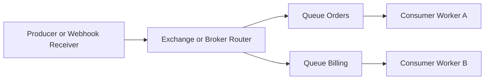

---
topic:
  - Software Architecture
subtopic:
  - Distributed Systems
summary: "Message queues decouple producers from consumers by buffering messages until consumers are ready, absorbing spikes and isolating failures."
tags: [FolderNote]
publish: true
priority: High
level:
  - "2"
status: Done
---

Message queues decouple producers from consumers by buffering messages until consumers are ready. They absorb spikes, isolate failures, and keep systems working when downstream services slow. Use queues for webhook ingestion and background work.

```datacorejsx
const { FolderStructureMap } = await dc.require("Assets/components/devbook-folder-map.jsx");
return FolderStructureMap;
```

# Core Concepts

- **Queue vs Topic**
- `Queue` (point-to-point): one message is consumed by one worker in a competing-consumer group.
- `Topic` (pub/sub): one event is consumed by multiple independent subscriber groups.
- Terminology varies: RabbitMQ uses exchanges, Kafka uses topics/partitions, and Service Bus uses subscriptions.


```mermaid
flowchart LR
    P[Producer or Webhook Receiver] --> E[Exchange or Broker Router]
    E --> Q1[Queue Orders]
    E --> Q2[Queue Billing]
    Q1 --> C1[Consumer Worker A]
    Q2 --> C2[Consumer Worker B]
```

- **Delivery guarantees**
- `At-most-once`: possible loss, no redelivery.
- `At-least-once`: an unacknowledged delivery is retried, so duplicates are expected.
- A bounded retry policy may terminate in an owned DLQ. Retention or TTL expiry is a separate loss boundary, not part of the at-least-once guarantee.
- `Effectively-once` for one side effect is usually `at-least-once + idempotency + transactional boundary`.
- End-to-end exactly-once across external systems is generally not realistic.

- **Ordering and partitioning**
- Ordering is usually per partition/queue shard, not global.
- More partitions improve throughput but weaken global order guarantees.
- If per-entity ordering matters (for example `OrderId`), route by a stable key to one partition.
- Retries/redelivery and competing consumers can reorder events.
- Kafka rebalances can cause duplicate processing when offsets were not committed. Out-of-order effects usually come from multi-partition reads or concurrent handlers.

# Reliability Patterns

- **DLQ for poison messages**
- Use DLQ when messages repeatedly fail and block healthy traffic.
- Broker specifics: Service Bus uses `MaxDeliveryCount`. RabbitMQ uses DLX + TTL/retry queues. Kafka has no broker DLQ and uses an app dead-letter topic.
- Operate DLQ as a first-class system: alerts, replay tooling, retention ownership.

- **Retry with backoff**
- Retry transient failures with exponential backoff + jitter.
- If the broker supports delayed delivery, prefer broker-managed delay. Otherwise use retry queues/topics.

- **Idempotency keys**
- Persist a durable idempotency key (`MessageId` or business key).
- Avoid check-then-act. It races. Reserve/upsert key atomically (unique index or transactional insert), then apply side effects.
- Commit business write and idempotency completion in one database transaction. Broker ack/offset commit follows after success.

- **Ack modes and offset commits**
- Auto-ack favors throughput but risks loss on mid-processing crashes.
- Manual ack after successful side effects favors correctness.
- RabbitMQ `nack`/requeue and Service Bus `Abandon` cause retry/redelivery. Dead-lettering is separate.
- Kafka uses offset commits instead of ack/nack: commit after processing and rely on idempotency for duplicate safety.
- Lock or visibility expiration can also trigger redelivery, so long handlers need lock renewal/extension.

- **Backpressure**
- Limit in-flight work using prefetch/QoS.
- Track queue depth, lag, and oldest-message age to avoid memory and latency collapse.

# .NET Worker Implementation

A worker acknowledges only after the business effect or an owned quarantine record is durable:

```csharp
public sealed class InvoiceWorker(
    IQueueConsumer consumer,
    IInvoiceHandler handler,
    IDeadLetterPublisher deadLetters) : BackgroundService
{
    protected override async Task ExecuteAsync(
        CancellationToken stoppingToken)
    {
        await foreach (var delivery in consumer.ReadAllAsync(stoppingToken))
        {
            try
            {
                await handler.HandleAsync(
                    delivery.Message,
                    stoppingToken);
                await delivery.AckAsync(stoppingToken);
            }
            catch (InvalidMessageException error)
            {
                await deadLetters.PublishAsync(
                    delivery,
                    error.Code,
                    stoppingToken);
                await delivery.AckAsync(stoppingToken);
            }
            catch (TransientDependencyException)
            {
                await delivery.RetryAsync(stoppingToken);
            }
        }
    }
}
```

`HandleAsync` should reserve a unique message or business-operation key in the same transaction as its state change. A crash after that commit but before `AckAsync` then produces a harmless redelivery. Dead-letter or quarantine publication must succeed before the original delivery is acknowledged.

Bound concurrency by downstream capacity, stop intake during shutdown, and track oldest-message age, in-flight count, handler latency, retries, dead-letter rate, and idempotency conflicts. A short queue can still be unhealthy when one old message never completes.
# .NET Platform Choices

Use [[Home/Software Architecture/Distributed Systems/Message Queues/RabbitMQ]] for routing-heavy queues and latency-sensitive tasks. Use [[Home/Software Architecture/Distributed Systems/Message Queues/Kafka]] for replayable event streams. Use Azure Service Bus for managed messaging with queues/topics and dead-lettering.

| Option | Strengths | Tradeoffs | Typical .NET fit |
|---|---|---|---|
| [[Home/Software Architecture/Distributed Systems/Message Queues/RabbitMQ]] | Rich routing, easy work queues, low latency | Cluster operations remain the team's responsibility unless managed | Background jobs, webhook pipelines, command dispatch |
| [[Home/Software Architecture/Distributed Systems/Message Queues/Kafka]] | High throughput, durable log, strong replay | Partition model and ops complexity | Event streaming, analytics, event sourcing feeds |
| Azure Service Bus | Fully managed with enterprise messaging features | Cost and platform coupling | Azure-native workflows and integration |

- `IDistributedCache` is not a queue.
- Cache stores key-value state. Queues store ordered work items/events with ack/retry semantics.

# Delivery Attempts, Processing Effects, and Idempotency

Broker guarantees describe delivery attempts at a boundary. They do not automatically guarantee business effects. An at-least-once broker may redeliver after a consumer commits `ChargeCustomer` but crashes before acknowledgement. The second attempt is correct broker behavior and a dangerous duplicate unless the charge operation uses a stable idempotency key.

| Broker behavior | Consumer sequence | Result |
|---|---|---|
| At-most-once | Acknowledge, then process | A crash can lose work |
| At-least-once | Process, then acknowledge | A crash can repeat work |
| Transactional broker scope | Atomically consume and publish inside one broker | External database or HTTP effects remain outside that transaction |

For `InvoicePaid { EventId = 91, InvoiceId = 42 }`, reserve `EventId=91` with a unique constraint in the same database transaction that marks invoice 42 paid. A redelivery then observes the completed reservation and acknowledges without applying the transition twice. This produces one durable effect even though delivery was attempted more than once.

# Messaging Patterns

Choose a pattern from ownership and fan-out, not from broker terminology:

- **Competing consumers:** several workers share one logical subscription. Each message is handled by one worker. Use it to scale image processing.
- **Publish/subscribe:** each subscription receives the event independently. Use it when `OrderPlaced` drives billing, email, and analytics.
- **Request/reply:** a request carries a correlation ID and a reply address. Use it only when asynchronous transport is required but the caller still needs a response. It preserves temporal coupling.
- **Priority queue:** urgent work is selected first. Guard against starvation and do not assume every broker offers strict priority.
- **Dead-letter channel:** terminally failed messages leave the hot path with failure metadata and an owned replay process.
- **Claim check:** store a large payload in object storage and send its identifier, checksum, and authorization context through the broker.

Patterns combine. A video upload can publish a claim-check message to a competing-consumer queue, then emit `VideoProcessed` to multiple subscribers.

# Choosing a Broker

![[Software Architecture/Software Architecture-Message Queues-18120000.png|theme-aware]]

Choose from replay, routing, ordering, delivery, retention, managed-service, and operating requirements rather than popularity.

| Need | [[Home/Software Architecture/Distributed Systems/Message Queues/RabbitMQ]] classic/quorum queues | [[Home/Software Architecture/Distributed Systems/Message Queues/Kafka]] |
| --- | --- | --- | --- |
| Work distribution | Strong fit with acknowledgements and exchanges | Possible through consumer groups, but retained-log semantics dominate |
| Replay | Consumed messages normally leave the queue. Replay needs republishing or a retained design | Native offset replay within retention |
| Routing | Exchanges, bindings, topics, and headers | Topic and partition selection |
| Ordering | Per queue, affected by redelivery and competing consumers | Per partition |
| Operations | Queue depth, unacked messages, redelivery, node health | Partitions, replication, rebalances, lag, retention |

## RabbitMQ Streams

RabbitMQ Streams adds a replicated append-only log with non-destructive consumers and offset/timestamp replay. A super stream partitions traffic and preserves order only within each partition. Choose Streams when RabbitMQ is already the operational center and the workload needs large fan-out, replay, or large backlogs. Choose Kafka when retained logs, partitioned consumer groups, and its ecosystem are the primary model.

Use RabbitMQ classic or quorum queues for `GenerateInvoice` jobs that need acknowledgements and flexible routing. Use Kafka for `OrderPlaced` events consumed by billing, fraud, analytics, and replayable projections.

Managed services such as Azure Service Bus, Amazon SQS/SNS, and Google Pub/Sub are often better when the team does not want to operate brokers. Compare their exact ordering, deduplication, dead-letter, size, retention, and throughput contracts rather than assuming open-source semantics.

# Pitfalls

## Assuming Global Order

Most brokers guarantee order only within a partition, and retries, prefetch, or competing consumers can still reorder effects. Partition by the entity key when its transitions must stay ordered, limit concurrency for that key, and reject stale versions at the consumer.

## Retrying a Poison Message Forever

A message that always fails can consume worker capacity and starve healthy traffic. Bound retries, move the failure to a dead-letter path, alert its owner, and keep enough metadata to replay it after repair.

## Applying an At-least-once Effect Twice

Redelivery is expected after an acknowledgement is lost. A charge, email, or external call therefore needs a stable idempotency key reserved atomically with the local state change.

## Letting Backlog Age Go Unseen

Queue depth alone hides whether one old message is stuck or fresh traffic is arriving faster than consumers can drain it. Monitor oldest-message age, in-flight work, redelivery, and consumer throughput, then apply backpressure or add capacity before memory or latency limits fail.

# Questions

> [!QUESTION]- How do Kafka and RabbitMQ fit different messaging workloads in a .NET service?
> Kafka fits high-throughput event streams that must be retained and replayed. RabbitMQ fits low-latency work queues and messages that need flexible routing. For either broker, the design still needs a clear ordering boundary, such as a Kafka partition or a RabbitMQ queue, and the decision must include operating cost and the team's experience.

# References

- [Messaging technology choices](https://learn.microsoft.com/en-us/azure/architecture/guide/technology-choices/messaging)
- [Enterprise Integration Patterns](https://www.enterpriseintegrationpatterns.com/patterns/messaging/)
