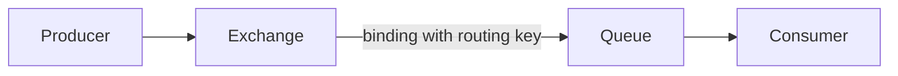

---
topic:
  - Software Architecture
subtopic:
  - Distributed Systems
summary: "Open-source AMQP 0-9-1 broker routing messages from exchanges to queues via bindings, decoupling producers from consumers."
level:
  - "2"
priority: High
status: Done

publish: true
---

RabbitMQ is an open-source broker. This note focuses on its classic and quorum AMQP 0-9-1 queues: producers publish messages to exchanges, which route them into queues for consumers. This extra hop separates the rate of incoming work from the rate at which workers can finish it. In a `[[Home/Software Architecture/Distributed Systems/Webhooks|Webhook]] -> Queue -> Worker` flow, the queue turns a short traffic spike into backlog instead of forcing the webhook endpoint to wait for every job.

Classic and quorum queues fit task queues and request-reply flows, especially when messages need flexible routing or fair distribution across competing workers. They can also fan one publication out to several queues. RabbitMQ Streams add retention and replay, so durable event history is not a boundary of the RabbitMQ ecosystem as a whole.

# AMQP Model

Routing is explicit. A producer publishes to an exchange, and bindings decide which queues receive the message. The default exchange preserves the convenient appearance of publishing directly to a queue, but it still performs exchange routing.



Each part has one job:

- **Producer**: publishes a message.
- **Exchange**: decides routing destination(s).
- **Binding**: connects exchange to queue with a rule.
- **Routing key**: message attribute used in route matching.
- **Queue**: stores messages until consumed.
- **Consumer**: processes and acks or nacks messages.

## Exchange Types

| Type | Rule | Typical use |
| --- | --- | --- |
| Direct | Exact routing key match | Command-style task queues (`order.created`) |
| Fanout | Broadcast to all bound queues | One event consumed by many services |
| Topic | Pattern match with `*` and `#` | Domain events with taxonomy (`order.*`, `payment.#`) |
| Headers | Match message headers | Complex metadata-based routing |

# Delivery Guarantees

RabbitMQ supplies the acknowledgements and persistence controls needed to build a delivery contract. The application still decides when ownership has safely moved and how to handle a repeated delivery.

## At-most-once

With `autoAck: true`, the broker treats a delivery as complete as soon as it sends it. A consumer crash after delivery can therefore lose the message. Publishing without confirms adds another loss window because the producer never learns whether the broker accepted responsibility.

That contract is suitable only when an occasional lost message has little consequence.

## At-least-once

At-least-once closes those loss windows with publisher confirms, a durable queue, persistent messages, and manual consumer acknowledgements. If the consumer or its connection fails before the acknowledgement reaches the broker, RabbitMQ makes the message available again.

Redelivery creates duplicates. A stable message ID and an idempotent consumer are part of the contract, not an optional cleanup step.

## Exactly-once

RabbitMQ does not provide end-to-end exactly-once delivery. Business-level exactly-once behavior comes from controlling side effects with stable deduplication keys. On the publishing side, an outbox keeps the database change and the intent to publish in the same transaction.

## Confirms, Ack, Nack, Reject, DLX

- **Publisher confirms** report whether the broker accepted responsibility for a publication. They say nothing about consumer processing.
- **`BasicAck`** transfers ownership after successful processing, allowing the broker to remove the message.
- **`BasicNack`** reports failed processing and can requeue or dead-letter one or several deliveries.
- **`BasicReject`** rejects one delivery.
- **DLX (Dead Letter Exchange)** receives messages rejected with `requeue: false`, expired by TTL, removed by a queue length limit, or rejected after a quorum queue delivery limit.

# C# Example (`RabbitMQ.Client`)

## Producer

```csharp
using System.Text.Json;
using RabbitMQ.Client;

var factory = new ConnectionFactory { HostName = "localhost" };

await using var connection = await factory.CreateConnectionAsync();
await using var channel = await connection.CreateChannelAsync(
    new CreateChannelOptions(
        publisherConfirmationsEnabled: true,
        publisherConfirmationTrackingEnabled: true));

await channel.ExchangeDeclareAsync("orders.dlx", ExchangeType.Direct, durable: true);
await channel.QueueDeclareAsync(
    queue: "orders.dlq",
    durable: true,
    exclusive: false,
    autoDelete: false,
    arguments: null);
await channel.QueueBindAsync("orders.dlq", "orders.dlx", "orders.failed");

await channel.QueueDeclareAsync(
    queue: "orders",
    durable: true,
    exclusive: false,
    autoDelete: false,
    arguments: new Dictionary<string, object?>
    {
        ["x-dead-letter-exchange"] = "orders.dlx",
        ["x-dead-letter-routing-key"] = "orders.failed"
    });

var order = new Order("ord-1001", "cust-42", 129.50m);
var body = JsonSerializer.SerializeToUtf8Bytes(order);

var props = new BasicProperties
{
    DeliveryMode = 2,
    MessageId = order.OrderId,
    ContentType = "application/json"
};

await channel.BasicPublishAsync(
    exchange: "",
    routingKey: "orders",
    mandatory: true,
    basicProperties: props,
    body: body);

public sealed record Order(string OrderId, string CustomerId, decimal Amount);
```

## Consumer

```csharp
using System.Text.Json;
using RabbitMQ.Client;
using RabbitMQ.Client.Events;

var factory = new ConnectionFactory { HostName = "localhost" };

await using var connection = await factory.CreateConnectionAsync();
await using var channel = await connection.CreateChannelAsync();

await channel.BasicQosAsync(prefetchSize: 0, prefetchCount: 32, global: false);

var consumer = new AsyncEventingBasicConsumer(channel);
consumer.ReceivedAsync += async (_, ea) =>
{
    try
    {
        var order = JsonSerializer.Deserialize<Order>(ea.Body.Span);
        if (order is null)
        {
            await channel.BasicNackAsync(ea.DeliveryTag, multiple: false, requeue: false);
            return;
        }

        await ProcessOrderAsync(order);
        await channel.BasicAckAsync(ea.DeliveryTag, multiple: false);
    }
    catch
    {
        await channel.BasicNackAsync(ea.DeliveryTag, multiple: false, requeue: false);
    }
};

await channel.BasicConsumeAsync(queue: "orders", autoAck: false, consumer: consumer);

await Task.Delay(Timeout.InfiniteTimeSpan);

static Task ProcessOrderAsync(Order order) => Task.CompletedTask;

public sealed record Order(string OrderId, string CustomerId, decimal Amount);
```

This compact consumer treats every failed delivery as terminal, so `requeue: false` routes it through the declared DLX instead of discarding it. Transient retry needs a separate bounded delayed path, such as retry queues/exchanges or a quorum-queue delivery limit, before terminal dead-lettering. Immediate unbounded `requeue: true` can hot-loop a poison delivery.

# Operating the Queue

## Prefetch Count (QoS)

Prefetch caps the number of unacknowledged messages in flight to a consumer. A low value limits the damage from a slow worker but may leave capacity idle. A higher value can improve throughput for I/O-heavy handlers, provided each worker has enough memory and concurrency to process the deliveries it already owns.

## Message TTL

`x-message-ttl` expires work that is no longer useful. When a DLX is configured, expired messages can be routed there for inspection instead of disappearing without evidence.

## Queue Length Limits

`x-max-length` and `x-max-length-bytes` put a hard ceiling on backlog. They protect disk and memory only if the overflow behavior matches the business contract, so queue depth and age still need alerts.

## Disk-backed Classic Queues

The old `lazy` queue mode no longer exists. Since RabbitMQ 3.12, classic queues already keep a small working set in memory and move most queued data to disk. Configuring `x-queue-mode=lazy` is ignored, so capacity planning must use current classic or quorum queue behavior rather than the old latency tradeoff.

## Quorum Queues

Quorum queues replicate a durable FIFO queue through Raft. They are the default choice when queue data must survive a node failure with clear recovery semantics. Classic queue mirroring was removed in RabbitMQ 4.0. Existing installations that depended on it need a migration to quorum queues or streams.

# Pitfalls

## Unbounded Backlog

When producers stay faster than consumers, a queue is delayed failure unless its backlog has a limit. Disk eventually fills, and message age can exceed the time in which the work is useful. TTL and length policies put boundaries around the failure. Alerts on depth and oldest-message age reveal it before the broker runs out of room.

## Acknowledging before the Side Effect

Automatic acknowledgement hands ownership back to the broker before business work finishes. A crash in the gap leaves no message to retry. Manual acknowledgement should follow the durable business side effect, with repeated deliveries handled safely.

## Treating Classic Mirroring as a Current Design

Mirrored classic queues are gone from RabbitMQ 4.x. A system that still assumes their policies or failure behavior has an upgrade blocker, not a supported high-availability design. New replicated queues should use quorum queues. Migrations need to account for their different feature set and resource cost.

## Leaving Prefetch Unbounded

Too much in-flight work can pile up behind one slow consumer while another consumer has room. `BasicQos` makes that ownership window explicit. The right count comes from load tests because handler cost and downstream latency determine whether a value such as `32` is conservative or excessive.

# References

- [RabbitMQ documentation](https://www.rabbitmq.com/docs)
- [RabbitMQ tutorials](https://www.rabbitmq.com/tutorials)
