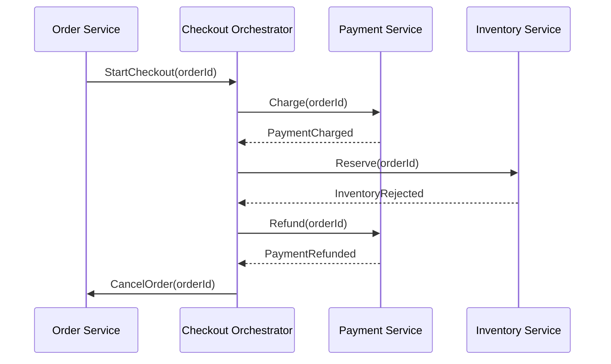

---
topic:
  - Software Architecture
subtopic:
  - Distributed Systems
summary: "Coordinates a multi-service workflow through one component that owns its state, ordering, retries, and compensation decisions."
level:
  - "3"
priority: High
status: Not-Started
publish: true
---

Orchestration coordinates a distributed workflow through an orchestrator that decides which participant acts next. The orchestrator owns the process state and sends commands. Services still own and commit their local business state. It is not a global database transaction, and durable orchestration does not remove eventual consistency.

# Order Workflow

The process record advances only after durable outcomes. If inventory rejects the reservation, the orchestrator records the compensation path, requests a refund, and cancels the order. Commands and replies need stable workflow and message identifiers because timeouts can cause retries after a participant has already succeeded.

# When Orchestration Fits

Orchestration suits workflows whose sequence, deadlines, or current state are part of the business contract. Checkout and account opening are typical examples. The state machine makes the next valid action explicit and gives each workflow instance an audit trail.

The cost is a durable coordination service that every participant depends on. A crashed orchestrator must resume from persisted state. An ambiguous timeout must reconcile the participant's actual outcome before choosing retry or compensation, and a duplicated command must be harmless. Replication removes a process-level single point of failure only when state ownership and fencing are sound.

Observability follows the workflow instance. Persist transitions, propagate trace and causation IDs, and expose stuck-step age, retry counts, and exhausted compensation. Compensation is a business action such as refunding, not a byte-for-byte rollback. Irreversible side effects need an explicit forward recovery.

# Boundary with Choreography

[[Home/Software Architecture/Distributed Systems/Choreography|Choreography]] lets participants react to events without one component deciding the next step. Prefer it for independent fan-out. Prefer orchestration when sequence, deadlines, compensation, or an operator-visible process state are part of the business contract. A workflow can orchestrate `Charge -> Reserve -> Ship` and then publish `OrderCompleted` for choreographed email and analytics reactions.

# References

- [Saga distributed transactions pattern](https://learn.microsoft.com/en-us/azure/architecture/reference-architectures/saga/saga)
- [OpenTelemetry trace semantic conventions](https://opentelemetry.io/docs/specs/semconv/general/trace/)
