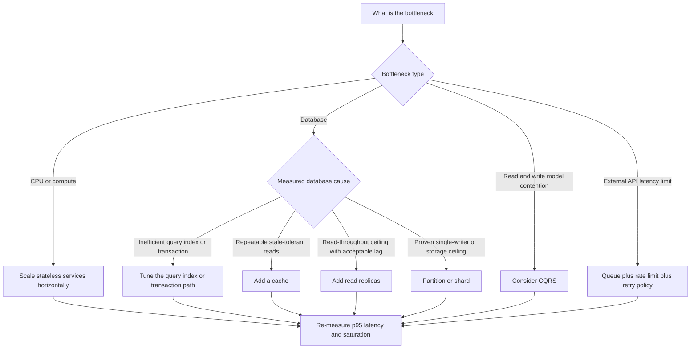

---
topic:
  - Software Architecture
subtopic:
  - Distributed Systems
summary: "A system's ability to keep serving requests as load grows by adding resources."
level:
  - "2"
priority: High
publish: true
tags: [FolderNote]
status: Creation
---

Scalability measures how capacity and unit cost change as load grows and resources are added. A system scales only while it preserves its latency, error, and reliability targets. The question becomes concrete once workload volume, traffic shape, data growth, and the first likely bottleneck are known.

A checkout service growing from 1,000 to 10,000 RPS cannot be designed by repeating "add more servers." The saturated resource determines the next move, and the same workload test must show whether that move increased useful capacity.

```datacorejsx
const { FolderStructureMap } = await dc.require("Assets/components/devbook-folder-map.jsx");
return FolderStructureMap;
```

# Core Patterns

| Pattern | Primary bottleneck addressed | How it helps | Tradeoff and interview caveat |
|---|---|---|---|
| Horizontal scaling (stateless services behind LB, see [[Home/Software Architecture/Distributed Systems/Load Balancing]]) | App CPU and request concurrency | Add service instances behind a load balancer to increase throughput and availability | Stateless handlers are the simplest model. Stateful services require partitioning, replication, and affinity or coordination |
| Database read replicas | Read-heavy relational load | Offload read queries from primary to replicas | Replica lag can break read-after-write expectations |
| Database sharding | Write throughput and dataset size | Partition data by key so writes and storage spread across shards | Rebalancing, cross-shard queries, and hotspot keys add major complexity |
| CQRS (see [[Home/Software Architecture/Patterns/Architectural Patterns/CQRS]]) | Read/write contention with different query needs | Separate write model from read model to optimize each independently | Eventual consistency and projection maintenance must be explicit |
| Caching (see [[Home/Data Persistence/Caching\|Caching]]) | Repeated expensive reads | Serve hot data from in-memory cache to reduce DB/API pressure | Cache invalidation and staleness policy drive correctness risk |
| CDN | Static asset latency and origin egress | Move static content to edge locations close to users | Cache-control mistakes can serve stale or private content |
| Async processing and message queues (see [[Home/Software Architecture/Distributed Systems/Message Queues/Message Queues\|Message Queues]]) | Synchronous dependency latency and burst traffic | Buffer work, decouple producers/consumers, smooth spikes | Requires idempotency, retry policy, and dead-letter handling |
| Connection pooling | Expensive connection setup and DB connection limits | Reuse open connections to reduce handshake cost and limit churn | Pool exhaustion often appears as latency spikes before hard failures |
| Event-Driven Architecture (see [[Home/Software Architecture/System Architecture/Event-Driven Architecture\|Event-Driven Architecture]]) | Tight coupling between services | Publish events so services scale and evolve independently | Ordering, duplication, and schema evolution must be designed upfront |
| Load shedding and rate limiting | Overload collapse during spikes | Reject or defer excess traffic early to protect critical paths | Requires clear priority rules and client retry behavior |

Stateless request handlers are the simplest horizontal-scaling model because any replica can accept the next request. Stateful services can also scale horizontally. They require explicit partition ownership, state replication, and routing affinity or coordination during failover.

Sharding is usually a late move because routing and resharding become permanent operating work. Connection pooling, query and index repair, caching, or read replicas often remove the measured bottleneck at lower cost. CQRS applies when read and write models genuinely diverge. Ordinary CRUD does not justify it.

# Measurement and Bottleneck Migration

![[Software Architecture/Software Architecture-Scalability Patterns-18120000.png|theme-aware]]

The strategies in the visual solve different measured bottlenecks. They are not a checklist. Each evaluation needs an explicit measurement contract:

- **Offered load:** work presented to the system.
- **Throughput:** completed useful work per unit time.
- **Latency:** a distribution such as p50, p95, and p99.
- **Capacity:** highest sustained offered load that still meets latency, error, and resource limits.
- **Saturation:** constrained resource or queue that stops throughput from rising.
- **Scalability:** how capacity and unit cost change after adding resources or changing architecture.

Success is defined before the test: `2x ASP.NET Core instances should deliver at least 1.7x completed checkout throughput, p99 below 400 ms, errors below 0.1%, and database connections below 80% of the limit for 30 minutes`.

At 1,000 RPS, load increases in steps while request rate, completed orders, latency, errors, runtime resources, database contention, dependency latency, and queue age are recorded. If application CPU reaches 85% and throughput rises when instances double, horizontal scale addressed the current bottleneck. If database lock wait dominates at 2,500 RPS, more application replicas now increase contention. One change is applied and measured before the next bottleneck is located.

# Scaling Decision Framework

Telemetry and saturation lead the decision. Architecture fashion does not.



# .NET Operating Guidance

`dotnet-counters` supplies runtime counters, OpenTelemetry records request and dependency signals, and the database exposes wait and query telemetry. A low application CPU value does not prove spare capacity when threads are blocked on connections. Platform scaling features help only when their signal matches the saturated resource. CPU-based autoscaling does not fix a database lock or third-party quota.

Cost per completed operation matters more than instance count. Cache, replicas, queues, and sharding move cost into invalidation, replication, backlog, and routing. A rollback threshold limits changes that worsen tail latency or errors. The same workload runs after every change because the bottleneck moves.

# Tradeoffs

| Choice | Better when | Worse when |
|---|---|---|
| Vertical vs horizontal app scaling | Immediate capacity and low migration risk dominate | Single-node ceiling and blast radius become dominant |
| Read replicas vs caching for reads | Queries are complex and freshness matters more than latency | Cache hit ratio is high and stale-tolerant reads dominate |
| Sharding vs larger primary DB | Write throughput and data size exceed one node limits | Team is small and cross-shard operations are frequent |
| Sync calls vs queue-based async | User needs immediate result and latency budget allows it | Dependency is slow or rate-limited and bursty traffic is expected |

# Pitfalls

1. **Scaling before finding the real bottleneck**
   More application instances do not reduce p95 when database locks, connection saturation, or an external quota controls throughput. Record the baseline, identify the saturated resource, and scale that component first.

2. **Premature sharding**
   Shard routing, cross-shard queries, and resharding become permanent operating work. Repair indexes and queries, then consider read replicas, caching, partitioning, or queueing before splitting the write store.

3. **Stateful services that cannot scale horizontally**
   Sticky sessions and per-node state create uneven load and complicate failover. External session storage can keep request handlers stateless. Intrinsic state instead needs partitioning, replication, and affinity or coordination.

4. **Ignoring database bottlenecks while scaling app tier**
   More application instances generate more database work. If database CPU, locks, or connection limits are already saturated, failures arrive faster. Profile queries, repair indexes, tune pools, and add read replicas where their consistency is acceptable before scaling the application tier.

# References

- [Design to scale out](https://learn.microsoft.com/azure/architecture/guide/design-principles/scale-out)
- [Using load shedding to avoid overload](https://aws.amazon.com/builders-library/using-load-shedding-to-avoid-overload/)
