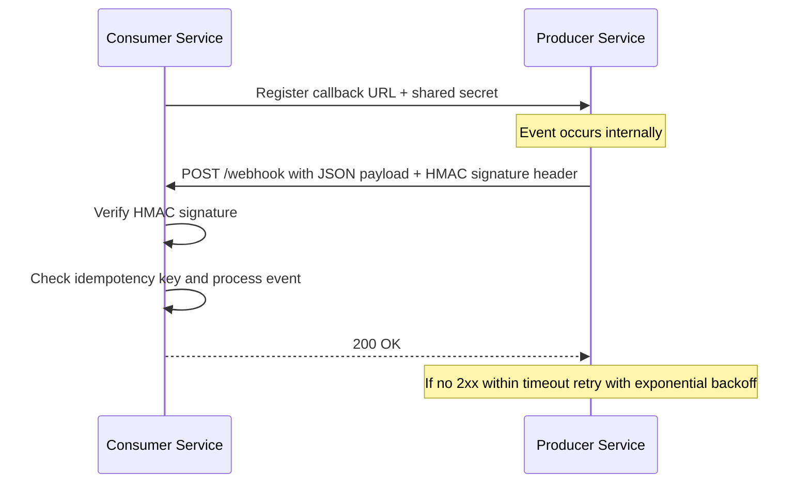

---
topic:
  - Software Architecture
subtopic:
  - Distributed Systems
summary: "An HTTP callback: a producer POSTs event data to a consumer's pre-registered URL, inverting polling into near real-time push."
level:
  - "2"
priority: Medium
status: Done
publish: true
---

# Intro

A webhook is an HTTP callback: when an event occurs in a producer system, it sends an HTTP POST with event data to a URL the consumer registered in advance. This inverts the communication direction compared to polling — instead of the consumer repeatedly asking "anything new?", the producer pushes notifications in near real-time. You reach for webhooks when you need low-latency, push-based integration between systems that communicate over HTTP, especially across organizational boundaries where shared message brokers are impractical (payment providers, source control platforms, SaaS integrations).

The mechanism is straightforward: the consumer registers a callback URL with the producer, optionally negotiating a shared secret for signature verification. When the producer detects a relevant event, it serializes a payload (usually JSON), signs it with HMAC-SHA256 using the shared secret, and sends an HTTP POST to the registered URL. The consumer validates the signature, processes the payload, and returns `200 OK` to acknowledge receipt. If the producer receives no success response within a timeout, it retries with exponential backoff.

Webhooks complement [[Event-Driven Architecture]] — they are the HTTP-native way to deliver events between systems that do not share a message broker. For internal service-to-service communication within the same platform, [[Home/Software Architecture/Distributed Systems/Message Queues/Message Queues|Message Queues]] are usually a better fit because they provide built-in durability, fan-out, and back-pressure.

## ASP.NET Core receiver

[[ASP.NET Core Webhook Receivers]] owns the implementation boundary: authenticate the provider's exact raw request bytes, validate timestamp/replay policy, deduplicate under a durable unique key, commit inbox or queue work, then return success. Parsing and reserializing JSON before HMAC verification changes the signed bytes.

## Polling interval versus durable webhook delivery contract

![[System Design 101/3381182ee93536fc7fa7f386859a9d426c239e650375751c49b5ca6d196d7b49.png]]

The visual shows the direction difference, not a reliability guarantee. Polling can be cheap when the interval is long or conditional requests return no body; webhooks can be expensive when retries storm or endpoints are slow.

| Question | Polling | Webhook |
|---|---|---|
| Freshness | Bounded by the interval plus API latency | Usually near real-time, bounded by delivery and retry delay |
| Missed changes | Fetch from a durable source cursor or `updated_since` window | Producer must retain deliveries or expose replay/reconciliation |
| Duplicate work | Overlapping windows repeat records | At-least-once retries repeat events |
| Load owner | Consumer chooses interval and batch size | Producer controls fan-out and retry schedule |
| Failure recovery | Resume from cursor after outage | Replay by event ID, dead-letter inspection, or reconciliation poll |

A durable webhook contract needs more than `POST`:

1. Sign the exact body plus a timestamp and identify the signing key version.
2. Assign a stable event or delivery ID and document retry and ordering scope.
3. Retry transient failures with bounded exponential backoff and jitter; do not retry permanent `4xx` failures blindly.
4. Require the receiver to persist the event before returning success and process it idempotently.
5. Expose delivery logs, manual replay, retention, timeout, and terminal failure behavior.
6. Provide a cursor-based list API so consumers can reconcile gaps after outages.

For an hourly billing export, polling may be simpler and more controllable. For `PaymentCaptured`, use a signed webhook for low latency, then poll `GET /events?after=<cursor>` periodically as a correctness safety net. Push handles the common path; pull repairs the gaps.

## Tradeoffs: Webhooks vs Polling vs SSE vs WebSockets

| Approach | Direction | Latency | Complexity | Connection | Best fit |
| --- | --- | --- | --- | --- | --- |
| **Webhooks** | Push (server to server) | Near real-time | Moderate (retry, signatures, idempotency) | Per-event HTTP request | Cross-org integrations, SaaS event delivery |
| **Polling** | Pull (consumer to producer) | Interval-bound delay | Low | Stateless per-request | Simple integrations, systems without webhook support |
| **SSE** | Push (server to browser) | Real-time | Low | Long-lived HTTP stream | One-directional browser notifications, dashboards |
| **WebSockets** | Bidirectional | Real-time | High (connection management, scaling) | Persistent TCP | Chat, collaborative editing, real-time bidirectional flows |

Decision heuristic:

- Pick **webhooks** for server-to-server push across trust boundaries (Stripe payment events, GitHub repository events, CRM notifications).
- Pick **polling** when the producer has no webhook support, or when near real-time latency is not required and simplicity matters most.
- Pick **SSE** when you need server-to-browser push without the complexity of WebSockets.
- Pick **WebSockets** when you need bidirectional real-time communication (client sends and receives).

## Pitfalls

### 1) At-Least-Once Delivery Without Idempotency

- **What goes wrong**: the producer retries after a timeout and the consumer processes the same event twice — double-charging a payment, sending duplicate notifications, or creating duplicate records.
- **Why it happens**: network timeouts, producer retries, and load balancer replays mean the same webhook may arrive more than once. Exactly-once delivery over HTTP is not achievable.
- **Mitigation**: use the delivery ID (e.g., `X-GitHub-Delivery`, Stripe `event.id`) as an idempotency key. Store processed IDs in durable storage and check before processing. Make state transitions conditional (`UPDATE ... WHERE status = 'pending'`).

### 2) Slow Processing Causes Timeout and Retry Storm

- **What goes wrong**: the consumer does heavy work synchronously in the webhook handler, exceeds the producer's timeout (typically 5-30 seconds), and triggers retries that compound the load.
- **Why it happens**: inline database writes, external API calls, or computation in the request path.
- **Mitigation**: authenticate and durably store the inbox/queue record, then return `2xx` without running downstream business work inline. A background worker performs the business logic.

### 3) Missing or Weak Signature Verification

- **What goes wrong**: an attacker sends forged webhook payloads to the endpoint, triggering unauthorized actions (fraudulent refunds, fake deployment triggers, data manipulation).
- **Why it happens**: the endpoint accepts any POST without verifying the HMAC signature, or uses a non-constant-time comparison vulnerable to timing attacks.
- **Mitigation**: always verify HMAC signatures using constant-time comparison. Reject requests with missing or invalid signatures. Add timestamp validation to prevent replay attacks (reject payloads older than 5 minutes).

### 4) Endpoint Availability and Missed Events

- **What goes wrong**: if the consumer is down during delivery and the producer exhausts its retry budget, events are permanently lost.
- **Why it happens**: webhook producers typically retry for a limited window (hours to days) and then give up.
- **Mitigation**: implement a reconciliation mechanism — periodically poll the producer's event API to detect gaps. Monitor webhook delivery metrics. Some producers offer event replay or dead-letter inspection (use them).

## Questions

> [!QUESTION]- How do you design webhook consumers to prevent event loss and duplicate processing?
> Verify the HMAC over the provider's exact raw bytes and validate its signed timestamp. Store the provider event ID and inbox/queue payload durably before returning `2xx`, then process it idempotently in a worker. Since the producer can exhaust its retry window while the consumer is unavailable, reconcile against the provider's event-list API or replay facility.

> [!QUESTION]- When would you choose webhooks over a shared message broker for inter-service event delivery?
> Webhooks win when you cross an organizational boundary — a SaaS or third-party provider you don't control can't publish into your broker, but it can POST to a URL. Inside your own platform a message broker is usually better: durable fan-out, back-pressure, replay, and per-key ordering that raw HTTP callbacks don't give you. They aren't exclusive, though — the common pattern is to receive external webhooks at the edge and immediately republish them onto an internal broker, so you get HTTP reach at the boundary and broker guarantees everywhere inside.

> [!QUESTION]- How do you protect a webhook endpoint against replay attacks?
> Sign a timestamp alongside the payload — in the body or as a signed header — and reject anything outside a tight window, say older than five minutes, so a captured request can't be replayed later. The HMAC has to cover both the payload and the timestamp together, or an attacker just swaps one without invalidating the signature. Inside the window, your idempotency key (the delivery ID) still catches a fast replay. Signature proves authenticity, the timestamp bounds the replay window, idempotency handles what slips through.

## References

- [Validating webhook deliveries (GitHub Docs)](https://docs.github.com/en/webhooks/using-webhooks/validating-webhook-deliveries) — Official guide to HMAC-SHA256 signature verification for GitHub webhooks, with language-specific examples.
- [Webhook best practices (GitHub Docs)](https://docs.github.com/en/webhooks/using-webhooks/best-practices-for-using-webhooks) — Production checklist: respond fast, use async processing, handle redeliveries, monitor failures.
- [Check webhook signatures (Stripe Docs)](https://docs.stripe.com/webhooks#verify-official-libraries) — Stripe's approach to webhook security including timestamp-based replay protection.
- [Building reliable webhooks (Stripe Engineering Blog)](https://stripe.com/blog/webhooks) — Practitioner deep-dive on designing webhook infrastructure at scale: retries, idempotency, and failure modes.
- [CloudEvents HTTP Webhook Specification (CNCF)](https://github.com/cloudevents/spec/blob/main/cloudevents/http-webhook.md) — Vendor-neutral CNCF standard for webhook delivery, including the OPTIONS-based subscription handshake and abuse protection.
- [Standard Webhooks](https://www.standardwebhooks.com/) — Open specification for webhook signing, verification, and delivery semantics backed by Svix, aiming to standardize webhook behavior across providers.
- [Asynchronous messaging options (Microsoft Learn)](https://learn.microsoft.com/azure/architecture/guide/technology-choices/messaging) — Azure architecture guide comparing webhooks, queues, event hubs, and event grid for event delivery.
- [Retry pattern (Azure Architecture Center)](https://learn.microsoft.com/azure/architecture/patterns/retry) — Canonical guidance on retry strategies with exponential backoff, directly applicable to webhook sender retry loops.
- [Polling versus webhooks](https://github.com/ByteByteGoHq/system-design-101/blob/b28380a4710c5ec9638ec037d4168e288f334cba/data/guides/polling-vs-webhooks.md) — ByteByteGo provenance for the direction comparison; resource and reliability claims are qualified by the delivery contract.
