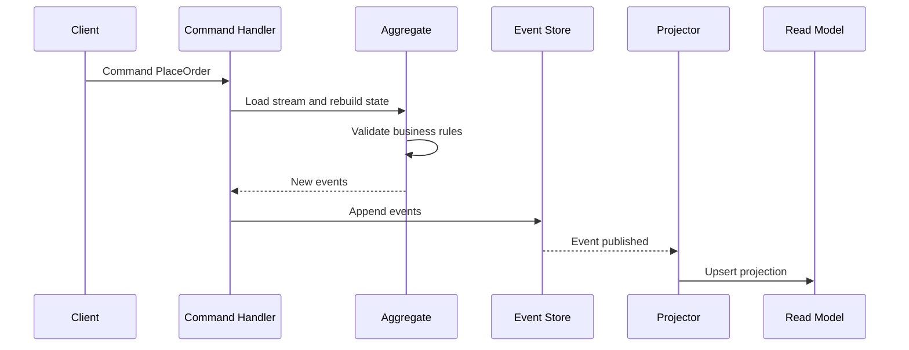

---
topic:
  - Software Architecture
subtopic:
  - Patterns
summary: "Event Sourcing stores each aggregate's state as an ordered stream of domain events instead of only the latest snapshot."
level:
  - "2"
priority: High
status: Done

publish: true
---

# Intro

Event Sourcing stores each aggregate's state as an ordered stream of domain events instead of saving only the latest row snapshot. That event history gives you a built-in audit trail, enables temporal queries like "what did we believe at 10:15 yesterday", and allows replay when you need to rebuild read models or recover from projection bugs. You usually reach for it when business value depends on immutable history, traceability, and intent-level debugging, not just current state reads. In .NET systems, it often appears together with [[CQRS]] so writes persist events and reads consume projections optimized for query use cases.

## Mechanism
### Core flow
1. A command reaches the write model (`PlaceOrder`, `AddItem`, `ShipOrder`).
2. The aggregate loads its prior event stream and replays events to rebuild current in-memory state.
3. Business invariants are validated against that rebuilt state.
4. New domain event(s) are appended to an append-only event store.
5. Projection handlers consume appended events and update one or more read models.
### Why append-only matters
- **Immutability**: old facts are never updated in place, so history stays trustworthy.
- **Auditability**: every state transition is explainable by concrete business events.
- **Temporal analysis**: you can rehydrate state as-of a version or timestamp.
- **Operational recovery**: if a projection is corrupted, rebuild it by replaying events.
### State reconstruction by replay
At load time, you fetch events for a stream (for example `order-123`) and apply them in sequence.
- `OrderPlaced` creates base state.
- `ItemAdded` mutates line items and totals.
- `OrderShipped` flips lifecycle status and shipment metadata.
Your aggregate is deterministic if applying the same ordered events always yields the same state.
### Projections and read models
Write-side aggregates enforce invariants; read-side models optimize querying.
- A projection can build `OrderSummary` for dashboard lookups.
- Another projection can build `RevenueByDay` for analytics.
- A third can drive search indexing.
Read models are disposable when they are derived only from replayable event history and can be rebuilt deterministically.
### Snapshots

Snapshots cache aggregate state at a known stream version so loading can replay only the tail. They are disposable performance artifacts, not the source of truth. [[Event Store Operations]] owns snapshot compatibility, projection rebuilds, checkpoints, and replay isolation.
### Request-to-projection sequence

## Event Sourcing vs CRUD

CRUD stores the latest accepted state. Event Sourcing stores the ordered facts that produced it. For an order changing from `Pending` to `Paid` to `Shipped`, a CRUD row answers "what is the status now?" An event stream also answers when each transition happened, which command caused it, and what the state was at an earlier revision.

![[System Design 101/b5745367294e9ee1ae1ec3ed8c12ee79c27c489c00dfc9a9d4d6f6a9443103f8.jpg]]

The image's rebuild arrow is conditional, not automatic. Replay is trustworthy only when events have a stable order, handlers are deterministic, historical schemas remain readable through versioning or upcasters, and projections isolate external side effects. If replay calls today's tax API or reads the current clock, the same stream can produce a different result. Snapshots shorten replay but do not replace the event stream as the source of truth.

| Question | CRUD state store | Event-sourced store |
|---|---|---|
| What is persisted? | Current row or document | Ordered immutable domain events |
| How is current state loaded? | Read the latest value | Replay events, usually from a snapshot plus the tail |
| How is history obtained? | Separate audit/history mechanism | Native stream, if events preserve business meaning |
| How is a read model repaired? | Recompute from available current data or backups | Replay into a new deterministic projection |
| Main operational risk | Lost history and in-place update mistakes | Schema evolution, replay cost, and projection lag |

## .NET aggregate example

[[Event-Sourced Aggregate in NET]] contains the replayable `Order` aggregate, its command invariants, uncommitted-event handling, and the expected-version append boundary. Keeping the implementation separate leaves this note focused on when an event stream should be the source of truth.

## Event Sourcing + CQRS
Event Sourcing and [[CQRS]] solve different concerns and complement each other well.
- **Write side**: command handlers persist validated domain events to the event store.
- **Bridge**: those events become the integration boundary between write and read models.
- **Read side**: projectors consume events and maintain query-optimized denormalized views.
You can do CQRS without Event Sourcing, and Event Sourcing without strict CQRS separation, but pairing them usually gives the cleanest model when auditability and replay are first-class requirements.

## Where Event Sourcing Fits

Use Event Sourcing at an aggregate boundary when the event stream is the authoritative record of state transitions. Do not infer Event Sourcing merely because a system publishes events:

- **Event Sourcing** appends domain facts such as `OrderPlaced` and rebuilds aggregate state from that ordered stream.
- **Change Data Capture** reads mutations from a conventional database log. The database row remains the source of truth; the log is an integration feed.
- **Event notification** tells consumers that something changed, often requiring a callback to fetch current state.
- **Event-carried state transfer** includes enough state for consumers to update local copies, but the producer may still persist ordinary CRUD rows.
- **Integration events** cross bounded contexts. They are stable public contracts and need not match the finer-grained events used inside an event-sourced aggregate.

For a payment ledger, immutable state transitions and temporal reconstruction can justify Event Sourcing. For a product description edited occasionally, CRUD plus an audit table is usually cheaper. For a CRUD order service that emits `OrderUpdated` through an outbox, the outbox makes delivery reliable; it does not change the order database into an event store.

## Operating boundary

Event schema evolution, stream growth, projection lag, checkpoints, and replay side effects are operational concerns covered by [[Event Store Operations]]. The core rule here is that the ordered event stream remains authoritative and aggregate replay remains deterministic.
## Tradeoffs
| Concern | Event Sourcing | Traditional CRUD |
|---|---|---|
| Source of truth | Immutable event history | Latest row/document state |
| Auditability | Native, complete timeline | Usually add separate audit table/log |
| Temporal queries | Natural via replay/as-of version | Hard, often requires custom history model |
| Write complexity | Higher: events, versions, projections | Lower: direct update/insert/delete |
| Read complexity | Higher with projection pipeline | Lower for straightforward queries |
| Operational model | Needs idempotency/replay tooling | Simpler operational story |
Decision rule: prefer CRUD by default; choose Event Sourcing only when immutable audit history, temporal reconstruction, or replay-based recovery are explicit and valuable requirements.

## Questions
> [!QUESTION]- When does Event Sourcing justify its complexity over CRUD plus an audit-log table?
> - CRUD + audit table can satisfy compliance for many systems with lower operational overhead.
> - Event Sourcing is justified when domain behavior depends on historical intent and replay, not only final values.
> - If you need deterministic rebuild of multiple read models, Event Sourcing is stronger.
> - If temporal queries are frequent and core to product value, Event Sourcing can pay off.
> - If team maturity for schema evolution and projection operations is low, choose CRUD first.
> - The honest default is CRUD plus an audit table; Event Sourcing earns its cost only when replay and historical intent are core to the product, not merely compliance.

> [!QUESTION]- How do you evolve event schemas safely without breaking old streams?
> - Use explicit event versioning strategy.
> - Prefer backward-compatible additive changes.
> - Introduce upcasters/adapters for old payloads.
> - Keep integration tests that replay production-like historical streams.
> - Treat event contracts as long-lived public interfaces.
> - Schema evolution is the most common production failure mode in event-sourced systems — especially when teams skip compatibility testing across historical streams.
## References
- [Event Sourcing - Greg Young FAQ](https://cqrs.nu/faq/event-sourcing) — primary practitioner FAQ on streams, replay, and event-sourced aggregates.
- [SimpleCQRS - Greg Young sample repository](https://github.com/gregoryyoung/m-r) — compact reference implementation of command handling, aggregates, event streams, and projections.
- [Event Sourcing pattern - Azure Architecture Center](https://learn.microsoft.com/azure/architecture/patterns/event-sourcing) — Microsoft guidance on append-only events, projections, snapshots, and consistency costs.
- [CQRS pattern - Azure Architecture Center](https://learn.microsoft.com/azure/architecture/patterns/cqrs) — official separation of command and query models and their consistency consequences.
- [Event Sourcing - Martin Fowler](https://martinfowler.com/eaaDev/EventSourcing.html) — foundational definition and discussion of replay, temporal queries, and external updates.
- [Turning the database inside out with Apache Samza - Martin Kleppmann](https://www.confluent.io/blog/turning-the-database-inside-out-with-apache-samza/) — practitioner explanation of logs, materialized views, replay, and state reconstruction.
- [Differences in Event Sourcing system design -- ByteByteGo comparison of current-state persistence and event-history reconstruction](https://github.com/ByteByteGoHq/system-design-101/blob/b28380a4710c5ec9638ec037d4168e288f334cba/data/guides/differences-in-event-sourcing-system-design.md)
- [How do we incorporate Event Sourcing into systems? -- ByteByteGo flow used here to distinguish an authoritative event store from CDC and integration messaging](https://github.com/ByteByteGoHq/system-design-101/blob/b28380a4710c5ec9638ec037d4168e288f334cba/data/guides/how-do-we-incorporate-event-sourcing-into-the-systems.md)
