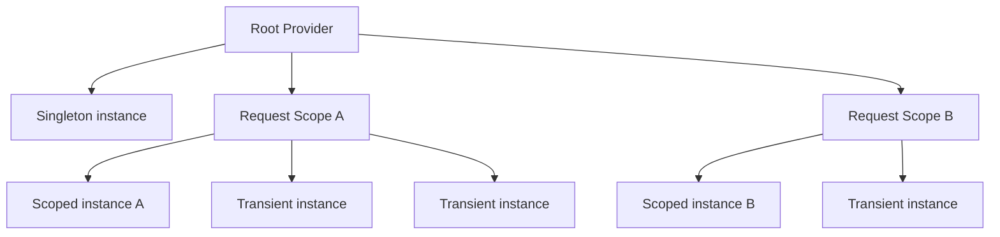

---
topic:
  - Software Architecture
subtopic:
  - Patterns
summary: "A pattern where objects receive dependencies from an external source instead of creating them, a practical form of Inversion of Control."
level:
  - "4"
priority: High
status: Done
publish: true
---

Dependency Injection (DI) moves object construction to a composition boundary. A class declares the services it needs, and something outside the class supplies them. This is a practical form of Inversion of Control (IoC): business code describes the collaboration while the application decides which implementations participate. The result is explicit dependencies and components that can be replaced without rewriting their consumers.

DI does not require a container. The composition root is the application startup boundary, typically `Program.cs` in .NET, where object graphs are assembled. It may connect objects directly with constructors and factories or delegate that work to a container. ASP.NET Core uses its built-in container at this boundary. [[Home/Programming/NET/ASP.NET Web API/Dependency Injection|ASP.NET Core Dependency Injection]] covers the framework-specific mechanics.

# How It Works
The container has three jobs: record registrations, build object graphs, and release the instances it owns.

## 1) Registration (`builder.Services.Add*`)

Registration says which implementation satisfies a service type and how long its instances live.

```csharp
var builder = WebApplication.CreateBuilder(args);

// Registration
builder.Services.AddScoped<IOrderRepository, SqlOrderRepository>();
builder.Services.AddSingleton<IClock, SystemClock>();
builder.Services.AddTransient<IEmailSender, SmtpEmailSender>();
```

Each call adds a service descriptor containing the service type, its implementation, and its lifetime. Registration usually records a recipe. It does not create the service yet.

## 2) Resolution (Constructor Injection, `[FromServices]`, `IServiceProvider`)

Resolution follows constructor dependencies recursively and builds the required object graph.

```csharp
public class OrderService(IOrderRepository repo, IClock clock)
{
    public async Task<Order> PlaceOrder(CreateOrderDto dto)
    {
        var order = new Order(dto.CustomerId, clock.UtcNow);
        await repo.SaveAsync(order);
        return order;
    }
}
```

```csharp
app.MapGet("/time", ([FromServices] IClock clock) => Results.Ok(clock.UtcNow));
```

Constructor injection fits business logic because the constructor exposes every required collaborator. `[FromServices]` is useful at framework boundaries such as endpoint handlers. Direct `IServiceProvider` access belongs in factories, middleware, or infrastructure code that manages scopes. Application and domain services should keep their dependencies visible.

## 3) Disposal

The container disposes the `IDisposable` and `IAsyncDisposable` instances it creates at their lifetime boundary:

- `Transient`: disposed when the owning scope is disposed (if container-created)
- `Scoped`: disposed when the scope ends (request end in ASP.NET Core)
- `Singleton`: disposed when host/root provider shuts down

An injected service is not owned by its consumer, so a controller or application service should not dispose it.

# Service Lifetimes (Mechanics + Usage)

## Transient

`AddTransient<TService, TImpl>()`: new instance every resolution.

Good fits include:

- Lightweight stateless services
- Pure mappers/formatters/strategies without cross-request state

The important mechanics are simple:

- Every resolve call gets a fresh instance.
- A transient captured by a singleton constructor remains attached to that singleton and effectively gains the singleton's lifetime.

## Scoped

`AddScoped<TService, TImpl>()`: one instance per scope.

Good fits include:

- `DbContext`
- Unit-of-work/request-consistent operations

Within a web application:

- ASP.NET Core creates one scope per HTTP request.
- All scoped resolutions in the same request share the same object.
- Background services have no request scope, so scoped work needs an explicit scope.

## Singleton

`AddSingleton<TService, TImpl>()`: one instance for app lifetime.

Good fits include:

- Thread-safe caches
- Configuration/time abstractions
- `IHttpClientFactory` (factory is singleton)

The lifetime changes the design constraints:

- The root provider owns the instance and shares it across requests.
- Concurrent callers require thread-safe behavior.
- Capturing a scoped dependency breaks the shorter lifetime.

# Lifetime Scope Diagram



The root provider owns the singleton. Each request scope gets its own scoped instance, while transient services are created on demand.

# Captive Dependency (Critical Pitfall)

Captive dependency occurs when a long-lived service, usually a singleton, stores a shorter-lived service such as a scoped dependency.

That capture breaks the shorter lifetime's guarantees:

- Request state can cross its intended boundary.
- A shared `DbContext` may expose stale tracking state to concurrent work.
- Cleanup moves from the end of the scope to the end of the longer lifetime.

ASP.NET Core's default Development configuration enables scope validation, which rejects a scoped service resolved from the root provider or injected into a singleton with `InvalidOperationException`.

## Anti-pattern: Singleton Directly Depends on Scoped Service

```csharp
public sealed class CacheWarmupService(AppDbContext db) : IHostedService
{
    public async Task StartAsync(CancellationToken cancellationToken)
    {
        // BAD: hosted service is singleton, AppDbContext is scoped
        var count = await db.Orders.CountAsync(cancellationToken);
    }

    public Task StopAsync(CancellationToken cancellationToken) => Task.CompletedTask;
}
```

## Fix: Resolve the Scoped Service inside an Explicit Scope

```csharp
public sealed class CacheWarmupService(IServiceScopeFactory scopeFactory) : IHostedService
{
    public async Task StartAsync(CancellationToken cancellationToken)
    {
        await using var scope = scopeFactory.CreateAsyncScope();
        var db = scope.ServiceProvider.GetRequiredService<AppDbContext>();
        var count = await db.Orders.CountAsync(cancellationToken);
    }

    public Task StopAsync(CancellationToken cancellationToken) => Task.CompletedTask;
}
```

# Service Locator Anti-pattern

Service Locator replaces declared dependencies with runtime lookups from `IServiceProvider` (`GetService<T>()` or `GetRequiredService<T>()`).

Inside business logic, this causes three concrete problems:

- The constructor no longer describes what the class needs.
- Missing registrations fail during execution rather than when the object graph is checked.
- Unit tests must reproduce container setup instead of passing collaborators directly.

```csharp
public sealed class CheckoutService(IServiceProvider provider)
{
    public async Task ProcessAsync()
    {
        var repo = provider.GetRequiredService<IOrderRepository>();
        var sender = provider.GetRequiredService<IEmailSender>();
        await repo.SaveChangesAsync();
        await sender.SendAsync("done");
    }
}
```

Application and business services should declare their collaborators in constructors.

Runtime lookup still has a narrow place:

- Factory patterns choosing implementation at runtime
- Middleware/infrastructure activation code
- Explicit scope management in background jobs

# Keyed Services (.NET 8+)

Keyed services register several implementations of one abstraction under distinct keys. The key makes the selection explicit at the resolution boundary.

```csharp
builder.Services.AddKeyedScoped<ICache, RedisCache>("redis");
builder.Services.AddKeyedScoped<ICache, MemoryCacheAdapter>("memory");

app.MapGet("/cache/ping", ([FromKeyedServices("redis")] ICache cache) =>
{
    return Results.Ok(new { cache = cache.GetType().Name, status = "ok" });
});
```

Keys work well when the set of choices is small and stable. Once domain code starts branching on strings and resolving services itself, the design has slipped back toward Service Locator.

# Pitfalls

## 1) Registering `DbContext` as Singleton

`DbContext` is a short-lived unit of work and is not thread-safe. A singleton registration shares its change tracker across concurrent operations and delays cleanup. Keep the default scoped registration from `AddDbContext<TContext>()`. Workers should create a scope per operation.

## 2) Circular Dependencies (`A -> B -> A`)

The container cannot construct a graph in which `A` requires `B` and `B` requires `A`. The cycle usually exposes a confused responsibility boundary. Break it by moving the shared work to one side or by replacing the direct callback with a message.

# Tradeoffs

- **Built-in or external container:** the built-in container covers the normal lifetime and constructor-injection model with no extra operational surface. An external container earns its place only when a required feature is missing.
- **Constructor injection or runtime resolution:** constructor injection keeps dependencies visible and makes tests ordinary object construction. Method injection (`[FromServices]`) fits endpoint boundaries, while locator-style resolution stays in infrastructure.

# Questions

> [!QUESTION]- Explain `Transient`, `Scoped`, and `Singleton` lifetimes with a safe production example each.
> The lifetime controls how long the container reuses an instance:
> - **Transient:** one instance per resolution, suitable for a lightweight stateless mapper.
> - **Scoped:** one instance per scope. In ASP.NET Core, a scoped `DbContext` gives one request a coherent unit of work.
> - **Singleton:** one instance for the application lifetime, suitable for a thread-safe cache or `IClock`.
> Lifetime is a shared-state decision, not a performance setting. A singleton cannot safely capture a scoped service.

> [!QUESTION]- What is a captive dependency, and how do you fix it?
> A captive dependency appears when a longer-lived service stores a shorter-lived one, classically an `IHostedService` holding a scoped `DbContext`. The scoped object escapes its boundary, so request state may leak across work and disposal happens too late. Scope validation catches this configuration when enabled. The repair is to inject `IServiceScopeFactory`, create a short scope for the operation, resolve the scoped service inside it, and dispose the scope when the operation ends.

# References

- [Dependency injection in .NET](https://learn.microsoft.com/en-us/dotnet/core/extensions/dependency-injection)
