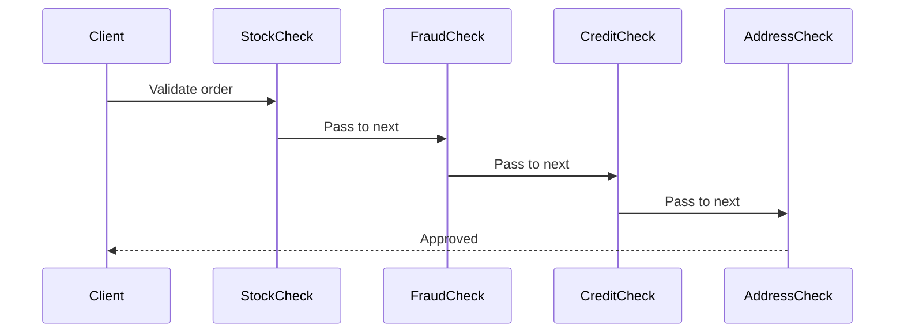

---
topic:
  - Software Architecture
subtopic:
  - Patterns
summary: "Passes a request along a chain of handlers, each deciding to process it or forward it to the next."
level:
  - "3"
priority: High
status: Ready to Repeat
publish: true
---

Airport security behaves like a Chain of Responsibility. A bag moves through a fixed sequence of checkpoints. Each one clears it, rejects it, or passes it forward. A new check can be inserted without rewriting the existing stations, and the passenger has no reason to know which checkpoint will stop the process.

The pattern sends a request through ordered handlers. A handler can finish the request, reject it, or call the next handler. The sender sees one entry point and stays independent of the handler count. ASP.NET Core middleware follows this shape: `app.UseAuthentication()` → `app.UseAuthorization()` → `app.UseRateLimiting()` → endpoint.



# Problem

`OrderValidator` owns every check in one `Validate()` method. Stock, fraud, credit, and address rules now change together:

```csharp
public class OrderValidator
{
    private readonly IInventoryService _inventory;
    private readonly IFraudDetectionService _fraud;
    private readonly ICreditService _credit;
    private readonly IAddressVerificationService _address;

    // ⚠️ One method owns all validation logic — grows with every new check
    public async Task<ValidationResult> ValidateAsync(Order order)
    {
        // ⚠️ Stock check
        foreach (var item in order.Items)
        {
            if (!await _inventory.IsAvailableAsync(item.ProductId, item.Quantity))
                return ValidationResult.Fail($"Product {item.ProductId} out of stock");
        }

        // ⚠️ Fraud check — different logic, same method
        var fraudScore = await _fraud.GetScoreAsync(order.Customer.Id, order.Total);
        if (fraudScore > 0.8m)
            return ValidationResult.Fail("Order flagged for fraud review");

        // ⚠️ Credit check — only for B2B orders, but the condition is buried here
        if (order.IsBusinessOrder)
        {
            var creditLimit = await _credit.GetAvailableCreditAsync(order.Customer.Id);
            if (order.Total > creditLimit)
                return ValidationResult.Fail("Insufficient credit limit");
        }

        // ⚠️ Address verification — adding sanctions list check means editing this method
        var addressValid = await _address.VerifyAsync(order.ShippingAddress);
        if (!addressValid)
            return ValidationResult.Fail("Invalid shipping address");

        return ValidationResult.Success();
    }
}
```

A sanctions-list requirement forces another edit to `ValidateAsync`. Unrelated validation logic shares the same change surface.

# Solution

Each validation rule becomes a handler. The composition root fixes their order, while each class owns one decision:

```csharp
public record ValidationContext(Order Order, List<string> Errors);

// Handler interface
public abstract class OrderValidationHandler
{
    private OrderValidationHandler? _next;

    public OrderValidationHandler SetNext(OrderValidationHandler next)
    {
        _next = next;
        return next; // ✅ fluent chaining: stock.SetNext(fraud).SetNext(credit).SetNext(address)
    }

    public async Task<bool> HandleAsync(ValidationContext context)
    {
        if (!await ValidateAsync(context))
            return false; // ✅ short-circuit — stop chain on failure

        return _next is null || await _next.HandleAsync(context);
    }

    protected abstract Task<bool> ValidateAsync(ValidationContext context);
}

// Concrete handlers — each focused on one concern
public class StockCheckHandler(IInventoryService inventory) : OrderValidationHandler
{
    protected override async Task<bool> ValidateAsync(ValidationContext ctx)
    {
        foreach (var item in ctx.Order.Items)
        {
            if (!await inventory.IsAvailableAsync(item.ProductId, item.Quantity))
            {
                ctx.Errors.Add($"Product {item.ProductId} out of stock");
                return false;
            }
        }
        return true;
    }
}

public class FraudCheckHandler(IFraudDetectionService fraud) : OrderValidationHandler
{
    protected override async Task<bool> ValidateAsync(ValidationContext ctx)
    {
        var score = await fraud.GetScoreAsync(ctx.Order.Customer.Id, ctx.Order.Total);
        if (score > 0.8m)
        {
            ctx.Errors.Add("Order flagged for fraud review");
            return false;
        }
        return true;
    }
}

public class CreditCheckHandler(ICreditService credit) : OrderValidationHandler
{
    protected override async Task<bool> ValidateAsync(ValidationContext ctx)
    {
        if (!ctx.Order.IsBusinessOrder) return true; // ✅ skip non-B2B orders cleanly

        var available = await credit.GetAvailableCreditAsync(ctx.Order.Customer.Id);
        if (ctx.Order.Total > available)
        {
            ctx.Errors.Add($"Insufficient credit: {ctx.Order.Total:C} requested, {available:C} available");
            return false;
        }
        return true;
    }
}

public class AddressVerificationHandler(IAddressVerificationService address) : OrderValidationHandler
{
    protected override async Task<bool> ValidateAsync(ValidationContext ctx)
    {
        if (!await address.VerifyAsync(ctx.Order.ShippingAddress))
        {
            ctx.Errors.Add("Invalid or undeliverable shipping address");
            return false;
        }
        return true;
    }
}

// ✅ Adding sanctions check = new handler class, zero changes to existing handlers
public class SanctionsCheckHandler(ISanctionsService sanctions) : OrderValidationHandler
{
    protected override async Task<bool> ValidateAsync(ValidationContext ctx)
    {
        if (await sanctions.IsOnListAsync(ctx.Order.Customer.Id))
        {
            ctx.Errors.Add("Customer is on sanctions list");
            return false;
        }
        return true;
    }
}

// Composition — chain built in DI or composition root
public class OrderValidationPipeline(
    StockCheckHandler stock,
    FraudCheckHandler fraud,
    CreditCheckHandler credit,
    AddressVerificationHandler address,
    SanctionsCheckHandler sanctions)
{
    private readonly OrderValidationHandler _chain = BuildChain(stock, fraud, credit, address, sanctions);

    private static OrderValidationHandler BuildChain(params OrderValidationHandler[] handlers)
    {
        for (int i = 0; i < handlers.Length - 1; i++)
            handlers[i].SetNext(handlers[i + 1]);
        return handlers[0];
    }

    public Task<bool> ValidateAsync(Order order) =>
        _chain.HandleAsync(new ValidationContext(order, []));
}
```

The sanctions check is added as one handler and one composition change. Existing rule implementations stay closed.

# Middleware and Handler Pipelines

**ASP.NET Core Middleware pipeline** is the clearest .NET example. Each middleware calls `await next(context)` or returns early. Startup builds the chain once, then every request traverses it.

**`DelegatingHandler` in `HttpClient`** forms another chain. Authentication and resilience handlers continue through `base.SendAsync(request, cancellationToken)` or stop with their own response.

**MediatR `IPipelineBehavior<TRequest, TResponse>`** wraps a request handler in ordered behaviors. Calling `next()` continues. Returning directly short-circuits.

**Polly `ResiliencePipeline`** composes resilience strategies around an operation. The same chain shape appears, although the handlers govern execution attempts rather than business ownership.

# Pitfalls

**Chain ordering bugs.** Handler order is a business rule. A credit lookup before fraud screening performs needless work on a request that may be rejected. Keep the order visible in one composition root.

**Requests reaching no handler.** A request may fall off the end and disappear. A terminal handler should define that outcome. Validation pipelines often treat the absence of a rejection as success, which must be an explicit contract.

**Swallowed errors in async chains.** Converting every exception into `false` destroys failure context. A chain should use result values for expected rejection and reserve exceptions for failed processing. Mixing the two makes diagnosis guesswork.

# Tradeoffs

| Concern | Chain of Responsibility | Monolithic method |
|---|---|---|
| Adding a new check | New handler class, zero changes | Edit existing method |
| Handler ordering | Explicit at composition | Implicit in method body |
| Short-circuiting | Each handler decides independently | Nested if/else |
| Testability | Each handler tested independently | Must test all checks together |
| Tracing a request | Follow the chain | Single method, easier to trace |

Chain of Responsibility pays off when several ordered handlers can accept or reject the same request and the set changes independently. One or two fixed checks belong in a plain method. A growing run of `else if` branches is usually the first useful warning.

# Questions

> [!QUESTION]- How does ASP.NET Core Middleware differ from a classical Chain of Responsibility?
> Classical CoR usually links handler objects directly. ASP.NET Core composes middleware delegates into one request pipeline at startup. That pipeline is fixed after the application is built, while a conventional object chain may be rearranged at runtime. The practical boundary is startup composition versus runtime mutation.

# References

- [Chain of Responsibility pattern](https://refactoring.guru/design-patterns/chain-of-responsibility)
