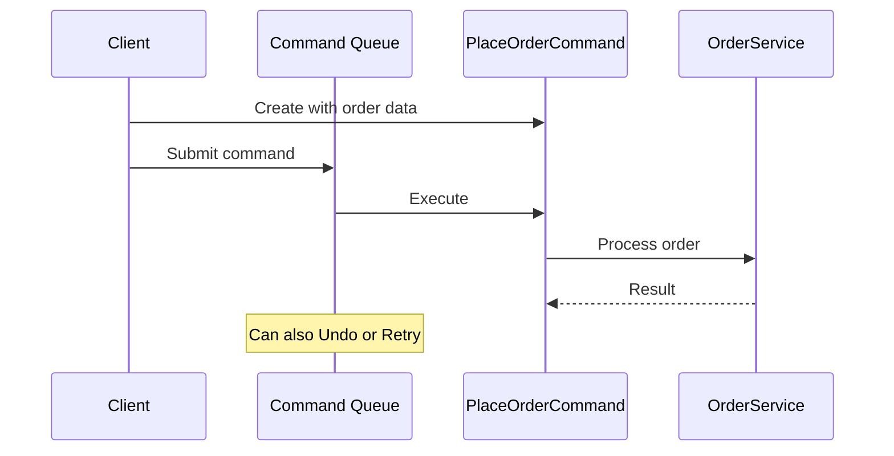

---
topic:
  - Software Architecture
subtopic:
  - Patterns
summary: "Encapsulates a request as an object bundling action, parameters, and receiver, so it can be queued, logged, undone, and replayed."
level:
  - "2"
priority: High
status: Done
publish: true
---

A restaurant ticket is a command in paper form. It records the requested meal, waits in the kitchen queue, and tells the chef what to prepare. The waiter does not cook and the chef does not take the order. The ticket keeps the request separate from its execution.

The Command pattern represents a request as an object containing the action and its input. An invoker calls `Execute()` without knowing the receiver or the implementation. Once a request has object identity, it can enter a queue, an audit log, or a retry policy. Some commands also carry enough state to undo or compensate for the operation.



> [!NOTE] Command vs Strategy
> **Command** represents work to perform, including the input needed for that invocation. [[Home/Software Architecture/Patterns/Design Patterns/Behavioral/Strategy]] represents an interchangeable way to perform a kind of work. A `PlaceOrderCommand` carries one order request. A `ShippingCostStrategy` supplies a reusable calculation.

# Problem

`OrderService` exposes operations directly. There is no object to queue, record, or place in an undo history:

```csharp
public class OrderService
{
    // ⚠️ No undo — once placed, can't roll back without a separate cancel call
    public async Task PlaceOrderAsync(Order order)
    {
        await _repository.SaveAsync(order);
        await _inventory.ReserveAsync(order.Items);
        await _payment.ChargeAsync(order.Total, order.Customer.PaymentMethod);
    }

    // ⚠️ No record of who cancelled, when, or why
    public async Task CancelOrderAsync(Guid orderId)
    {
        var order = await _repository.GetAsync(orderId);
        order.Status = OrderStatus.Cancelled;
        await _repository.UpdateAsync(order);
        await _inventory.ReleaseAsync(order.Items);
        await _payment.RefundAsync(order.PaymentTransactionId, order.Total);
    }

    // ⚠️ Retry logic scattered — if refund fails, caller must retry manually
    public async Task RefundOrderAsync(Guid orderId, decimal amount) { /* ... */ }
}
```

An "undo last action" feature needs both the executed request and its reversal. The service calls leave neither behind.

# Solution

Each operation becomes a command with `ExecuteAsync()` and, where meaningful, `UndoAsync()`:

```csharp
// Command interface
public interface IOrderCommand
{
    Task ExecuteAsync();
    Task UndoAsync();
    string Description { get; } // for audit trail
}

// Concrete commands
public class PlaceOrderCommand(
    Order order,
    IOrderRepository repository,
    IInventoryService inventory,
    IPaymentService payment) : IOrderCommand
{
    private string? _transactionId;

    public string Description => $"Place order #{order.Id} for {order.Total:C}";

    public async Task ExecuteAsync()
    {
        await repository.SaveAsync(order);
        await inventory.ReserveAsync(order.Items);
        _transactionId = await payment.ChargeAsync(order.Total, order.Customer.PaymentMethod);
        order.Status = OrderStatus.Paid;
        await repository.UpdateAsync(order);
    }

    public async Task UndoAsync()
    {
        // ✅ Undo knows exactly what to reverse
        if (_transactionId is not null)
            await payment.RefundAsync(_transactionId, order.Total);
        await inventory.ReleaseAsync(order.Items);
        order.Status = OrderStatus.Cancelled;
        await repository.UpdateAsync(order);
    }
}

public class CancelOrderCommand(
    Guid orderId,
    string reason,
    IOrderRepository repository,
    IInventoryService inventory,
    IPaymentService payment) : IOrderCommand
{
    private Order? _cancelledOrder;

    public string Description => $"Cancel order #{orderId}: {reason}";

    public async Task ExecuteAsync()
    {
        _cancelledOrder = await repository.GetAsync(orderId);
        _cancelledOrder.Status = OrderStatus.Cancelled;
        _cancelledOrder.CancellationReason = reason;
        await repository.UpdateAsync(_cancelledOrder);
        await inventory.ReleaseAsync(_cancelledOrder.Items);
        await payment.RefundAsync(_cancelledOrder.PaymentTransactionId, _cancelledOrder.Total);
    }

    public async Task UndoAsync()
    {
        if (_cancelledOrder is null) return;
        _cancelledOrder.Status = OrderStatus.PaymentPending;
        await repository.UpdateAsync(_cancelledOrder);
        await inventory.ReserveAsync(_cancelledOrder.Items);
        // The refund already completed; a successful new charge can move the order to Paid.
    }
}

// In-memory invoker for one UI session; it is not a durable workflow engine
public class OrderCommandInvoker
{
    private readonly Stack<IOrderCommand> _history = new();
    private readonly ICommandAuditLog _auditLog;

    public OrderCommandInvoker(ICommandAuditLog auditLog) => _auditLog = auditLog;

    public async Task ExecuteAsync(IOrderCommand command)
    {
        await command.ExecuteAsync();
        _history.Push(command);
        await _auditLog.RecordAsync(command.Description, DateTime.UtcNow); // ✅ automatic audit trail
    }

    public async Task UndoLastAsync()
    {
        if (_history.TryPeek(out var command))
        {
            await command.UndoAsync();
            await _auditLog.RecordAsync($"UNDO: {command.Description}", DateTime.UtcNow);
            _history.Pop();
        }
    }
}

// Usage
var placeCommand = new PlaceOrderCommand(order, repository, inventory, payment);
await invoker.ExecuteAsync(placeCommand);

// Customer service agent undoes the last action
await invoker.UndoLastAsync();
```

A `PartialRefundCommand` can use the same invoker and audit path. Only its execution and compensation rules are new.

This in-memory history fits a local UI action whose execution and undo each complete as one owned operation. Command represents a request; it does not make the save, inventory reservation, charge, or audit write atomic. A production workflow with partial external effects needs durable command state, stable idempotency keys, and saga-style compensation or forward recovery. An outbox makes the resulting messages durable. Recovery must record progress before executing the next side effect, because a failure before `_history.Push` leaves this sketch with nothing to undo.

# Commands in UI, Messaging, and Data Access

**`ICommand` (WPF/MAUI)** exposes `Execute(parameter)` and `CanExecute(parameter)`. A bound button knows when it may invoke the command, but it does not know the operation behind it.

**MediatR `IRequest<T>` with a handler** separates request data from execution. `PlaceOrderCommand` carries intent and the handler performs the work. The mediator supplies dispatch.

**`IDbCommand` / `SqlCommand`** packages a SQL statement with its parameters and connection. Execution can be delayed until the caller chooses to run it.

**`Action<T>` / `Func<T>` delegates** are lightweight commands when a named type, serialization, and undo are unnecessary. `Task.Run(() => ProcessOrder(order))` queues behavior together with captured input.

# Questions

> [!QUESTION]- How does MediatR implement the Command pattern, and what does it add?
> `PlaceOrderCommand` carries the request, while `PlaceOrderCommandHandler` owns execution. MediatR routes between them and can wrap handlers with pipeline behaviors. That indirection is useful when dispatch and shared policies matter across many requests. A direct service call remains clearer for a small, fixed interaction.

# References

- [Command pattern](https://refactoring.guru/design-patterns/command)
- [Command Pattern — Christopher Okhravi](https://www.youtube.com/watch?v=9qA5kw8dcSU&list=PLrhzvIcii6GNjpARdnO4ueTUAVR9eMBpc&index=7)
