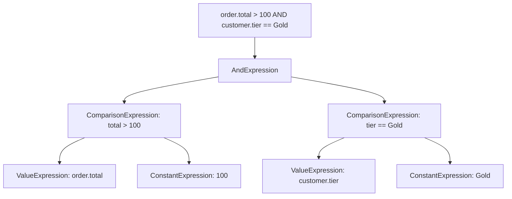

---
topic:
  - Software Architecture
subtopic:
  - Patterns
summary: "Defines a grammar for a language and an interpreter that evaluates sentences, composing complex expressions from simpler ones."
level:
  - "3"
priority: High
status: Ready to Repeat
publish: true
---

A calculator interprets `2 + 3 * 4` by parsing the expression into a tree and walking that tree according to precedence rules. Each node represents a grammar construct. LINQ providers use the same broad mechanism: a lambda supplied as an expression tree becomes data that a provider can inspect and translate.

The Interpreter pattern gives a small language an executable representation. Grammar rules become expression types, and an interpreter evaluates those expressions against a context. Composite expressions build larger rules from smaller nodes: `AndExpression` contains two children, while `ComparisonExpression` evaluates one condition. In .NET, expression trees and `IQueryable<T>` are the production form most engineers meet. A provider walks the tree and translates the nodes into its target query language.



# Problem

`DiscountService` hardcodes every promotion rule. Even a new combination of existing conditions requires code and deployment:

```csharp
public class DiscountService
{
    // ⚠️ Every new promotion rule requires a code change and deployment
    public decimal CalculateDiscount(Order order)
    {
        decimal discount = 0m;

        // ⚠️ "10% off orders over $100" — hardcoded
        if (order.Total > 100m)
            discount += order.Total * 0.10m;

        // ⚠️ "Free shipping for Gold members" — hardcoded
        if (order.Customer.Tier == CustomerTier.Gold)
            discount += order.ShippingCost;

        // ⚠️ "Buy 2 get 1 free on Electronics" — hardcoded
        var electronicsItems = order.Items.Where(i => i.Product.Category == "Electronics").ToList();
        if (electronicsItems.Count >= 2)
        {
            var cheapest = electronicsItems.MinBy(i => i.UnitPrice);
            if (cheapest is not null) discount += cheapest.UnitPrice;
        }

        // ⚠️ Marketing wants "20% off for Silver members on orders over $200 placed on weekends"
        // That's a new deployment just to add a rule
        return discount;
    }
}
```

Marketing cannot configure a promotion because the rules exist only as branches in compiled code.

# Solution

A small discount language moves conditions into expression objects evaluated at runtime:

```csharp
// Evaluation context — the data available to expressions
public class DiscountContext
{
    public Order Order { get; init; } = null!;
    public Customer Customer { get; init; } = null!;
}

// Expression interface
public interface IDiscountExpression
{
    bool Evaluate(DiscountContext context);
}

// Terminal expressions — leaf nodes
public class OrderTotalGreaterThan(decimal threshold) : IDiscountExpression
{
    public bool Evaluate(DiscountContext ctx) => ctx.Order.Total > threshold;
}

public class CustomerTierEquals(CustomerTier tier) : IDiscountExpression
{
    public bool Evaluate(DiscountContext ctx) => ctx.Customer.Tier == tier;
}

public class OrderDayOfWeek(DayOfWeek day) : IDiscountExpression
{
    public bool Evaluate(DiscountContext ctx) => ctx.Order.CreatedAt.DayOfWeek == day;
}

// Non-terminal expressions — composite nodes
public class AndExpression(IDiscountExpression left, IDiscountExpression right) : IDiscountExpression
{
    public bool Evaluate(DiscountContext ctx) =>
        left.Evaluate(ctx) && right.Evaluate(ctx); // ✅ recursive evaluation
}

public class OrExpression(IDiscountExpression left, IDiscountExpression right) : IDiscountExpression
{
    public bool Evaluate(DiscountContext ctx) =>
        left.Evaluate(ctx) || right.Evaluate(ctx);
}

public class NotExpression(IDiscountExpression operand) : IDiscountExpression
{
    public bool Evaluate(DiscountContext ctx) => !operand.Evaluate(ctx);
}

// Discount rule — pairs a condition expression with a discount action
public class DiscountRule
{
    public string Name { get; init; } = "";
    public IDiscountExpression Condition { get; init; } = null!;
    public Func<DiscountContext, decimal> CalculateDiscount { get; init; } = null!;
}

// Rule engine — evaluates rules against a context
public class DiscountRuleEngine(IEnumerable<DiscountRule> rules)
{
    public decimal CalculateTotalDiscount(Order order, Customer customer)
    {
        var context = new DiscountContext { Order = order, Customer = customer };
        return rules
            .Where(r => r.Condition.Evaluate(context)) // ✅ interpret each rule
            .Sum(r => r.CalculateDiscount(context));
    }
}

// Developers compose the rule set in startup code
var rules = new[]
{
    new DiscountRule
    {
        Name = "10% off orders over $100",
        Condition = new OrderTotalGreaterThan(100m),
        CalculateDiscount = ctx => ctx.Order.Total * 0.10m
    },
    new DiscountRule
    {
        Name = "20% off for Silver members on weekend orders over $200",
        // ✅ Compose existing expression types into a new rule
        Condition = new AndExpression(
            new AndExpression(
                new CustomerTierEquals(CustomerTier.Silver),
                new OrderTotalGreaterThan(200m)),
            new OrExpression(
                new OrderDayOfWeek(DayOfWeek.Saturday),
                new OrderDayOfWeek(DayOfWeek.Sunday))),
        CalculateDiscount = ctx => ctx.Order.Total * 0.20m
    }
};

// Deployment-free rules require a serializable AST or parser plus allowlisted actions
```

As written, developers compose these expression objects in startup code, so changing the rule set still requires deployment. Deployment-free rules need a serializable AST or parser plus an allowlist of available fields and discount actions. The example demonstrates interpretation and composition only.

# Expression Trees and Runtime Expression Engines

**LINQ Expression Trees with EF Core `IQueryable<T>`** provide a familiar .NET example. `dbContext.Orders.Where(o => o.Total > 100 && o.Customer.Tier == CustomerTier.Gold)` records the predicate as an expression tree. EF Core visits the supported nodes and emits SQL such as `WHERE Total > 100 AND CustomerTier = 2`. A custom method fails translation when the provider has no rule for that node.

**`Regex`** evaluates a regular-expression language against an input string. `Regex.IsMatch(input, pattern)` supplies the sentence and the evaluation context in one call.

**Roslyn scripting (`CSharpScript.EvaluateAsync`)** accepts C# text at runtime, compiles it, and executes it against supplied globals. Its language and attack surface are far broader than a purpose-built rule DSL.

**NCalc / DynamicExpresso** evaluate mathematical or C#-like expressions from strings. They remove parser work but still require a deliberate policy for which operations and values are exposed.

# Pitfalls

**Repeated tree walking.** Interpreting the same deep expression for every request adds per-call overhead. When profiling shows it matters, compile the tree to a delegate and cache that delegate. Compilation moves cost to setup and uses more memory.

**Grammar growth.** A few boolean and comparison rules stay manageable. Once precedence, diagnostics, and richer syntax appear, use a parser that produces an AST. A hand-written chain of string splits will collapse under edge cases.

**Untrusted expressions.** General-purpose scripting turns configuration into code execution. User-authored rules should use a restricted grammar with an allowlist of operations and fields. Input sanitization alone is not a security boundary.

# Tradeoffs

| Concern | Interpreter | Hardcoded rules | External rules engine (NCalc, Drools) |
|---|---|---|---|
| Adding a new rule | Developer composes existing expression types | Code change + deployment | Configure through the engine's supported format |
| Performance | Slower (tree traversal) | Fastest (compiled) | Depends on engine |
| Rule complexity | Limited by grammar | Unlimited | Depends on engine |
| Debugging | Hard (runtime evaluation) | Easy (debugger) | Engine-specific tooling |
| Dependencies | None | None | External library/service |

Interpreter fits a small language represented as data. Stable rules are clearer as ordinary code. Rules can change independently of application releases only when their AST and allowed actions can be stored and loaded safely. Otherwise developers still compose them in code.

# Questions

> [!QUESTION]- How does EF Core use LINQ Expression Trees as an Interpreter?
> The `Queryable.Where` overload accepts an `Expression<Func<Order, bool>>`, so the compiler represents the lambda as a tree instead of only emitting an executable delegate. EF Core examines supported nodes, builds a database query, and parameterizes captured values. A custom method fails when no translator handles its expression node.

> [!QUESTION]- What's the difference between Interpreter and Strategy for runtime rule selection?
> Strategy selects among algorithms already written in code. Interpreter evaluates a rule represented as data. Strategy suits a closed set of implementations. Interpreter suits combinations that must be authored or changed without compiling a new strategy class.

# References

- [Interpreter — original pattern definition](https://www.amazon.com/Design-Patterns-Elements-Reusable-Object-Oriented/dp/0201633612)
- [Expression trees](https://learn.microsoft.com/en-us/dotnet/csharp/advanced-topics/expression-trees/)
- [How EF Core translates LINQ to SQL — Microsoft Learn](https://learn.microsoft.com/en-us/ef/core/querying/how-query-works)
