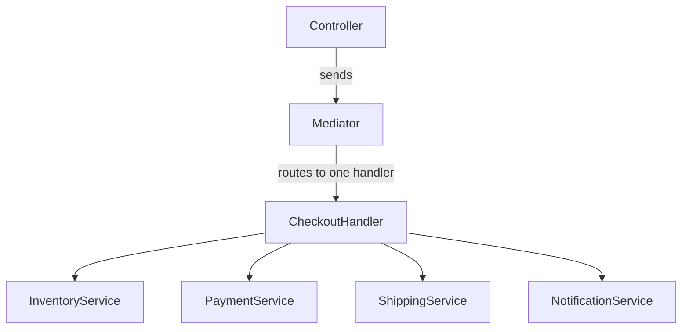

---
topic:
  - Software Architecture
subtopic:
  - Patterns
summary: "Defines an object that encapsulates how a set of components interact, replacing a many-to-many dependency web with one-to-many routing."
level:
  - "1"
priority: High
status: Ready to Repeat
publish: true
---

Air traffic control is a useful Mediator analogy. Pilots coordinate through the tower instead of maintaining direct conversations with every aircraft nearby. A new plane joins one coordination system rather than a web of peer relationships.

The classic Mediator pattern places interaction rules behind one coordination boundary. Colleague objects notify the mediator, which decides which other colleagues should react. This turns a many-to-many dependency graph into hub-and-spoke coordination.

MediatR uses the same decoupling direction for request dispatch, but it is a narrower mechanism: `IMediator.Send(command)` resolves one handler, and that handler owns the workflow. It does not coordinate a set of peer colleagues by itself.



# Problem

`CheckoutController` coordinates four services directly. That makes the transport layer the owner of the checkout workflow:

```csharp
[ApiController]
public class CheckoutController(
    IInventoryService inventory,
    IPaymentService payment,
    IShippingService shipping,
    INotificationService notification) : ControllerBase
{
    // ⚠️ Controller knows about all services and their coordination
    [HttpPost]
    public async Task<IActionResult> CheckoutAsync(CheckoutRequest request)
    {
        if (!await inventory.CheckStockAsync(request.Items))
            return BadRequest("Out of stock");

        var paymentResult = await payment.ChargeAsync(request.Total, request.PaymentMethod);
        if (!paymentResult.Success) return BadRequest("Payment failed");

        var shipment = await shipping.CreateLabelAsync(request.Items, request.Address);
        await notification.SendConfirmationAsync(request.CustomerId, shipment.TrackingNumber);

        return Ok(new { shipment.TrackingNumber });
    }
    // ⚠️ Adding analytics tracking requires editing this controller
    // ⚠️ Mobile API controller duplicates the same coordination logic
}
```

Fraud detection must then be added to every transport that copied this sequence. The workflow has no single owner.

# Solution

The controller sends `CheckoutCommand`. One handler owns the service coordination:

```csharp
// Command — data only, no behavior
public record CheckoutCommand(
    Guid CustomerId,
    IReadOnlyList<OrderItem> Items,
    Address ShippingAddress,
    PaymentMethod PaymentMethod) : IRequest<CheckoutResult>;

public record CheckoutResult(string TrackingNumber);

// Handler — knows how to process the command
public class CheckoutCommandHandler(
    IInventoryService inventory,
    IPaymentService payment,
    IShippingService shipping,
    INotificationService notification) : IRequestHandler<CheckoutCommand, CheckoutResult>
{
    public async Task<CheckoutResult> Handle(CheckoutCommand cmd, CancellationToken ct)
    {
        // ✅ Coordination logic in one place — all callers use the same handler
        if (!await inventory.CheckStockAsync(cmd.Items))
            throw new OutOfStockException();

        var paymentResult = await payment.ChargeAsync(cmd.Items.Sum(i => i.Total), cmd.PaymentMethod);
        if (!paymentResult.Success)
            throw new PaymentFailedException(paymentResult.Reason);

        var shipment = await shipping.CreateLabelAsync(cmd.Items, cmd.ShippingAddress);
        await notification.SendConfirmationAsync(cmd.CustomerId, shipment.TrackingNumber);

        return new CheckoutResult(shipment.TrackingNumber);
    }
}

// ✅ Controller has one dependency — IMediator
[ApiController]
public class CheckoutController(IMediator mediator) : ControllerBase
{
    [HttpPost]
    public async Task<IActionResult> CheckoutAsync(CheckoutRequest request)
    {
        try
        {
            var result = await mediator.Send(new CheckoutCommand(
                request.CustomerId, request.Items, request.Address, request.PaymentMethod));
            return Ok(result);
        }
        catch (OutOfStockException) { return BadRequest("Out of stock"); }
        catch (PaymentFailedException ex) { return BadRequest(ex.Message); }
    }
}

// DI registration
builder.Services.AddMediatR(cfg => cfg.RegisterServicesFromAssembly(typeof(Program).Assembly));
```

Cross-cutting fraud screening can sit in a pipeline behavior shared by every relevant command. The controller stays an adapter.

# In-Process Dispatch and Message Routing

**MediatR `IMediator`** is request dispatch related to Mediator. It routes `Send(command)` to one registered `IRequestHandler<TCommand, TResult>`, while pipeline behaviors wrap that dispatch with shared policies. The handler, not MediatR, coordinates its dependencies.

**SignalR `IHubContext<T>`** is a related decoupled broadcaster. A sender targets a client group without holding individual connection references, but the hub context does not encode colleague interaction rules.

**MassTransit / NServiceBus** provide related message routing. Producers address contracts and the bus resolves consumers. This is brokered dispatch rather than the classic object-level pattern.

# Tradeoffs

**Use classic Mediator when** peer dependencies have become tangled and their interaction rules need one owner. MediatR fits a separate command/handler problem when several transports need the same dispatch boundary or shared pipeline behaviors justify the indirection.

**Avoid it when** a direct call already expresses the relationship. Routing every two-class interaction through MediatR makes the execution path harder to find. The mediator also fails when it becomes a god object instead of dispatching to focused handlers.

**Related patterns.** Mediator usually routes one request to one handler through `Send`. An **[[Home/Software Architecture/Patterns/Event Bus]]** or **[[Home/Software Architecture/Patterns/Design Patterns/Behavioral/Observer]]** fans one event out to many subscribers. A **[[Home/Software Architecture/Patterns/Design Patterns/Structural/Facade]]** exposes a simpler subsystem API without coordinating peers.

# Questions

> [!QUESTION]- What are the signs that a mediator is adding indirection without reducing coupling?
> A mediator should route work, not become the place where business rules accumulate. Moving a 300-line workflow from a controller into one handler changes its location without reducing its complexity or dependencies. For a simple, stable interaction, a direct dependency is usually clearer.

> [!QUESTION]- How do MediatR pipeline behaviors implement the Chain of Responsibility pattern?
> Each `IPipelineBehavior<TRequest, TResponse>` wraps the next delegate. It calls `next()` to continue or returns its own response to stop. DI registration supplies the order, so the chain is less visible than explicit `SetNext()` calls but centralized in application composition.

# References

- [Mediator pattern](https://refactoring.guru/design-patterns/mediator)
- [MediatR — GitHub](https://github.com/jbogard/MediatR)
