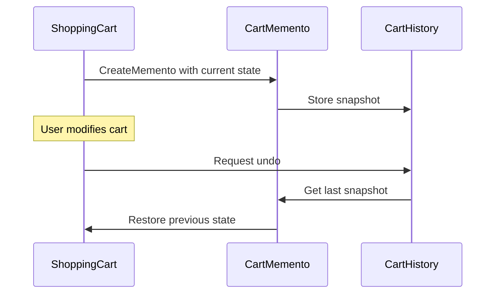

---
topic:
  - Software Architecture
subtopic:
  - Patterns
summary: "Captures and externalizes an object's internal state so it can be restored later, without violating encapsulation."
level:
  - "1"
priority: High
status: Ready to Repeat
publish: true
---

A video-game save point is a memento. It captures enough state to restore a particular moment after a failed attempt. The save system stores that snapshot without needing to understand every internal object that produced it.

The Memento pattern captures an object's state for later restoration without handing its internals to the history mechanism. The **originator** creates and restores snapshots. A **caretaker** stores them as opaque values. This ownership boundary matters more than the snapshot format: only the originator interprets its saved state.



# Problem

A shopping cart has no undo boundary. Removing an item changes live state immediately, while recovery logic would have to reconstruct that state from the outside:

```csharp
public class ShoppingCart
{
    public List<CartItem> Items { get; set; } = [];
    public string? DiscountCode { get; set; }
    public decimal Total => Items.Sum(i => i.Price * i.Quantity);

    // ⚠️ No way to undo — once an item is removed, it's gone
    public void RemoveItem(Guid productId) =>
        Items.RemoveAll(i => i.ProductId == productId);

    // ⚠️ No snapshot capability — abandoned cart recovery requires external logic
}

public class CartController
{
    public IActionResult RemoveItem(Guid productId)
    {
        _cart.RemoveItem(productId);
        // ⚠️ Customer immediately regrets this — no undo button
        return Ok();
    }
}
```

"Undo last change" now requires external code to know how a valid cart is assembled. Encapsulation has already been lost.

# Solution

`CartMemento` records a cart snapshot, and `CartHistory` stores snapshots without interpreting them:

```csharp
// Memento — immutable snapshot of cart state
public sealed record CartMemento(
    IReadOnlyList<CartItem> Items,
    string? DiscountCode,
    DateTime SnapshotAt);

// Originator — creates and restores from mementos
public class ShoppingCart
{
    private List<CartItem> _items = [];
    public string? DiscountCode { get; private set; }
    public IReadOnlyList<CartItem> Items => _items.AsReadOnly();
    public decimal Total => _items.Sum(i => i.Price * i.Quantity);

    public void AddItem(CartItem item) => _items.Add(item);
    public void RemoveItem(Guid productId) => _items.RemoveAll(i => i.ProductId == productId);
    public void ApplyDiscount(string code) => DiscountCode = code;

    // ✅ Creates a snapshot of current state
    public CartMemento Save() =>
        new(_items.Select(i => i with { }).ToList().AsReadOnly(), DiscountCode, DateTime.UtcNow);

    // ✅ Restores state from a snapshot
    public void Restore(CartMemento memento)
    {
        _items = memento.Items.Select(i => i with { }).ToList(); // shallow record copies
        DiscountCode = memento.DiscountCode;
    }
}

// Caretaker — stores mementos without inspecting them
public class CartHistory
{
    private readonly Stack<CartMemento> _history = new();

    public void Push(CartMemento memento) => _history.Push(memento);

    public CartMemento? Pop() => _history.TryPop(out var m) ? m : null;

    public bool CanUndo => _history.Count > 0;

    // ✅ Serialize for abandoned cart recovery
    public string Serialize() => JsonSerializer.Serialize(_history.ToArray());
    public static CartHistory Deserialize(string json)
    {
        var history = new CartHistory();
        var mementos = JsonSerializer.Deserialize<CartMemento[]>(json) ?? [];
        foreach (var m in mementos.Reverse()) history.Push(m);
        return history;
    }
}

// Usage
var cart = new ShoppingCart();
var history = new CartHistory();

cart.AddItem(new CartItem(laptopId, 1, 1299m));
history.Push(cart.Save()); // ✅ snapshot before change

cart.RemoveItem(laptopId); // customer removes item

// Customer clicks "Undo"
if (history.CanUndo)
    cart.Restore(history.Pop()!); // ✅ laptop is back
```

The same snapshot can be serialized for abandoned-cart recovery. Restoration still runs through `ShoppingCart`.

This compact example keeps `CartMemento` public, so opacity is conventional rather than enforced: `CartHistory` can read its properties but has no reason to. A stricter design exposes an opaque interface or nests the memento type inside `ShoppingCart`. The `with` expressions are shallow copies and are safe only when the entire `CartItem` object graph is immutable. Mutable nested objects require explicit deep-copy logic.

# Snapshots in EF Core, JSON, and DataSet

**EF Core `ChangeTracker.OriginalValues`** retains the original property values for a tracked entity. Copying them back into `CurrentValues` restores that tracked value set, which resembles a memento within EF Core's unit-of-work boundary.

**JSON serialization** can serve as a memento format when the serialized contract contains all required state. The hard part is versioning and deep-copy correctness, not calling `JsonSerializer`.

**`DataSet.GetChanges()` / `RejectChanges()`** retain row versions and can reject pending edits. The dataset itself owns the restoration semantics.

# Tradeoffs

**Use it when** an object must restore in-memory state while keeping the snapshot opaque to history code. Editors and multi-step workflows are common fits because a change may touch several related fields at once.

**Avoid it when** snapshots are large and changes are small. Command-based undo stores an inverse operation instead of a full copy. A durable audit history points toward [[Home/Software Architecture/Patterns/Architectural Patterns/Event Sourcing]], where events are the record and snapshots are only an optimization.

**Compared with Command undo**, a Command stores how to reverse one action. A Memento stores prior state. Commands are leaner when the state is large and edits are small. Mementos are easier when one user action changes several internal values. Shared mutable references invalidate either choice, so snapshots need real copy semantics.

# Questions

> [!QUESTION]- How do you prevent the memento from growing unbounded in memory?
> Bound the history by count or memory budget. Long-lived recovery often needs only the newest snapshot, while an editor may retain a fixed undo window. A full audit record should use durable events or changes rather than an unbounded stack of opaque object copies.

> [!QUESTION]- When is Memento overkill compared to simpler approaches?
> A full snapshot is wasteful when undo can be represented as one small delta. If restoring a removed item needs only that item and its position, store those values. Memento earns the extra copy when state is interdependent or restoration must survive across sessions.

# References

- [Memento pattern](https://refactoring.guru/design-patterns/memento)
- [ChangeTracker — EF Core's built-in Memento for entity state tracking](https://learn.microsoft.com/en-us/ef/core/change-tracking/)
