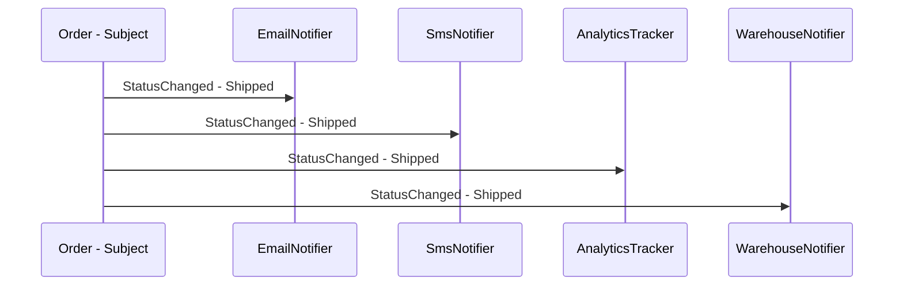

---
topic:
  - Software Architecture
subtopic:
  - Patterns
summary: "Defines a one-to-many dependency where a subject's state change automatically notifies all subscribers."
level:
  - "3"
priority: High
status: Done
publish: true
---

A newspaper subscription has the shape of Observer. The publisher keeps a subscriber list and sends each new issue to that list. Subscribers can leave independently, and the publisher does not know how any recipient uses the issue.

Observer defines one publisher with many independently registered subscribers. A state change triggers notification through a stable callback contract, so the publisher does not depend on subscriber types. C# events provide this mechanism directly: `+=` subscribes, `-=` unsubscribes, and invoking the event notifies the current delegate list.



# Problem

`OrderService.UpdateStatus()` calls every downstream system itself. Notification policy is mixed into order state changes:

```csharp
public class OrderService
{
    private readonly IEmailService _email;
    private readonly ISmsService _sms;
    private readonly IAnalyticsService _analytics;
    private readonly IWarehouseService _warehouse;

    // ⚠️ OrderService knows every subscriber — tight coupling
    public async Task UpdateStatusAsync(Guid orderId, OrderStatus newStatus)
    {
        var order = await _repository.GetAsync(orderId);
        order.Status = newStatus;
        await _repository.UpdateAsync(order);

        // ⚠️ Adding a new subscriber (push notification, ERP system) requires editing this method
        await _email.SendStatusUpdateAsync(order.Customer.Email, order.Id, newStatus);
        await _sms.SendStatusUpdateAsync(order.Customer.Phone, order.Id, newStatus);
        await _analytics.TrackStatusChangeAsync(order.Id, newStatus);
        await _warehouse.NotifyStatusChangeAsync(order.Id, newStatus);
    }
}
```

A push notification requires another `OrderService` dependency and another call. The publisher has become a registry of notification channels.

# Solution

C# events work for synchronous notifications. An explicit observer interface gives server-side code an awaitable contract and clearer failure handling:

```csharp
// Approach 1: C# event — the idiomatic .NET Observer
public class Order
{
    public Guid Id { get; set; }
    public OrderStatus Status { get; private set; }
    public Customer Customer { get; set; } = null!;

    // ✅ event IS the Observer pattern — subscribers register independently
    public event EventHandler<OrderStatusChangedEventArgs>? StatusChanged;

    public void UpdateStatus(OrderStatus newStatus)
    {
        var previous = Status;
        Status = newStatus;
        // ✅ Raise event — Order doesn't know who's listening
        StatusChanged?.Invoke(this, new OrderStatusChangedEventArgs(Id, previous, newStatus));
    }
}

public record OrderStatusChangedEventArgs(Guid OrderId, OrderStatus Previous, OrderStatus New)
    : EventArgs;

// Synchronous UI subscriber
public class StatusBadge
{
    public string Text { get; private set; } = "Pending";

    public void Subscribe(Order order) =>
        order.StatusChanged += (_, e) => Text = e.New.ToString();
}

// Approach 2: awaitable observers discovered through DI
public interface IOrderStatusObserver
{
    Task OnStatusChangedAsync(Order order, OrderStatus previous, OrderStatus current);
}

public class EmailNotifier(IEmailService email) : IOrderStatusObserver
{
    public Task OnStatusChangedAsync(Order order, OrderStatus previous, OrderStatus current) =>
        email.SendStatusUpdateAsync(order.Customer.Email, order.Id, current);
}

public class AnalyticsTracker(IAnalyticsService analytics) : IOrderStatusObserver
{
    public Task OnStatusChangedAsync(Order order, OrderStatus previous, OrderStatus current) =>
        analytics.TrackStatusChangeAsync(order.Id, current);
}

public class PushNotifier(IPushService push) : IOrderStatusObserver
{
    public Task OnStatusChangedAsync(Order order, OrderStatus previous, OrderStatus current) =>
        push.SendAsync(order.Customer.DeviceToken, $"Order {order.Id}: {current}");
}

public class OrderStatusService(IEnumerable<IOrderStatusObserver> observers)
{
    public async Task UpdateStatusAsync(Order order, OrderStatus newStatus)
    {
        var previous = order.Status;
        order.UpdateStatus(newStatus);
        await Task.WhenAll(
            observers.Select(o => o.OnStatusChangedAsync(order, previous, newStatus)));
    }
}

// DI registration for explicit observer approach
builder.Services.AddScoped<IOrderStatusObserver, EmailNotifier>();
builder.Services.AddScoped<IOrderStatusObserver, AnalyticsTracker>();
// ✅ Adding push notifications = register new observer, zero code changes
builder.Services.AddScoped<IOrderStatusObserver, PushNotifier>();
```

A push subscriber is registered alongside the others. The publisher contract does not change.

# Events and Observable APIs in .NET

**C# `event` / `delegate`** supplies the language-native subscription list. `button.Click += handler` registers a callback and `-=` removes it.

**`IObservable<T>` / `IObserver<T>`** model push streams through `OnNext`, `OnError`, and `OnCompleted`. Reactive Extensions builds composition operators over that protocol.

**`INotifyPropertyChanged`** lets binding infrastructure observe ViewModel property changes without the ViewModel knowing which controls display them.

**`ObservableCollection<T>`** raises `CollectionChanged` after mutations. UI collection views subscribe and update their projection.

**`IChangeToken` / `ChangeToken.OnChange()`** exposes one-shot change notifications, including configuration reload signals.

# Pitfalls

**Unsubscribed event handlers.** A long-lived publisher retains its delegate targets. A closed view can stay alive because its handler is still attached to a surviving ViewModel. Unsubscribe with the owning lifetime or use a weak-event mechanism where that ownership cannot be aligned.

**One observer breaks the notification loop.** A synchronous event invocation stops when a handler throws. Explicit async observers can isolate failures or aggregate them with `Task.WhenAll`, but the policy must say whether one subscriber may fail the whole operation.

**Hidden ordering dependencies.** `Task.WhenAll` starts independent observers together and gives no completion order. When `WarehouseNotifier` must finish before `ShippingNotifier`, await observers sequentially in an explicit workflow or chain.

# Tradeoffs

| Concern | C# `event` | DI-discovered observers |
|---|---|---|
| Async support | Awkward (`async void` or fire-and-forget) | Natural (`Task`-returning interface) |
| Error handling | Exceptions propagate to publisher | Can wrap each observer independently |
| Subscriber discovery | Manual registration | DI container can inject all implementations |
| Completion order | Invocation-list order for synchronous handlers | None with `Task.WhenAll`. Use a sequential awaited loop when order matters |
| Lifetime and removal | Must hold the handler delegate and unsubscribe | Governed by DI registration and the containing scope |

C# events fit synchronous UI notifications. Server-side async subscribers need a `Task`-returning interface so completion and failure remain observable. `IObservable<T>` with Rx becomes worthwhile when the event stream itself needs composition over time.

# Questions

> [!QUESTION]- How should event subscriptions be managed to avoid retaining subscribers after their lifetime ends?
> A subscription should be removed when its owner is disposed or otherwise reaches the end of its lifetime. Weak events help when the publisher must live longer than its subscribers and there is no clear owner that can unsubscribe. Matching DI scopes helps only if the publisher stays in the same scope and the subscription does not escape into a singleton, static event, or another longer-lived object.

# References

- [Observer pattern](https://refactoring.guru/design-patterns/observer)
- [Observer Pattern — Christopher Okhravi](https://www.youtube.com/watch?v=_BpmfnqjgzQ&list=PLrhzvIcii6GNjpARdnO4ueTUAVR9eMBpc&index=2)
