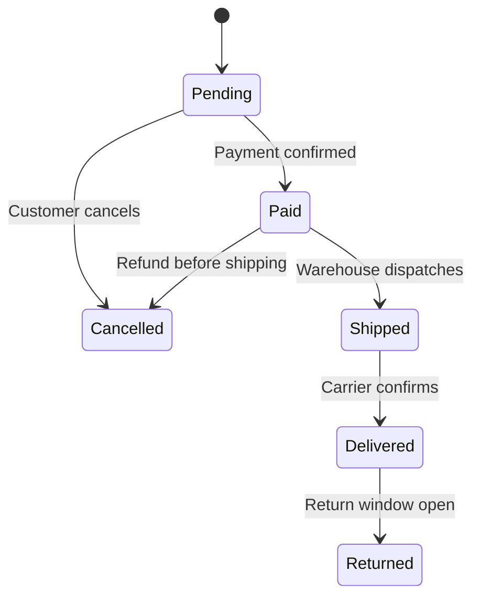

---
topic:
  - Software Architecture
subtopic:
  - Patterns
summary: "Extracts state-specific behavior into separate classes. The context delegates to its current state, which drives transitions."
level:
  - "3"
priority: High
status: Done
publish: true
---

A vending machine responds to the same button differently while idle, holding credit, or out of stock. The input stays the same. Its current state decides what the input means.

The State pattern moves state-dependent behavior into objects that share one interface. A context such as `Order` holds its current state and delegates operations to it. Replacing `PendingState` with `PaidState` changes how `Ship()` behaves without spreading a status switch across every operation. Transitions may be initiated by the context or by a state object. The important boundary is that callers ask for domain operations instead of setting state directly. C# compiler-generated `IAsyncStateMachine` types use the same broad idea—saved state determines where `MoveNext()` resumes—though their generated switch is an implementation technique rather than a textbook object-oriented State hierarchy.



> [!NOTE] State vs Strategy
> The class diagrams can look alike, but the reasons for change differ. State represents an internal mode and its valid transitions. [[Home/Software Architecture/Patterns/Design Patterns/Behavioral/Strategy|Strategy]] represents a replaceable algorithm, usually selected from outside the context.

# Problem

`Order.Ship()`, `Order.Cancel()`, `Order.Refund()` each have a massive switch on `Status` — scattered validation, easy to miss a transition:

```csharp
public class Order
{
    public OrderStatus Status { get; private set; } = OrderStatus.Pending;

    // ⚠️ Every method repeats the same switch — adding a new status means editing all methods
    public void Ship()
    {
        switch (Status)
        {
            case OrderStatus.Paid:
                Status = OrderStatus.Shipped;
                break;
            case OrderStatus.Pending:
                throw new InvalidOperationException("Cannot ship unpaid order");
            case OrderStatus.Shipped:
                throw new InvalidOperationException("Order already shipped");
            case OrderStatus.Delivered:
                throw new InvalidOperationException("Order already delivered");
            case OrderStatus.Cancelled:
                throw new InvalidOperationException("Cannot ship cancelled order");
            // ⚠️ Adding OrderStatus.OnHold requires editing Ship(), Cancel(), Refund(), Deliver()
        }
    }

    public void Cancel()
    {
        switch (Status) // ⚠️ same switch, different transitions
        {
            case OrderStatus.Pending:
            case OrderStatus.Paid:
                Status = OrderStatus.Cancelled;
                break;
            case OrderStatus.Shipped:
                throw new InvalidOperationException("Cannot cancel shipped order — use return");
            // ...
        }
    }
}
```

Adding `OrderStatus.OnHold` means finding every operation that switches on status. Missing one leaves an inconsistent transition rule.

# Solution

Each state becomes a class that knows its valid transitions:

```csharp
// State interface — defines all operations the order can perform
public interface IOrderState
{
    void Pay(Order order);
    void Ship(Order order);
    void Deliver(Order order);
    void Cancel(Order order);
    void Return(Order order);
    string StatusName { get; }
}

// Concrete states — each knows only its own valid transitions
public class PendingState : IOrderState
{
    public string StatusName => "Pending";

    public void Pay(Order order) => order.TransitionTo(new PaidState()); // ✅ valid transition
    public void Ship(Order order) => throw new InvalidOperationException("Pay first");
    public void Deliver(Order order) => throw new InvalidOperationException("Pay and ship first");
    public void Cancel(Order order) => order.TransitionTo(new CancelledState()); // ✅ valid
    public void Return(Order order) => throw new InvalidOperationException("Order not yet delivered");
}

public class PaidState : IOrderState
{
    public string StatusName => "Paid";

    public void Pay(Order order) => throw new InvalidOperationException("Already paid");
    public void Ship(Order order) => order.TransitionTo(new ShippedState()); // ✅ valid
    public void Deliver(Order order) => throw new InvalidOperationException("Ship first");
    public void Cancel(Order order) => order.TransitionTo(new CancelledState()); // ✅ valid (with refund)
    public void Return(Order order) => throw new InvalidOperationException("Not yet delivered");
}

public class ShippedState : IOrderState
{
    public string StatusName => "Shipped";

    public void Pay(Order order) => throw new InvalidOperationException("Already paid");
    public void Ship(Order order) => throw new InvalidOperationException("Already shipped");
    public void Deliver(Order order) => order.TransitionTo(new DeliveredState()); // ✅ valid
    public void Cancel(Order order) => throw new InvalidOperationException("Use return process");
    public void Return(Order order) => throw new InvalidOperationException("Not yet delivered");
}

public class DeliveredState : IOrderState
{
    public string StatusName => "Delivered";

    public void Pay(Order order) => throw new InvalidOperationException("Already paid");
    public void Ship(Order order) => throw new InvalidOperationException("Already delivered");
    public void Deliver(Order order) => throw new InvalidOperationException("Already delivered");
    public void Cancel(Order order) => throw new InvalidOperationException("Use return process");
    public void Return(Order order) => order.TransitionTo(new ReturnedState()); // ✅ valid
}

// CancelledState and ReturnedState are omitted; they reject or define any later transitions.

// Adding OnHoldState = one new class plus edits to states that transition to or from it
public class OnHoldState : IOrderState
{
    public string StatusName => "OnHold";

    public void Pay(Order order) => throw new InvalidOperationException("Resolve hold first");
    public void Ship(Order order) => throw new InvalidOperationException("Resolve hold first");
    public void Deliver(Order order) => throw new InvalidOperationException("Resolve hold first");
    public void Cancel(Order order) => order.TransitionTo(new CancelledState());
    public void Return(Order order) => throw new InvalidOperationException("Not yet delivered");
}

// Context — delegates to current state
public class Order
{
    private IOrderState _state = new PendingState();

    public string Status => _state.StatusName;

    internal void TransitionTo(IOrderState newState)
    {
        _state = newState;
        // ✅ Raise event, log transition, etc.
    }

    // ✅ Delegates to state — no switch statements
    public void Pay() => _state.Pay(this);
    public void Ship() => _state.Ship(this);
    public void Deliver() => _state.Deliver(this);
    public void Cancel() => _state.Cancel(this);
    public void Return() => _state.Return(this);
}
```

`OnHoldState` localizes the new behavior. Existing states still need edits if they gain transitions to or from the new state, so the pattern does not eliminate all change. It keeps each change near the state that owns it.

# Familiar state machines

**Compiler-generated `IAsyncStateMachine`** stores a numeric state and resumes `MoveNext()` at the corresponding continuation point. It demonstrates state-driven control flow, but it does so with generated fields and branching rather than interchangeable state objects.

**Circuit breakers** move among closed, open, and half-open modes. The same execution request is admitted, rejected, or used as a probe according to the current mode and transition policy.

**`TaskStatus`** exposes a task's lifecycle state. It is an enum-backed state machine, which is often the better design when the transition table is small and behavior does not warrant separate classes.

# Pitfalls

**State explosion.** Ten states behind an eight-method interface can produce 80 method bodies, many of which only reject an operation. A default base state can centralize rejection, while a library such as `Stateless` can express a transition-heavy machine as a table.

**Incomplete transition effects.** Changing `Paid` to `Cancelled` without arranging the refund creates a valid-looking state with broken business meaning. The transition boundary must define whether effects complete atomically, run through an outbox, or leave the machine in an intermediate state.

**Persistence coupling.** Persist a stable state identifier and reconstruct behavior after loading. Serializing concrete state objects ties stored data to the class hierarchy and makes refactoring much harder.

# Tradeoffs

| Concern | State pattern | Enum + switch |
|---|---|---|
| Adding a new state | Add one class, then edit existing states whose transitions reference it | Edit every switch that handles the state |
| Adding a new operation | Add method to interface + all state classes | Add one method with a switch |
| Valid transition enforcement | Each state class defines its own | Switch in each method |
| Complexity | Many small classes | Few large methods |
| Readability | State behavior is localized | All behavior in one class |

State earns its classes when state-dependent rules are scattered across several operations and each mode owns meaningful behavior. A compact enum and one transition function remain easier to audit for a small machine. `Stateless` is useful when the transition table matters more than rich behavior inside each state.

# Questions

> [!QUESTION]- How does a compiler-generated async state machine relate to the State pattern?
> The compiler emits an `IAsyncStateMachine` implementation with a numeric state field. `MoveNext()` branches on that field, saves a continuation when an awaiter is incomplete, and later resumes from the saved point. Locals that must survive suspension become fields. This is a compiler state machine, but it does not use the pattern's usual family of state objects.

# References

- [State pattern](https://refactoring.guru/design-patterns/state)
- [State Pattern — Christopher Okhravi](https://www.youtube.com/watch?v=N12L5D78MAA&list=PLrhzvIcii6GNjpARdnO4ueTUAVR9eMBpc&index=17)
- [Async/await state machine — Microsoft Learn](https://learn.microsoft.com/en-us/dotnet/csharp/asynchronous-programming/task-asynchronous-programming-model)
- [Stateless — declarative state machine library for .NET](https://github.com/dotnet-state-machine/stateless)
