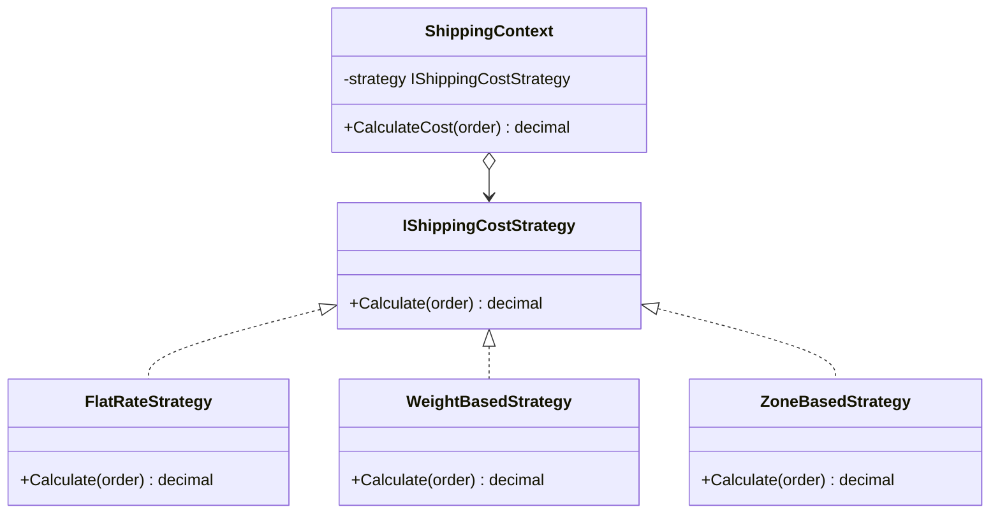

---
topic:
  - Software Architecture
subtopic:
  - Patterns
summary: "Defines a family of algorithms behind a common interface and makes them interchangeable at runtime, selected by the client."
level:
  - "2"
priority: High
status: Done
publish: true
---
A navigation app uses the Strategy pattern every time you pick a route. Same destination, different algorithms — fastest, shortest, avoid tolls, scenic. You choose the strategy before you start driving; the app uses it to calculate the route. Swap the strategy mid-trip and the app recalculates without changing the navigation engine itself.

The Strategy pattern defines a family of algorithms, encapsulates each one behind a common interface, and makes them interchangeable at runtime. A **context** holds a reference to a strategy interface and delegates the algorithm to it. The **client** injects the desired strategy — `FlatRateStrategy`, `WeightBasedStrategy`, or `ZoneBasedStrategy` — and the context executes it without knowing which variant it received. Adding a new algorithm means adding a new strategy class, not editing a growing switch statement.



> [!NOTE] Strategy vs State vs Command
> **Strategy** selection is **driven by the client** — the caller injects which algorithm to use. [[Home/Software Architecture/Patterns/Design Patterns/Behavioral/State]] transitions are **driven by the object** — the object changes its own behavior. [[Home/Software Architecture/Patterns/Design Patterns/Behavioral/Command]] encapsulates a **request** with context — what to do and when. If the caller decides the algorithm, it's Strategy. If the object decides, it's State.

# Problem

`ShippingService.CalculateCost()` has an if/else chain — adding a new strategy means editing the method:

```csharp
public class ShippingService
{
    // ⚠️ Adding "same-day delivery" requires editing this method
    public decimal CalculateCost(Order order, string strategy)
    {
        if (strategy == "flat_rate")
        {
            return 9.99m;
        }
        else if (strategy == "weight_based")
        {
            var weightKg = order.Items.Sum(i => i.Product.WeightKg * i.Quantity);
            return weightKg * 2.50m;
        }
        else if (strategy == "zone_based")
        {
            var zone = GetShippingZone(order.ShippingAddress);
            return zone switch { 1 => 5.99m, 2 => 9.99m, 3 => 14.99m, _ => 19.99m };
        }
        else if (strategy == "free" && order.Customer.Tier == CustomerTier.Gold)
        {
            return 0m;
        }
        // ⚠️ String comparison — typos cause silent failures
        throw new ArgumentException($"Unknown strategy: {strategy}");
    }
}
```

Here's what breaks when requirements change: adding same-day delivery requires editing `ShippingService` — touching code that already works for flat rate, weight-based, and zone-based strategies.

# Solution

Each algorithm becomes a strategy class. The context selects the strategy via DI or a registry:

```csharp
// Strategy interface
public interface IShippingCostStrategy
{
    decimal Calculate(Order order);
    bool AppliesTo(Order order); // ✅ strategy knows when it's applicable
}

// Concrete strategies
public class FlatRateStrategy : IShippingCostStrategy
{
    public decimal Calculate(Order order) => 9.99m;
    public bool AppliesTo(Order order) => true; // always applicable as fallback
}

public class WeightBasedStrategy : IShippingCostStrategy
{
    private const decimal RatePerKg = 2.50m;

    public decimal Calculate(Order order)
    {
        var totalWeightKg = order.Items.Sum(i => i.Product.WeightKg * i.Quantity);
        return Math.Max(totalWeightKg * RatePerKg, 4.99m); // minimum charge
    }

    public bool AppliesTo(Order order) =>
        order.Items.Any(i => i.Product.WeightKg > 0);
}

public class ZoneBasedStrategy(IZoneCalculator zoneCalc) : IShippingCostStrategy
{
    private static readonly Dictionary<int, decimal> ZoneRates = new()
        { [1] = 5.99m, [2] = 9.99m, [3] = 14.99m };

    public decimal Calculate(Order order)
    {
        var zone = zoneCalc.GetZone(order.ShippingAddress);
        return ZoneRates.GetValueOrDefault(zone, 19.99m);
    }

    public bool AppliesTo(Order order) => order.ShippingAddress is not null;
}

public class FreeShippingStrategy : IShippingCostStrategy
{
    public decimal Calculate(Order order) => 0m;
    public bool AppliesTo(Order order) =>
        order.Customer.Tier == CustomerTier.Gold || order.Total >= 100m;
}

// ✅ Adding same-day delivery = new class, zero changes to existing strategies
public class SameDayDeliveryStrategy : IShippingCostStrategy
{
    public decimal Calculate(Order order) => 24.99m;
    public bool AppliesTo(Order order) =>
        order.ShippingAddress.City == order.WarehouseCity && DateTime.UtcNow.Hour < 14;
}

// Context — selects and applies the strategy
public class ShippingService(IEnumerable<IShippingCostStrategy> strategies)
{
    public decimal CalculateCost(Order order)
    {
        // ✅ Strategy selection via priority — no if/else
        var strategy = strategies
            .Where(s => s.AppliesTo(order))
            .OrderByDescending(s => s is FreeShippingStrategy) // free shipping wins
            .First();

        return strategy.Calculate(order);
    }
}

// DI registration — adding a strategy = one new registration
builder.Services.AddScoped<IShippingCostStrategy, FreeShippingStrategy>();
builder.Services.AddScoped<IShippingCostStrategy, SameDayDeliveryStrategy>();
builder.Services.AddScoped<IShippingCostStrategy, ZoneBasedStrategy>();
builder.Services.AddScoped<IShippingCostStrategy, WeightBasedStrategy>();
builder.Services.AddScoped<IShippingCostStrategy, FlatRateStrategy>(); // fallback
```

Adding same-day delivery now means one new class and one DI registration — `ShippingService` never changes.

# You Already Use This

**`IComparer<T>` / `IComparable<T>`** — comparison strategies. `orders.Sort(new OrderByTotalDescending())` injects a comparison strategy. LINQ's `OrderBy(o => o.Total)` uses a `Func<T, TKey>` as an inline strategy.

**LINQ `Func<T, bool>` predicates** — `orders.Where(o => o.Total > 100)` injects a filtering strategy as a delegate. The predicate is a Strategy implemented as a lambda.

**`JsonConverter<T>`** — serialization strategy. `[JsonConverter(typeof(OrderStatusConverter))]` injects a custom serialization strategy for a type. The converter decides how to serialize/deserialize.

**`IPasswordHasher<T>`** — hashing strategy. ASP.NET Core Identity uses `IPasswordHasher<TUser>` to hash passwords. Swapping the hasher (e.g., from PBKDF2 to Argon2) is a strategy swap.

# Questions

> [!QUESTION]- When should you use a Strategy interface vs a `Func<T, TResult>` delegate?
> Use a `Func<T, TResult>` delegate when the strategy is simple (one method, no state, no dependencies). `Func<Order, decimal>` is a perfectly valid shipping cost strategy for simple cases. Use an interface when: the strategy has multiple methods, needs DI-injected dependencies, needs to be registered in a DI container, or needs to carry state. The tradeoff: delegates are simpler and more flexible; interfaces are more explicit and support DI. Start with delegates; introduce an interface when the strategy grows beyond a single expression.

> [!QUESTION]- How do you handle strategy selection when multiple strategies apply?
> Define a priority or exclusivity rule. Options: (1) **First-match wins** — strategies are ordered by priority; the first applicable one is used. (2) **Explicit selection** — the caller specifies the strategy by name or type. (3) **Composite strategy** — all applicable strategies run and results are combined (e.g., sum all applicable discounts). The tradeoff: first-match is simple but order-dependent; explicit selection is clear but requires the caller to know strategy names; composite is flexible but may produce unexpected combinations.

# References

- [Strategy Pattern — Christopher Okhravi](https://www.youtube.com/watch?v=v9ejT8FO-7I&list=PLrhzvIcii6GNjpARdnO4ueTUAVR9eMBpc&index=1) — video walkthrough of the Strategy pattern with OOP examples
- [Strategy — refactoring.guru](https://refactoring.guru/design-patterns/strategy) — canonical pattern description with context/strategy diagram and C# example
- [`IComparer<T>` — Microsoft Learn](https://learn.microsoft.com/en-us/dotnet/api/system.collections.generic.icomparer-1) — .NET's built-in Strategy for comparison algorithms
- [`JsonConverter<T>` — Microsoft Learn](https://learn.microsoft.com/en-us/dotnet/api/system.text.json.serialization.jsonconverter-1) — Strategy pattern for JSON serialization
- [`IPasswordHasher<T>` — Microsoft Learn](https://learn.microsoft.com/en-us/dotnet/api/microsoft.aspnetcore.identity.ipasswordhasher-1) — Strategy pattern for password hashing in ASP.NET Core Identity
