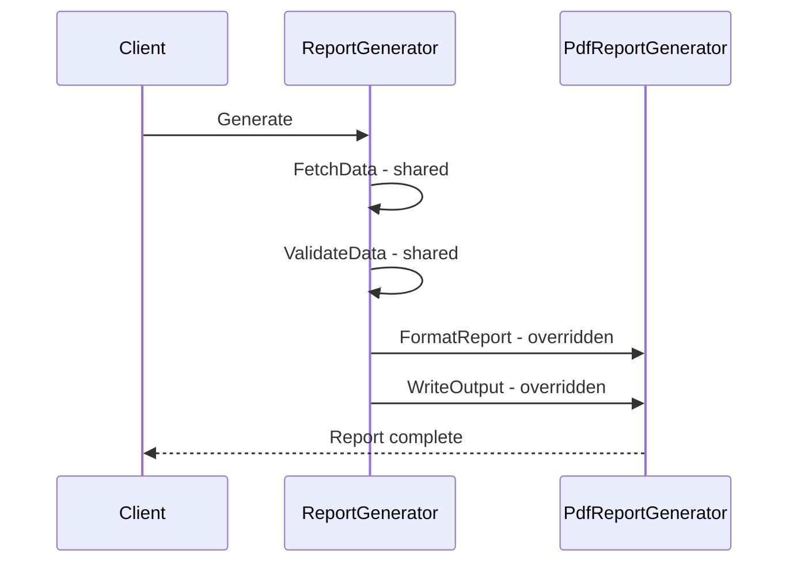

---
topic:
  - Software Architecture
subtopic:
  - Patterns
summary: "Defines the skeleton of an algorithm in a base class, letting subclasses override specific steps without changing its structure."
level:
  - "2"
priority: High
status: Ready to Repeat
publish: true
---

Tea and coffee can share a preparation sequence while varying the brewing step. The sequence belongs in one place. Subclasses fill the deliberate gaps.

Template Method puts an algorithm's control flow in a base class. Its public method calls shared steps plus a small set of abstract or virtual hooks. `ReportGenerator.GenerateAsync()` can own fetching, validation, auditing, and result assembly while subclasses provide only the output format. The base class controls when each hook runs, so the extension points form a protocol rather than a collection of unrelated overrides.



# Problem

`PdfReportGenerator`, `CsvReportGenerator`, and `ExcelReportGenerator` each independently implement the same fetch → validate → format → write lifecycle, duplicating orchestration logic:

```csharp
public class PdfReportGenerator
{
    public async Task<byte[]> GenerateAsync(Guid orderId)
    {
        // ⚠️ Fetch, validate, and audit logic duplicated in every generator
        var order = await _repository.GetAsync(orderId);
        if (order is null) throw new NotFoundException(orderId);
        await _auditLog.RecordAsync($"Report generated for order {orderId}");

        // Format-specific logic
        var pdf = new PdfDocument();
        pdf.AddPage().AddTable(order.Items.Select(i => new[] { i.ProductId.ToString(), i.Quantity.ToString() }));
        return pdf.Save();
    }
}

public class CsvReportGenerator
{
    public async Task<byte[]> GenerateAsync(Guid orderId)
    {
        // ⚠️ Same fetch/validate/audit — copy-pasted
        var order = await _repository.GetAsync(orderId);
        if (order is null) throw new NotFoundException(orderId);
        await _auditLog.RecordAsync($"Report generated for order {orderId}");

        // Format-specific logic
        var sb = new StringBuilder("ProductId,Quantity,UnitPrice\n");
        foreach (var item in order.Items)
            sb.AppendLine($"{item.ProductId},{item.Quantity},{item.UnitPrice}");
        return Encoding.UTF8.GetBytes(sb.ToString());
    }
}
// ⚠️ Adding ExcelReportGenerator = copy-paste the fetch/validate/audit block again
```

Adding an audit field now requires the same edit in every generator, and one missed copy produces a different workflow for that format.

# Solution

`ReportGenerator` base class defines the algorithm skeleton. Subclasses override only the format-specific steps:

```csharp
// Abstract base — defines the template method
public abstract class ReportGenerator
{
    protected ReportGenerator(IOrderRepository repository, IAuditLog auditLog)
    {
        Repository = repository;
        AuditLog = auditLog;
    }

    // ✅ Template method — sealed, defines the algorithm skeleton
    public async Task<Report> GenerateAsync(Guid orderId)
    {
        var order = await FetchDataAsync(orderId);    // step 1: always the same
        ValidateData(order);                           // step 2: always the same
        var content = await FormatReportAsync(order);  // step 3: subclass-specific
        await RecordAuditAsync(orderId);               // step 4: record successful formatting
        return new Report(GetContentType(), content);  // step 5: uses subclass value
    }

    // Fixed steps — shared implementation
    private async Task<Order> FetchDataAsync(Guid orderId)
    {
        var order = await Repository.GetAsync(orderId);
        return order ?? throw new NotFoundException(orderId);
    }

    private void ValidateData(Order order)
    {
        if (order.Items.Count == 0)
            throw new InvalidOperationException("Cannot generate report for empty order");
    }

    private Task RecordAuditAsync(Guid orderId) =>
        AuditLog.RecordAsync($"Report generated for order {orderId} as {GetContentType()}");

    // Abstract steps — subclasses must implement
    protected abstract Task<byte[]> FormatReportAsync(Order order);
    protected abstract string GetContentType();

    protected IOrderRepository Repository { get; }
    protected IAuditLog AuditLog { get; }
}

// Concrete implementations — override only format-specific steps
public class PdfReportGenerator(IOrderRepository repository, IAuditLog auditLog)
    : ReportGenerator(repository, auditLog)
{
    protected override Task<byte[]> FormatReportAsync(Order order)
    {
        var pdf = new PdfDocument();
        var page = pdf.AddPage();
        page.AddHeading($"Order #{order.Id}");
        page.AddTable(order.Items.Select(i => new[] { i.ProductId.ToString(), i.Quantity.ToString(), i.UnitPrice.ToString("C") }));
        return Task.FromResult(pdf.Save());
    }

    protected override string GetContentType() => "application/pdf";
}

public class CsvReportGenerator(IOrderRepository repository, IAuditLog auditLog)
    : ReportGenerator(repository, auditLog)
{
    protected override Task<byte[]> FormatReportAsync(Order order)
    {
        var sb = new StringBuilder("ProductId,Quantity,UnitPrice\n");
        foreach (var item in order.Items)
            sb.AppendLine($"{item.ProductId},{item.Quantity},{item.UnitPrice:F2}");
        return Task.FromResult(Encoding.UTF8.GetBytes(sb.ToString()));
    }

    protected override string GetContentType() => "text/csv";
}

// ✅ Adding Excel = new subclass, zero changes to base class or other generators
public class ExcelReportGenerator(IOrderRepository repository, IAuditLog auditLog)
    : ReportGenerator(repository, auditLog)
{
    protected override Task<byte[]> FormatReportAsync(Order order)
    {
        using var workbook = new XLWorkbook();
        var sheet = workbook.AddWorksheet("Order");
        // ... populate Excel
        using var stream = new MemoryStream();
        workbook.SaveAs(stream);
        return Task.FromResult(stream.ToArray());
    }

    protected override string GetContentType() =>
        "application/vnd.openxmlformats-officedocument.spreadsheetml.sheet";
}
```

`GenerateAsync()` is non-virtual, so subclasses cannot override the control flow. The inline "sealed" comment describes that intent. `sealed` is not a modifier on this method.

An Excel generator supplies only the format-specific hooks. Fetching, validation, and auditing still follow the base algorithm.

# Framework examples

**`BackgroundService.ExecuteAsync()`** is the required hook invoked by the base service lifecycle. The host owns registration and calls `StartAsync()` and `StopAsync()`. The derived service supplies its long-running operation and must honor cancellation.

**`Stream`** fixes high-level copying behavior while derived streams provide their supported I/O operations. Capability flags such as `CanRead` and `CanSeek` are part of the contract because not every stream supports every hook.

**`DbContext.OnModelCreating()`** is a hook inside EF Core's model-building process. A derived context contributes mappings without owning when the model is initialized or cached.

**`AuthenticationHandler<T>.HandleAuthenticateAsync()`** supplies scheme-specific authentication inside a base handler that coordinates the surrounding authentication operation.

# Tradeoffs

Template Method fits variants that share a stable algorithm and differ at a few intentional hooks. It is an inversion-of-control mechanism: the base class calls overridden steps at times chosen by the base algorithm (see [[Home/Software Design/Principles/DRY, IoC, and YAGNI#Inversion of Control (IoC)|IoC]]).

It fits poorly when behavior must change at runtime or when inheritance exists only to reuse a few lines. A base-class change can affect every subtype through undocumented hook order, shared state, or new assumptions.

**[[Home/Software Architecture/Patterns/Design Patterns/Behavioral/Strategy]]** moves variation into composed objects or delegates, which allows runtime replacement and avoids consuming the single base-class slot. Template Method is smaller when the base genuinely owns most of the workflow. When two dimensions vary independently, [[Home/Software Architecture/Patterns/Design Patterns/Structural/Bridge]] can keep them from turning into a cross-product of subclasses.

# Questions

> [!QUESTION]- What should determine whether algorithm variation uses Template Method or Strategy?
> Template Method fits a stable workflow whose hooks make sense only inside one base class. Strategy fits a behavior that is useful on its own or must be replaced at runtime. Template Method couples variants through inheritance. Strategy adds another dependency and needs a clear selection rule.

> [!QUESTION]- What is the "Hollywood Principle," and how does Template Method apply it?
> The principle means that the framework controls the flow and calls application code at defined extension points. Template Method applies that rule inside a class: the base method fixes the order, then calls subclass hooks for the steps that may vary. This protects the sequence, but every subtype becomes coupled to that calling protocol.

# References

- [Template Method pattern](https://refactoring.guru/design-patterns/template-method)
- [Template Method Pattern — Christopher Okhravi](https://www.youtube.com/watch?v=7ocpwK9uesw&list=PLrhzvIcii6GNjpARdnO4ueTUAVR9eMBpc&index=13)
- [BackgroundService — Template Method for hosted background services](https://learn.microsoft.com/en-us/dotnet/api/microsoft.extensions.hosting.backgroundservice)
- [Stream abstract class — Template Method in the .NET I/O hierarchy](https://learn.microsoft.com/en-us/dotnet/api/system.io.stream)

