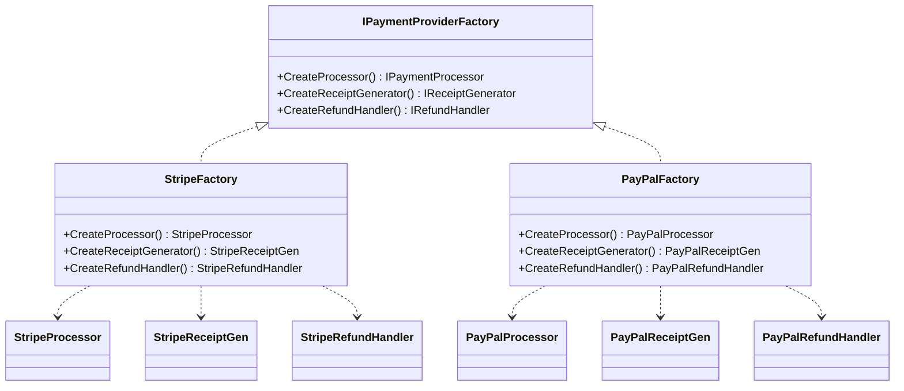

---
topic:
  - Software Architecture
subtopic:
  - Patterns
summary: "Provides an interface for creating families of related objects without specifying their concrete classes, keeping every product in a family compatible."
level:
  - "3"
priority: High
status: Done
publish: true
---

An application may need a matching set of provider-specific objects: a connection, command, and adapter for one database provider, or several payment components built for the same gateway. Selecting the family once is safer than repeating the provider choice at every construction site.

Abstract Factory exposes creation operations for a family of related products without naming their concrete classes in client code. Each concrete factory supplies one family, so replacing the factory replaces the set. The interface centralizes the compatibility decision. It does not prove compatibility by itself: a faulty concrete factory can still return mismatched implementations unless the type system encodes the family more strongly.



> [!NOTE] Abstract Factory vs Factory Method
> [[Home/Software Architecture/Patterns/Design Patterns/Creational/Factory Method]] lets a creator subtype choose one product. Abstract Factory supplies several related product types through a composed factory object. The latter keeps a family choice in one construction boundary, though its correctness still depends on each concrete factory.

# Problem

`CheckoutService` creates payment objects, receipt generators, and refund handlers per provider. Without a factory, provider selection is scattered:

```csharp
public class CheckoutService
{
    public async Task<CheckoutResult> CheckoutAsync(Order order, string provider)
    {
        IPaymentProcessor processor;
        IReceiptGenerator receiptGen;
        IRefundHandler refundHandler;

        // ⚠️ Provider selection duplicated in every method that needs payment objects
        if (provider == "stripe")
        {
            processor = new StripePaymentProcessor(Environment.GetEnvironmentVariable("STRIPE_KEY")!);
            receiptGen = new StripeReceiptGenerator();
            refundHandler = new StripeRefundHandler();
        }
        else if (provider == "paypal")
        {
            processor = new PayPalPaymentProcessor(Environment.GetEnvironmentVariable("PAYPAL_CLIENT_ID")!);
            receiptGen = new PayPalReceiptGenerator();
            refundHandler = new PayPalRefundHandler();
        }
        else
        {
            throw new NotSupportedException($"Provider '{provider}' not supported");
        }
        // ⚠️ Adding BankTransfer means editing this block AND every other place that creates payment objects
        // ⚠️ Nothing prevents mixing StripePaymentProcessor with PayPalReceiptGenerator

        var payment = await processor.ChargeAsync(order.Total, order.Customer.PaymentMethod);
        var receipt = receiptGen.Generate(order, payment);
        return new CheckoutResult(payment, receipt, refundHandler);
    }
}
```

A new provider changes every place that repeats this branch. Direct construction also permits a Stripe processor to be paired with a PayPal receipt generator without any single boundary noticing.

# Solution

Define a factory interface for the payment family. Each provider implements the full family:

```csharp
// Abstract products
public interface IPaymentProcessor
{
    Task<Payment> ChargeAsync(decimal amount, PaymentMethod method);
}

public interface IReceiptGenerator
{
    Invoice Generate(Order order, Payment payment);
}

public interface IRefundHandler
{
    Task<bool> RefundAsync(Payment payment, decimal amount);
}

// Abstract factory — the family contract
public interface IPaymentProviderFactory
{
    IPaymentProcessor CreateProcessor();
    IReceiptGenerator CreateReceiptGenerator();
    IRefundHandler CreateRefundHandler();
}

// Concrete factory — Stripe family (compatibility is centralized here)
public class StripePaymentFactory(StripeOptions options) : IPaymentProviderFactory
{
    public IPaymentProcessor CreateProcessor() => new StripePaymentProcessor(options.ApiKey);
    public IReceiptGenerator CreateReceiptGenerator() => new StripeReceiptGenerator(options.AccountId);
    public IRefundHandler CreateRefundHandler() => new StripeRefundHandler(options.ApiKey);
}

// Concrete factory — PayPal family
public class PayPalPaymentFactory(PayPalOptions options) : IPaymentProviderFactory
{
    public IPaymentProcessor CreateProcessor() => new PayPalPaymentProcessor(options.ClientId, options.Secret);
    public IReceiptGenerator CreateReceiptGenerator() => new PayPalReceiptGenerator(options.MerchantId);
    public IRefundHandler CreateRefundHandler() => new PayPalRefundHandler(options.ClientId, options.Secret);
}

// ✅ Adding BankTransfer = new factory class, zero changes to CheckoutService
public class BankTransferFactory(BankOptions options) : IPaymentProviderFactory
{
    public IPaymentProcessor CreateProcessor() => new BankTransferProcessor(options);
    public IReceiptGenerator CreateReceiptGenerator() => new BankReceiptGenerator(options.BankName);
    public IRefundHandler CreateRefundHandler() => new BankRefundHandler(options);
}

// CheckoutService works against the abstract factory — no provider knowledge
public class CheckoutService(IPaymentProviderFactory factory)
{
    public async Task<CheckoutResult> CheckoutAsync(Order order)
    {
        // All three objects come from one concrete factory, which owns compatibility
        var processor = factory.CreateProcessor();
        var receiptGen = factory.CreateReceiptGenerator();
        var refundHandler = factory.CreateRefundHandler();

        var payment = await processor.ChargeAsync(order.Total, order.Customer.PaymentMethod);
        var receipt = receiptGen.Generate(order, payment);
        return new CheckoutResult(payment, receipt, refundHandler);
    }
}

// DI registration — swap the factory to switch providers
builder.Services.AddSingleton<IPaymentProviderFactory>(
    new StripePaymentFactory(builder.Configuration.GetSection("Stripe").Get<StripeOptions>()!));
```

Bank transfer now has one construction boundary, and `CheckoutService` remains provider-neutral. The compiler enforces the product interfaces returned by the factory, not that their concrete implementations belong to one provider. Tests or stronger family-specific types must protect that invariant.

# Framework examples

**A DI container** is a general object factory and composition root. Grouped registrations can switch several services together, but `IServiceProvider` is not a typed Abstract Factory and does not prevent mixed registrations.

**`DbProviderFactory`** is the clearest .NET example. One provider factory creates connections, commands, adapters, and related ADO.NET objects for that provider. Client code stays on the shared abstractions.

**Hosting builders** assemble related infrastructure through one composition path, but they are primarily Builders rather than textbook Abstract Factories.

# Pitfalls

**Mismatched products.** A shared return interface cannot express that every object came from the same provider. Restricting concrete constructors reduces bypasses. When compatibility is a hard invariant, provider-specific aggregate types or generic family markers can move more of the check into the type system.

**Family growth.** A new product kind such as `IFraudDetector` changes the abstract factory and every family. Split the interface only when consumers use genuinely separate families. Arbitrary small interfaces can hide the fact that the products must vary together.

**Selection lifetime.** Startup registration gives the application one family. Per-request selection needs a registry or strategy, plus explicit rules for credentials, retries, and provider-specific state.

# Tradeoffs

| Concern | With Abstract Factory | Without (direct construction) |
|---|---|---|
| Product compatibility | Centralized in one concrete factory. Stronger typing may enforce more | Repeated at each construction site |
| Adding a new provider | One new factory class, zero changes to consumers | Edit every service that creates payment objects |
| Adding a new product type | Add method to interface + implement in every factory | Add creation logic in every service |
| Testability | Inject a `MockPaymentFactory` in tests | Must mock each product individually |
| Complexity | Factory hierarchy adds indirection | Simpler for 1-2 providers |

Abstract Factory fits several product types that must vary together across more than one family. A single product abstraction or one fixed provider needs less machinery. The deciding pressure is coordinated variation, not a numeric threshold.

# Questions

> [!QUESTION]- How do you add a new product type (e.g., IFraudDetector) to an existing Abstract Factory without breaking all existing factories?
> If fraud detection is part of every provider family, change the interface and update every concrete factory. That compile-time break is useful because it exposes incomplete families. A separate factory is appropriate only when fraud detection varies independently. A default no-op avoids the break but can turn a missing security control into apparently valid behavior.

> [!QUESTION]- When is Abstract Factory overkill compared to a simpler approach?
> It is unnecessary when only one product varies or the products do not share a compatibility boundary. In that case, inject the product interface directly. Abstract Factory earns its indirection only when a family choice must move together.

> [!QUESTION]- How does Abstract Factory relate to the DI container in modern .NET?
> A DI container can construct the same object graph, but it is a general registry rather than a domain-specific family contract. Grouped registration methods can keep a provider family together at the composition root. A typed factory makes that boundary visible to consumers, yet ordinary interface return types still do not prove concrete-family compatibility.

# References

- [Abstract Factory pattern](https://refactoring.guru/design-patterns/abstract-factory)
- [Abstract Factory Pattern — Christopher Okhravi](https://www.youtube.com/watch?v=v-GiuMmsXj4&list=PLrhzvIcii6GNjpARdnO4ueTUAVR9eMBpc&index=5)
- [Dependency injection in .NET — how the DI container acts as a runtime Abstract Factory](https://learn.microsoft.com/en-us/dotnet/core/extensions/dependency-injection)
