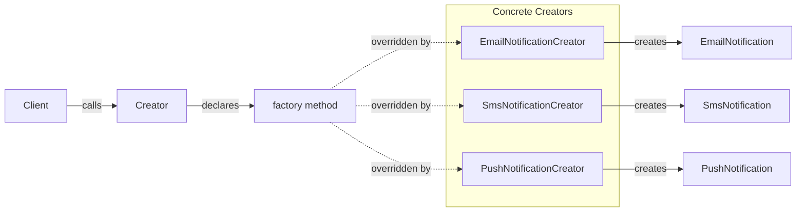

---
topic:
  - Software Architecture
subtopic:
  - Patterns
summary: "Defines an interface for creating an object but lets subclasses decide which concrete class to instantiate."
level:
  - "1"
priority: High
status: Done
publish: true
---
A restaurant kitchen has one menu, but different stations prepare the same dish their own way — the Italian station makes pasta, the French station makes a soufflé. The customer orders "the special" without knowing which station handles it. The ordering process is the same; the creation varies by station.

The Factory Method pattern works the same way: it defines an interface for creating an object but lets subclasses decide which class to instantiate. A creator class declares an abstract or virtual factory method that returns a product interface. Each concrete creator overrides this method to produce its specific product. The client code calls the factory method through the creator interface, never touching `new` directly — so adding a new product type means adding a new creator subclass, not editing existing code.



> [!NOTE] Factory Method vs Abstract Factory
> Factory Method creates **one product** via inheritance — the subclass decides. [[Home/Software Architecture/Patterns/Design Patterns/Creational/Abstract Factory]] creates a **family of related products** via composition. If you only need one object type, Factory Method is simpler.

# Problem

An `OrderService` needs to send notifications after order events. The naive approach hardcodes channel creation inline:

```csharp
public class OrderService
{
    public async Task PlaceOrderAsync(Order order)
    {
        await SaveOrderAsync(order);

        // ⚠️ Switch on type — every new channel requires editing this method
        var channel = order.Customer.PreferredChannel;
        if (channel == "email")
        {
            var emailSender = new SmtpEmailSender("smtp.example.com", 587); // ⚠️ hardcoded config
            await emailSender.SendAsync(order.Customer.Email,
                "Order Confirmed", BuildEmailBody(order));
        }
        else if (channel == "sms")
        {
            var smsSender = new TwilioSmsSender(Environment.GetEnvironmentVariable("TWILIO_SID")!);
            await smsSender.SendAsync(order.Customer.Phone, BuildSmsBody(order));
        }
        else if (channel == "push")
        {
            var pushSender = new FirebasePushSender(Environment.GetEnvironmentVariable("FCM_KEY")!);
            await pushSender.SendAsync(order.Customer.DeviceToken, "Order Confirmed", BuildPushBody(order));
        }
        // ⚠️ Adding Slack, webhook, or WhatsApp means editing this method again
    }
}
```

Here's what breaks when requirements change: adding a Slack notification for B2B customers requires editing `OrderService`, touching production code that already works, and risking regressions in email/SMS paths.

# Solution

Extract notification creation into a factory method. Each channel gets its own creator:

```csharp
// Product interface
public interface INotificationSender
{
    Task SendOrderConfirmationAsync(Order order);
}

// Concrete products
public class EmailNotificationSender : INotificationSender
{
    private readonly SmtpEmailSender _smtp;
    public EmailNotificationSender(SmtpEmailSender smtp) => _smtp = smtp;

    public Task SendOrderConfirmationAsync(Order order) =>
        _smtp.SendAsync(order.Customer.Email, "Order Confirmed", BuildBody(order));

    private static string BuildBody(Order order) =>
        $"Hi {order.Customer.Name}, your order #{order.Id} for {order.Total:C} is confirmed.";
}

public class SmsNotificationSender : INotificationSender
{
    private readonly TwilioSmsSender _twilio;
    public SmsNotificationSender(TwilioSmsSender twilio) => _twilio = twilio;

    public Task SendOrderConfirmationAsync(Order order) =>
        _twilio.SendAsync(order.Customer.Phone,
            $"Order #{order.Id} confirmed. Total: {order.Total:C}");
}

public class SlackNotificationSender : INotificationSender // ✅ new channel = new class, zero edits elsewhere
{
    private readonly SlackClient _slack;
    public SlackNotificationSender(SlackClient slack) => _slack = slack;

    public Task SendOrderConfirmationAsync(Order order) =>
        _slack.PostAsync(order.Customer.SlackUserId,
            $":white_check_mark: Order #{order.Id} placed — {order.Total:C}");
}

// Creator — declares the factory method
public abstract class NotificationCreator
{
    public abstract INotificationSender CreateSender(); // ✅ factory method

    public async Task NotifyOrderConfirmedAsync(Order order)
    {
        var sender = CreateSender(); // ✅ creator doesn't know the concrete type
        await sender.SendOrderConfirmationAsync(order);
    }
}

// Concrete creators
public class EmailNotificationCreator(SmtpEmailSender smtp) : NotificationCreator
{
    public override INotificationSender CreateSender() => new EmailNotificationSender(smtp);
}

public class SmsNotificationCreator(TwilioSmsSender twilio) : NotificationCreator
{
    public override INotificationSender CreateSender() => new SmsNotificationSender(twilio);
}

// OrderService now depends on the abstraction
public class OrderService(NotificationCreator notificationCreator)
{
    public async Task PlaceOrderAsync(Order order)
    {
        await SaveOrderAsync(order);
        await notificationCreator.NotifyOrderConfirmedAsync(order); // ✅ no switch, no channel knowledge
    }
}
```

Adding a Slack channel now means a new `SlackNotificationCreator` class — zero changes to `OrderService` or any existing creator.

# You Already Use This

**`ILoggerFactory.CreateLogger<T>()`** — `ILoggerFactory` is the creator; `CreateLogger<T>()` is the factory method. The concrete factory (`LoggerFactory`) decides which `ILogger` implementation to return based on registered providers (Console, Serilog, Application Insights).

**`DbProviderFactory`** — ADO.NET's abstract factory method base. `SqlClientFactory.Instance.CreateConnection()` returns a `SqlConnection`; `NpgsqlFactory.Instance.CreateConnection()` returns a `NpgsqlConnection`. The caller works against `DbConnection` without knowing the provider.

**`Task.FromResult<T>()`** — a factory method that creates a completed `Task<T>` without allocating a state machine. The static method decides the concrete `Task` subtype based on the value.

# Questions

> [!QUESTION]- When does Factory Method become the wrong choice?
> When you need to create a **family of related objects** that must stay compatible — use Abstract Factory instead. Factory Method creates one product type; if `PaymentProcessor` and `ReceiptGenerator` must always come from the same provider (Stripe or PayPal), a single factory method can't enforce that constraint. Also avoid Factory Method when the creation logic is trivial and unlikely to vary — the extra abstraction adds indirection without benefit.

> [!QUESTION]- How does Factory Method support the Open/Closed Principle?
> The creator class is closed for modification: its `NotifyOrderConfirmedAsync` algorithm never changes. It's open for extension: adding a new channel means a new subclass of `NotificationCreator`, not an edit to existing code. The tradeoff is class proliferation — each new product type requires a new creator subclass. For many variants, Abstract Factory or a registry-based approach scales better.

# References

- [Factory Method Pattern — Christopher Okhravi](https://www.youtube.com/watch?v=EcFVTgRHJLM&list=PLrhzvIcii6GNjpARdnO4ueTUAVR9eMBpc&index=4) — video walkthrough of the Factory Method pattern with OOP examples
- [Factory Method — refactoring.guru](https://refactoring.guru/design-patterns/factory-method) — canonical pattern description with structure diagram and C# example
- [ILoggerFactory interface — Microsoft Learn](https://learn.microsoft.com/en-us/dotnet/api/microsoft.extensions.logging.iloggerfactory) — .NET logging factory method in production use
- [DbProviderFactory — Microsoft Learn](https://learn.microsoft.com/en-us/dotnet/api/system.data.common.dbproviderfactory) — ADO.NET abstract factory method for database providers
