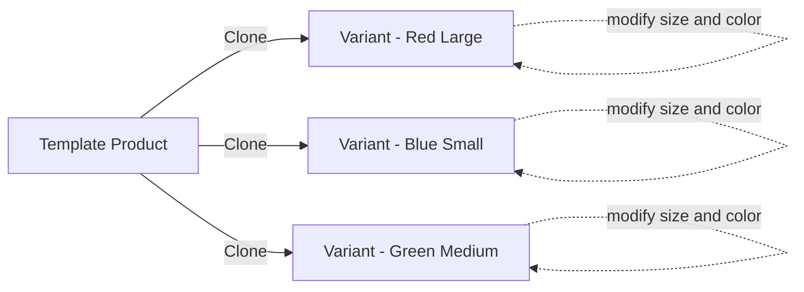

---
topic:
  - Software Architecture
subtopic:
  - Patterns
summary: "Creates new objects by copying an existing instance rather than constructing from scratch, with the prototype knowing how to clone itself."
level:
  - "2"
priority: High
status: Done
publish: true
---
# Prototype

Photocopying a filled-out form is a Prototype in everyday life. Instead of filling out a new form from scratch, you copy the existing one and change just the name or address. The copy carries all the original structure and most of the original data — you only modify what differs.

The Prototype pattern creates new objects by copying an existing instance rather than constructing from scratch. The prototype object knows how to copy itself, producing either a shallow copy (references shared) or a deep copy (full object graph duplicated). The client asks the prototype to clone itself, then tweaks the variant-specific fields. In modern C#, **`record with {}` expressions are the idiomatic Prototype** for value-semantic objects — the compiler generates the copy logic for you. The classical `ICloneable` interface is considered problematic because it doesn’t specify shallow vs deep semantics. Prefer `record with {}` for new code, or explicit copy constructors when you need deep-copy control over reference types.



## Problem

Creating product variants (same base product, different size/color/region pricing) by manually copying properties is error-prone:

```csharp
public class ProductService
{
    public Product CreateVariant(Product baseProduct, string size, string color, decimal priceAdjustment)
    {
        // ⚠️ Manual property copy — adding a new field to Product means updating this method
        var variant = new Product
        {
            Id = Guid.NewGuid(),
            Name = baseProduct.Name,
            Sku = $"{baseProduct.Sku}-{size}-{color}",
            Price = baseProduct.Price + priceAdjustment,
            Category = baseProduct.Category,
            // ⚠️ Shallow copy of Tags — mutating variant.Tags mutates baseProduct.Tags
            Tags = baseProduct.Tags,
            // ⚠️ Forgot to copy Description — variant has null description
            // Description = baseProduct.Description,  <-- missed!
            Variants = new List<ProductVariant>() // ⚠️ intentionally empty? or forgot to copy?
        };
        return variant;
    }
}
```

Here's what breaks when requirements change: adding a `ShippingConstraints` property to `Product` requires finding every manual copy site and adding the assignment — a maintenance burden that grows with the object's complexity.

## Solution

Use `record with {}` for the modern approach, or an explicit copy constructor for classes:

```csharp
// Modern approach: record with {} — the idiomatic C# Prototype
public record Product
{
    public Guid Id { get; init; }
    public string Name { get; init; } = "";
    public string Sku { get; init; } = "";
    public decimal Price { get; init; }
    public string Description { get; init; } = "";
    public ProductCategory Category { get; init; } = null!;
    public IReadOnlyList<string> Tags { get; init; } = [];
    public ShippingConstraints Shipping { get; init; } = ShippingConstraints.Default;
}

public class ProductService
{
    public Product CreateVariant(Product baseProduct, string size, string color, decimal priceAdjustment)
    {
        // ✅ 'with' expression copies all fields, then overrides only what changes
        // Adding a new field to Product automatically includes it — no manual update needed
        return baseProduct with
        {
            Id = Guid.NewGuid(),                                    // ✅ new identity
            Sku = $"{baseProduct.Sku}-{size}-{color}",             // ✅ variant-specific
            Price = baseProduct.Price + priceAdjustment,           // ✅ adjusted price
            Tags = [..baseProduct.Tags, $"size:{size}", $"color:{color}"] // ✅ new list, not shared reference
        };
        // All other fields (Name, Description, Category, Shipping) are copied automatically
    }
}

// Classical approach: explicit copy constructor for classes (when record isn't appropriate)
public class Order
{
    public Guid Id { get; set; }
    public Customer Customer { get; set; } = null!;
    public List<OrderItem> Items { get; set; } = [];
    public Address ShippingAddress { get; set; } = null!;
    public decimal Total { get; set; }

    // ✅ Copy constructor — explicit about what gets deep-copied
    public Order(Order source)
    {
        Id = Guid.NewGuid();                                    // new identity
        Customer = source.Customer;                             // shallow — Customer is shared
        Items = source.Items.Select(i => new OrderItem(i)).ToList(); // ✅ deep copy items
        ShippingAddress = new Address(source.ShippingAddress);  // ✅ deep copy address
        Total = source.Total;
    }

    // Factory method using the copy constructor
    public Order Clone() => new(this);
}

// Usage: create a draft order from a template
var templateOrder = orderRepository.GetTemplate("B2B_STANDARD");
var draftOrder = templateOrder.Clone();
draftOrder.Customer = currentCustomer;
```

Adding a new field to `Product` record automatically includes it in `with` copies — no manual update needed.

## You Already Use This

**`record with {}` expression (C# 9+)** — the language-native Prototype. Every `record` type gets a compiler-generated copy constructor and `with` expression support. This is the recommended approach for new code: it's shallow by default, explicit about what changes, and the compiler keeps it in sync with the type definition.

**`ICloneable` / `MemberwiseClone()`** — the classical .NET Prototype interface. `MemberwiseClone()` performs a shallow copy (reference types share the same instance). Avoid `ICloneable` in new code — its contract doesn't specify shallow vs deep, leading to subtle bugs. Use explicit copy constructors instead.

**`Array.Clone()` / `Array.Copy()`** — shallow array copy. `int[] copy = (int[])original.Clone()` copies the array structure but shares reference-type elements.

**`DataTable.Copy()`** — deep copies a `DataTable` including schema and data. `DataTable.Clone()` copies only the schema (shallow). The naming inconsistency is a classic `ICloneable` ambiguity problem.

## Pitfalls

**Shallow copy sharing mutable state** — `record with {}` is shallow by default. If `Product.Tags` is a `List<string>` (mutable), the copy shares the same list instance. Mutating `variant.Tags` mutates `baseProduct.Tags`. Use immutable collections (`IReadOnlyList<T>`, `ImmutableList<T>`) or explicitly copy mutable fields in the `with` expression.

**Forgetting to update copy logic when adding fields** — with explicit copy constructors or manual `MemberwiseClone()` overrides, adding a new field to the class requires updating the copy method. `record with {}` avoids this: the compiler-generated copy constructor always includes all fields. This is the primary reason to prefer `record` for Prototype scenarios.

## Questions

> [!QUESTION]- When should you use Prototype instead of just calling `new`?
> When construction is expensive (loading from DB, computing derived fields) and you need many similar objects. Prototype amortizes the construction cost: build one template, clone it N times with small variations. Also use it when the exact type isn't known at compile time — `prototype.Clone()` works without knowing the concrete type. The tradeoff: cloning can be as expensive as construction if the object graph is deep; profile before assuming it's faster.

> [!QUESTION]- What's the difference between shallow and deep copy, and when does it matter?
> Shallow copy duplicates the object's fields but shares reference-type values. Deep copy recursively duplicates the entire object graph. It matters when the copied object contains mutable reference types: two shallow copies sharing a `List<OrderItem>` will interfere with each other. Use deep copy when the clone must be fully independent. Use shallow copy when shared references are intentional (e.g., `Customer` is shared across orders — that's correct). The cost of deep copy scales with graph depth; for large graphs, consider serialization-based cloning (`JsonSerializer.Deserialize(JsonSerializer.Serialize(obj))`).

## References

- [Prototype — refactoring.guru](https://refactoring.guru/design-patterns/prototype) — canonical pattern description with shallow/deep copy discussion and C# example
- [Records (C# reference) — Microsoft Learn](https://learn.microsoft.com/en-us/dotnet/csharp/language-reference/builtin-types/record) — `record with {}` as the modern C# Prototype
- [Object.MemberwiseClone — Microsoft Learn](https://learn.microsoft.com/en-us/dotnet/api/system.object.memberwiseclone) — classical shallow copy mechanism
- [ICloneable interface — Microsoft Learn](https://learn.microsoft.com/en-us/dotnet/api/system.icloneable) — why the interface is problematic and when to avoid it
